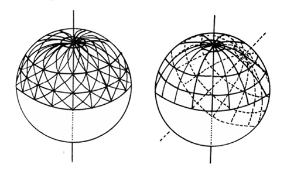

<section>

> Hory zajisté přinášejí mu pastvu, a všechna  
> zvěř polní hrá tam. V stínu lehá,  
> v soukromí mezi třetím a bahnem. Dříví  
> stín dávající stínem svým jej přikrývá,  
> a vrbí potoční obkličuje jej.

> Aj, zadržuje řeku tak, že nemůže pospíchati,  
> tuší sobě, že pozře Jordán v ústa svá.  
> Zdaž kdo před očima jeho polapí jej, aneb  
> provazy protáhne chřípě jeho?

KNIHA JOBOVA, 40, 15–19

> Člověk jeden v Městě Tetíně, chtěje sobě loch v zemi udělati, kopal a nalezl hlavu člověčí nesmírné velikosti, která když ze země vyňata byla, dva muži jedva ji mohli obsáhnouti, nalezeny su při tom i jiné kosti jednak všecky jednoho člověka hnátové, byli su na dvacet šest noh vzdýli a to všecko bylo na hrad Tetín přineseno a pověšeno v jedné syni a všem lidem, kteříž tam přišli, ukazováno.

KRONIKA VÁCLAVA HÁJKA Z LIBOČAN K ROKU 785 (1541)

</section>

<section>

Člověk se setkával s mamutem, dobře se s ním seznámil a často (i když ne tak často, jak se obvykle má za to) ho výtvarně zpodoboval

</section>

<section>

Podivné a v dějinách tvorstva zřejmě neobvykle náhlé vymizení jurské živočišné i rostlinné „dekorace“, především suverénních hromovládců, obrovských praještěrů, je dodnes nevyřešenou hádankou, zasutou ovšem asi 130 milióny let, a tedy příliš vzdálenou v minulosti, než abychom směli doufat v jiné než víceméně důvtipné hypotetické vysvětlení. Množství takových hypotéz bylo již zavrženo, další mají své zastánce a mnohé budou ještě nepochybně zkonstruovány s postupujícím poznáním zákonitostí přírody.

Podivnější však je, že se dosud nepodařilo uspokojivě vysvětlit vyhynutí mamutů, žijících – navzdory Cuvierovu tvrzení – nejen jako současníci člověka, jak je dávno známo z četných paleolitických kreseb, rytin a plastik, ale existujících dokonce ještě v době, kdy se v některých částech světa rozvinuly civilizace, schopné např. budovat megalitické stavby.

Evropská věda se počala o mamuty živě zajímat teprve díky podnikavosti a toulavé povaze tunguzského kočovného lovce Osipa Šumachova, jenž se roku 1799 vydal k moři Laptěvů při ústí Leny hledat vhodné místo pro své další dočasné sídlo. Na Bykovově mysu nalezl strašlivé chlupaté zvíře, skryté pod slabou vrstvou ledu, které na něho (jak se mu nepochybně zdálo) výhružně civělo. Milý Šumachov rázem věděl, na čem je: byla to obrovská zemní krysa z pohádek Tunguzů a Ostjaků, strašlivé, vraždící zvíře, které sice na vzduchu, díkybohu, rázem zdechne, ale pod zemí, ve vodě i pod vodou se pohybuje jako doma. Protože vůbec netoužil po intimnějším setkání s uu kylou (vodním zvířetem) čili uu oguchou (vodním býkem), vzal nohy na ramena a nalezl si místo pro loveckou chatu raději někde jinde.

Bykovův mys však přece jen občas opatrně navštěvoval, a když se konečně roku 1803 přesvědčil, že podzemní krysa je určitě a nadobro mrtvá, urazil jí oba kly, které se zatím odtáním ledovce uvolnily a o nichž věděl, že jsou hledaným zbožím, a prodal je zástupcům kupce Boltunova, jenž měl tehdy na veškerou sibiřskou mamutovinu nejjasnější carský monopol.

O Šumachovově nálezu se čirou a šťastnou náhodou dozvěděl ruský botanik Adams, vracející se tehdy z vědecké expedice do Číny, a rozhodl se koupit tak říkajíc zajíce v pytli, mamuta, kterého nikdy neviděl.

Věděl však asi, že už v letech 1707 a 1739 došly do Moskvy zprávy o nálezech mršin obrovských zvířat a že hrabě A. I. Mušinskij-Puškin byl roku 1802 na návrh Akademie věd odměněn zlatým řetězem za několik mamutích kostí a dva kly. Odměnu měli ovšem obdržet spíše hraběcí mužici, kteří pozůstatky mamuta v Povolží nedaleko Jaroslavli nalezli. Adams zaplatil lovci značnou částku, aby mu vynahradil ztracené sezónní lovy, a odejel. Šumachov mamuta poctivě a věrně hlídal až do roku 1806, kdy si Adams konečně přijel pro svůj majetek, doprovázen eskortou kozáků a domorodými pomocníky. Odvezli kompletní kostru, tři nohy, výborně Zachovalé oko, mozek a kus kůže s chlupy, takže petrohradští vědci mohli téhož roku dokonale rekonstruovat toto vyhynulé zvíře a definitivně vyvrátit četné báchorky, jež o něm kolovaly. Vždyť amsterodamský purkmistr Witzen dokonce převzal do svého německého „vědeckého“ popisu Sibiře, vydaného koncem 17. století, nejen jakutské pohádky, ale dušoval se, že mamut je obrovským krtkem, jehož pohyb vyvolává zemětřesení. Důkazem je prý sám název: mamut znamená estonsky a finsky „zemní krtek“.

Ve skutečnosti je etymologie slova mamut (podle Anatolije Ložkina) jiná: pochází z tatarského dek mamma, což znamená země, půda. Do evropské části Ruska přinesli toto slovo Jermakovovi kozáci, vracející se z výpravy do Sibiře, a z Ruska se pak rozšířilo dál do světa. Mamuti byli ovšem známi již dříve pod jménem indrik, což patrně pochází, smíme-li věřit etymologům, ze slova jengora, pán země. Jedna z nejstarších ruských literárních památek, tzv. Bledě modré rukopisy, přináší tuto charakteristiku mamuta: „Indrik zvíře je všem zvířatům otec a všem zvířatům zvíře, ryje rohy pod zemí, jde si pod zemí, kam chce, jako Slunce po nebeské klenbě, a když se toto zvíře rozzlobí, celá matička Země se nad ním rozechvěje.“ Rozhodně nelze přijmout vysvětlení, spojující slovo mamut s biblickou potvorou behemotem či arabským strašidlem mehemotem, ačkoli se to lze leckde dočíst. Vědecký název Elephas primigenius udělil mamutovi německý přírodovědec Johann Blumenbach roku 1799.

Nesmíme být ostatně na důvěřivého pana purkmistra Witzena příliš přísní: racionalista a polyhistor G. W. Leibnitz (1646 až 1716) „zrekonstruoval“ kostru mamuta tak fortelně, že vytvořil mohutného dvounohého tvora s jediným mamutím klem uprostřed čela, čímž velmi podpořil lékárníky, prodávající zlatem vyvažovaný a neselhávající všelék, roh jednorožce, unicornum čili ebur fossile. Svou podivuhodnou rekonstrukci, jejíž jedinou zásluhou bylo odmítnutí existence předpotopních lidských obrů, za jejichž pozůstatky byly mamutí kosti všeobecně pokládány, uveřejnil v díle Protogaea.

O čtvrt století před ním vysvětloval realističtější a přesnější pozorovatel, první moravský historiograf Tomáš Pěšina z Čechorodu (1629–1680), nálezy mamutích kostí přenesením zdechlin afrických slonů do naší vlasti vlnami biblické potopy (Mars Moravicus, 1677)…

Teď byl tedy konečně nalezen mamut podivuhodně zachovalý.

Byla to senzace a jako každá senzace povzbudila fantazií obdařené nadšence k horečné činnosti, takže mnohé evropské noviny záhy přinesly zprávu o mamutech, kteří ještě kdesi na dálném a mrazivém severu žijí. Tato zpráva se nepotvrdila. Nepotvrdily se ani údaje, obsažené v pamětech německého barona Zigmunda Herbertsteina, jež vyšly roku 1549 a popisují mj. baronovu cestu na Sibiř počátkem 16. stol. Autor prohlašuje, že se ještě za jeho života na Sibiři lovilo palnými zbraněmi jakési obrovské slonu podobné zvíře, domorodci nazývané „věs“. Bez potvrzení je i setkání se živými mamuty, o němž vyprávěl sám dobyvatel Sibiře ataman Jermak. Stejně dopadla jedna z historických žurnalistických mystifikací, jejíž obětí se stali čtenáři říjnového McClure’s Magazinu roku 1899. Autor článku Henry Tukeman popisoval se všemi podrobnostmi, jak předešlého roku na lovecké výpravě, financované milionářem Horacem P. Conradim, zastřelil za vydatné pomoci aljašského indiána Paula posledního žijícího mamuta…

Otázkou zůstávají čínské prameny ze 4. století př. n. l., popisující zcela bez nadšení mamuta jaksi samozřejmě jako zvíře žijící, avšak „velmi hloupé a netečné“. Anatomický popis je celkem výstižný.

Je ovšem nápadné, že zatímco takřka všude na světě, kde se mamuti vyskytovali, byly jejich lebky, zbavené vykloubením v zubním lůžku klů a poněkud podobné obrovské lebce lidské, považovány za pozůstatky jednookých obrů-kyklopů (nosní otvor byl pokládán za očnici, vlastní nepatrné očnice unikaly pozornosti), případně draků. Sibiřané nikdy nepochybovali, že mamut je jen a jen zvíře. Trvali na tom až do zrození moderní vědy, kdy už (jak alespoň předpokládáme) dávné vzpomínky na osobní setkání člověka s mamutem v povědomí domorodých kmenů vyhasly.

Nelze ovšem popřít, že s myšlenkou podstatně pozdějšího vyhynutí mamutů, než jaký až dosud věda předpokládá, přicházejí v poslední době někteří sovětští vědci. Tak například člen Akademie věd SSSR I. G. Pidopličko se domnívá, že se mamut vyskytoval ve středním Povolží dokonce i v prvním tisíciletí našeho letopočtu (vychází z údajů arabských autorů) a že pro ozdoby z mamutoviny, nalézané tu a tam v hrobech z této doby, nebylo použito fosilního materiálu, ale loveckých trofejí, získaných z čerstvě skolených zvířat. Nelze ovšem popřít, že prameny, o něž se opírá, jsou značně mlhavé.

Sovětský geolog Vladimír Puškarev dokonce oznámil, že mu staří jakutští lovci shodně potvrdili historky svých otců o setkáních s obrovskými chlupatými a nosatými zvířaty s velkými kly ještě nedlouho před první světovou válkou a že sám jeden z Puškarevových informátorů nějakou dobu sledoval stopy neznámého, avšak zřejmě obrovského tvora, „veliké jako malá umyvadla“. Podobné stopy byly prý spatřeny koncem třicátých let našeho století dvěma čukotskými chovateli sobů ve stejné oblasti, totiž severně od Jakutska, když hledali ztracené stádo. Jiný sovětský autor, A. Moskvin, soudí, že důležitou známkou zcela nedávného, nebo snad dokonce i současného výskytu posledních mamutů jsou hromady lišejníků, mnohokráte nalezené lovci, vydávajícími se do zcela osamělých oblastí. Mamuti prý je shrabují svými kly. Existenci těchto lišejníkových zásobáren potvrdili i staří cestovatelé, avšak nedovedli si vysvětlit jejich vznik.

Podporou těchto ne právě krotkých hypotéz jsou i sibiřské pověsti, tradující se mezi obskými Ugry, Tatary i Rusy, které sebral P. Gorodcov. Na základě jejich vyprávění píše: „Mamut podle jejich představ žije dosud, jenže v malém množství. Toto zvíře je dnes velmi vzácné. Dříve, za starých časů, bylo mamutů bezpochyby mnohem více. Mamut se svým vnějším vzhledem a stavbou těla podobá býkovi nebo losovi, svými rozměry však značně tato zvířata převyšuje. Mamut je pětkrát či šestkrát větší než největší los. Na hlavě má dva obrovské rohy; jeho rohy jsou hladké a čisté, poněkud zahnuté jako u býka, nikoli však rozvětvené jako u losa. Kopyta má rozštěpená…

… Mamut je svým založením zvíře krotké a mírumilovné, vůči lidem přátelské. Při setkání s člověkem na něho mamut nejen ne­útočí, ale dokonce k němu přilne a lísá se k němu.“

Obyvatelé Sibiře se ovšem mohli seznámit s kostrami nebo i poměrně zachovalými zdechlinami mamutů – přesto je však přesnost anatomického popisu i shoda různých lidových pramenů o naturelu mamuta a jeho neagresivním chování vzhledem k člověku pozoruhodná.

Nelze tedy vyloučit, že část mamutů v některých oblastech přežila dosti dlouho, zejména tam, kde nebyla ohrožena člověkem – je-li tomu tak dodnes (čemuž nevěřím), půjde zřejmě o naprostou výjimku.

Až dosud byly vědcům předány ze severovýchodní Sibiře asi tři desítky velice dobře konzervovaných mamutů se zachovanými měkkými částmi těla – prvního nalezl, avšak neodvezl, roku 1724 polský vyhnanec Michal Molochowicz – jiný byl nalezen roku 1948 na témže místě u ústí řeky Indigirky, a nejslavnější, dosud nejčastěji v literatuře zmiňovaný, roku 1901 na říčce Berjozovce, přítoku Kolymy. Objevil jej lamutský lovec Semjon Tarabykin a jakutský guvernér Skripicin upozornil petrohradskou Akademii – po dobrodružné cestě se k nálezu dostavili zoolog akademik Otto Herz, preparátor Pfinzenmeyer a student geologie Sevasťanov, kteří dovezli nejen pozůstatky mamuta, ale i další vzácnou vědeckou kořist. Zatím poslední nález zachované mamutí zdechliny byl učiněn roku 1977 buldozeristou na rýžovišti zlata při Kolymé – bylo to znamenitě v ledu konzervované mamutí mládě.

Byly – pochopitelně – provedeny radioizotopové analýzy, které naznačily dvojí dobu zhynutí nalezených mamutů: 44 000 ± 250 let a 11 450 ± 250 let př. n. l. Výslovně píši „naznačily“ – poslední zkoumání prokazují stále zřetelněji porovnáním výsledků radioizotopových analýz fosilizovaných zbytků živočichů i rostlin a např. letokruhů nejstarších stromů nebo racemizace původně výhradně levotočivých látek poměrně značné odchylky výsledků této metody od pravděpodobné skutečnosti (rozptyl dat hynutí mamutů však je nápadně malý).

Spočívají ve zvláštnostech asimilace některých sloučenin a prvků a v jejich kolísavém množství v atmosféře, jež mohou časové údaje poněkud zkreslovat. V každém případě je zřejmé, že od zániku mamutů uplynula doba relativně (v geologickém smyslu) velmi krátká.

Naprostá většina až dosud nalezených a radiokarbonovou metodou datovaných mamutů uhynula přibližně v uvedených dobách. Výjimky jsou poměrně vzácné, např. mamut, který však žil na Aljašce, zahynul asi před 21 000 lety. Velmi pozoruhodnou skutečností je, že se v Evropě ani v Asii dosud nepodařilo nalézt mamutí fosilii starší 44 000 let, tedy předcházející „první velké hynutí“, ačkoli mamuti prokazatelně žili již mnohem dříve – jejich éra začala asi před 300 000 lety (T. Bulavincevová), avšak už asi před 800 000 lety se vyvinuli ze svých předků, žijících patrně v Indii a jejím sousedství, a rozšířili se až do Francie a Severní Ameriky.

Volky nevolky si musíme vzpomenout na legendární „hřbitovy“ slonů, vděčící za svůj vznik a pevné místo v povědomí lidí faktu, že nález mrtvého, přirozenou smrtí uhynulého slona je naprosto ojedinělý. Je to způsobeno jednak zvykem přestárlých a nemocných slonů, hynoucích žízní, když již nejsou schopni použít zesláblého a ochrnutého chobotu k transportu vody do tlamy, uchýlit se na skrytá a odlehlá místa, jednak rychlou likvidací sloní zdechliny čtyřnohými i šestinohými mrchožrouty. Zdá se, že podobně končili i přestárlí mamuti – ovšem kromě zvláštních období „velkých hynutí“.

Z uvedeného se zdá být zřejmé, že nálezy zcela zachovalých mamutů, konzervovaných ledovcem nebo věčně zmrzlou půdou, tedy mamutů s uchovanými měkkými tkáněmi, jsou výjimečné a vzácné a lze je vysvětlovat jen obzvláště šťastnou shodou okolností. Není tomu tak.

Sibiř je obrovskou bonanzou mamutoviny již nejméně 2500 let. Dávno před naším letopočtem odtud odváželi Číňané kly obrovského zvířete, nazývaného – patrně pod vlivem vyprávění domorodců – fen-ši čili hrabavá krysa. Podobné objasňování existence fosilních reliktů, nalézaných v zemi, je ovšem všeobecné. Charles Darwin ve své klasické reportáži o cestě posádky plachetnice Beagle kolem světa (1831– 1836) píše o stejném vysvětlení, jež měli obyvatelé státu Paraná pro občas nalézané kostry mastodontů. O zemi, kde se dobývá slonovina, zřejmě o Sibiři a o mamutovině, psal ve 4. stol. př. n. l. Aristotelův žák Theofrastos a z mamutoviny byl zhotoven nádherný trůn, dar chalífa Hárúna al Rašída Karlu Velikému. Koncem 1. tisíciletí převzali obchod mamutovinou pro Evropu Arabové – podle letopisů dojížděli na pravidelné trhy v městě Bolghari, ležícím patrně poblíž Nižního Novgorodu. Dalším centrem obchodu mamutovinou byla středoasijská Chiva. Trůn chakána, džihangíra Zlaté hordy, popsaný r. 1246 papežským legátem Giovannim Piano Carpinim, zhotovil ruský zlatník Kosma rovněž z mamutích klů; z tohoto materiálu jsou i normanské válečné rohy, uložené v berlínském muzeu.

Z novověku je již zpráv více než dost. Roku 1611 bylo v Londýně vydraženo větší množství mamutoviny z majetku Josiase Logana; nakoupil ji přímo na místě nálezů od Samojedů. Největším odběratelem však zůstávala Čína, jež pro svůj rozvinutý řezbářský umělecký průmysl dávala přednost sibiřské mamutovině před indickou slonovinou pro její bělost, jak dosvědčuje např. roku 1685 cestovatel Avril nebo ruský vyslanec u čínského dvora Isbrand Ides, jenž o své cestě Sibiří v letech 1692–1695 vydal roku 1704 v Amsterodamu holandsky psaný cestopis s nesmírně zajímavými a zřejmě autentickými podrobnostmi, k nimž se záhy vrátíme.

V soustavné exploataci bílého zlata vynikl za časů Kateřiny II. kupec a lovec Ljachov, jenž nejdříve s úspěchem paběrkoval na tundře mezi řekami Chotangou a Anadyrem, avšak roku 1770 se odvážil cesty po zamrzlém moři na dnešní Ljachovské ostrovy, které nalezl takřka pokryté zbytky nejen mamutů, ale i pravěkých nosorožců a praturů. Po získání nezbytné carské výsady zaplavovali Ljachov a jeho potomci trh „ljachovskou slonovinou“ plných sto let, aby vyhověli obrovské poptávce, zvyšované obecnou zálibou kulečníku, a tedy potřebou koulí z dokonalého materiálu, i zálibou dívek z lepších rodin hrát na klavír se slonovinovými klávesami. Přes intenzívní těžbu posbíral na Ljachovských ostrovech dr. Bunge ještě v letech 1882–1884, tedy za pouhé tři roky, neméně než 2500 skvěle zachovaných mamutích klů, vážících až 230 kg. Průměrná váha byla ovšem menší – na sibiřské pevnině 98 kg, na ostrovech 48 kg.

V práci Bungeho pokračovala ještě roku 1904 expedice K. Volosoviče – a s úspěchem.

Bohatství zdánlivě vůbec neubývalo, ačkoli příkaz sbírat slonovinu vydal už car Petr Veliký a ačkoli množství prodaných párů klů šlo do desítek tisíců. Na trzích v Jakutsku, kam od 18. století dojížděli i angličtí, francouzští a němečtí kupci, bylo každoročně vydraženo asi 30 tun mamutoviny, tuna po 1500 rublech – dr. Middendorf udává dvojnásobek, šedesát tun, a odhaduje počet nalezených mamutů do svého průzkumu v roce 1840 na 30 000 kusů. Ještě roku 1873 přišlo jen na londýnský trh 1140 mamutích klů o průměrné váze 75 kg.

Tolik o imponujícím, takřka neuvěřitelném množství mamutů, nalezených v polárních oblastech Sibiře, jež ohromilo badatele. Ve své zprávě carevně píše Ljachov doslova: „Množství pozůstatků mamutů bylo tak obrovské, že se celý ostrov zdál být složen z mamutích kostí a klů, spojených zmrzlým pískem.“ Podobný obraz skýtaly ostrovy Nové Sibiře, objevené roku 1805 a 1806.

A ze dna Severního ledového oceánu mezi pevninou a „slonovinovými ostrovy“ dodnes vynášejí pokusně spuštěné vlečné sítě a drapáky znovu a znovu mamutí kosti a kly, svědčící, že je jimi poseto i mořské dno.

Nedaleko Sibiře, oddělena Beringovým průlivem, leží Aljaška, „Ruská Amerika“, jak se kdysi nazývala. Vědecké výpravy sem dříve zavítaly velmi zřídka. Předními hlídkami kolonizace byli lovci kožišin a především zlatokopové, kterým čerta záleželo na mamutech a kteří nalezené kosti nejvýše proklínali, když jim překážely v ražení štol. Trvalo proto dlouhou dobu, než se svět dozvěděl (a do širšího povědomí vlastně nepronikla tato skutečnost dodnes), že naleziště obrovského množství fosilií nekončí Děžněvovým mysem, ale pokračuje v řadě lokalit Aljašky, v oblasti řek Tanana, Koyukuk i Kuskokwim, a pak dál i mimo Aljašku na nejzazším kanadském severu amerického kontinentu. Jednu z prvních zpráv o fosiliích v kanadských nalezištích přinesl do Evropy takřka negramotný český dobrodruh Jan Welzl (1868–1951), o jehož historkách se kdysi tolik pochybovalo. Teprve později byla prozkoumána četná místa Aljašky, odpovídající přesně líčení Strýčka Eskymáka. Díky zájmu vědců a modernímu vybavení těžařských společností těžkými stroji bylo odhaleno nesmírné množství pozůstatků mamutů, mastodontů, praturů a koní, kteří v Novém světě vymřeli na počátku neolitu. Mezi těmito zbytky byly – až v hloubi sta i více stop – nalezeny charakteristickým způsobem opracované kamenné hroty kopí a čepele tzv. yumského typu. Kosti jsou většinou rozlámány a promíseny s rozdrcenými kmeny a větvemi stromů, zčásti fosilizovanými.

Tím se však již dostáváme k dalším zajímavým otázkám, totiž jaký byl stupeň fosilizace nalezených zvířecích pozůstatků, především mamutích, a pokud to bylo možné zjistit, jaký byl fyzický stav uhynulých zvířat.

Zodpovězme nejprve druhou otázku.

Všechny pozůstatky i dobře zachované zdechliny mamutů, jež byly podrobeny vědeckému zkoumání, svědčí o tom, že potravy nebyl nedostatek. Šlo o zvířata dobře živená, jež uhynula s plným žaludkem a obvykle i s posledním soustem v tlamě.

Mamut od Berjozovky je docela slušný cvalík, a co hlavního, pro fyzický stav a výživu zvířete příznačná váha klů dokazuje, že sibiřští mamuti jak v průměru, tak i rekordními „trofejemi“ převyšovali zdatností a velikostí mamuty, známé z jiných částí světa, což ostatně odpovídá zoologickému Bergmannovu pravidlu o zvětšování druhu od rovníku k pólům. Výjimkou jsou exempláře z ostrovů, kde byla i tehdy zřejmě o potravu, ne-li nouze, tedy přece jen jistá starost. N. Vereščagin tu objevil i zrůdné kly, podélné, a tedy abnormální obroušení zubů a jiné znaky degenerace.

Zdánlivé nesrovnalosti mezi chudobou pastvy a velikostí i množstvím zvěře, jež v tomto případě přímo bije do očí, si povšiml v citovaném už cestopise i Charles Darwin, rovněž informovaný o výskytu fosilií na obou stranách Beringovy úžiny. Inspirován úvahami botanika Williama Burchella se snažil odhadnout poměr „živé váhy“ zvěře, spásající na prostorovou jednotku poměrně chudou pastvu afrických stepí, s jejich druhy v neskonale bohatších biotopech jihoamerických. Došel k výsledku 24:1 ve prospěch Afriky. Podobný jev zřejmě pozorujeme i u sibiřských a např. středoevropských mamutů.

Opakujeme tedy, že ani v jediném případě nebyl nalezen mamut, jehož pozůstatky nebo zachovaná zdechlina by dovolovaly pomýšlet na smrt hladem či postupným vysílením, vedoucím ke ztrátě plodnosti, případně sešlostí věkem.

Pokud jde o stupeň zachovalosti mamutích zdechlin, kolují o něm tu a tam divoké, avšak ne zcela nepravdivé zprávy o chutných mamutích řízcích a roštěnkách, s oblibou vyhledávaných labužnickými polárníky. Jen několik málo odvážlivců (tvrzení o celé stovce, jež se občas traduje, je jistě přehnáno) však skutečně mamutí maso ochutnalo a shledalo ho sice jedlým, ale pro gurmány nijak zvlášť přitažlivým. Většina se spokojila ohledáním. Bylo však doporučováno a Jakuty také používáno jako lék, hojící horečnatá onemocnění. D. F. Hertz píše, že mamutí maso je „vláknité, prorostlé tukem, připomínající čerstvé, dobře mrazené hovězí“. Podobné svědectví podal Adams, tvrdící, že domorodci toto maso občas pojídají; jisté je, že v několika ověřených případech byli mamutím masem nakrmeni bez jakýchkoli škodlivých následků tažní psi a je velmi pravděpodobné, že tímto způsobem vzalo za své v tomto kraji, kde velmi často potrava pro polodivokou psí smečku rozhoduje o životě a smrti lovce, mnoho zdechlin. (Tak byla ostatně věda připravena o řadu jedinečných nálezů, např. obrovských kalmarů. O jednom případě píše ve svém dopise z roku 1791 islandský prefekt G. Thordarensen: „… Zvíře bylo nalezeno neporušené, ale já jsem se o něm doslechl, až když bylo úplně v rozkladu a přeměněné jako obvykle v návnadu pro tresky…“ Historie se doslova a do písmene opakovala v prosinci 1853 v dánském Aalbeku a pak znovu a znovu.) Rozhodujícím svědectvím však je zachování nejchoulostivějších částí, podléhajících autolytickému a bakteriálnímu rozkladu v nejkratší době, např. očí a mozku. Jejich dokonalé uchování přes propast tisíců let je dokladem, že tyto nalezené exempláře byly ihned po smrti obklopeny a uzavřeny ledem uprostřed polárního léta, jak dokazují obsahy tlam a žaludků, a tento led již nikdy neroztál. Chránil je před hnilobou i – a na to se dosti často zapomíná – před drobnými i většími mrchožrouty, kteří nezbytně doprovázejí větší zvířata a kteří dovedou v rekordně krátkém čase zlikvidovat i mršinu slona včetně kostry a klů (jejich dřeň je pochoutkou dikobrazů). Je samozřejmé, že tito hrobaři začnou své dílo od nejměkčích částí, především od očí. Ochrana ledem, případně zmrzlým pískem je tedy pravděpodobná, ačkoli by teoreticky postačilo, aby teplota nevystoupila nad 4 °C.

Vše, co bylo řečeno, se týká nálezů poměrně nebo dokonce výborně zachovalých zdechlin mamutů, objevených za posledních 150 let, tedy za dobu, v níž – a to je pozoruhodné – bylo v Evropě nalezeno jen velmi málo mamutích klů, jež by byly svou kvalitou vhodné např. k výrobě kulečníkových koulí, vyžadujících naprosto homogenní slonovinu bez puklin a kazů. V jakém stavu byly tedy, u všech všudy, nalézány kostry mamutů, zásobující sibiřskou mamutovinou svět a kryjící po staletí podle opatrného odhadu plnou polovinu značné poptávky po slonovině?

Máme o tom pouhé dvě zprávy současníků: Avrilovu, jenž mluví o proslulé bělosti sibiřské mamutoviny, vynikající nad čínskou slonovou kost, a závažnější Idesovu, jež zůstala vzhledem k obtížné dostupnosti již zmíněného cestopisu z r. 1704 takřka nepovšimnutou. Cituji: „… Nedaleko na severovýchod od Makovského nad Ketou se nalézají zuby a kosti mamutů. Vyskytují se rovněž při řekách Jeniseji, Truganu, Mongamsenu a Leně od Jakutska až po Severní ledové moře, takže když se zjara tyto řeky rozvodní a jejich dravá voda podemílá a trhá břehy, obnažují se pak ve zmrzlých březích celá tato zvířata nebo jen jejich jednotlivé zuby. Mé výpravy do Číny se zúčastnil člověk, jenž se každý rok vydával tyto kosti hledat. Vyprávěl mi, že spolu s druhem nalezli celou mamutí hlavu, vyčnívající ze zmrzlé země. Když vyprostili ze země větší část zmrzlého zvířete, shledali, že maso je již shnilé; kly, které vyčnívaly z tlamy jako u slonů, vylomili s velkým úsilím a rovněž usekli přední nohu, kterou pak přinesli do Truganu. Tato noha měla objem jako trup silného člověka.“

Nesporným a rozhodujícím faktem však je, že sibiřská slonovina byla v tak dobrém stavu, že dovolovala řezbářské práce i soustružení. V případě zuboviny to znamená, že nepodlehla přibývání pórovitosti ztrátou organických látek, následovaných obvykle jejich nahrazením některými minerály, především fosforečnanem vápenatým, ale i jinými, nezbytně způsobujícími rozpad klu v hranolovité segmenty podle průběhu dentinových kanálků. Fosilizovaná mamutovina je obvykle tmavohnědá (záleží na půdním prostředí, v němž ležela), křehká, drobivá, její vyzdvižení vyžaduje konzervaci např. umělými pryskyřicemi, skelným laminátem, sádrou, klihem atd. přímo na místě nálezu. A ovšem naprosto se nehodí k jakémukoli dalšímu zpracování. Závažným změnám podléhají mamutovina i slonovina, vystavené účinku vlhkosti a větrání, již za velmi krátkou dobu; v mnoha východoasijských bazarech, zásobených uměleckými předměty získanými vyloupením hrobů, jsem se přesvědčil, že slonovinové nebo mamutovinové řezby a sošky, podle stylu ne starší dvou či tří set let, byly ve velmi špatném stavu, manipulace s nimi vyžadovala svrchovanou opatrnost a k jejich zachování byla nezbytná složitá odborná restaurace.

Ostatně – mamutovina ze severovýchodní Sibiře slouží jako výtvarný materiál dodnes. Jen v Jakutsku je ke stovce lidových umělců-řezbářů, v čele se samoukem P. Pestěrjovem a zasloužilým umělcem Jakutské ASSR Vasilijem Popovem. Mezi Jakuty má řezba do mamutoviny pradávnou tradici a tematické výjevy ze života národů dálného severu, šachové figurky či postavičky mamutů a dalších zvířat jsou umístěny v řadě světových muzeí. Vyřezání jedné plastiky z mamutoviny trvá vzhledem k náročnosti práce a nepoddajnosti materiálu tři až šest měsíců a sovětský stát za každou z nich, určenou většinou jako dar významným osobnostem, platí jakutským umělcům nemalé částky.

Velmi přesvědčující je i počínání jakéhosi pana Hedenströma, pověřeného roku 1809 ruskou vládou dalším průzkumem ostrovů Nové Sibiře. Paleontologií se příliš nezabýval – zato z morku mamutích kostí vyrobil pro petrohradské krasavice pleťový krém Pommade à Mammouth… a zbohatl.

Zkrátka: značná část sibiřských mamutů, z nichž byly odebírány kly na vývoz, byla mumifikována ledem nebo věčně zmrzlou sibiřskou půdou, permafrostem, a zachována nezřídka i s měkkými částmi – pro paleontologa vzácný případ, opakující se zčásti pouze v nalezišti pravěkých nosorožců v ozokeritovém ložisku poblíže Staruně v Haliči a v jedné patagonské jeskyni, nalezišti pleistocénního Grypotherium domesticum. Pohádky Jakutů o strašlivých a zabíjejících podzemních krysách a udánlivý, Adamsovi stále zdůrazňovaný strach Osipa Šumachova při nálezu zachovaného mamuta byly patrně předstíráním, jež mělo odradit konkurenty, hrozící podílet se na výnosných nalezištích. Jsem přesvědčen, že po celá staletí byly po stovkách a tisících nacházeny zdechliny mamutů v rozličném stupni konzervace chladem a že tři desítky posledních mohykánů, zachráněných pro vědu, představují exempláře, jež čirou a šťastnou náhodou unikly pozornosti a plánovitému hledání. Všechno svědčí pro tuto skutečnost. Mamutovina, ležící několik tisíců let v periodicky rozmrzávající zemi nebo dokonce na volném prostranství, by určitě nebyla zvlášť žádaným zbožím.

Nejnovější výzkumy severovýchodní Sibiře a její vyhynulé fauny jsou nerozlučně spojeny se jménem předního světového odborníka a nositele státní ceny B. Rusanova, jemuž se podařilo nalézt roku 1972 u říčky Šadrin, východně od ústí Indigirky, až dosud poslední úplnou mamutí kostru s výborně zachovanými vnitřnostmi a dokonale mrazem konzervovaným obsahem střev.

Tomuto úspěchu předcházela Rusanovova a Vereščaginova kom­plexní průzkumná výprava roku 1970, která na řece Berelejechu, přítoku Indigirky, nalezla dva metry mocnou vrstvu mamutích pozůstatků, 7513 kostí ze 120 mamutů nejrůznějšího stáří, od embryí až ke stařešinům, ba i kusy kůže se srstí, dosahující délky až 85 cm. Podle radiokarbonového datování uhynulo stádo v „mladší epoše hynutí“, asi před 13 700 lety. Toto unikátní pohřebiště mamutů poskytlo několik zajímavých informací pro naše úvahy (celý výzkum umožnil získat díky účasti geologů, geomorfologů, odborníků na průzkum půdního ledu, paleontologů a mikrobiologů obrovský materiál). Bylo zjištěno, že hlavní část stáda tvořili mladí a velmi zdatní jedinci ve věku 15 až 30 let, tedy na vrcholu bujarých mamutích sil. Další pozoruhodné zjištění přinesl rozbor pylů a výtrusů rostlin, uchovaných v lebkách a čelistech zvířat i v sedimentu, který tento hromadný hrob překryl. Ukázalo se, že převážná část pylu patřila tundrové stepi, tedy ideálnímu biotopu pro mamuty. Rusanov se proto domnívá, že stádo bylo v údolí řeky překvapeno velkou vodou a utopilo se. Snad. Ale vysvětluje to nahromadění kostí na jednom jediném místě? Neroznesla by spíše povodeň topící se a mrtvé mamuty široko daleko? A shoda s „epochou hynutí“ řady ostatních mamutů na blízkých i velmi vzdálených místech Sibiře je velmi, velmi nápadná…

Jak tedy k obrovskému nakupení pozůstatků velkých pravěkých savců v řadě lokalit došlo? Hromadný výskyt fosilií je dávným předmětem zájmu paleontologie, ať již jde o horniny přímo vytvářené fosilními organismy (prvoky, houbami, korály, mechovkami apod.), či o zvláště bohatá naleziště vyšších živočichů. Nahromadění fosilií je v těchto případech vysvětlováno takřka vždy mimořádnými okolnostmi, doprovázejícími nebo přímo způsobujícími uhynutí zvířat, např. sopečnými výbuchy, povodněmi, zátopami, panikou stáda či hladem. Jen výjimečně mohly takovou kumulaci způsobit opakující se okolnosti, např. občasné a postupné zapadání zvířat do bahna nebo zvláštní životní zvyky některých druhů.

Velmi početné nálezy devonské rybky Paleospondylus gunni ve Skotsku, ryb z rodu Melleta na Moravě nebo ryby Semionotis capensis v Kapsku jsou vysvětlovány mimořádným vlnobitím, jež ryby vyhodilo na břeh a leklé pokrylo bahnem či pískem. Slavná pískovcová deska z Kalenthalu u Stuttgartu se zbytky čtyřiadvaceti pancéřnatých ještěrů druhu Aetosaurus ferratus vděčí (podle E. Dacquéa) za svůj vznik překvapení ještěrů náhlou a prudkou bouří. Bouře a záplavy mohou také splavovat zdechliny zvířat do tišin, kde po skončení vývinu nadlehčujících je hnilobných plynů klesají ke dnu – což bylo asi příčinou vzniku hromadného hrobu dvaceti tří velkých dinosaurů, objeveného roku 1877 u Benissartu v Belgii, a snad i „paleontologického nálezu století“, jímž se patrně stane obrovské pohřebiště nespočetných dinosaurů v 60 km širokém a 200 km dlouhém údolí dávno vyschlé řeky uprostřed saharské pouště. Pod vedením starého Tuarega z Agadesu Fall Achmuda je jako první Evropané navštívili roku 1970 italští badatelé dr. Giancarlo Ligabue a dr. Gino Baccazzi.

Pokud jde o hromadné nálezy mamutů v jiných částech světa, je nejznámější nález dvou tisíc mamutích kostí a zubů nejméně z jednoho tisíce (K. J. Maška), avšak spíše daleko většího množství individuí (K. Absolon) v předmostecké spraši. Podle domněnky O. Abela zde zahynulo obrovské stádo v prudké a dlouhotrvající sněhové bouři a vánici, spíše však šlo o pozůstatky potravy u trvalého sídliště lovců mamutů – Štorchův stejnojmenný román ostatně čtenáři dobře znají.

Je téměř neuvěřitelné, že tato jedinečná naleziště, Předmostí u Přerova i Moravský kras, byla v 19. století bezohledně exploatována a do značné míry zničena (podle J. Vignatiové) zásluhou Eisenachovy továrny v Letovicích a Grätzerovy továrny v Holešově, které mamutí kosti a kly ve velkém vykupovaly – na výrobu spódia. Jako první protestovali osvícení školní inspektoři. Ne snad, že by jim drancování nalezišť vadilo, to nikoli, ale dítka, nucená zúčastnit se od útlého věku výprav rodičů za kostmi alespoň jako světlonoši, zanedbávala vyučování… Teprve v devadesátých letech 19. století byl vydán dlouho očekávaný a už značně opožděný zákaz volného vykopávání kostí.

Další a poslední příčinou nahromadění mamutích kost a klů byl na mnohých místech člověk gravettské kultury, lovec mamutů, odhazující některé kosti po získání morku do tzv. kjökkenmöddingů, kuchyňských odpadových jam, a jiné používající jako nástroje nebo výtvarný materiál.

Vzácnější případy hromadění fosilií (asfaltová jezera, výrony kysličníku uhličitého, vulkanické exhalace, vody otrávené měďnatými sloučeninami atd.) můžeme z naší úvahy vypustit, právě tak jako hromadná hubení pravěké zvířeny sopečným popelem nebo stepními požáry. Žádná z těchto příčin prokazatelně nesehrála na severosibiřských a aljašských nalezištích rozhodující úlohu.

Důvod vyhynutí sibiřských mamutů a s ním nerozlučně spojená otázka příčiny jejich okamžité mumifikace ledem a věčně zmrzlou zemí vzrušovaly odedávna badatele a byly výzvou jejich důvtipu. Při úvahách je třeba vzít v potaz např. i těžká zranění berjozovského mamuta (zlomeniny pánve a mnohočetné fraktury dlouhých kostí), vysvětlované značně nepravděpodobně zřícením zvířete do rokle. I když taková zranění, způsobená pádem, nelze zcela vyloučit, zdají se být přece jen přílišná: zbytky mamuta poskytují spíše obraz zvířete, vymrštěného obrovskou pěstí do výšky a roztříštěného pádem i následujícím valivým pohybem. Nejpodivuhodnějším výsledkem „soudní pitvy“ této zdechliny však bylo ujištění, že mamut patrně zahynul – udušením. Z toho někteří autoři usoudili, že po nešťastném pádu „dorazilo“ mamuta zřícení většího množství země nebo skály, které ho pohřbily. Situace nálezu však takovému mechanismu smrti neodpovídá. Berjozovka jako ostatní severosibiřské řeky má sice poměrně vysoké svahy břehů, avšak tvořené jemnými sedimenty s dosti značnou soudržností. I když pískovou (spíše než kamennou nebo zemí tvořenou) lavinu nelze vyloučit, není pravděpodobná.

Jiní mamuti však zřejmě zahynuli vestoje, podle velmi sporného vysvětlení zaváti mimořádně prudkou sněhovou smrští – jak ale potom vysvětlit, že zbytky potravy v jejich tlamách a žaludcích svědčí pro letní pastvu (modřínové jehličí a šištice, vrbové a brusinkové listí), kdy je taková vánice velmi nepravděpodobná a setrvání sněhu, zajišťujícího mumifikaci takřka nepoškozeného zvířete, za normálních okolností vyloučeno.

Vzhledem k obtížím, spojeným s vysvětlením záhady vyhynutí sibiřských mamutů, se Charles Darwin dokonce řešení otázky vzdal, připouštěl však správnost tvrzení George Cuviera, velkého francouzského paleontologa (1769–1832), známého autora učení o kataklyzmatech, měnících zemskou flóru a faunu: že totiž mamuty překvapila katastrofa kontinentálních nebo planetárních rozměrů, vyhubila je a zároveň změnila podnebí. Ještě nedávno bohaté pastviny se staly pustými ledovými pláněmi.

Další výzkumy a především (což historikům věd obvykle uniká) nechuť konzervativní Evropy, ještě bledé hrůzou při vzpomínce na Velkou francouzskou revoluci a Napoleona, rozvracejícího idylu kompaktně feudálního kontinentu, připustit jakoukoli možnost náhlé a násilné změny čehokoli, třeba i sibiřské fauny, popřely rozhodně a na dlouhou dobu platnost Cuvierových kataklyzmat. Nahradily je nepochybně rámcově správným učením o pozvolném evolučním vzniku druhů přírodním výběrem, jakýmsi „mírným pokrokem v mezích zákona“, a stejně nepochybně nesprávným učením o pozvolném hynutí a odumírání. Obecně se ujalo mínění, že mamuti zkrátka, jak se sluší, generaci po generaci hynuli, jakýmsi způsobem se záhy ocitli v ledu nebo sněhu a k potěšení kupců a později i vědců tu byli chladem mumifikováni.

Tento názor je neudržitelný z mnohých důvodů, z nichž některé byly uvedeny. Výsledky radiokarbonových analýz posilují domněnku, že katastrofa, jež překvapila mamuty, byla náhlá a postihla značnou část severní Sibiře i Aljašky současně a takřka bleskově. Pokryla ledem a záhy i vrstvou věčně zmrzlé půdy zdechliny již zašlých mamutů v různém stupni rozkladu a zabránila tak jejich dalšímu poškození mrchožrouty (každá z nich se musela z ploché tundry tyčit jako mohyla). Žijící generaci tato katastrofa rázem zabila a na tisíciletí v příznivých okolnostech konzervovala. Zřejmě zanesla polámaným dřívím a pískem i zářezy v aljašských údolích a přidala k živočišným pozůstatkům, jež se tam hromadily dlouhá staletí, další, poslední exempláře. Přervala most mezi asijskou pevninou a „ostrovy slonoviny“ snad rázem, snad tak pomalu, že zběsile prchající stáda ještě mohla dosáhnout nejzazších výběžků tehdejší pevniny, jež se záhy změnily v ostrovy, a pokrýt je svými kostrami.

Mamuty v severní Sibiři nevyhubil člověk, jenž byl nesporně jejich zhoubcem na mnoha jiných místech. Dosud nebyl nalezen ani jediný doklad, který by pro takovou možnost svědčil. Zdá se, že sever Sibiře byl na sklonku poslední ledové doby (ač nezasažen ledovcem, pronikajícím např. až na Moravu a pokrývajícím větší část Evropy) a na počátku doby poledové, jež byla svědkem vyhynutí mamutů, liduprázdný téměř tak, jak jej popsal ještě na slavné cestě Vegy podél severních břehů Sibiře roku 1878 Nils Erik Nordenskjöld, jenž nespatřil ani človíčka. Střídavě osídlen byl patrně pouze Čukotský poloostrov, kudy procházela část migrace lidí a všech mamutů do Severní Ameriky, pokud jejím svědkem nebyly spíše Aleuty nebo, podle nových sovětských teorií, jejichž zastáncem je např. archeolog V. Dikov z Magadánu, Beringie, ležící mezi Sibiří a Amerikou a vytvářející tisíc kilometrů široký most v místech dnešního Beringova, Čukotského a Východosibiřského moře. Beringie, která se vynořila poklesem hladiny světového oceánu, když byly vody asi před 30–20 tisíci lety vázány ledovci vrcholícího zalednění, měla svůj protějšek v pevnině, spojující souší Amur, Sachalin, Kurily a japonské ostrovy s Kamčatkou.

Nevelké sídliště člověka nalezl N. Vereščagin dokonce nedaleko berelejchovského hromadného hrobu mamutů. Nic však nenasvědčuje tomu, že by tento paleolitický lid mamuty lovil.

Velmi silným argumentem proti častému a plánovitému lovu mamutů v severovýchodní Sibiři jsou výsledky sovětských expedic, organizovaných od roku 1961 magadanským ústavem k Uškovskému jezeru na Kamčatce. Od páté do sedmé vrstvy naleziště byla odkryta polopodzemní sídliště zřejmě nejstarší sibiřské kultury, tvořící donedávna chybějící článek mezi kulturami Starého a Nového světa. Kamenné hroty s bočními žlábky, které tamní obyvatelé vyráběli asi před 14–15 tisíci lety, se ocitly podle radiokarbonového datování kolem roku 8760 př. n. l. až na nejjižnějším cípu amerického kontinentu v Jižní Patagonii. Nás zajímá skutečnost, že ačkoli v oblasti Uškovského jezera žila početná stáda mamutů, nebyl zde nalezen žádný užitkový ani ozdobný předmět vyrobený z mamutoviny. Nástroje (škrabadla) a čepele zbraní byly odštěpovány z živcových předvýrobků (jader), množství korálků, perliček a jiných ozdob, nápadně připomínajících – a patrně ne náhodou – indiánské vampumy, bylo vyřezáno z měkkého barevného minerálu pyrofylitu.

Jisté je, že se s mamuty setkali výrobci zbraní yumské industrie v blízkosti Beringova průlivu, když putovali podél tichomořského pobřeží Asie a pronikali opět po pobřeží Tichého oceánu za Beringovým průlivem na jih, osídlujíce postupně podle dnes téměř všeobecně přejímané teorie, vypracované českým vědcem Alešem Hrdličkou, celý americký kontinent. Snad se jim občas podařilo dobít mamuta, jenž se např. zřítil do rokle a nemohl ven. Byla to jediná naděje na tak skvělou kořist; v otevřeném terénu se mohli kolosálnímu zvířeti postavit svými oštěpy s kamennými hroty (a ještě ke všemu drobnými, mikrolitickými) pouze v teorii – nic víc. Systematický lov mamutů, prokázaný např. v Předmostí nebo na zbrusu novém rakouském nalezišti mamutů Rupperstahlu u Kirchbergu, nebyl dosud potvrzen ani jediným sibiřským nálezem a kraj tu byl příliš nehostinný pro trvalé etablování silných loveckých tlup.

Žádná ze zachovalých zdechlin sibiřských a aljašských mamutů nenese stopy zranění, způsobeného člověkem nebo zvířetem. Smíme-li použít analogii lovecko-sběračské společnosti severo­amerických indiánů, lovících „mamuty prérie“, bizony, na straně jedné, a tvůrců Yümské industrie s jejich severosibiřskými kolegy na straně druhé, stěží bychom ostatně zbytky ulovených mamutů vůbec nalezli. Kořist by byla totiž v pravém smyslu slova beze zbytku využita, včetně kůže, šlach, žíní, kostí a samozřejmě i klů, poskytujících (jak známo z evropských nalezišť) nejen trvanlivý materiál, ale i vhodné podpěry pro stavbu chatrčí tam, kde je nouze o dřevo. (Nálezy sídliště z mousterienu v Molodově na Dněstru.)

Velmi zajímavý nepřímý důkaz o poměrné vzácnosti úspěšného lovu mamuta člověkem poskytla roku 1957 trpělivá účetnická práce francouzského archeologa Leroi-Gourhana, který zrevidoval náměty 4000 paleolitických kreseb, rytin a sošek zvířat. Nejčastěji jsou zpodobováni bizoni a koně, sob je na pátém místě. Mamut, toto takřka erbovní zvíře paleolitu, získal jen 1 % zájmu pravěkých umělců, jimž připisujeme především utilitární záměry, totiž přípravu rekvizit pro kouzla, zajišťující úspěšný lov zcela adresného zvířete. Nebylo-li tomu tak, musíme připustit motivaci především estetickou. Pak bychom se ovšem pohybovali na tenkém ledě úvah. Stejným právem by totiž mohl historik umění 20. století ve vzdálené budoucnosti prohlásit, že jsme se, soudě podle malíři zpodobovaných objektů, živili především slanečky a kytarami. Zjevná a tuhá kanonizace kreseb paleolitických obrazových galérií ostatně estetické hře nenasvědčuje.

I podle statistického zhodnocení pravěkého umění se zkrátka zdá, že člověk a mamut vedle sebe žili většinou ve statutu ozbrojené neutrality a neútočení, které zrušila jen výjimečná událost nebo situace.

Dobrá výživa a mohutné kly zachovaných kusů dokazují, že i poslední generace sibiřských mamutů měla dostatek pastvy a že byla životu na tehdejším dálném severu skvěle přizpůsobena, podle mínění některých zoologů lépe než recentní slon svému dnešnímu biotopu. Mamut neměl přirozených nepřátel – byl vládcem tundry a odešel ze scény současně s dalšími velkými býložravci, s nimiž se dělil o místo pod sluncem. Ostatně – a to je jeden z kardinálních důkazů na podporu našich domněnek – při rozboru obsahu žaludků mamutů, objevených v severní Sibiři, byly nalezeny, jak již víme, např. šišky a šištice, jehličí smrků a modřínů, vrbové haluze apod., tedy vesměs vegetační části stromů a keřů, které dnes v těchto místech nerostou (z vrb nacházíme jen plazivou trpasličí vrbu) a za podmínek, uchovávajících zdechliny mamutů, tedy při teplotě nepřevyšující 4 °C, ani růst nemohly.

Vzhledem k vyjmenovaným skutečnostem jsem v několika knihách formuloval domněnku (kterou zastávají i jiní autoři), že vyhy­nutí mamutů mohlo být způsobeno dopadem jednoho z 50 000 ob­­rovských meteoritů, jež podle odhadu astronomů, vycházejících ovšem především z četnosti meteoritických kráterů na Měsíci, v posledních 500 mi­liónech let zasáhly Zemi. Některé z nich mohly dokonce – jsem o tom přesvědčen, i když to řada odborníků popírá – pohnout zemskou osou (přesněji řečeno změnit polohu Země vůči ose), porušit rotaci Země a ovlivnit polohu a tvar kontinentů.

Dopadl-li takový vesmírný projektil (o jehož identifikaci se záhy pokusíme) do oceánu, vyvrhl svým výbuchem, vyvolaným okamžitou přeměnou kinetické energie v tepelnou – nikoli tedy jen pouhým „šplouchnutím“ – obrovské masy mořské vody do prostoru. Voda se odpařováním prudce ochladila a dopadla kdesi daleko zpět na zem jako přechlazený sníh o teplotě mnoha desítek stupňů pod bodem mrazu. Sibiřští mamuti mohli být tímto zvláštním sněhem, snášejícím se pravými vodopády v nepředstavitelném množství, překvapeni, s posledním soustem potravy mezi zuby zaváti, udušeni a uzavřeni do nitra ledovců, jež se z mas sněhu vytvořily po kontinentální změně klimatu, způsobené snad posunem zemského geoidu vůči ose, a tím migrací polohy pólů. Smrště, uragány a rozsáhlé zátopy koncentrovaly množství čerstvých i starších zdechlin na některých místech, zanesly je pískem a hlínou, které pod přechlazeným sněhem rychle promrzly, lámaly větve i kmeny stromů na aljašské straně Beringova moře a smetaly je spolu s masami hlíny a písku do strží.

Velmi zajímavé zjištění, týkající se svým dosahem výpovědi o klimatu i okolností vyhynutí (nebo, podle mého mínění, náhlého vyhubení) mamutů před asi 12 000 lety, poskytl nález z roku 1972. V deltě řeky Indigirky, bohaté na nálezy mamutích reliktů, byl vykopán při řece Šadrin již zmíněný poměrně zachovalý mamut se zbytky vnitřností. Paleontolog B. S. Rusanov objevil v jeho žaludku kromě rostlinné potravy (není ani třeba podotýkat, že mamut byl nalezen v permafrostu, věčně zmrzlé zemi, kde zcela určitě od svého skonu ležel) i nápadně velké larvy dvojkřídlého hmyzu. K. J. Grunin, leningradský zoolog, je popsal jako larvy nového druhu žaludečního střečka Cobboldia rusanovi, nového podrodu Mamontia čeledi Gasterophilidae.

Nemám v úmyslu podrobněji popisovat morfologii larev, podotýkám však, že nově popsaný druh má své příbuzenstvo. Druhy podčeledi Cobboldinae vesele cizopasí v žaludku afrických i indických slonů. Vajíčka jsou kladena na kořen klů, larvy pronikají do žaludku a pak zpět do tlamy, odkud se stěhují na zem a zde se kuklí.

Podle názoru odborníků není důvod domnívat se, že by životní cykly současných i paleozoologii náležejících střečků probíhaly zásadně odlišně. Morfologické rozdíly se vyvinuly divergencí. Je to jen další z mnoha argumentů pro tvrzení, že mamuti, zahubení nám dosud neznámou katastrofou, žili těsně před svým zánikem v prostředí zcela odlišném od toho, které je uchovalo a konzervovalo pro potěšení současných vědců.

Sovětští vědci považují všestranný průzkum mamutů za tak důležitý a zajímavý, že byl zřízen Výbor pro studium mamutů AV SSSR, sdružující celou řadu specialistů a vybavený mimořádně bohatými materiálními prostředky. Tak např. mamut od řeky Šadrin, představující po sedmdesáti letech, jež uplynula od nálezu berjozovského mamuta z povodí Kolymy, další velmi dobře zachovaný exemplář, byl přepraven z Jakutska do Novosibirska speciálním letadlem a se všemi ohledy na zachování co nejbohatšího vědeckého materiálu. Díky této péči, otázce mamutů věnované, můžeme formulovat celou řadu závěrů, které by ještě přednedávnem byly předčasné nebo ryze spekulativní.

Omylem by bylo domnívat se, že z nekonečných rovin severní Sibiře smetly vichřice a snad i zpětné vlny vracející se ze zátopy všechna lehčí zvířata do moře, že jen několikatunoví obři, mamuti, zůstali, tu a tam s přeraženými kostmi, na místě, poskytujíce snad podnět k mylným domněnkám, že se hromadné umírání týkalo jenom jich a nepostihlo veškeré živočišstvo i většinu rostlin.

Nebylo tomu tak. Již odedávna se na severovýchodě nacházely i pozůstatky turů, pižmoňů, vlnatých nosorožců, sajek ruháků, koní a dalších větších zvířat. V době, kdy hynuli mamuti, bylo zjištěno i podstatné snížení početních stavů malých savců, hlodavců, lumíků a hrabošů, které ovšem zcela určitě nebylo zaviněno člověkem.

Bude-li bezpečně zjištěn dopad vesmírného tělesa dostatečné velikosti (planetoidy nebo jádra komety), shodující se časově s upřesněným datem vyhynutí poslední generace mamutů, můžeme, podle mého soudu, přijmout tuto domněnku, jež nerozporně vysvětluje celý komplex otázek kolem sibiřských mamutů, alespoň jako výchozí pracovní hypotézu.

Vzhledem k tomu, že četná fakta takové časové shodě, jejíž náhodnost je vysoce nepravděpodobná, nasvědčují (viz dále), měla by být uvedená hypotéza alespoň připuštěna vedle několika dalších, zastávaných rozličnými vědci.

Hypotéz o přirozených, nekatastrofických příčinách vyhynutí mamutů je celá řada – vědci se však dosud nedohodli.

O člověku jako o příčině vyhynutí mamutů jsme se již zmínili a jeho výraznou účast na dvou epochách „velkého umírání“ mamutů v severovýchodní Sibiři odmítli. Jinak je ovšem jisté, že v jiných částech světa existovaly celé kultury lovců mamutů, např. kultura klovis na amerických Velkých rovinách asi před 13–9 tisíci lety, zaměřená na lov bohatých stád mamutů. Teprve po jejich vyhubení se místní paleoindiánské kultury věnovaly přednostně lovu bizonů. Na Ukrajině byla naležena (akademik I. Pidopličko) paleolitická sídliště v pravém smyslu slova vybudovaná z mamutích kostí – jedno takové sídliště si vyžádalo skolení až tisíce i více mamutů. Světoznámé naleziště Sungir u Vladimiru je téměř celé z mamutoviny a rutinu jeho obyvatel dokazuje i neuvěřitelná schopnost narovnat nějakým dnes neznámým a zatím nepředstavitelným způsobem 200 kg hmotný mamutí kel, aby mohl být opracován ve dva metry dlouhé rovné kopí. Velmi řídké a nomádské osídlení severovýchodní Sibiře lidem většinou mikrolitické industrie (používajícím drobných kamenných čepelek a hrotů) však v žádném případě nemohlo stavy mamutů ohrozit.

</section>

<section>

Další navrženou hypotézou je genetické přežití, což je termín, zmítající se v mystickém příšeří naprosté bezobsažnosti. I kdybychom si pod tímto názvem dovedli představit nějaký evoluční nebo genetický děj (matně tušíme, co mají jeho zastánci na mysli), byl by mamut rozhodně naprosto nevhodným demonstračním objektem. Byl to tvor biologicky neobyčejně plastický, schopný přizpůsobit se různým podnebným pásmům od jižní Francie a teplých oblastí dnešních Spojených států až k ostrovům Nové Sibiře, nemluvě ani o území našeho státu. Byl bezkonkurenčním vládcem své doby, ohroženým jen přírodními katastrofami a v některých oblastech člověkem. Svému biotopu se, jak víme, dovedl přizpůsobit podle mínění většiny vědců lépe než recentní slon. A sama kumulace hynutí mamutů těsně kolem dvou navzájem vzdálených radiokarbonově určených dat odsuzuje hypotézu o genetickém přežití do panoptika kuriozit.

Třetí domněnkou je hladovění, způsobené změnou klimatu. Tento názor je nejčastěji publikován a zastáván – avšak i pak zůstává řada otazníků. A. Ložkin, jeden z jeho obhájců, sám připouští, že právě v obou obdobích „velkého hynutí“ mamutů nastala období oteplení, kdy se vytvářely příznivější podmínky pro rostlinstvo a kdy např. modřínová tajga postoupila až k pobřeží Ledového oceánu – tedy plných 200 km na sever proti dnešnímu stavu. K severu putovaly nejen modříny, ale i břízy, olše a jiné stromy a keře. Zkrátka a dobře: právě v těchto dobách si mohli mamuti spíše gratulovat k zbrusu novým lahůdkám – ale oni jako naschvál vymírali.

Později, na přechodu diluvia a aluvia, tedy před 13–11 tisíci lety, došlo k prudkému oteplení, k dalekosáhlému vyrovnání zimních a letních teplot, a v období před 9,5–4 tisíci lety k hromadnému vzniku bažin, porostlých mechem a ostřicí. Do této doby také v lidských dějinách klademe počátek neolitu, některými autory ne zcela správně formulovaný jako „neolitická revoluce“. Člověk si osvojil řadu nových zručností a schopností, vyráběl účinnější lovecké zbraně, dokonalejší nástroje, a stal se tím pro mamuty smrtelně nebezpečným sokem. Zdálo by se tedy, že pro naše úvahy postačí rovnice

</section>

<section>

zcela neznámá situace + neolitický lovec = vyhynutí mamutů

</section>

<section>

Rovnice by skutečně souhlasila a vysvětlovala by beze zbytku celou naši otázku, kdyby v tomto nepříznivém období nebylo již druhé a poslední „velké hynutí“ mamutů v severovýchodní Sibiři tisíciletou historií.

A. Ložkin tedy na naši otázku neodpovídá.

Je nepochybné, že s příchodem aluvia se dekorace flóry i fauny severovýchodní Sibiře změnila. Suchá travnatá tundra s merlíkovitými travinami a pelyňkem byla vystřídána mechy a křovinami, případně ostřicemi, rostoucími v bažinách. Suchomilný hmyz, jaký dnes nalézáme např. v Mongolsku nebo ve Střední Asii, vymizel. Z velkých přežvýkavců se s touto změnou vyrovnal jen los, živící se jívami podél řek, a skromný sob, konzument lišejníků. Tento názor zastává např. pracovník Paleontologického ústavu AV SSSR A. Šer. Sám však připouští, že jeho vysvětlení není nerozporné, že objektivně odráží dosud nevyřešené otázky. Především proč mamut přežil bez úhony v bouřlivé době geologických přeměn celou řadu jiných období oteplení, blížících se oteplení aluviálnímu. Šer doufá nalézt odpověď v dalším podrobném zkoumání sedimentů pozdního diluvia a raného aluvia spolu se studiem zbytků savců, radiokarbonově datovaných. Je to nepochybně program rozumný a úctyhodný, znovu však musíme podotknout, že se vlastně netýká našeho tématu „velkých hynutí“, v němž sibiřští mamuti (omlouvám se jejich památce) slouží toliko jako pozoruhodný indikátor možné kosmické katastrofy.

Ostatně ani toto vysvětlení není, alespoň pokud jde o možnosti mamutů, přijímáno bez výhrad. Akademik J. Pavlovskij prohlásil roku 1949 po nálezu tzv. tajmyrského mamuta, jehož životní pouť skončila v mladší etapě „velkého hynutí“, doslova: „Mamut nebyl odkázán jenom na podmínky doby ledové, mohl žít v teplejší, pozdější době.“ Svůj výrok doložil např. rozborem půdy v místě nálezu. Nechybí tedy ani hlasy, že přizpůsobení se novým podmínkám bylo zcela v rámci mamutích možností tím spíše, že byla zjištěna sezónní migrace sibiřských mamutů, schopných nalézt přiměřenou pastvu v nejrůznějších biotopech od tundry, lesotundry a lesů až po otevřená luka. Tajmyrský mamut, dopravený roku 1949 do Leningradu, se např. živil, jak ukázal rozbor obsahu žaludku, výhradně trávou. V zimě se mamuti pásli jižněji, v létě prchali před komáry a muchničkami, podobně jako dnes sobi, daleko na sever a po cestě spásali prakticky vše, co jim nepříliš štědrá příroda poskytla, včetně ostřic (botanikové Voronin a Sukačovová). Hypotéza chronického hladu má tedy značné slabiny. A co více: jakákoli úvaha o příčinách vyhynutí mamutů v severovýchodní Sibiři (znovu opakuji, že jde jen o ně) ve dvou radiokarbonovým datováním přibližně určených obdobích, asi 44 000 a 11 500 let př. n. l. (a opět – jde jen o tato období), musí přijatelně vysvětlit několik podivných faktů.

Proč došlo k „velkému hynutí“ právě v těchto dosti ostře ohraničených dobách?

Jaký byl mechanismus nebo příčina hynutí?

Proč toto hynutí postihlo jedince silné, statné, a pokud můžeme soudit, dobře živené a zdravé?

Jak je možné, že zvířata, která uhynula, soudě podle zbytků rostlin a pylů, v horkém arktickém létě (podle mínění některých paleontologů dokonce v přesně určeném měsíci srpnu), byla zjevně uchována v teplotě nepřevyšující 4 °C, takže byla ušetřena nejen mrchožrouty, ale i hnilobnými baktériemi a jejich maso je ještě po tisíciletích jedlé – přinejmenším pro psy?

Jak došlo k nahromadění mamutích zdechlin na určitých místech, takže vytvářejí souvislé vrstvy ve věčně zmrzlé zemi?

Proč se změnilo klima rázem a navždy tak, že zdechliny, jak se zdá, již nebyly vystaveny ani vyšším teplotám, ale ani působení vlhkosti a vzduchu, takže nezvětralá fosilní zubovina klů mohla být nejen dobře používána pro řezbářské práce, ale dokonce jí byla dávána přednost před zcela čerstvou slonovinou?

Proč dosud nebyli mezi mnoha radiokarbonovými a dalšími metodami datovanými zdechlinami mamutů nalezeni jedinci, zahynuvší před prvním, starším katastrofálním úhynem?

Otázek je ještě daleko více – ale již i uvedené postačí ke zjištění, že dosud navržené odpovědi, opírající se např. o klimatické změny a jimi způsobenou proměnu biotopu, nejsou schopny na ně jako na celek odpovědět.

Darwin se vysvětlení vzdal – připouští však, že šlo patrně o jednu z katastrof, považovaných Cuvierem za jakési předěly ve vývoji života na Zemi a zároveň za rozhodující evoluční impulsy.

Ivan Sanderson, o němž je na několika místech knihy zmínka, nabídl značně fantastickou, a tudíž nepřijatelnou hypotézu o plynech a popelu vulkánů, vracejících se z horních vrstev atmosféry jako „ledové sloupy vzduchu“, které mamuty zmrazily. Nehledě na to, že podobné jevy nebyly dosud pozorovány ani po pořádných vulkanických výbuších (Krakatoa), nenalezl komplexní vědecký tým Rusanovův a Vereščaginův na nalezišti u říčky Berelejech ani stopy po sopečném popelu.

Š. Gasanov (viz _Tušení stínu_) vychází z vlastních zkušeností z této oblasti a domnívá se, že mamuti propadli do klínovitých šest až osm metrů hlubokých trhlin, širokých jeden až čtyři metry, vznikajících v permafrostu, věčně zmrzlé půdě. Tyto trhliny byly původně tvořeny bloky ledu, který v arktickém létě začne tát a vytváří tak dutiny se slabým stropem, fungující jako dobře utajená past. Na Čukotce se do podobných dutin občas propadnou traktory i koně.

Některé otázky řeší Gasanovova domněnka přímo brilantně – např. odpovídá, proč k úhynu mamutů docházelo především v létě, za jistých okolností by řešila i obtížný problém trvalé přírodní chladničky a snad i nacházená zranění mamutů, především fraktury dlouhých kostí.

Ani pak ovšem nenacházíme odpověď na velmi závažné otázky další – nesouhlasí především poloha a početnost mamutích zdechlin a fosilií na nalezištích, rozklad mamutů by ve vlhkém prostředí dutiny v půdě bažinaté tundry pokračoval velmi rychle atd. atd. A pasti, Gasanovem popisované, bychom marně hledali např. na skalnatých ostrovech Severního ledového moře, nehledě ovšem ke zřejmé hromadnosti hynutí.

Zkrátka – musíme pokračovat v pátrání, na jedné straně ulehčeném novými pokroky věd nejrůznějších oborů, na druhé však ustavičně svízelnějším pouhým faktem, že čas ubíhá, civilizace pokrývá celou řadu zajímavých oblastí a přetváří je, mýty přírodních národů berou za své, jsouce nahrazeny televizními se­riály, a dokonce i významné a zjištěné lokality, vypovídající o dávné minulosti člověka a předkládající vzrušující hádanky, jsou ničeny stejně bezohledně a brutálně jako naleziště mamutích kostí již zmíněnými továrnami na spódium. Rozdíl je v tom, že pánové Eisenach a Grätzer patrně neměli ani tušení, k čemu by mohly být staré hnáty dobré, ne-li k výrobě jejich artiklu. Američtí turisté, ničící z lenosti pojížděním kamionetů zbytky kreseb na Nazkánské plošině, porušené již trasou panamerické dálnice, vědí ze senzacionalistických knih a článků velmi dobře, že se nacházejí na „letišti bohů“. Vždyť sem proto vážili cestu. Nijak je to nevzruší – a Nazca za několik let nenávratně zmizí ze soupisu památek dávných civilizací.

Ani pro vysvětlení smrti mamutů v severovýchodní Sibiři se čas nezastavil a civilizace mění zvolna tvář Země i zde – doufejme, že ještě není pozdě.

A nyní už je nejvyšší čas, aby autor vyložil a podle svých možností obhájil domněnku, ve které se mu zalíbilo.

Věříme-li v nezbytnost posunování hranic do minulosti a přijímáme-li tuto nezbytnost i pro společenskou paměť lidstva, měli bychom nalézt stopy kataklyzmatu, které otřáslo naší planetou a jehož vedlejším, avšak shodou okolností dobře zhodnotitelným výsledkem bylo podivné vyhynutí mamutů v severovýchodní Sibiři v „mladší epoše umírání“. Starší epochu, určenou radiokarbonovými datovacími metodami na dobu asi před 46 000 lety, zatím nedohlédneme.

Pro naše úvahy je velmi cenný zájem, projevovaný v posledních letech řadou specializovaných observatoří planetkám, schopným přiblížit se Zemi, meteorům, dotýkajícím se svou dráhou dráhy Země, a meteoritům, tuto dráhu protínajícím. I tato tělesa se pohybují po drahách výjimečných planetek, vlastně jsou samy planetkami (asteroidy) nebo jejich troskami, – naštěstí pro Zemi řádově menších, až miniaturních rozměrů a hmotnosti. Rozměry asteroidů se pohybují mezi rozměry balvanu až k průměru 770 km, přičemž počet planetek o průměrech větších než 1,5 km, obíhajících většinou mezi dráhou Marsu a Jupitera, je odhadován na půl miliónu. Planetek menších je daleko více.

Naprostá většina planetek krouží ukázněně v drahách o malé výstřednosti a v rovinách blízkých rovině ekliptiky. Dnes však známe řadu výjimek – Adonis, Hidalgo, Icarus, Betulia a další. Některé planetky se mohou přiblížit Zemi nebo její dráhu protnout. Dostaly dokonce zlověstný název earth-grazers čili ohryzávači Země.

V podrobnostech odkazuji zájemce např. na článek O. Obůrky (Těsná přiblížení planetek k Zemi – _Říše hvězd_ 57, 1976, č. 10), z něhož zčásti čerpám. Zde uveďme toliko, že vyhledání nejmenších planetek je možné jen největšími dalekohledy, a nejsou-li parametry dráhy určeny s dostatečnou přesností, je to jen díky dobrotivé Štěstěně a náhodě. Ani hledání „ztracených“ asteroidů s dávno dobře známými dráhami nemusí být úspěšné. Naše vědomosti o earth-grazers jsou tedy zatím velmi kusé a neúplné, zplna však dostačí, abychom – zcela bez senzacechtivosti a tím spíše ovšem bez jakýchkoli katastrofických a eschatologických úvah – připustili možnost srážky naší planety s kosmickými tělesy relativně značné hmotnosti.

Rozhodně ji nelze vypustit ze zřetele v naší při o vyhynutí sibiřské skupiny mamutů. Právě naopak.

Za nejpravděpodobnější příčinu katastrofy považuji dopad vesmírného projektilu, nejspíše planetoidy, která – podle výpočtů rakouského badatele Otty Mucka a po malé úpravě – dopadla 6. června 8498 př. n. l. v 01 hodin greenwichského času poblíže Floridy do Atlantského oceánu. Její trosky vyryly na území Severní a Jižní Karolíny asi 3000 kráterů tvořících pouhou výseč ze zasažené oblasti. Váhu planetoidy A, jak ji nazývá, odhaduje Muck na přibližně 1–2 bilióny tun, průměr na 10 km a objem na 600 km3. Energie, uvolněná dopadem, činila kolem 2·1019 Kgm. J. L. Zajdler, z jehož knihy Atlantida (české vydání Orbis, 1972) tyto údaje čerpám, uvádí pro srovnání energii některých největších zemětřesení, jaká v historické době postihla svět:

</section>

<section>

1\. listopadu 1755 v Lisabonu     1,9·1017 Kgm

18\. dubna 1960 v Kalifornii        1,8·1016 Kgm

28\. prosince 1908 v Kalábrii       5,8·1015 Kgm

4\. března 1914 v Japonsku          5,6·1014 Kgm

</section>

<section>

Jak je vidět, byl dopad planetoidy A doprovázen uvolněním stokrát většího množství energie, než jaká dokázala roku 1755 zničit zemětřesením, proti němuž ve jménu lidství Voltaire protestoval (!), hlavní město Portugalska a zabít 50 000 lidí. Ostatní uvedená zemětřesení byla po stránce energetické bilance tisíckrát až stotisíckrát slabší než výsledek kolize planetoidy A se Zemí, což platí i o pozdějších proslulých zemětřeseních, postihujících roku 1920 Kansu v Číně, roku 1939 Anatolii v Turecku a jedno z nejtěžších zemětřesení vůbec, Assam v Tibetu roku 1950.

Pokud jde o zničenou plochu, byla by při dopadu planetky na souš kolem 25 000 000 km2, tedy asi rozměru poloviny euroasijského nadkontinentu. Při dopadu do oceánu (a vzhledem k předchozímu rozpadu původně kompaktního tělesa) by byla přímá zkáza menší, ale nepřímé škody, působené obrovitými vlnami a dalšími vedlejšími účinky, tím horší a rozsáhlejší.

Muck vychází při svém výpočtu data katastrofy jednak ze zvláštní polohy Slunce, Venuše, Země a Měsíce, seskupených tou dobou na jedné přímce, jednak z Platónových údajů, a především z jednoho z možných dat počátku mayského kalendáře. Jeho datum lze považovat za velmi přibližné a s tolerancí nejméně ± 1000 let; ač značně spekulativní, souhlasí i s mladší etapou vyhynutí mamutů i s celou řadou dalších událostí místního nebo planetárního významu, umožňujících alespoň přibližné datování některým ze způsobu dnes vědě známým, nehledě na nedávno nalezený papyrus z hrobky Ramesse III., panujícího v Egyptě od roku 1200 do roku 1168 př. n. l., kladoucí zkázu Atlantidy asi k roku 8500 př. n. l.

Uveďme namátkou (atlantologové snesli neskonale více argumentů):

</section>

<section>

– Golfský proud vznikl teprve před asi 12 000 lety, jak zjistil vědecký tým sovětské oceánografické lodi Sadko především rozborem pylu i jinými způsoby. Tehdy byla odstraněna překážka v podobě pevniny nebo souostroví někde v oblasti dnešních Azorských ostrovů a teplé vody z Mexického zálivu se mohly vydat k pobřeží Evropy, oteplujíce ji průměrně až o 24 °C (severní Norsko v lednu).

– Egyptské a asyrské „roční kruhy“ (1460 let, tj. 365 × 4, a 1005 let, od roku 712 př. n. l.), jimiž byla počítána období – jinak tyto národy letopočty v našem smyslu slova neznaly a probíhající rok označovaly pořadovým číslem roku vlády toho či onoho panovníka – se v minulosti setkávají roku 10 583 př. n. l., kdy, jak se zdá, oba „kruhy“ vznikly, resp. byly „spuštěny“. U jejich kolébky byla patrně nějaká výrazná a významná událost.

– Geologové určují ponoření rozlehlých ostrovů v Atlantiku na dobu asi 10 000–11 000 let př. n. l. – souhlasně to tvrdí nejen atlantologové, např. N. F. Zirov, ale i antiatlantologové R. Malaise, L. S. Berg, J. Boucard, H. Petterson a další.

– Halleyova kometa při svém návratu roku 9564 př. n. l. pravděpodobně přešla v takové blízkosti Země, že nelze vyloučit vytržení části hmoty její hlavy zemskou přitažlivostí a slapovými silami. (Pravděpodobně proto, že vliv negravitačních sil brání přesnému propočtu dráhy.) Nestálost hlavy Halleyovy komety se ostatně potvrdila roku 1909, kdy byly v hlavě i chvostu pozorovány prudké exploze a turbulence. Datum, které určuje na základě výpočtů i nové interpretace starých záznamů o kometách Kamieński, nemusí být právě přesné (autor sám počítá s přesností asi ± 0,2 roku) – exaktně známe pohyby Halleyovy komety ode dneška do roku 837 n. l., jakžtakž přijatelně do roku 86 př. n. l. Vypočítat její dráhu a návraty ještě dále do minulosti je neobyčejně svízelné, ne-li docela nemožné vzhledem k účasti mnoha gravitačních i negravitačních sil. To ovšem neznamená, že by tím tato domněnka padla.

</section>

<section>

Výzkumy jednotlivých vrstev Velké jeskyně Šanidaru v Kurdistánu při řece Velký Zab (i na jiných místech) prokázaly kontinuitu lidského osídlení, trvající tu již 100 000 let (!) a přinesly pozoruhodné nálezy pro historii lidstva, např. zjevně záměrnou amputaci pravé ruky neandertálce nad loktem. Končetina byla, podle kosterního nálezu soudě, od dětství ochrnuta a spíše překážela.

Nás však zajímá především skutečnost, že osídlení Šanidaru, zkoumané např. B. Soleckým a T. D. Stewartem, bylo kolem roku 10 000 př. n. l. na velmi dlouhou dobu – minimálně 5000 let – přerušeno patrně otřesy, které způsobily částečné zřícení stropu, a zaplavením povodní, ačkoli jeskyně je dnes 750 metrů nad mořem.

Materiálními památkami a stopami nejsou indicie vyčerpány. Zbývá obrovská oblast mýtů, tolik oblíbená autory spekulativní literatury. Jestliže využití mýtů jako zdroje informací o době, o níž pojednávají (nikoli o době, v níž jako útvar lidové slovesnosti vznikaly), vyžaduje nejvyšší opatrnost a zdrženlivost, neznamená to zdaleka, že by byly zcela nepoužitelné.

Je však nutno zodpovědět základní otázku: může vůbec mýtus, báje, pohádka překlenout propast desetitisíce let, byť i v zašifrované, metamorfované a zkreslené formě? Nevyhasne docela v povědomí téměř nepřehledného sledu generací?

Nevyhasne.

Přesvědčující důkaz o trvalosti mýtů, navozených skutečnými událostmi, především mýtů katastrofických a astrálních, podala skupina archeologů, vedená Williamem A. Cassidym z Kolumbijské univerzity a argentinskou geoložkou Marií Luisou Villarovou. Vydali se po stopách indiánských pověstí, tradovaných až do současnosti, o domýšlivém náčelníkovi, který vyzval na souboj samo Slunce. Slunce, rozhořčené takovou opovážlivostí, přispěchalo k povrchu Země a spálilo ho ohnivým plamenem.

W. A. Cassidy nehledal nazdařbůh. Věděl, že se s touto pověstí setkali již španělští konkvistadoři, kterým indiáni vyprávěli o rozžhavených skalách, padajících z nebe. Roku 1576 konečně našli na území dnešního Chile balvan z téměř čistého železa, vážící odhadem 25 tun. Podle indiánských zkazek nazvali naleziště Campo de Cielo, Nebeské pole – protože však v takové zázraky jako padání železa z nebe nevěřili, usilovně v okolí hledali přísně utajenou huť, která železo vyrobila. Pochopitelně marně.

Cassidy určil datum dopadu železného deště – šlo opravdu o déšť, protože železoniklové meteority totožného složení byly nalezeny v meteoritických kráterech v Chile, Peru i Argentině – na rok 3835 ± 50 let př. n. l. Použil radiokarbonového datování popele ze stromů, zapálených pádem meteoritů. Asi třítunový železoniklový cvalík je zkoumán metodami strukturální analýzy. Edward P. Henderson ze Smithonského institutu ve Washingtonu zjistil, že nebeské projektily naprosto totožného složení, a tedy nejspíše z jednoho mateřského tělesa, pokryly jedním nebo několika železnými dešti (celkem bylo nalezeno téměř tisíc sideritů) dráhu, táhnoucí se po polovině zemského obvodu od Chile přes oceán ke Španělsku a odtud až k hranicím SSSR s výrazně protaženým tvarem všech impaktních kráterů od jihozápadu k severovýchodu. Připisuje to rozpadu železné planetky nebo jiného tělesa, případně shluku železných meteorů, obíhajících jako dočasný druhý Měsíc Zemi. Kdoví jak dlouho tento adoptivní satelit naši planetu obíhal – byl-li za noci viditelný, měli bychom o něm nalézt zprávu v podání legend. Při přestupu kritické tzv. Rocheovy meze se toto těleso slapovými silami Země rozpadlo – nejspíše v místě perigea svého oběhu nad Tichým oceánem – a smrtonosný železný déšť zabubnoval do pralesa a do pamp.

Nás v této souvislosti zajímá především skutečnost, že se plných pět tisíc let v oblastech předinckých kultur zachovala pověst živá a poměrně málo zkreslená – vždyť čemu se žhoucí bolid podobá spíše než sestupujícímu Slunci, pálícímu ohnivým plamenem výbuchu při proměně kinetické energie v termickou a zažehujícímu požáry?

Vědcům, pracujícím v oblasti kalendářnictví, a historikům zcela nezištně předávám zajímavý poznatek: rok 3853 př. n. l., nebo roky blízké jsou jedním z „prokletých“ dat. Poblíže nich byly „nastartovány“ některé kalendáře, stýkají se tu velké kalendářní cykly a bloudí tu pověsti a báje…

Roku 1891 si geologové povšimli velkého kráteru v Arizoně nedaleko Ďáblovy rokle. Má průměr 1,2 km a je 174 m hluboký. Nedovedli vysvětlit jeho vznik – stěny kráteru jsou pískovcové, účast vulkanismu je tedy vyloučena. Indiánské kmeny měly vysvětlení: ohnivý bůh tu sestoupil z nebe do pekel. Když geolog Barringer skromně vyrukoval s myšlenkou, že by kráter mohl být meteoritického původu, byl zesměšňován a jeho názor byl rázně odmítnut. Dnes o tom není pochyby, právě tak jako není pochyby o tom, že vesmírný projektil, jehož pád a výbuch se zachoval ve společenské paměti indiánů, dopadl (soudě podle oxidace železa a zvětrání stěn kráteru) před 5000 lety nebo dříve (někteří uvažují o 50 000 letech).

Pravděpodobně ještě starší je meteoritické pole kráterů v poušti Henbury ve střední Austrálii, nazývané domorodci „slunce dráha čert oheň skála“, což, jak trefně poznamenává M. Plavec (Komety a meteory, Orbis, 1957), zní jako zápis obrázkovým písmem…

Buď jak buď, právě astrální báje a mýty projevují největší sou­držnost a trvalost, sahajíce od nejstarších dob lidstva až k dnešku, od doby před ovládnutím ohně člověkem až do věku kosmických korábů.

Podívejme se tedy do světa mýtů.

Velmi mnoho možných reflexí impozantní katastrofy nacházíme v bájích celého světa, především ve vyprávění o potopě; dostatečně známy jsou potopa biblická, Deukalionova, Utnapištimova a mnohé další, básnicky překrásné i primitivní, podle úrovně societ, kde vznikaly a kde byly vyprávěny. I když je zřejmé, že obrovské vlny, zdvižené impaktem planetoidu A, musely vyvolat rozsáhlé zátopy, tím spíše, způsobil-li dopad náhlé posunutí zemského geoidu vůči rotační ose naší planety, nelze ignorovat ani hlasy, tvrdící, že potopy, předlohy bájí, byly místními nebo oblastními katastrofami, způsobenými mimořádnými meteorologickými podmínkami toho či onoho kraje, a že ke globální potopě nikdy nedošlo – platí to především o potopě, popisované eposem o Gilgamešovi.

Jisto je, že bez rozpouštění arktických a antarktických ledovců nemůže hladina světového oceánu ani po deštích, vyčerpávajících všechnu atmosférickou vláhu (což je fyzikálně a meteorologicky vyloučeno), stoupnout více než o několik málo decimetrů, nebo dokonce pouhých centimetrů. Neméně jisté je, že vlny „super­tsunami“ zdvižené explozí planetoidu A, mohly obejít v podobě ničivých vodních přívalů takřka celou zeměkouli. Ponechme však báje o potopě stranou a věnujme se jiným, téměř stejně početným a rozšířeným, které můžeme souborně nazvat bájemi faethónskými.

Pověst o Faethontovi je z tohoto okruhu nejznámější a patrně nejkrásnější. Héliův syn tak dlouho na tatíčka naléhá, až mu (jak už to se syny a otci pravidelně bývá) tatíček se zničenými nervy a zlomenou schopností odporu půjčí opratě ohnivých koní, táhnoucích vůz Slunce po obloze. Faethón pochopitelně nedbal dobře míněných otcovských rad, a ztrativ kurs, přiblížil se k Zemi. Lesy se vzňaly, obyvatelé mrazivých končin na sever od oikuméné, obyvatelného pásu mezi Dunajem a Egyptem, pocítili ve svých kožešinových oblecích žár. Vida nezbytí a chtěje zachránit, co se dá, srazil Zeus Faethonta bleskem. Mrtvý jinoch padl do řeky Eridanu.

Georg Gerland přečetl tabulku Aššurbanipalovy knihovny, kde potopa byla ohlášena deštěm bahna, upozorňujícím Utnapištima, že je nejvyšší čas vstoupit do pracně vybudované archy.

Perské báje vyprávějí, jak Ahuramazda předem oznámil Yimovi zlou zimu, mrazy, mocné sněhové vánice a krupobití, které postihnou zemi jako boží trest.

V mexickém Chimalpopockém kodexu, nazývaném též Kronika Chauhtitlanu, jehož části klade Brasseur do „velmi dávné doby… více než tisíc let před Kristem“, nalézáme zprávu, že v průběhu kosmické katastrofy byla noc podstatně prodloužená a trvala velmi dlouho – což lze připisovat jednak znečištění atmosféry, jednak posunu samotnému. Zvláštní zprávu přináší i Sahagun: při kosmické katastrofě vyšlo Slunce jen nevysoko nad obzor a dlouho setrvalo na témž místě (_Historia general de las cosas de Nueva España_). Manuskript Quiché to potvrzuje, dodává, že se země zachvěla a voda v řekách zrudla – snad prachem, nebo bahnem, rozpuštěným ve vodě otřesy.

Déšť meteoritů se zřejmě neomezil jen na území, jehož část zjišťujeme na východním pobřeží USA. Buď šlo v těchto případech o jiné meteoritické deště, nebo snad část hmoty planetoidu A, ro­zervaného za Rocheovou hranicí slapovými silami Země, zůstala nějakou dobu na oběžné dráze kolem naší planety. Prameny midráš a talmud popisují deště obrovských žhavých kamenů, jaké Egypt nikdy dříve nezažil. Používají pro ně výrazu barad = kroupa, který biblisté ztotožňují s občas pozorovanými meteority.

V Ipuverově papyru se dočítáme o katastrofě, jež „zničila stromy… nezůstalo ovoce ani listy… Země byla pak pustá jako kus sukna“.

Finský národní epos Kalevala vypráví o dnech, kdy z nebe padalo krupobití železných kamenů, Slunce a Měsíc byly ukradeny z oblohy a neobjevily se devět dnů. Když tma pominula, byly nahrazeny jinými, novými nebeskými tělesy.

Gaius Iulius Solinus, zajímavá postava antické literatury, žijící ve 3. stol. n. l., také přispěl svým dílem. Podobně jako Charles Hoy Fort sbíral celý život pozoruhodné kuriozity z nejrůznějších pramenů (především od Suetonia a Plinia). Shrnul je posléze ve velmi populární spis, kýmsi v 6. stol. zredigovaný a nazvaný Polyhistor. Tvrdí tam, že po dešti kamenů, který doprovázel Ogygeovy dny (tj. dny bájného krále Ekténů, současníka potopy, předcházející v mytologii potopu Deukalionovu), nastala dlouhá a temná noc. Podle překladatele M. A. Agnanta (1847) trvala devět dní, v jiných překladech devět měsíců. První údaj je poněkud pravděpodobnější. Peruánské tradice mluví o pěti dnech tmy, kdy vlny oceánu zalily souš a hory změnily svůj tvar.

Brasseur se domnívá, že mayský Troanský rukopis lze překládat mj. jako zprávu o kosmické katastrofě, při níž oceán zalil pevninu a strašlivé vichřice pustošily celou Zemi za spoluúčasti řetězů oživených sopek. Tvář Země se změnila, jedny hory se zřítily a druhé se počaly tyčit z rovin, řeky měnily stará koryta. To vše způsobil bůh Hurakan, mimochodem řečeno, kmotr hurikánů.

Vysvětlovat mayské hieroglyfické rukopisy (kodexy) kdekoli tam, kde nejde o dnes už objasněné matematické kalendářní údaje, je obtížné i riskantní. Je však nutno Brasseurovi a jeho práci z roku 1869 přiznat, že podobné zprávy se zhusta vyskytují i ve spisech autorů píšících španělsky nebo alespoň latinkou nedlouho po konkvistě, kdy domorodé ságy ještě nebyly zatlačeny a překryty katolickými legendami. Nelze tedy vyloučit, že na jeho výkladu může být zrnko pravdy.

Katastrofické faethónské báje zná i Polynésie. Otec bouří a vichrů Tawhirima-tea v nich zaplavuje zemi mořem, jehož vlny se zdvíhají k nebi jako hory, a za doprovodu deště kamenů pustoší lesy. Bez zajímavosti není ani, že tyto efekty na polynéském Paumotu obstarával bůh Tefaafa-nau, který „potopil ostrovy úderem hvězd“, na jiných ostrovech Taafa-nua, u Arabů je ničivý vítr personifikován démonem Tufonem, v Číně totéž ministerstvo obsadil Ty-fong a v řecké mytologii drak Typhon, odvažující se napadnout dokonce i nejvyššího boha Dia. A teď, prosím, pozor: Plinius Starší ve své _Historia naturalis_ (II. kniha, 91 kap.) popisuje kometu téhož jména, „kterou spatřili obyvatelé Egypta a Etiopie… valící se nebem… nepodobající se hvězdě, ale ohnivé kouli…“ Kometa byla prý nazvána Typhon po tehdy vládnoucím egyptském faraónovi – což by byla zvláštní shoda, nehledě ke skutečnosti, že dějiny pečlivě sestavené díky grafomanským starým Egypťanům, krále tohoto jména neznají.

Hevelius (1611–1687), vycházeje z dnes většinou ztracených rukopisů Calvisia, Helvika, Herlicia a především Rockenbacha, se ve své _Cometographii_ o této kometě zmiňuje a klade ji do roku 1495 př. n. l. – což je odhad, inspirovaný patrně Heveliovou vírou v souvislost této komety s mimořádnými událostmi, doprovázejícími Exodus. Jinak jsou rozličné maléry, které tehdy postihly Zemi, popisovány v podstatě shodně s ostatními legendami. Božstva mnoha národů jsou zpodobována s hromovým klínem, kamenem nebo kladivem v ruce. Tyto atributy mají zřejmě zdůraznit schopnost rozbít hříšný okrsek Země napadrť. Platí to o řeckém Diovi, severském Odinovi, ugrofinském Ukkovi, slovanském Perunovi, germánském Wotanovi, perském Ahuramazdovi, babylónském Mardukovi i hindském Šivovi.

Značnou soudržnost prokazují pohádky a pověsti afrických kmenů. Ovahererové vyprávějí, že „Velcí z nebes, Eyuruové“, nechali nebe spadnout na zem, přičemž většina lidí zhynula. Jen nemnozí se zachránili. Podobné pohádky vyprávějí kmeny Kanga a Loanga. Viníkem v podání Vanyorů je bůh Kagra, který rozšířil kamennou oblohu, aby zahubil lidský rod – stejně nepříjemného boha, který provedl totéž, mají např. západobrazilští Kašinauové.

Číňané mluví o novém pořádku věcí, který nastal v době, kdy se hvězdy posunuly z východu na západ (Bellamy).

V Ugaritu byla nalezena óda na planetární bohyni Anat, „která změnila postavení hvězd“.

Grónští Eskymáci vyprávěli misionářům, že se ve velmi dávných dobách Země pootočila a že se lidé stali v krátké době protinožci. Je to zajímavé, protože astronomie Eskymáků rozhodně není a nebyla příliš na výši. (Stačila však na důvtipné „věčné“ kalendáře z mrožích klů se zastrkovanými kostěnými jehlami, označujícími den.)

Korán mluví o bohu „dvou západů a dvou východů“, což způsobuje bolení hlavy mohamedánským exegetům. Jedno z možných vysvětlení je _obou_ východů a západů, tedy minulých i dnešních, jinými slovy – bůh je odvěký.

A tak dále a tak dále.

Citované báje i poznatky, zčásti získané díky chudákům sibiřským mamutům, naznačují, že kromě výbuchů částí předpokládaného planetoidu A (případně kometárního jádra, meteoritu nebo druhého Měsíce), které vyhloubily několik tisíc většinou eliptických impaktních kráterů na americké pevnině, rozdrtily a ponořily souostroví či pevninu v oblasti dnešních Azor, vyslaly ke břehům nepředstavitelné a ničivé vlny, způsobující zátopy značných ploch, kromě zemětřesení, otřásajícího celou zemskou kůrou a měnícího reliéf hor, a kromě vyzdvižení obrovských mas přechlazeného sněhu, případně bahna z oceánu, došlo i k okamžité změně klimatu, postihující takřka celou planetu.

Tato klimatická změna spadá časově do konce poslední doby ledové, přesněji a v lepší shodě s naší domněnkou pád planetoidu A konec poslední doby ledové způsobil. Podílely se na tom rozličné faktory, mezi jiným i „propuštění“ teplého Golfského proudu, do té doby toliko obkružujícího Sargasové moře a tím prospěšného leda láskychtivým úhořům, ke břehům Evropy. Snad se zúčastnilo i znečištění horních vrstev atmosféry zplodinami výbuchů při impaktech s následným zvýrazněným skleníkovým efektem. V žádném případě však nelze pustit ze zřetele ani možnost rychlého, a tedy katastrofického přemístění zemského geoidu vůči rotační ose, a tím změnu geografické polohy zemských pólů.

Úvahy o takovém kataklyzmatu vyžadují značnou opatrnost a střízlivost – Impey Barbican a jeho poradce J. T. Mason se ve Vernově románu Zmatek nad zmatek marně pokoušeli pohnout matičkou Zemí kopancem, uděleným jí zpětným rázem superkanónu. Malým přehlédnutím došlo k tomu, že jejich dělo vyvinulo biliónkrát menší energii, než by bylo třeba. Bylo by trapné dostat se do jejich situace. Jde tedy o to, zda je představitelná katastrofa, především srážka Země s impaktogenním tělesem, schopná pohnout zemskou osou, resp. polohou zemského geoidu („bramboroidu“) proti rotační ose.

Většina astronomů – alespoň myslím, že většina – odpovídá zamítavě. Po uveřejnění první zkrácené verze této kapitoly v _Tvorbě_ za ně odpověděl astronom V. Vanýsek v témž časopise (č. 50–53, 1976).

Upozorňuje, že pole eliptických prohlubenin v Jižní Karolíně, vytvořené podle Muckovy domněnky jeho „planetoidem A“, není podle novějších výzkumů považováno za meteoritické. Vím, že se takové názory vyskytly, vím, že i Riess Kessel, „otcovský kráter“ českých a moravských vltavínů, je dnes prohlašován některými geology za kryptovulkanický útvar, což přispělo k provedení hloubkových vrtů, jež nenalezly ani stopy vulkanismu, zato minerály, typické pro impakty a astroblémy (schreibersit aj.). Věřím, že všechny jmenované útvary budou definitivně uznány za meteoritické. Odpovídá to všem dnes známým poznatkům.

Vanýsek odhaduje účinek srážky z kinetické energie předpokládané planetky na 4·1023 joulů, což je 1,5·1024 kalorií. Taková energie by ohřála vodu celého světového oceánu o 1 °C nebo uvedla do varu Středozemní moře, přesto je však (podle Vanýska) nejméně půlmiliónkrát menší než energie rotačního pohybu Země. Pro porovnání uvádí, že část rotační energie Země, proměněná prostřednictvím slapů v teplo a vyzářená do prostoru, zmenší energii rotačního pohybu naší planety právě za sto let asi o tolik, kolik energie by se uvolnilo při dopadu malé planetky – znamená to však zpomalení rotace a prodloužení dne toliko o 0,0007 sekundy za 100 let.

Kromě toho autor upozorňuje, že se kolize planetky nebo jádra komety se Zemí za jistých okolností odehraje v poměrně rozloženém časovém úseku alespoň několik vteřin, čímž bude snížen ničivý účinek dopadu. Tato kalkulace však předpokládá poměrně malou hmotnost kolidujícího tělesa, jeho relativně malý úhel dopadu vzhledem k zemskému povrchu, případně rozervání tělesa zemskou gravitací na několik malých (několikatunových) úlomků. Jistě je to pravda – ovšem takovou srážku nemáme v rámci panychidy za mamuty na mysli.

Vanýsek shrnuje: dopad planetky na Prahu by nepochybně znamenal zničení celých Čech, ale neměl by vliv na rotaci, tím méně na polohu pólu Země. Jedině srážka s tělesem větším, než je planetka Ceres (o průměru asi 70 km), by mohla Zemí poněkud pohnout.

To vše díky tomu, že Země je rotační elipsoid (zploštělý) a osa souměrnosti, které přísluší největší moment setrvačnosti, je současně osou rotační. Tím je splněna podmínka maximální možné stability rotujícího tělesa. Do této příznivé situace se Země dostala velmi záhy po svém vzniku nikoli náhodou, ale díky své plasticitě. Rotace zformovala Zemi do tvaru, jaký dnes má. A znovu: Země je ohromný setrvačník, rotující kolem své osy s maximální stabilitou…

Tolik tedy V. Vanýsek za odpůrce – citoval jsem z jeho názorů jen zkráceně a útržkovitě, ale s poctivou snahou nezkreslit argumenty. Jinak odkazuji čtenáře na původní články v Tvorbě.

Všechno chápu – a nesouhlasím. Přinejmenším ne se vším.

Je nejspíše skutečností, že by kolize Země s planetkou průměrného kalibru (míním cvalíka o průměru řádově desítky km) sotva podstatně změnila moment hybnosti Země, odkázaný naší planetě Prasluncem, a že by tedy nedošlo k výrazné změně rychlosti rotace – i když srovnání mechanismu impaktu se slapovým třením mi připadá poněkud odvážné.

Jestliže by však nebyla výrazně dotčena rychlost rotace, nelze to tvrdit o poloze geoidu. Země totiž není ve stabilní poloze, nelze ji srovnávat se setrvačníkem např. gyrokompasu nebo dětským „vlkem“, a už vůbec nelze v souvislosti s naší planetou mluvit o maximální možné stabilitě. Nedorozumění by mohl přinést termín rotačního elipsoidu, navozujícího představu jakési zploštělé koblihy, poměrně slušně napodobující skutečný setrvačník, tedy těžké kolo s převahou hmoty na obvodě, velkou kinetickou energií nejen udržující rovnoměrný chod stroje, ale zachovávající při zavěšení nebo podepření polohu rotační osy v prostoru.

Skutečnost je jiná. Rovníkový průměr Země je asi 12 756 776 metrů, polární průměr 12 713 824 m, zploštění pak činí pouhých 21 476 m, tedy asi 1/500 průměru Země. Znamená to, že by model Země, glóbus o průměru 0,5 m, byl zploštěn o pouhý 1 mm, to znamená bez přesného proměření absolutně nepozorovatelně. Míče takto zploštělé by byly v mezích i nejpřísnějších norem a uspokojily by i nejpuntičkářštější primadony. Připočteme-li skutečnost, že Země nemá tvar rotačního elipsoidu, ale speciálního trojosého elipsoidu (L. B. Listing), podle družicových měření ještě deformovaného do známého „bramboroidu“, že hmota zemské kůry je rozdělena zcela nepravidelně, o čemž svědčí pestrá mozaika tíhových „hladin“, a že, jak se zdá podle gravimetrických měření, jsou nehomogenity i v podkorových vrstvách, pak je jasné, že o maximální stabilitě nelze mluvit, ba dokonce o stabilitě vůbec. Země je v poloze trvale labilní a její poloha vůči rotační ose může být – domnívám se – vychýlena působením překvapivě malé energie. Rovněž nemyslím, že by zploštění Země setrvalo na svém místě od raných dob jejího formování – příčina je zde asi zaměňována s následkem: naše planeta se díky plasticitě svého pláště, moderní vědou stále znovu a znovu potvrzované, při jakékoli změně polohy rotační osy nebo zemského geoidu vůči ose nově formuje a zploští i „roztáhne“ na nových místech, odpovídajících minimální a maximální odstředivosti. Jsem přesvědčen, že se to v minulosti stalo nejednou.

Toto přesvědčení není aktem pouhé víry. Geomorfologie se v poslední době živě zajímá o genezi puklin a zlomků nejen zemské kůry, ale i – díky poznatkům z družicových snímků – povrchu Marsu, Merkuru, Venuše a Měsíce. Poměrně nedávné zvýšení zájmu o tyto geologické útvary lze vysvětlit jejich malou „čitelností“ a překrytím mladšími jevy. V jejich rozložení je nesporná zákonitost, jejímž studiem a využitím v prospekci se dnes zabývá řada geologů, u nás především R. Květ, který formuloval teorii planetárních ekvidistančních poruchových systémů, jejíž základní myšlenkou je představa o zákonitém uspořádání směru puklinových zón a souvisejících zlomů, vázaném především ke změnám polohy zemské osy, případně rychlosti otáčení, i ke kontinentálnímu driftu. Studium puklin poskytuje významné argumenty k domněnce, že v době vyvrcholení horotvorných pochodů dochází k náhlému vyrovnávání dlouho vznikající nerovnováhy přemístěním polohy zemského geoidu vůči ose. Tento pochod se opakoval několikráte (přinejmenším) a zanechal svědectví v podobě geneticky a geometricky shodných puklinových sítí, lišících se vzájemnou polohou.

</section>

<section>

Vlevo schéma ideální sítě puklinových zón, vpravo síť puklinových zón, příslušející dvěma systémům po změně polohy planety vůči rotační ose.  
Druhé schéma se zdá odpovídat skutečnosti (podle Radana Květa)

Ani to není vše. Mezi početnými úvahami o příčinách periodicky se opakujících ledových dob si v poslední době dobývá hlasu názor, že by příčinou mohla být labilizace polohy Země vůči ose, způsobená vahou ledu v polárních oblastech. Ledové čepičky Země posléze geoid „převáží“ a přemístěním pólů dochází k zalednění v oblastech s dosud mírným, nebo dokonce subtropickým klimatem.

Popsané změny se, přirovnáme-li Zemi k jablku, odehrávají v jeho slupce. A přece by podle seriózních výpočtů postačily změnit rovnovážné poměry naší Země vůči rotační ose. O maximální stabilitě tedy opravdu lze mluvit jen stěží.

Přiznám se, že nejsem schopen vyjádřit a řešit tento problém matematicky. Jistě je to možné – ale nikdo to, pokud vím, neudělal. Pokusil jsem se tedy o experiment, ačkoli moje fascinace astronomickými experimenty (sebral je např. ve své knize J. Meurers roku 1956) už dávno polevila a s extrapolacemi jejich výsledků nakládám velmi opatrně. Ideální uspořádání by byl stav beztíže, v němž by se vznášela rotující koule o průměru 15 cm s kovovým jádrem, potažená např. nevulkanizovaným kaučukem, schopným přijmout celou kinetickou energii projektilu, otáčející se rychlostí asi 10 obrátek za sekundu. Tato koule by byla pod různými úhly zasahována normálním brokem, vystřeleným vzduchovkou. Poměry hmot a rychlostí jsou zhruba ve správné modelové relaci a výsledek by byl zajímavý a poučný – myslím, že ho mohu předvídat předem. Provedl jsem totiž experiment v dostupném uspořádání (nejsem, žel, kosmonaut, a ani s přizváním k programu Interkosmos zatím nepočítám), totiž s koulí, vznášející se v kapalině stejné měrné hustoty. I relativně zcela nepatrný náraz, ba dotek, způsoboval řádné změny polohy koule vůči rotační ose. Hráči kulečníku o tom ostatně také vědí své.

Mimochodem podotýkám, že ani změny polohy planetární rotační osy k rovině dráhy planety kolem Slunce nelze vyloučit. Svědčí o tom pestrost tohoto údaje v rodině našeho slunečního systému, ačkoli téměř všechny planetogenetické teorie soudí, že se protoplanety otáčely velmi přibližně ve shodné poloze. Tak zatímco např. Země (23,5°), Mars (25,2°) a Saturn (26,8°) se spolu s Neptunem (29°) zdají přibližně zachovávat „zděděný“ sklon rovníku k rovině dráhy, bylo Jupiteru naměřeno pouze 3,1° a Uran se otáčí dokonce „na štorc“ s 98°.

Kolísání zeměpisné šířky, jeho průběh a příčiny byly jedním z hlavních bodů programu Mezinárodního geofyzikálního roku a ve spolupráci řady vědních oborů přinesly cenné a zajímavé výsledky, potvrzující daleko starší hypotézy. Některé z nich shrnul ve své již jmenované knize L. Zajdler, z něhož je i část materiálu o této otázce čerpána.

Před několika milióny let byl severní zeměpisný pól v oblasti dnešní Beringovy úžiny, pak putoval podél severního pobřeží Ameriky ke Grónsku, kde se ustálil za poslední doby ledové (podle S. Wegenera, tvůrce teorie kontinentálního driftu; 1880–1930) právě uprostřed tohoto ostrova, 15° s. š., jižně od jeho dnešní polohy. Podle Allana O. Kellyho a jeho novějších výzkumů byl dokonce ještě jižněji, v blízkosti ostrova Akpatok v Hudsonově zálivu na dnešní zeměpisné šířce 60°.

Tato poloha nerozporně vysvětluje poslední glaciál – zatímco tedy zaledněné oblasti ležely vesměs v polární oblasti, byl donedávna platný světový pól zimy, Verchojansk v severovýchodní Sibiři (jehož primát převzala Antarktida), vzdálen od zeměpisného pólu 500 km a na 37° s. š., což odpovídá dnešní střední Číně, Turecku nebo Sicílii. Velmi podobný posun, mimochodem řečeno, by tedy postihl i oblast našeho „mamutího sporu“, rozkládající se nedaleko.

Po nárazu planetoidy A nebo jiného vesmírného projektilu – připusťme to jako pracovní hypotézu – se zemský geoid pohnul vůči rotační ose o 30 stupňů ve směru působení síly, zjištěném podle tvaru kráterového pole i jednotlivých impaktních kráterů samotných. Děj byl nepochybně doprovázen mohutnými otřesy a intenzívním vulkanismem, který vyvrhl do atmosféry masy prachu a plynů – skleníkový efekt je tedy velmi pravděpodobný. Vždyť ještě několik měsíců po erupci sopky Mont Pelé na Martiniku bylo sluneční záření v Evropě filtrací oslabeno o 20 % proti obvyklému průměru.

Možná že atmosféra byla nasycena vodními parami a znečištěna sopečným prachem tak dalece, aby poskytovala vysvětlení pro četné báje, popisující dobu „bez hvězd“ nebo „před hvězdami“. Snad je to vzdálená vzpomínka na období, kdy hvězdná obloha byla nápadně dlouho neviditelná.

Klimatologická mapa Země se následkem úderu, jehož výslednice se co do směru shodovala s dnešním 70. poledníkem a vzhledem k „předkataklyzmatické“ zeměpisné síti směřovala od severozápadu k jihovýchodu, velmi změnila. Místo dopadu a „starý“ i „nový“ pól leží na jednom poledníku. Antarktida, dříve v podobratníkové oblasti, se přesunula k pólu, klimaticky poměrně mírná severovýchodní Sibiř se stala chladničkou pro zdechliny mamutů, zahubených masami přechlazeného sněhu, zanesenými do této oblasti.

Geofyzikálním argumentem pro relativně nedávnou markantní změnu polohy geografického pólu je jeho nesoulad s pólem magnetickým, alespoň podle některých autorů, např. Edwarda Stenze. Přijmeme-li sice otřesenou, ale dosud nevyvrácenou teorii zemského dynama, indukujícího magnetické pole a magnetosféru, měly by se geografické a magnetické póly krýt. Stenz a další podle výsledků paleomagnetických sond soudí, že tomu tak opět v dohledné době bude, ale zatímco se geografický pól posunul náhle, katastroficky, magnetický pól za ním „pokulhává“ krůček za krůčkem daleko pomaleji, takže až dosud urazil sotva polovinu vzdálenosti. Také tento názor má své fyzikální opodstatnění – domnívám se, že se v případě náhlé změny polohy zemského geoidu vůči rotační ose chovalo tekuté zemské jádro jako samostatný „vnitřní gyrokompas“ a zachovávalo po jistou dobu svou původní orientaci rotace. Teprve třením na rozhraní jádra a pláště a strhováním rotujícího jádra by se rotační osa fluidních hmot jádra zvolna blížila rotační ose zemského pláště a kůry, až by s ní splynula.

Velmi pěkný soubor argumentů pro domněnku o náhlé nebo alespoň nápadně rychlé změně geografické polohy zemského pólu, a tím pochopitelně i pólu nebeského přináší dnes už takřka nepřehledná literatura z dějin astronomických pozorování. Upozornila na ni již interpretace hvězdné mapy, nalezené v proslulé Senmutově hrobce, která „nesouhlasí ani s přímým pozorováním, ani s propočtenou polohou hvězd v době zřízení stavby, v níž je znázorněna“ (A. Pogo, 1931).

Jediná zpráva by byla ovšem nedostatečná – naštěstí jich máme více než dost.

Podle Senekova dramatu _Thyestes_ (v jednom ze zpěvů sboru) byla Polárkou kdysi jedna z hvězd Velkého medvěda (vozu) (Seneka ji nazývá Plostra V), teprve později se jí stala Alfa Ursae min., hvězda Malého medvěda. Totéž tvrdí _Džajminia-Upanišád-Bráhma_ (Bentley, 1825; Thibaut). Jiné egyptské prameny výslovně tvrdí, že souhvězdí Velkého medvěda dříve ani zčásti nezapadalo za obzor (Wainwright, 1932), což ovšem mohlo být způsobeno precesí a nutací pólu. Polárkou hindů byla tehdy hvězda zvaná védami Dhrura, která se podle pověsti mohla pohnout ze svého výsadního místa na obloze jen po katastrofě, ničící celou Zemi (Kunike; A. B. Keith, 1917). Totéž ostatně věřili např. severoameričtí indiáni Pawneeové (G. A. Dorsey, 1906).

Podobně bychom mohli pokračovat a citovat prameny čínské, babylónské a další. Pozoruhodné např. je, že podle babylónských zpráv usuzoval na změnu polohy Babylónu v síti poledníků a rovno­běžek již starověký Klaudios Ptolemaios (asi 90–160 n. l.), středověký arabský astronom Arzachel (al-Zarkalí, žijící kolem r. 1080 v Toledu), který tuto domněnku dokonce matematicky zpracoval v rukopisu _Sto hvězdářských problémů_, uloženém dnes v Escorialu, s nímž se seznámil a z něhož při úvahách o této otázce vycházel i Jan Kepler (v _Astronomiae opera omnia_, VI) i další.

Na jiném místě knihy popisujeme důsledky lunárního a solárního kultu pro nejstarší pohřby – zvyk se přenesl i do plánování staveb chrámů, podle možnosti co nejpřesněji orientovaných svými významnými částmi (vchod, oltář, božiště, obětní místo apod.) k západu nebo k východu. Astronomickou orientaci dokazují i četné obelisky, určující např. dny rovnodennosti, kdy slunce vychází přesně na východě a zapadá přesně na západě. Přes nepochybnou schopnost našich předků světové strany s chybou nejvýše několika málo minut nejen určit, ale i stavbu realizovat (egyptské pyramidy v Gíze), shledáváme dnes u většiny nejstarších staveb odchylky, nevysvětlitelné pouhým omylem nebo ledabylostí. Konstatují je s jistým podivem archeologové, zabývající se babylónskými chrámy, francouzští vědci, odkrývající komplex deuzínských svatyň, i např. obelisky západně od Cuzka, zvanými inti-huatlana a funkčně odpovídajícími kalendářním i časoměrným obeliskům egyptským.

Také tyto stavby potvrzují domněnku Plutarchovu („Pól se pootočil nebo klesl“) a Ovidiovu („Země klesla poněkud níže, než bylo jejím přáním“)…

V egyptském Fajjúmu byly nalezeny staroegyptské sluneční hodiny obvyklé konstrukce s horizontální deskou, opatřenou ciferníkem, a kolmou tyčí, gnómonem, vrhajícím stín. Podle nejistého odhadu pocházejí z doby asi kolem 850 př. n. l., není však vyloučen původ daleko starší. Na 27° s. š., kde Fajjúm leží, nemohly tyto hodiny ani přibližně ukazovat správný čas, což zjistil např. L. Borchardt, věnující staroegyptským slunečním hodinám monografickou práci (1911). Před posunem zemského geoidu vůči ose, který naše domněnka předpokládá, by však v tehdy daleko jižněji položeném Fajjúmu zcela vyhovovaly. Váhu tohoto argumentu ovšem snižuje nevelké stáří hodin – předpokládáme-li jejich vyrobení podle dostatečně starších místních vzorů, byla by setrvačnost tradice opravdu obdivuhodná. Tím spíše se ovšem fajjúmské sluneční hodiny hodí I. Velikovskému, který klade geografický posun zemského pólu do okamžiku, kdy Jahve zastavil ve prospěch bojujících Židů Slunce nad Gabaónem, a datuje jej rokem 747 př. n. l. Vzhledem k tehdy v této oblasti již plně historické době považujeme jeho domněnky, dokládané v řadě knih s mravenčí pílí hodnou lepšího cíle, za nepřijatelné, a odůvodnění výpadku této globální katastrofy ze všech písemných záznamů kromě židovských „kolektivních amnézií“ za absurdní.

Pokračujme však posledními podpůrnými argumenty. Vzhledem k nutně omezenému rozsahu knihy vypouštím celou řadu faktů geologických, paleontologických, glaciologických, etnografických atd. atd. Prosím čtenáře, aby se po nich poohlédli v odborné literatuře – naleznou jich dost a dost.

Pro domněnku o posunu Země vůči rotační ose zajímavou skutečnost objevili odborníci již počátkem našeho století v konstrukci egyptských vodních hodin (řecky klepsydry), podle bájného podání vynalezených v dávných dobách samotným bohem Thovtem – díky poněkud pro boha překvapujícím pozorováním intervalů, v nichž močí paviáni. Zásluhou neúnavné pracovitosti egyptologů i řady šťastných náhod se původní egyptské vodní hodiny, nejstarší z dob panování Amenhotepa II. (1434–1413 př. n. l.), i jejich podrobný popis zachovaly. Stručně řečeno: kalibrovaná nádoba, z níž zvolna vytékala voda, byla tvarována záměrně tak, aby poměr délky nejdelšího dne ke dni nejkratšímu (hodiny starých Egypťanů byly nestejné, ale klepsydra je umožňovala měřit v kterýkoli den roku) byl 14 : 12, „návod k použití“ výslovně uvádí, že tento kánon, užívaný prý ostatně i pro sluneční hodiny různé konstrukce (fajjúmské jsou jedny z nich), byl převzat z prastarých svatých textů. Dotyčné svaté texty se sice, žel, nezachovaly, jednoduchý výpočet a porovnání však ukáží, že kánon 14 : 12 nebyl správný v žádné oblasti starověkého ani dnešního Egypta a že je přiměřený teprve pro zeměpisnou šířku 1000 km jižně od hranice Egypta faraónů. Teprve helénismus, importovaný sem po dobytí Egypta Alexandrem Makedonským, přinesl kromě jiného i opravu kánonu vodních a slunečních hodin na správnou hodnotu 14 : 10, platnou pro Alexandrii.

V _Tušení stínu_ i jinde jsem vzdal zasloužený hold staroegyptské astronomii, schopné např. znamenitě určit orientaci pyramid podle světových stran, i staroegyptské technice, umožňující provést neméně dokonalou nivelaci a vyrovnat se i s problémy stavby pyramid, mohutných chrámů a kolosálních soch. Lze si těžko představit, že by se v těsném sousedství rozvinutých věd, přímo určujících možnosti časomíry, udržela po celá tisíciletí nepřesnost stejné kvantity, jakou by vykazovaly např. dnešní hodinky, vesměs se předcházející nebo opožďující o několik hodin denně, a že by se vlastní zdroj této nepřesnosti dostal i do svatých knih se zřejmě návodným obsahem.

Zinner připisoval tento rozpor jakési „mystice čísel“, jiní autoři, atlantologové, v něm hledali důkaz spojení civilizace Mayů se starým Egyptem – pro 15° s. š., procházející zemí Mayů, je totiž kánon 14 : 12 zcela správný. Zdá se, že vysvětlení nabízené např. Zajdlerem, je jednodušší a přijatelnější: před dopadem planetoidy A a před posunem zeměpisné sítě probíhala 15. rovnoběžka pouhých 75 km jižně od Karnaku, kde byly nalezeny nejstarší vodní hodiny, a jen 20 km od dnešních arabských vesnic Edfu a El-Kab, které podle mínění egyptologů stojí v místech prvního hlavního města Horního Egypta Nechenu, kvetoucího ještě před nástupem panovníků I. dynastie a před vznikem tzv. Staré říše sjednocením Horního a Dolního Egyp­ta pololegendárním faraónem Menim (asi 3000 let př. n. l.). Tehdy ukazovaly „vadné“ vodní hodiny zcela uspokojivě – jestliže připustíme možnost přenosu jejich detailní konstrukce (nejspíše kněžským, chrámovým podáním) do dob historického Egypta – a autor je tomuto řešení nakloněn –, byla by hádanka vysvětlena a Muckova hypotéza by získala velmi silnou oporu dobrého argumentu.

Alespoň tolik tedy jako epitaf sibiřským mamutům, kteří ostatně, jak se zdá, neumírali při obou epochách „velkého hynutí“ sami. Mohlo je těšit škodolibé vědomí, že i jejich rodní bratři, obývající tehdy Anglii, a s nimi srstnatí nosorožci, divocí koně, jeskynní lvi a medvědi, šavlozubí tygři, hyeny, lišky a králíci podlehli – soudě podle radiokarbonového datování jejich pozůstatků v kirkdalských jeskyních v Yorkshiru, poprvé prozkoumaných Williamem Bucklandem (jeho kniha _Reliquiae diluvianae_ vyšla roku 1823) – v téže době následkům stejné katastrofy. Jejich těla byla v úkrytech zatopena přívalem vod, bahna a písku. Nebyly tu nalezeny stopy člověka a jeho možné účasti na hromadění těchto fosilních reliktů – opracované pazourky, přítomné např. v jeskyních Thames Valley (J. Geikie, 1881) nebo poblíže francouzského Breugne (Cuvier) spolu s kostrami různých zvířat, zde chybí.

Proslulý Georges Cuvier (1769–1832) k pojednání o Kirkdale přidává: „Co bylo příčinou, zda změna sklonění zemské osy, nebo přílišné přiblížení se komety, či jiná příčina, nebo konečně kombinace příčin ryze astronomických, je otázkou do diskuse, vymykající se dosahu dnešní paměti lidstva.“

Jak je vidět, myšlenky neumírají a vracejí se vždy znovu a znovu. Mamuti nám pomohli dostat se v úvahách o dávné a pozoruhodné minulosti lidstva k dalším argumentům o její skutečné podobě, nepochybně ovlivňující bezprostředními i zprostředkovanými důsledky nejstarší dnes známé civilizace, a dokonce snad i celou epochu, která by mohla mít pro naše úvahy o zdrojích podivných nesrovnalostí, podivných nálezů a podivných mystických i věcných zpráv klíčový význam.

Jsem potěšen, že uvedené domněnky podporuje i praktická kosmonautika: právě když píši tyto řádky, věnují sovětští kosmonauté J. Romaněnko a G. Grečko na palubě orbitální stanice Saljut 6 (v prosinci 1977) mimořádnou pozornost „kruhovým strukturám dosud nejasného původu, jež by mohly být vizitkami minulosti Země“. Jsou viditelné pouze z vesmíru…

Než se rozhodneme vzpomínat na budoucnost, jak doporučuje Däniken, měli bychom ověřit alespoň hlavní položky minulosti… Teprve pak pod nimi smíme učinit tlustou čáru a dát se do sčítání. Tím spíše, jestliže právě položky dosud neověřené označují děje a místa, kde a kdy se patrně rozhodujícím způsobem formoval pozoruhodný obraz našeho dnešního světa a kde jeho předobraz zmizel ve vlnách a v dešti kamenů, padajících z nebe.

</section>

<section>

> Úder železné nebo kamenné pěsti obrovitého meteoritu, vytvářejícího na tváři naší Země astroblém a působícího podle okolností i katastrofy celoplanetárního dosahu, byl ovšem událostí okázalou a nepřehlédnutelnou. To však neznamená, že v dávné i méně dávné minulosti lidstva neexistovaly katastrofy stejně ničivé, ba svou plíživostí ještě ničivější. Jejich existence je i mementem pro budoucnost tím spíše, že některé z nich jsme schopni poprvé v dějinách lidstva navodit vlastními silami a vlastní neopatrností. Kosmické poruchy, o nichž vypráví příští kapitola, však život nejen braly, ale snad i rozdávaly. Právě ony tvoří jakýsi most mezi dvěma hlavními body, kolem nichž se obírají naše úvahy: civilizacemi dávnými a vzdálenými, civilizacemi nepoznanými v čase a civilizacemi nepoznanými v prostoru.

</section>
