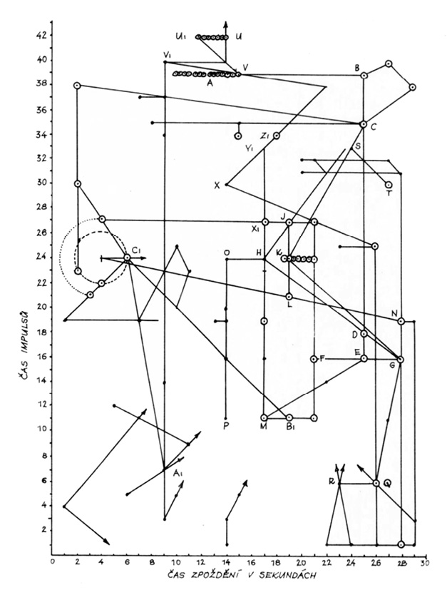

Pro lovce nespočetných a málokdy zcela průkazných indicií z dávné minulosti lidstva je vysloveně odstrašujícím případem a varováním tunguzská katastrofa, čtenářům jistě dobře známá. Pro upamatování: dne 30. června 1908 v 07 hodin 17 minut místního času prolétlo nad Sibiří žhavé těleso, popisované některými svědky jako „trubka“ nebo „kláda“, dopadlo o jedenáct vteřin později do oblasti severně od faktorie Vanovary v povodí Kamenné Tunguzky (60° 55’ s. š., 101° 57’ v. d.) způsobilo značné zpustošení širého okolí. Zájemci naleznou podrobnosti v odborném nebo populárně vědeckém tisku.

  

Jde tedy o událost například proti hypotetické zkáze Atlantidy planetkou A velmi nedávnou, necelých sedmdesát let starou, jejímuž vysvětlení se věnovalo množství kvalifikovaných odborníků ve svých pracovnách i na místě samém. Byli vyzbrojeni potřebnými vědomostmi a záhy i moderními přístroji, znali cenu dostatečné míry sebekritiky. Oblast výbuchu byla sice trochu pozdě (první Kulikova výprava se na místo v pravém slova smyslu prosekala teprve roku 1927), ale přece jen dokonale prozkoumána.

Data a poznatky, nasbírané za padesát let, umožnily třem sovětským matematikům, Korobelnikovovi, Čiškonovi a Šuršalovovi (_Acta Cosmonautica_ 3, 615, 1976), odvodit roku 1976 model pádu. Na ploše 2150 km2 bylo balistickými vlnami zničeno 60 tisíc stromů. Obrys zničené tajgy není kruhový, ale má tvar rozepjatého motýla, širokého 75 km a dlouhého 50 km. K výbuchu došlo ve výšce 6,5 km nad tajgou a dráha tělesa svírala s povrchem Země úhel 40° (při dopadu). Celková energie výbuchu a balistických vln byla asi 9,5 Mtun, což je ekvivalent velkorážové termonukleární nálože.

Měli bychom tedy zdánlivé právo očekávat jisté sjednocení duchů na nejpřijatelnější domněnce nebo alespoň na skupině domněnek, na výchozí pracovní hypotéze, prokázané experimenty, průzkumem, vyhodnocením zpráv svědků (jichž bylo více než dost), seizmografických záznamů atd. atd.

To je teorie – podle Goetha šedivá, zatímco žití strom se prý zelená. Opak ovšem bývá pravdou. Každá teorie je nádherným a slibným drahokamem, skrývajícím kazy a rozpory praxe. Slibuje modré z nebe, okouzluje perspektivami – v tomto případě jednotným názorem odborníků na výjimečný přírodní úkaz. Žití strom poskytuje střízlivější obraz.

Redakce známého sovětského časopisu _Priroda_ se nedávno rozhodla sestavit přehled hypotéz, který zkráceně a po úpravě cituji.

První skupinu tvoří hypotézy, předpokládající působení inteligentních bytostí:

  

1\. Atomový výbuch marťanského kosmoletu (1946)

2\. Meziplanetární loď, brzdící raketovými motory (1950)

3\. Odlet lodi po krátkém pobytu na Zemi (1955)

4\. Přílet lodi z Venuše (1958)

5\. Kosmická loď s měděnými vodiči a polovodiči (1958)

6\. Průzkumná automatická sonda z Venuše (1959)

7\. Raketa s tryskami, jež určily tvar tlakové vlny (1960)

8\. Jaderný výbuch neznámého původu (1960)

9\. Létající talíř (1961)

10\. Paprsek laseru, vyslaný ze souhvězdí Labutě (1964)

11\. Kosmická loď, která na Zem dopravila yettiho, sněžného muže (1965)

12\. Relativistický kosmolet, cestující proti času (1965)

13\. Srážka několika kosmických lodí (1966)

14\. Havárie manévrujícího kosmoletu (1967)

Hypotézy kolem antihmoty:

  

1\. Pád antimeteoritu (1947)

2\. Anihilace antihmoty v atmosféře (1958)

3\. Rozpad kosmického tělesa, podobného planetě Faethón (1959)

4\. Dopad kousku hmoty supertěžké trpasličí hvězdy (1966)

5\. Dopad normálního meteoritu s malou družicí z antihmoty (1968)

6\. Přeměna času, prostoru atd. v energii (1969)

Náboženské hypotézy:

  

1\. Sestoupení evenského boha Agdy (Oglua) na Zemi (1908)

2\. Přelet ohnivého draka (1908)

3\. Opakování katastrofy Sodomy a Gomory (1950)

Hypotézy geofyzikální:

  

1\. Výbuch jednoho nebo několika kulových blesků (1908)

2\. Neobvyklé zemětřesení (1908)

3\. Japonská dělostřelba (1908)

4\. Uragán, doprovázený požárem (1928)

5\. Katastrofa továrny na výrobu umělých diamantů (1958)

6\. Výbuch obrovského mračna komárů a típlic (1960)

7\. Výboj ionosféry, vyvolaný dopadem meteoritu (1962)

8\. Výbuch zemního plynu po dopadu meteoritu (1962)

9\. Kataklyzma v protilehlé oblasti Země (1964)

10\. Výbuch bahenního plynu, zapáleného bleskem (1967)

Meteoritické hypotézy:

  

1\. Exploze skupinového meteoritu (1908)

2\. Pád obrovského meteoritu do povodí Kamenné Tunguzky (1922)

3\. Vzdušná exploze meteoritu s tlakovou vlnou (1925)

4\. Dopad meteoritu v podobě střepin a plynů (1927)

5\. Průlet meteoru po tečně a jeho odlet do vesmíru (1929)

6\. Srážka s kompaktním mračnem kosmického prachu (1932)

7\. Dopad železoniklového meteoritu do bahna (1939)

8\. Vznik meteoritického kráteru, jenž se naplnil bahnem (1949)

9\. Meteorit neobvyklého složení, např. z ledu (1958) nebo sněhu (1975)

10\. Balistická vlna přeletujícího meteoru (1958)

11\. Déšť žhavých meteoritů, jenž vytvořil v půdě dutiny (1959)

12\. Balistická vlna meteoritu, jenž se nad zemí odpařil (1959)

13\. Bouřlivé odpaření (tepelná exploze) ledového meteoritu (1960)

14\. Postupný rozpad meteoritu tlakem vzduchu (1964)

15\. Průlet jasného bolidu nad Dánskem (1908)

16\. Dopad meteoritu u Filimonova (1908)

17\. Dopad meteoritu k řece Keť (1948)

18\. Meteorit se po dopadu odrazil k severu (1958)

19\. Železný meteorit, rozpadlý v prach, který ve vzduchu shořel (1958)

20\. Dopad kamenného meteoritu u potoka Čurgim (1959)

21\. Zkázu způsobil elektrostatický náboj meteoritu (1959)

22\. Srážka dvou meteoritů v atmosféře (1959)

23\. Srážka částí rozpadlého meteoritu ve vzduchu (1959)

24\. Destrukce způsobená nestabilností lesa při dopadu meteoritu (1960)

25\. Meteorit letící od západu dopadl na Nižní Tunguzce(1960)

26\. Uhlíkový meteor shořel ve vzdušném kyslíku (1966)

27\. Meteor rozerván při průletu atmosférou tepelným napětím (1967)

Kometární hypotézy:

  

1\. Dopad „planety“ nebo komety za Angaru (1908)

2\. Dopad Pons-Winneckeovy komety a roje Bootid (1926)

3\. Srážka s malou kometou s prašným ohonem (1934)

4\. Srážka s Enckeho kometou, ocitající se roku 1908 poblíže Země (1958)

5\. Podle dráhy i fyzikálních vlastností neznámá kometa (1960)

6\. Exploze rozkladem volných radikálů v kometě (1960)

7\. Exploze bouřlivě odpařeného ledu v jádru komety (1960)

8\. Dopad téže komety, jež zničila Atlantidu (1963)

9\. Exploze jádra komety z mechanických příčin při průletu atmosférou (1964)

10\. Průlet komety 1874/II a její tlaková vlna (1965)

11\. Výbuch třaskavého plynu, vzniklého disociací vody v kometě (1966)

Syntetické hypotézy:

  

1\. Disociace ledového meteoritu a za vysoké teploty zahájená termojaderná reakce (1961)

2\. Kosmická loď poháněná antihmotou, maskovaná jako kometa (1963)

3\. Kometa z antihmoty, vybuchující v atmosféře (1965)

Skromně podotýkám, že jsem bez zvláštní námahy dodal další domněnku, tuším již sedmdesátou pátou: dopad částí jedné z přirozených a dočasných družic Země, jež dosáhla kritické, tzv. Rocheovy meze, kdy slapové síly naší planety rozrušily její soudržnost.

Snad stojí za zmínku, že se mi v roce 1969 přihlásil pozoruhodný svědek, pan Bohdan Berka z Dolánek u Terezína, který byl podle svého tvrzení jako chlapec po dva dny, předcházející tunguzské katastrofě svědkem přeletu zvláštního tělesa vždy před půlnocí, kolem 23.00 SEČ. Těleso se jevilo první den pozorování jasně zlaté, jakoby rozžhavené, druhý den žhnulo rudě. Také pan Berka, který patrně nebyl informován o podrobnostech svědeckých výpovědí, je popisuje jako „trubku“ nebo válec, první den s jakýmisi výtrysky plamenů, silnějšími na zadním a slabšími na předním konci, druhý den již bez výtrysků a bez strukturální rozlišenosti, patrné při prvním pozorování, zato však se zřetelnou kouřovou stopou. Průlet nad místem pozorování, jež je dodnes zachováno – kamenná lavička před starým domem – trval v obou případech asi dvě vteřiny.

Pan Berka působil veskrze střízlivým a důvěryhodným dojmem. Pozorování si zachoval i s datem díky svému deníku v paměti naprosto přesně, vyprávěl o něm v minulosti mnoha lidem, ale teprve daleko později se dozvěděl o události v povodí Kamenné Tunguzky. Na celé věci je nejpozoruhodnější fakt, o němž můj informátor (zprávu o průletu jakéhosi tělesa ve dnech bezprostředně předcházejících tunguzskou událost uveřejnil jen francouzský hvězdář-amatér) téměř jistě nevěděl: po dosti složitém propočtu rekonstruované dráhy pozorovaného objektu, pro nějž jsme určili na místě pozorování úhlovou rychlost, předpokládali charakter tělesa na oběžné dráze, přihlédli k rotaci Země atd. atd., jsme s přítelem astronomem pracně dospěli k závěru, že by se předmět na této oběžné dráze a pohybující se touto úhlovou rychlostí nalézal v okamžiku tunguzské katastrofy nejspíše – nad střední Sibiří…

A ještě jedna velice exkluzívní hypotéza nám byla nabídnuta americkými fyziky A. A. Jacksonem a M. P. Ryanem, pracovníky střediska pro teorii relativity na univerzitě v Austinu (Texas). Tvrdí, že objektem, pojmenovaným dnes tunguzský meteorit, byla ve skutečnosti „černá díra“. Její rozměry nebyly nijak impozantní, byla menší než zrnko prachu, ale při své hmotnosti kolem 106 tun a rychlosti 40 000 km za hodinu způsobila v místě dopadu známé jevy a zkázu, prolétla Zemí jako brok hrudkou másla a vynořila se opět z nitra Země někde v severním Atlantiku mezi New Foundlandem a Azorskými ostrovy. Bylo by – soudí oba originální Texasané – dobré, prozkoumat záznamy přístrojů a lodní deníky z této oblasti a ze dne 30. června 1908.

Domněnka je trochu divoká, dokazuje však nejen trvalý zájem o tuto událost, ale i zákonitost zbrusu nových interpretací, objevujících se s novými poznatky základního a aplikovaného výzkumu.

Nejhezčí na ní je, že nejen není tak bláznivá, jak se na první pohled zdá, ale naopak fyzikálně zcela přípustná. A co více, že by setkání s takovým objektem bylo patrně doprovázeno ještě efektnějším doprovodem, než jaký vědci i laičtí pozorovatelé registrovali při pádu tunguzského tělesa.

M. J. Rees, který v časopise _Observatory_ (1974) uveřejnil shrnující materiál o všech fyzikálně možných i nemožných černých dírách a o našich vědomostech o nich, soudí, že velmi mnoho „miniděr“ mohlo vzniknout při samém zrodu vesmíru, v první milióntině vteřiny po „velkém třesku“, big bangu (viz _Tušení stínu_). Mohou existovat dodnes. Minidíra hmotnosti Země by měla průměr (Schwarzschildův poloměr násobený dvěma) několik milimetrů, minidíra velikosti protonu by měla hmotu kolem 1015 g – názorněji řečeno miliardu tun. Mohla by cestovat velmi daleko a opravdu projít celou naší planetou nejen bez obtíží, ale i bez valného snížení rychlosti. Někteří badatelé dokonce soudí – a nelze jim oponovat pozorovacími argumenty, právě tak jako dosud nelze pouhým pozorováním vyvrátit domněnku, že Jupiter je osídlen malými růžovými slony – že plnou polovinu celkové hmoty naší Galaxie tvoří tyto bizarní a názorně nepředstavitelné objekty –

Minidíry s hmotností v rozmezí 1015 až 1018 gramů (miliarda až bilion tun) mohou za jistých okolností působením kvantově mechanických efektů explodovat a v době kratší než jedna vteřina uvolnit energii asi 1035 ergů. Takový ohňostroj by měl být registrovatelný v celé oblasti Galaxie a někteří autoři soudí, že záblesky gama-záření, zaznamenávané našimi stále zdokonalovanými přístroji, mají právě tento původ. Je to odvážná domněnka, ale o nic spekulativnější nebo exotičtější než mnohé jiné.

Proti Jacksonově a Ryanově hypotéze tedy svědčí nejspíše fakt, že výbuch tunguzského tělesa postihl poměrně nepatrnou část povrchu naší planety. Exploze o energii 1035 ergů by se nespokojila se surovým vyhozením odpočívajícího kočovníka Ljučetkana z lože, ale zničila by přinejmenším polovinu povrchu naší planety přímo, zatímco zbytek by patrně devastovaly sekundární jevy vulkanické, seizmické, nepředstavitelné vlny tsunami atp. Pro porovnání: Až dosud největší zjištěný meteoritický astroblém na území SSSR je Popigajská kotlina na severní Sibiři nedaleko moře Laptěvů o průměru více než sto kilometrů. Vytvořilo ji před 30 milióny let svým dopadem těleso o průměru 0,6 až 1,5 km, jež vybuchlo v hloubce asi 1,5 až 2 km a zpustošilo statisíce čtverečních kilometrů širého okolí. Energie výbuchu je odhadována na 1030 ergů – exploze černé minidíry by tedy uvolnila 10 000krát více energie. Prostý průlet by naopak nemusel být vůbec zpozorován.

Myslím, že pozorování je dostatečně plastické.

Uvedl jsem tuto domněnku spíše jako doklad okamžité aplikace nových objevů na dávno známá fakta než jako příspěvek, rovnocenný kometám, meteoritické, ba i „návštěvní“ hypotéze. Astronomové nebyli Jacksonovou a Ryanovou myšlenkou nijak zvlášť nadšeni a prof. Kenneth Brecher, astronom univerzity v Cambridgi (Massachusetts), vydavatel astronomického Dikobrazu nazvaného Černá díra, si neopomněl omočit dne 14. 2. 1974 článkem Texaští troufalci testují tunguzskou tragédii (překlad J. Grygar), kde mj. píše: „… Náš zpravodaj navštívil v této souvislosti námořníka Pepka, jenž se zotavuje po svém 110. infarktu v Bethesda Memorial Hospital, Washington D. C. a je už zase na zcela špenátové dietě. Proslulý hrdina comics prohlásil, že byl v uvedené době shodou okolností jen asi pět nautických mil od místa vynoření černé minidíry, jak je udali Jackson a Ryan, a neslyšel ani žbluňknutí konzervy. Poznamenal též, že nikdy předtím neslyšel nic tak potrhlého a že tohle je možné asi jen v Texasu…“ Takže černých děr v souvislosti s pádem tunguzského tělesa raději nechme.

Sám výpočet domněnek o podstatě tunguzské katastrofy naznačuje, že se nemůžeme pouštět do podrobnějších výkladů. Diskuse však neustávají a můj „tunguzský archív“ utěšeně roste. Stále častěji do něho přibývají články a studie s hrdým názvem Konec tunguzské záhady. Každý autor považuje své řešení za konečné a definitivní – např. akademik V. G. Fesenkov, který uzavřel diskuse kometární hypotézou. Ne nadlouho.

Odpůrci zásahu jakékoli nepozemské inteligence argumentují spíše emotivně než logicky. Akademik Arcimovič v souvislosti s tunguzskou katastrofou důvtipně poznamenal: „Kdyby někdo zazvonil u dveří mého bytu a já myslil, že to je někdo z mých známých nebo listonoš, a pak by vyšlo najevo, že to není ani ten, ani onen, proč by to nutně musela být anglická královna?“

Jistěže by to nemusela být anglická královna (bůh ji ochraňuj!). Kdyby náčelník kmene karibských indiánů spatřil daleko na obzoru bílý bod, plachtu, a domníval se, že je to nejodvážnější rybář celé vesnice Šedý kormorán nebo návštěva sousedního spřáteleného kmene, a pak by vyšlo najevo, že to není ani ten, ani oni, proč by to právě museli být příšerní bílí vetřelci z neznámé a podle všeho neexistující země za nekonečným mořem, přicházející vyhubit ohnivými rourami jeho lid?

Nemuseli, pochopitelně. Ale jednoho dne přece jen byli.

Ostatně – oněch „klepání na dveře“ je v poslední době více a mají několik společných podivností; především se odehrávají nad nejméně zalidněnými oblastmi pevnin, za druhé, obvykle nejsou nalézány zbytky kosmických projektilů, ačkoli jsou to střely velice slušných kalibrů a ačkoli jejich naměřená rychlost (méně než 20 km/sec) připouští odpad alespoň částí na povrch Země.

20\. srpna 1969 ve 22.58 hodin proletěl nad Britskou Kolumbií bolid jasnější než Měsíc a zmizel nad pralesem v okolí jezera Tabor. Rachot se rozléhal v okruhu několika set kilometrů, čtyři seizmografické stanice registrovaly silné otřesy půdy. Průzkum předpokládaného místa dopadu byl velmi pečlivý a provedený za účasti letadel, vrtulníků i pozemních skupin, povzbuzených příslibem prémie ve výši 1000 dolarů. Nebylo nalezeno zhola nic.

31\. března 1965 prolétl rovněž nad Kanadou, tentokráte jižní, neméně nápadný bolid, jehož let zakončil hromový výbuch, slyšitelný do vzdálenosti 200 km, a otřesy půdy, registrované v kanadských provinciích Alberta, Montana a Britská Kolumbie. Tlaková vlna byla zaznamenána až v 1600 km vzdáleném americkém Coloradu. Výsledek velkorysé pátrací akce byl neobyčejně hubený: po měsíci nalezli dva studenti na zamrzlé hladině jednoho jezera několik odštěpků, vážících dohromady méně než gram. Jejich souvislost s bolidem je ovšem nejistá.

(Poznamenejme, že nálezy meteoritů na ledu jsou možné a vzhle­dem k nápadnosti dosti časté. Řada meteoritických kamenů z pádu u Pultusku v Polsku 30. ledna 1868 neprorazila ani tenký led, právě tak jako kámen spadlý 12. března 1899 u Bjurbölle nedaleko Helsink.)

A do třetice: 5. února 1967 v 18.55 prolétl nad kanadskou provincií Alberta tiše se pohybující rudomodrý bolid zářící tak intenzívně, že na dráze letu způsobil vypnutí fotobuněk, ovládajících pouliční osvětlení. Za obvyklých efektů rázové vlny a otřesů půdy vybuchl bolid – jak bylo možné zjistit na snímku jedné z fotokamer, zaznamenávajících průběh polárních září – ve výšce 13 km, což samo o sobě je fyzikálně přípustné: při rychlosti kolem 30 km·s−1 dosahuje již ve výšce kolem 20 km nad povrchem Země odpor atmosféry hodnot 8,5 t·m−2. Mohutné brzdění meteoru přechází v neméně mohutnou explozi, uvolňující na 1 kg hmoty meteoru ekvivalent 100 kg tritolu. Podle pozorování se však tento bolid pohyboval řádově menší rychlostí a jeho efektní zánik je tak trochu otazníkem. Výsledky hledacích skupin se blížily nule: byly nalezeny dva nepatrné úlomky šedého chondritu (nejobvyklejší typ meteoritů vůbec) o hmotnosti 48 mg a 94 mg, jejichž mateřským tělesem bolid mohl, a nemusel být.

Velice pozoruhodný a velice podivný meteor prolétl 10. 8. 1972 – jak zvláštní shoda! – opět nad územím USA a Kanady. Podrobně jej popsal známý americký astronom L. Lacchia v červencovém čísle časopisu _Sky and Telescope_ 1973. Těleso o hmotnosti asi 1000 tun bylo během svého více než minutového letu nad Utahem, Montanou a Albertou fotografováno z různých míst (astrofyzikální observatoř v Cambridgi sleduje šestnácti pozorovatelnami 400 000 čtverečních mil území ÚSA), což umožnilo zpracovat potřebné údaje a zjistit nejen 1500 km viditelné dráhy, ale extrapolovat i původní dráhu ve sluneční soustavě. Těleso vlétlo do atmosféry pod velmi malým úhlem, sestoupilo nad Montanou do výše 58 km a poté se opět zemskému povrchu vzdalovalo, opustilo atmosféru a zmizelo ve vesmíru. McCrosky, který spočítal jeho dráhu, určil i průměrnou rychlost – 15 km·s−1, z čehož soudí, že se rozhodně nejednalo o těleso umělé.

Patrně opravdu ne, ale… Ale průlet tohoto meteoru s velmi výjimečnou dráhou byl provázen neméně výjimečnými úkazy, především akustickými. Hluk se totiž ozval pouze při vstupu meteoru do atmosféry ve výšce 76 km, pak ustal, ačkoli zvukové efekty registrujeme u meteoru obvykle teprve ve výškách pod 60 km. Rychlost 15 km·s−1 není nijak nedosažitelná i pozemské technice; některé umělé kosmické sondy, urychlené gravitačním polem planet, se v tomto okamžiku řítí kosmem několikanásobně rychleji. Také hmotnost by mohla řádově odpovídat např. kosmickému korábu blízké budoucnosti (a ovšem několikastupňovým nosným raketám dneška). A konečně výpočet změny dráhy tělesa zbrzděním v atmosféře a účinkem gravitačního pole Země v interpretaci McCroskyho se opírá o matematicko-fyzikální předpoklady. Není – a bohužel už ani nemůže být – potvrzen pozorováním. Pozoruhodný host putuje zase vesmírem a jeho návrat, šlo-li o meteor, je velmi, velmi nepravděpodobný…

Jeden z dosud posledních pokusů o ukončení vleklé „tunguzské diskuse“ učinil koncem roku 1969 obsáhlou, velice podrobnou monografií sovětský geofyzik A. Zolotov. Nazývá se _Problém tunguzské katastrofy_ _v roce 1908_ a vydalo ji nakladatelství Nauka. Autor píše na závěr knihy jakési shrnutí:

„Tunguzské kosmické těleso nemohlo být ani kometou, nemohl to být ani roj částic nebo oblak kosmického prachu, nemohl to být ani běžný železný, kamenný nebo ledový meteorit…

Nad tajgou došlo k jadernému výbuchu. Ve výšce 5–7 km došlo k explozi kosmického tělesa o průměru 50–70 metrů a o délce 550–560 m, jež se pohybovalo rychlostí 1–2 kilometry za vteřinu.“

Své vývody dokládá přísnou matematickou kontrolou a kritickým hodnocením existujících svědeckých výpovědí, což se zdá být perspektivnějším a přijatelnějším způsobem než odmítání hypotéz per analogiam z nevíry v návštěvu anglické královny, případně naopak na základě víry, že kmenový bůh ohně Oglu občas sestupuje na Zemi.

Pokud se dalšími výzkumy – o nichž nepochybujeme, ačkoli jsou se vzrůstajícím odstupem času stále obtížnější – potvrdí nebo alespoň nevyvrátí Zolotovovy závěry, skvěle souhlasící nejen s místní situací po výbuchu, ale i s výpověďmi svědků, spatřujeme zatím v události na Podkamenné Tunguzce jev, nevysvětlitelný dosud známými přírodními ději, a nasvědčující spíše havárii umělého objektu vysoké technické úrovně. Vesmírem – pokud víme – nelétají ani meteory, ani komety ve tvaru protáhlých válců, pohybující se na kosmické poměry šnečí rychlostí přepadové stíhačky a vybavené štěpnými materiály. Přirozené procento radioaktivních prvků v dosud prozkoumaných meteoritech je mizivě malé a nikdy nemůže vést ke vzniku samovolné jaderné reakce.

Kromě velmi účinného brzdění podivného tělesa, jež podle podrobné studie aerodynamika a leteckého konstruktéra A. J. Monockova při letu, probíhajícím v úhlu nejvýše 20° k zemskému povrchu, což je pro meteor dráha značně neobvyklá, snížilo rychlost z 45 km·s−1 dokonce na pouhé 2M (asi 700 m·s−1), je zde i opomíjená nebo spíše některými autory taktně zamlčovaná neshoda údajů o směru, kterým „trubka“ letěla. Je to tím podivnější, že svědky byli vědci, školení, zkušení a ovšem kritičtí pozorovatelé. Ředitel irkutské observatoře A. V. Vozněsenskij udal směr letu od jihu k severu, I. S. Astapovič na základě shrnutých výpovědí od jihozápadu na severovýchod.

Krinov proměřil situaci míst, kde se nacházeli svědkové, a jejich svědectví o tvaru a směru kouřové stopy, jež by měla naprosto odstranit jakékoli pochybnosti, porovnal s mapou – došel ke dráze od jihovýchodu k severozápadu. Konečně expedice, jež roku 1963 prozkoumala na území 60 000 km2 (a tedy větším než Čechy) rozložení kosmického prachu, mikrometeoritů a podivných srostlic, železných a silikátových kuliček, nalezených poprvé v okolí roku 1961 expedicí K. P. Florenského, objevila úzký „jazyk“ zvýšené koncentrace částic svědčící pro přílet tělesa od jihovýchodu…

Logické vysvětlení této neshody je dvojí: buď jde o lidskou nedokonalost a jakési kolektivní poblouznění, zabraňující určit alespoň poněkud přesně směr průletu mimořádně nápadného tělesa, zanechávajícího zřetelnou kouřovou stopu (ačkoli mnoho meteoritů bylo nalezeno i bez fotografického zachycení, pouze vyhodnocením dvou kratičkých pozorování z extrapolace průmětů dráhy), nebo, což ovšem není snadné připustit, těleso v poslední fázi letu manévrovalo a měnilo směr, jevící se pak pochopitelně pozorovatelům v různých místech různým. Vzhledem k tomu, že dosud nebyly zjištěny ani meteority, ani komety s kormidly nebo směrovými tryskami a že je jejich existence velmi nepravděpodobná, byla pozorování o změnách směru průletu tělesa pro klid duše raději založena ad acta.

Právě v nich však může být klíč.

Evenkijský národní okruh, kam 30. června 1908 tunguzské těleso dopadlo, se svou rozlohou vyrovná Finsku a Švédsku dohromady – a přece je dnes, kdy je o kočovníky pečováno a kdy zde existují prosperující kolchozy a sovchozy, zabývající se chovem sobů a zajišťující i lékařské ošetření a zdravotnickou osvětu, v této obrovské oblasti toliko 30 tisíc obyvatel. Těleso, odsouzené ke zkáze jaderným výbuchem, jenž zcela zničil více než 2000 km2 tajgy, si nemohlo „vybrat“ příhodnější místo. Zdá se dokonce, že i v rámci samotné oblasti, obývané Evenky, byla náhodou nebo záměrně provedena co nejoptimálnější volba: podle všecho nedošlo k obětem na životech (nehledě na pozdější nepotvrzená úmrtí podivnou nemocí). Nejbližším očitým svědkem byl kočovník Ljučetkan s manželkou, kteří se ocitli na samém okraji prudce vzplanuvšího lesa a celou příhodu odnesli jen několika modřinami, když je tlaková vlna shodila z lůžek.

Rovnoběžka dopadu tunguzského tělesa však prochází nejen hustě osídlenými místy, ale i velkými městy: Leningradem. Helsinkami, Oslem, takřka se dotýká Tallinu a Tobolska i Jakutska. Na americkém kontinentě protíná osídlené pobřeží jižní Aljašky a prochází velmi řídce osídlenou Britskou Kolumbií a Albertou do opět osídlených oblastí až k nehostinnému Labradoru. Dopady velkých meteoritů – přijmeme-li všeobecně uznávanou meteoritickou hypotézu – se tedy v posledních sedmdesáti letech a podle situování astroblémů (Popigajská kotlina, Vredefort Ring, krátery v Austrálii, pády obrovských kovových meteoritů v historické době na území Jižní Ameriky, Barringerův kráter v arizonské poušti nedaleko Canyon Diablo, meteoritické impakty pod ledem Antarktidy atd.) i daleko dříve odehrály buď do světového oceánu, nebo na nejne­obydlenější místa pevnin, nejčastěji poblíže 60° s. š., přičemž frekvence zásahů do těchto liduprázdných rajónů nejen daleko převyšuje počet pravděpodobnosti, ale je s ním v jistém rozporu. Na rozdíl od starších domněnek (Galle, Nielsen aj.) se totiž dnes domníváme, že oběžné dráhy meteoritů a bolidů jsou krátkoperiodické a že se do značné míry podobají drahám planetek, z nichž tato tělesa pravděpodobně, byť ani ne všechna, pocházejí. Tím ovšem předpokládáme prostorovou kumulaci meteorů zhruba v rovině ekliptiky, kde snad kdysi kroužila mezi Marsem a Jupiterem hypotetická sesterská planeta Faethón, jejíž existenci předpokládá řada vědců sovětských i amerických, i např. významný holandský astronom Oort. Rozložení zaznamenaných dopadů však tomu neodpovídá, i když jejich poměrná vzácnost nedovoluje seriózní statistický průzkum. Jisto je, že v historických dobách žádný z „velkorážových“ nebeských projektilů nenatropil škody, které by lidstvo postihly, ačkoli možností bylo dost a frekvence dopadů poměrně značně hmotných meteoritů je asi podstatně větší, než se obecně předpokládá.

Je to jen náhoda? Nebo je to argument pro možnost stejného úmyslu, jaký vede letce, aby neopouštěl své hořící letadlo a prokázal poslední službu lidstvu jeho dovedením do neobydlených míst, kde zahyne ve vraku? Či snad – ve stylu fantastických románů – trosky a snad ani obsah těles neměly být nalezeny?

Tunguzskou katastrofu zkrátka – kromě výmluvného poučení o obtížích se sjednocováním názorů – až na další raději přijímáme do arzenálu stop dávných i méně dávných stínů. Tím spíše, že tento názor zjevně zastávají i mnozí sovětští vědci. V létě roku 1976 se uskutečnila do oblasti katastrofy další společná výprava tomské univerzity (vedená J. Lvovem) a Všesvazové astronomické a geodetické společnosti, zkoumající půdu v oblasti o rozsahu 50 000 km2. Na vyhodnocení nálezů, spektrálních a izotopových analýzách, se podílí Ukrajinská akademie věd. Je ještě mnoho co vysvětlovat – především zjištěné biologické následky katastrofy v dědičných vlastnostech a genomech místních rostlin. Tempo změn dědičnosti se zrychlilo podle pečlivých odhadů dvanáctkrát, nejsilněji v pro­dloužení dráhy letu tělesa. Za sedmdesát let byla zakrslá tajga nahrazena vysokým borovým lesem. Odborníci soudí, že semena borovic byla při katastrofě vystavena mocným mutagenním faktorům. Jsou opatrní, a vedle záření, které se vnucuje do úvah samo sebou, uvažují i o možné účasti lesního požáru a magnetických bouří.

Takřka neuvěřitelně zní závěr příprav expedice Tunguzka 1976: posledních tři sta kilometrů letělo těleso takřka přesně od východu na západ… Je to tedy další do pestrého souboru údajů o směru letu.

Výslovného zdůraznění zaslouží, že zájem o pád a výbuch tělesa není v žádném případě motivován skutečností, že šlo o jev efektní a nevšední. 12. února 1947 v 10 hod. 48 min. místního času spadl např. do tajgy na okraji Sichotsko-aliňského pohoří asi 400 km na sever od Vladivostoku železný meteorit, nazývaný dnes sichotsko-aliňský. Stopy jeho dopadu zjistili letci již třetí den a 24. února byla na místě skupina geologů z Chabarovska a Vladivostoku. Bolid zářil jako Slunce, sršel jiskry, vlekl za sebou ohnivý ohon, a několik hodin značil jeho dráhu pruh tmavého klubkovitého dýmu, který se jen pomalu rozplýval. Před vstupem do atmosféry byla jeho hmotnost asi 1000 tun – do míst impaktu se sneslo nejméně 100 tun – šlo tedy o dosud největší pozorovaný železný meteorit (snad s výjimkou meteoritických želez z Campo de Cielo, o nichž je řeč jinde, za ním následují jihoafrický Hoba-West s 60 tunami, grónský Zelt o 31 t, mexický Bacubirito-Ranchito, hmotný asi 14 t, a kdesi na konci pelotonu slovenská meteoritická železa Magura, 300 kg, Lenartov, 108 kg, a konečně český loketský „zakletý purkrabí“ o hmotnosti 107 kg), a ještě ke všemu – opět s výhradou možné výjimky v Jižní Americe – první známý případ deště železných meteoritů. Sichotsko-aliňský meteorit se totiž před dopadem rozpadl asi na 10 000 kusů, které byly šesti až dosud vyslanými vědeckými expedicemi většinou vysbírány.

Přes mimořádnost a efektnost události nedošlo v případě sichotsko-aliňského meteoritu k žádným romantickým interpretacím. Nebyl pro ně žádný důvod. Sichotsko-alinský meteorit se na rozdíl od svého tunguzského bratrance (byl-li opravdu z přízně) choval podle všech pravidel, platných pro meteority…

Nic záhadného nebudeme hledat ani v pádu kamenného meteoritu u Innisfree, východně od města Edmontonu v provincii Alberta v Kanadě 5. února 1977, zaznamenaného sítí dvanácti meteorických fotografických přístrojů – díky snímkům bylo možné potřetí v dějinách astronomie nalézt podle vyhodnocení fotografií místo dopadu (poprvé to byl meteorit u obce Luhy 7. dubna 1959, podruhé meteorit z Lost City v Oklahomě 3. ledna 1970) a kamenný meteorit o hmotnosti 2,07 kg. Jeden den hledání čtyřčlenné výpravy postačil.

Stejně uspokojivě objasněn je až dosud největší popsaný déšť kamenných meteoritů, který se 8. března 1976 zřítil v severovýchodní Číně a zanechal 1770 kg hmotných úlomků olivínbronzitových chondritů.

Dráhy mateřských meteoritů se takřka přesně shodovaly s rovinou ekliptiky, meteoroid, který posléze zanechal zbytek hmoty u Innisfree, se od této roviny odchyloval o 10°.

Kromě všeobecně známé, byť i, jak vidíme, nejrůznějším způsobem vykládané tunguzské katastrofy, kromě mnoha dalších pozoruhodností a do jisté míry i astronomických bizarností přinášejí meteority i jiné otázky.

Vyberme jen jeden jediný okruh, jímž se zabývají např. sovětský astronom docent Felix Zigel a jeho odborný komentátor a oponent akademik Vsevolod Fedinskij, před nimi pak celá řada vědců i romantických sběratelů pozoruhodných zpráv ze starých letopisů či mladších ročníků novin a časopisů. Jde o takzvané pseudometeority, jejichž chemická struktura se zcela vymyká jednak složení naprosté většiny ostatních meteorů a planetek roztříštěním hypotetické planety Faethón, kroužící kdysi mezi Marsem a Jupiterem a velikostí poněkud převyšující Mars, nebo vzájemnými kolizemi planetek (asteroidů). Tyto meteority mají odlišné chemické složení, leckdy tak neuvěřitelné, že se přes prokazatelně kosmický, nebo abychom byli opatrní a přesnější, nadoblačný původ nedostaly do kategorie meteoritů pravých a nesporných.

Pseudometeority byly odjakživa vděčným námětem pro kronikáře a zájemce o přírodní pozoruhodnosti. Nezkrotně zvídavý Plinius Starší např. napsal (II, 56): „… Za konzulů M. Acilia a C. Porcia pršelo mléko a krev, za P. Volumnia a Servia Sulpicia maso, které nehnilo, pokud se ho nedotkli ptáci. Stalo se rok před porážkou P. Crassa od Parthů v Lukanii (53 př. n. l. – pozn. L. S.) a v bitvě pak zahynuli vojáci z tohoto kraje. Když pršely železné houby, haruspikové ten úkaz uváděli v souvislost s otvory v nebi, jež zůstaly po šípech Parthů. Za konzulátu Lucia a Paula Marcella pršela vlna okolo hradu Carissanu, u něhož za rok zahynul P. Annius Milo. Tamže pršely podle záznamů pálené cihly během soudní řeči uvedeného muže.“

Déšť „železných hub“ bude nejspíše hromadným pádem železných meteoritů, sideritů, pro něž je přirovnání k železné houbě docela plastické a přiměřené.

5\. dubna 1820 dopadl na palubu britské plachetnice, plující na širém moři, rozžhavený kámen. Prozkoumal ho německý geolog Wichmann, určil – jistě správně – jako kalcit, a jeho meteoritický původ zcela nelítostně odmítl.

Roku 1855 dopadla poblíž litevského městečka Igast hrouda pemzy. Pád byl pozorován několika svědky, ale vzhledem ke složení byl kámen zařazen mezi pseudometeority.

Ještě více svědků sledovalo z bezprostřední blízkosti 11. dubna 1925 dopad jasného bolidu ve Švédsku. Meteorit se zaryl do země a roztříštil se. Rozbor ukázal, že jde – jako v případě z roku 1820 –o kalcit, avšak nepodobný všem švédským vápencům. Obzvláště pikantní bylo, že ve zlomcích kamene byly nalezeny zkameněliny mušlí a živočichů „podobných trilobitům“ (F. Zigel).

V květnu 1931 si farmář Coster z Eatonu ve státu Colorado (USA) spálil prsty obrazně i v pravém smyslu slova, když po překonání prvního leknutí dobýval z půdy své zahrádky žhavou kovovou hrudku, která přiletěla z nebe a těsně ho minula. Předal ji odborníkům, kteří zjistili, že třicetigramová hrudka je z mosazi, tedy ze slitiny mědi, olova a zinku, vyráběné na Zemi uměle a stěží představitelné kdekoli na cizích planetách jako přirozený minerál. Coster byl označen za podvodníka a hrudka, ačkoli pozoruhodně „meteoriticky“ tvarovaná i obalená struskou, za pseudometeorit, ne-li dokonce falzifikát.

V mineralogickém muzeu mongolského hlavního města Ulánbátaru je mezi vzorky nerostných podkladů této podivuhodné země jako kuriozita chována i pracně poslepovaná kamenná deska, šedozelená a s bílými skvrnami roztaveného křemene. Dopadla 21. března 1950 přímo před očima mongolských pohraničníků a roztříštila se na 355 pečlivě sebraných kousků o celkové váze 28 kilogramů. Kerulenský kámen, jak se desce říká, dopadl, buď jak buď, z oblak, kde v tom okamžiku zcela určitě žádné letadlo neletělo. Složení je však příliš osobité. Rozsudek: pseudometeorit.

Také u nás bylo nalezeno požehnaně pseudometeoritů. Roku 1819 při Studené u Telče křemen se slídou, 1848 v Kašperských horách nigrín s ilmenitem, 1854 v Rokycanech železná struska, 1857 v Chocni pozemské železo v opuce. Podobné nálezy pozemských želez, resp. strusky z tzv. vlčích pecí nebo kusů železných pískovců, hlíz pyritu, valounů limonitu atp. byly hlášeny roku 1863 ze Žamberka, 1864 z Kremnice, 1877 z okolí Lokte, 1883 ze Smidar, z Holina u Prahy, Veselé u Berouna a Kláštera nad Jizerou, 1933 z Teplic (K. Tuček). Zajímavé je, že někteří pozorovatelé již od roku 1820 velmi sugestivně líčili pozorovaný pád, ačkoli „nebeský“ původ meteoritů byl váhavě přijat teprve po dnes již klasickém dešti meteoritických kamenů 26. dubna 1803 v okolí L’Aigle ve francouzském departementu Orne a prosadil se teprve po slavné Chladniho knize, zakládající novou vědu o meteoritech (1819).

Mezi pseudometeority jsou dnes počítány i tektity.

F. Zigel píše ve své práci, že bohužel nikdo nikdy neviděl pády tektitů. Mýlí se. Byly publikovány zprávy o dvou pádech tektitů v Austrálii. První byl pozorován v létě 1932 u Lake Grace (váha tektitů 31 g), druhý roku 1935 u Gonesloe nedaleko Perthu (156 g). Oba pády potvrdilo několik svědků a tektity byly vykopány z hloubi asi 30 cm ještě teplé – přesto přese všecko nebo právě proto je svrchovaná opatrnost zcela na místě.

Australity, mimochodem řečeno, kladou i další dosud nerozřešené otázky. První z nich je zřejmý nesoulad mezi jejich absolutním stářím, určeným podle kalium-argonové metody na 700 000 až 860 000 let, a jejich stářím pozemským. Australský mineralog G. Baker, považovaný v tomto oboru za autoritu, se domnívá, že povrchové sedimenty, kde jsou australity nalézány, jsou velmi mladé, sotva 5000 let staré. Roku 1972 byly jeho výsledky zkoumány znalci Loveringem, Masonem, Williamsem a McCollem, kteří stáří těchto sedimentů, tzv. dun Lake Torrens, určili na 16 000 až 24 000 let. Rozdíl obou odhadů a především neobyčejně dlouhá doba, která uplynula od vzniku australitů (předpokládáme-li jejich impaktní původ při pádu velkého meteoritu) k jejich uložení v sedimentech, nebyly dosud objasněny. Bez definitivního vysvětlení je i nápadná tvarová variabilita australitů. Některé hypotézy se ji snaží vysvětlit simultánními impakty rozpadlého velkého meteoritu nebo jádra komety – toto vysvětlení však není bez zranitelných bodů. Konečně posledním pozoruhodným zjištěním je nejnovější a dobře fundovaný odhad cekové hmoty mikrotektitů v australsko-asijské oblasti, na níž se podílejí převážně australity: podle W. Gentera a O. Müllera tato hmota představuje asi sto miliónů tun (!), tedy ne jméně stotisíckráte více, než se předpokládalo ještě před několika lety. Je zřejmé, že tento odhad, bude-li potvrzen, pozmění i naše představy o frekvenci a kalibru vesmírných střel, jimiž byla naše planeta v minulosti zasažena a které – patrně – zrodily i tektity.

Po všech vyjmenovaných „výstřednostech“ australitů bych se těm pozorovaným pádům ani příliš nedivil…

O tektitech bylo podrobněji psáno v _Tušení stínu_. Zde pouze připomeňme, že dnes je všeobecně přijímána hypotéza o vzniku tektitů při dopadu kráterotvorných meteoritů s mimořádnou kinetickou energií, schopnou při změně v energii termickou vyvinout teplotu 10–20 tisíc K, vyslat horkou plazmatickou tlakovou vlnu, schopnou dokonce vytvářet diamanty z uhlíku karbonátových hornin a rozstříknout protavené horniny do širokého okolí – pole australitů se např. táhne takřka po čtvrtině zemského glóbu.

Dosud se nepodařilo nalézt všechny matečné krátery pro různé skupiny tektitů – chybí např. pro tektity americké. Australity a jejich příbuzenstvo v jihovýchodní Asii (indočínity aj.) vznikly patrně, jak již bylo řečeno, podle této domněnky simultánními impakty, jejichž stopy nejspíše skryly anktarktické ledovce. Vltavíny-moldavity jsou vcelku jednomyslně připisovány impaktu, který vytvořil kráter Ries. I o tom byly vysloveny pochybnosti (pracovníky geologického oddělení Národního muzea v Praze) a kráter Ries byl připsán na konto kryptovulkanismu, provedené vrty však spolupůsobení vulkanismu neprokázaly. Nejpřesvědčivěji se zdá být prokázána korelace mezi tektity Pobřeží slonoviny a kráterem Ašanti, vyplněným zčásti jezerem Bosumtwi (Ghana).

Další, některými autory přijímanou domněnkou je žárem způsobená metamorfóza místních hornin v tektity, např. granulitu (bělokamene) ve vltavíny. Moldavity se totiž markantně liší jak chemicky, tak i např. poměrem izotopů kyslíku od rieských skel, což bývá trochu násilně vysvětlováno účastí směsi pískovců a jílů z okolí kráteru nebo dopadem obrovských uhlíkatých chondritů.

Hypotézy meteoritické, tj. o přímé přeměně meteorů v tektity, nebo vulkanické (především o vyvrhování tektitů měsíčními sopkami) byly sice tiše, ale zato takřka úplně opuštěny. Z tohoto hlediska by byly ověřené dopady tektitů velmi pozoruhodné, tím spíše, že zájem o tato prazvláštní přírodní skla, neobyčejně podobná složením, strukturou, dehydrací a protavením sklovité strusce, vznikající při jaderném výbuchu, se stále stupňuje. Tektitů se totiž zmocnila nejen věda, ale i móda, zejména od chvíle, kdy se britská královna Alžběta ozdobila šperkem s tektitem, darem svého manžela, vévody z Edinburghu. (Moje manželka naopak rázně odmítla okrášlit se mým darem, vltavínem. Vypadá prý jako sklo z pivní láhve, což je bohužel pravda. A kromě toho nejsem vévoda.)

Dovolím si navrhnout novou hypotézu: Burns, Greenstein a Verosub provedli roku 1976 kvantitativní analýzu průchodu černé díry naší Zemí. Předpokládají (Mon. Not. R. astr. Soc. 175, 355; 1976), že přenesením energie z černé díry na atomy pozemské hmoty nastane roztavení a následné utuhnutí hornin v okolí 0,5 km až 4 km od místa dopadu, odpaření vody a rozrušení organických i anorganických materiálů. S dopadem by byla spojena seizmická aktivita, odhadovaná autory na 1019 až 1021 J, přesahující tedy padesátkrát nejsilnější dosud registrované zemětřesení. Odhad může být značně nadsazen, počítáme-li se subminiaturními černými dírami – mechanismus účinku však dobře odpovídá předpokládanému vzniku nejen tektitů, ale i dosud nevysvětlených ploch zesklovatělého písku v Gobi a některých jiných podivných minerálů. Teď jde o to, co na to námořník Pepek…

Věda neuznává ani ledové meteority, ačkoli byly pozorovány a už v dávných kronikách popsány tak často, že by jen jejich soupis vydal pěkných pár stránek. Za všechny jen několik vybraných případů docenta Zigela:

8\. května 1970 spadl v Jagotinu (Kyjevská oblast, SSSR) z bezmračné oblohy a s nápadným hlukem patnáctikilogramový nazelenalý kus ledu. Dvě obyvatelky sebraly několik úlomků, které rychle tály, a uložily je do skleněných nádob. Na místě dopadu zůstal po rozpuštění a vypaření ledu jakýsi solný nálet. Tekutina v nádobách pekelně čpěla čpavkem a sirovodíkem, takže méně odolná občanka svůj poklad vylila, druhá jej naštěstí odevzdala do povolaných rukou profesora Astapoviče. Chemický a mikroskopický rozbor doplněný zprávou občanky A. Romanovové umožnil určit, že se ledová hrouda skládala ze zmrzlé vody, amoniaku, metanu a drobných železoniklových a kamenných částic – odpovídala tedy našim představám o kometárních jádrech, ovšem v miniatuře. Není však důvodu, proč by vesmírem nebloudily na velmi výstředních drahách kolem Slunce v tzv. Oortově oblaku nebo lépe Oortově sféře kromě impozantních komet i nespočetné minikomety, v něž se koneckonců změní rozpadem nebo odtáváním a ztrátou hmoty tlakem slunečních paprsků dříve nebo později všechny komety (Halleyova kometa ztrácí při každém průchodu kolem Slunce třímetrovou vrstvu), proč by neměly občas vnikat do zemské atmosféry a dopadat jako ledové meteority mezi vzrušené diváky. Roku 1843 dopadl ve Francii kus ledu jako mlýnský kámen, orientální analisté dokonce zaznamenali pád kusu ledu, velkého „jako slon“. Ve všech těchto případech lze vyloučit přelet letadla, z něhož by se odloupla část námrazy – i to se totiž občas může stát a stává, avšak jen vzácně a na trase dopravních linek. Ostatně stěží bychom našli letadlo, schopné unést váhu ledu „jako slon“.

Jisté ovšem je, že i v mracích mohou vznikat hydrometeority slušných rozměrů a hmotností, kterým již ani s největší licencí nelze říkat „kroupy“. Jeden z nich se roku 1975 představil se zvláštním smyslem pro přesný výběr cíle britskému fyzikovi R. R. Griffithsovi, jehož při bouřce minul o pouhé tři metry. Griffiths spěchal s nezbedným kusem ledu domů, uložil ho v lednici a druhý den předal k rozboru. Mikroskopickým i chemickým zkoumáním bylo bezpečně zjištěno, že ledový „meteorit“ vznikl z vodních par, kondenzovaných v mracích, že tedy opravdu jde o maxikroupu hmotnosti 600 g, až dosud největší, jaká kdy byla spolehlivě a ověřeně nalezena. Zdá se, a fyzikální předpoklady to potvrzují, že ledový hydrometeorit, který málem připravil britskou vědu o vynikajícího představitele, dosáhl takřka mezní a zcela mimořádné velikosti a hmotnosti. Staré kroniky se však přímo hemží zprávami o kusech ledu daleko a daleko větších a těžších. Doložené případy pádů ledových hmot tedy stěží vysvětlíme pouhými přerostlými kroupami.

Odmítání existence ledových meteoritů je vlastně poněkud zvláštní. Vezmeme-li v úvahu dnešní představy o kometách (souhrnný materiál uveřejnil např. roku 1973 v časopise _Astrophysics and Space Science_ Ernest J. Öpik), musíme připustit, že ačkoli při pozorování velkých meteoritických rojů, vzniklých patrně a někdy zcela určitě rozpadem komet, nepadají meteority, není uvolňování částic kometárního jádra a jejich vniknutí do zemské atmosféry v rozporu s fyzikálními předpoklady. Naopak.

Z jader některých komet se opravdu větší balvany nebo kusy ledu uvolňovat nemohou – např. mateřská kometa Perseid „nepropustí“ kamének větší než 1,5 cm. U menších komet, zejména přiblíží-li se značněji k Zemi, je situace příznivější. Z Enckeovy komety se mohou uvolňovat balvany až 85 cm v průměru, což dobře odpovídá jak „mlýnskému kameni“, tak ledovému tělesu z Jagotinu. Ostatně sám Ópik se domnívá, že k dceřinému meteoritickému roji Enckeovy komety, Tauridám, je třeba přiřadit několik ověřených pádů meteoritů.

Vyjmenované případy zdaleka nejsou nejbizarnější – letopisy a jiné záznamy vyprávějí o dopadech zřejmě organických hmot značných rozměrů a hmotnosti, o svítících hmotách, které se rychle vypařovaly, a o celé řadě dalších příhod tohoto druhu. Jen na ukázku uveďme dva dobře ověřené případy, které by patrně žádný seriózní vědec nejen nezařadil mezi pády pravých meteoritů, ale vůbec do oblasti, o níž má smysl uvažovat.

26\. září 1950 spatřila policejní patrola John Collins a Joseph Keenan svítící objekt, který spadl do polí jihozápadně od Filadelfie v Pensylvánii. Povolali na pomoc dva policejní důstojníky a za nějakou dobu předmět objevili. Byla to podivná věc nepravidelného tvaru, asi dva metry dlouhá a třicet centimetrů silná, která se rytmicky rozsvěcovala a zase zhášela. Collins si dodal odvahy a dotekem zjistil, že hmota, z níž je „věc“ složena, je měkká, poddajná, na omak podobná želatině. Bez obtíží se mu podařilo kousek oddělit – roztál mu na dlani jako sníh (a poznamenejme: jako tzv. „andělské vlasy“ nebo podivné pentlicovité útvary, ještě nad zemí tající, jejichž déšť pozorovaly stovky svědků ve francouzských městech Oloronu a Gaillaku i jinde roku 1952). Celý objekt se bez zápachu za půl hodiny vypařil – lépe řečeno sublimoval, protože nezanechal ani stopy nějaké tekutiny nebo náletu. Všemi členy patroly ověřenou zprávu přinesly filadelfské listy 27. září 1950.

(Z chemického hlediska by „andělské vlasy“ mohly být např. z pev­ného kysličníku uhličitého a patrně i z některých amonných solí nestálých kapalin, např. dusitanu, azidu, uhličitanu apod. \[V. Patrovský\]. E. U. Condon, provádějící do roku 1968 průzkum UFO, uvádí, odvolávaje se na Hallovo mínění z roku 1964, že šlo většinou o pavučiny. Tato vysvětlení nelze dobře přijmout.)

28\. února 1958 spadla zářivě bílá koule z čisté a slunečné oblohy do dvorku Faustina Gallegose v Miami na Floridě. Byla poloprůhledná a zřetelně pulsovala, což potvrdili i rychle přivolaní sousedé. Světelná emise nebyla pozorována – zanikla možná ve sluneční záři. I tento objekt v krátké době několika minut bez zápachu vysublimoval.

Tato kniha ovšem v žádném případě nechce být sbírkou bizar­ností – pokud jde o podivné meteority jen upozorněním, že každý meteorit poskytuje cenné informace z kosmického prostoru a měl by být co nejrychleji a bez poškození, vyplývajícího obvykle z nezkrotné touhy po suvenýru, odevzdán odborníkům. Možná že by pak dříve nebo později došlo i k rehabilitaci tzv. pseudometeoritů a kdoví, snad i k zajímavým závěrům, týkajícím se dosud otevřených otázek o mnohokrát pozorovaných tělesech, potulujících se poněkud fantomaticky v nejbližším okolí naší rodné planety.

Čím alespoň některá tělesa mohla být, naznačil ve svém souborném příspěvku do listu _Spaceflight_ (1973, 122–131) Duncan A. Lunan z Glasgowské univerzity. Pokračoval vlastně ve výzkumu, započatém R. N. Bracewellem z Radioastronomického ústavu Stanfordské univerzity (USA), publikovaném již roku 1960 v časopise _Nature_ (186, 670). Jde o novou vzrušující interpretaci zpožděného „odrazu“, lépe řečeno zpožděného navrácení rádiových signálů, zjišťovaného již od roku 1920 norskými, holandskými a francouzskými odborníky. (Za laskavé upozornění a zapůjčení původních materiálů děkuji prof. R. Peškovi.)

Lunanova dosti odvážná domněnka vychází z celkem rozumného předpokladu: jestliže se chce jakákoli vyspělá vesmírná civilizace ohlásit do značné vzdálenosti např. stovky světelných let, je technicky nejschůdnějším prostředkem odeslání kosmické sondy, předvídané již roku 1960 I. S. Šklovským a Australanem R. N. Brace­wellem, schopné (astronomicky vzato) v bezprostřední blízkosti cílových planet vyhlédnuté hvězdy detekovat umělé elektromagnetické vlny a signály jimi zprostředkované a po několika vteřinách nebo minutách je vracet odesílateli jako nepochybné poselství o přítomnosti technicky poměrně náročného zařízení v blízkém kosmu. Modifikace a záměrné deformace signálu mohou být – jak uvidíme – nositelem další informace. Až dosud získané výsledky vedly např. J. Stronga (1965) k úvaze, že taková sonda již v blízkosti Země a Měsíce existuje, a to v některém tzv. ekvivalentním (libračním) bodě (centru) systému Země–Měsíc, nebo v jeho blízkosti, kde by její poloha byla relativně nerušena gravitačními vlivy, a tím stálá. V soustavě dvou těles, např. Země a Měsíce, existuje pět takových libračních center.

Další výzkumy dokázaly, že tato hypotéza rozhodně nemůže být odmítnuta jako pouhá fantazie – ale i kdyby nebylo těchto výsledků, považuji ji přinejmenším za velmi uváženíhodnou pracovní domněnku vzhledem k několika skutečnostem.

Není dosud zcela jisto, zda je možné počítat s relativistickým zkrácením času a tím prodloužením života kosmonautů proti délce života obyvatel Země, zvolené jako východisko souřadnic iner­ciálního systému, vzhledem k nimž se kosmická loď pohybuje. Právě když píši tuto kapitolu (1976), probíhá na stránkách _Vesmíru_ na autorsky nejvyšší úrovni (Z. Horák, J. Langer, J. Grygar, J. Koštíř aj.) diskuse mezi astronomy, fyziky a biology o reálnosti takového jevu, využitelného případně kosmonautikou i k dosažení vzdálených hvězd, ba i cizích galaxií v rozmezí jednoho jediného lidského života kosmonauta, zatímco by na Zemi uplynuly milióny a miliardy let. Diskuse byla uzavřena neshodou prof. J. Koštíře s ostatními účastníky. Otázka tedy není definitivně vyřešena ani po stránce biologicko-fyzikální, tím méně po stránce etické.

Velmi pochybuji, že by mravně vyspělá společnost vůbec po­dobné lety připustila, i kdyby o ně byl zájem, což je nepravděpodobné. Nezkrotná vědychtivost není v tomto případě argumentem. Badateli, těžce postiženému faustovským nutkáním, který by se chystal vypravit se na dno mořského příkopu bez možnosti návratu, a především bez možnosti podat o výsledcích své cesty zprávu (cestovní zpráva za milión let či miliardu let, nedojde-li jen ke hrobům civilizace, bude asi stejné ceny, jako zpráva žádná; její aktuálnost znatelně vyvětrá), by bylo jistě v sebevražedné expedici zabráněno. A právem.

Vraťme se však ke zpožděným signálům.

Poprvé zpoždění registrovali roku 1927 Američané A. H. Taylor a I. C. Young, kteří zjistili odrazy ve vzdálenosti asi 2900 a 10 000 km, vysvětlitelné dnes ovšem bez obtíží reflektováním vln ionosférou, vnitřními van Allenovými pásy. Na sklonku téhož roku však sdělil inženýr Hals, pracovník experimentální stanice firmy Philips v holandském Eindhovenu, profesoru C. Strómerovi z Oslo, že zjistil zpoždění odrážených signálů o plné tři vteřiny (při pokusech Taylora a Younga to byly setiny vteřiny). Hals předpokládal odraz o povrch Měsíce, Strómer o magnetosféru Země. Společně podnikli několik nezdařených pokusů. Teprve 11. října 1928 se úspěch dostavil – ale s překvapením. Zpoždění navrácených signálů totiž kolísalo od tří do patnácti vteřin. Strómer o tomto divu telegraficky informoval předního odborníka v oboru bezdrátové sdělovací techniky van der Pola, který ještě téhož večera experiment opakoval vysíláním přesně oddělených a omezených signálů v půlminutových intervalech. Zpoždění činila postupně 8, 11, 15, 8, 13, 3, 8, 8, 8, 12, 15, 13, 8 a 8 vteřin. Frekvence přesně souhlasila, poněkud pozměněno bylo trvání některých signálů.

Celkem přijatelnou interpretaci těchto signálů, jejichž zpoždění bylo v době experimentů všemi zúčastněnými pochopitelně považováno za dosud neznámý přírodní a přirozený fenomén, podal elektronik P. Morrison (_Bull. Phil. Soc., Washington_, 16, 58, 1962), který nad výsledkem, pokud lze podle článku soudit, zkoprněl.

Materiál je příliš obsáhlý a jeho doložení nemůže být bez zkreslení zkracováno – Morrison zkrátka zjistil, že při vynesení frekvence signálů a jejich návratů na souřadnice grafu se objeví rozdělený diagram se zřetelnou hvězdnou mapou souhvězdí Pastýře (Bootes), přičemž pozice největší a nejznámější hvězdy tohoto souhvězdí, Alfy Bootis, Arktura, naznačuje, že program pro tento originální způsob sdělování domovského souhvězdí byl vypracován asi před 13 000 lety. Arktur, obr spektrální třídy K 2, má asi 23krát větší průměr než Slunce a je relativně nedaleko, 35 světelných let – kosmický objekt by se tedy od této hvězdy k Zemi za 13 000 let dostal leda při průměrné rychlosti letu řádově desetitisíce km za vteřinu. Je to možné? Nevím. Možná že projekce souhvězdí Boota na naši oblohu byla vypracována pro dobu před 13 000 lety, kdy se sonda ocitla mezi planetami slunečního systému, což mimochodem řečeno dost dobře souhlasí s předpokládaným zánikem Atlantidy a umožňuje zajímavé domněnky. Například spojitost této katastrofy s nepozemšťany a ponechání radiosondy v blízkosti Země až do doby, kdy se po vzniku nové civilizace objeví signály, jež bude možné přijmout a s přesně určeným zpožděním opět odvysílat…

Doplňkem a potvrzením smělé Morrisonovy domněnky je vlastní Strömerův materiál. 11. října 1927 zachytil čtyři série navrácených signálů se zpožděním čtyř až patnáct sekund. Po malé úpravě (sám Strömer připouští, že jeho měření nebyla absolutně přesná, že však „poskytují spolehlivý obraz o kvantitativních ukazatelích ,jevu‘“) a opětném vynesení do systému navzájem kolmých souřadnic se objevuje znovu hvězdná mapa, tentokrát zpodobující větší část naší oblohy, kde ústředním a zřejmě hlavním objektem je opět Arktur.

24\. října 1927 se zpožďování signálů opakovalo – bylo zaznamenáno celkem 48 „ozvěn“, naštěstí většinou současně a souhlasně stanicemi v Oslo i v Eindhovenu, takže je možné vyloučit vliv místních podmínek (pokud si ho lze vůbec představit), nebo nedokonalosti přístrojů. Diagram těchto zpoždění, bohužel až do Lunanovy práce z roku 1973 neúplný, vyšel v řadě odborných časopisů a byl zařazen i do Strömerovy knihy _Polar Aurora_ (Oxford University Press, 1955). Grafické zachycení sledu všech zpoždění poskytuje hvězdnou mapu se souhvězdími Velkého medvěda, Honicích psů, Severní koruny, Vlasu Bereniky, Hada (hlavy), Herkula, Draka, Lyry a patrně i s několika hvězdami souhvězdí Malého medvěda a Lva. Ve středu je opět souhvězdí Bootes (Pastýř) – vše nasvědčuje tomu, že mírné posuny hvězd proti dnešnímu stavu představují zdánlivé změny jejich polohy za posledních 13 000 let. Podrobná a důvtipná interpretace této hvězdné mapy a jejího originálního podkladu se zdá ukazovat spíše než na Arktur na hvězdu Epsilon Bootis, Izar, na jejíž hypotetické planetární rodině však můžeme jen se značnou dávkou fantazie předpokládat život. Izar je totiž dvojhvězdou, a s další vzdálenější hvězdou dokonce vizuální trojhvězdou (v dalekohledu tak pěknou, že dostala název „pulcherrima“, nejkrásnější), vzdálenou 230 světelných let. Pokud kolem dvojhvězd vůbec předpokládáme planety, byly by jejich dráhy patrně (ale ne určitě – dostatečně přesvědčivé propočty drah dosud nebyly zveřejněny) značně komplikované a vystavovaly by planety střídavě extrémním podmínkám všeho druhu.

Zpoždění signálů zachytil Hals ještě 20. února, 28. února, 4. dubna, 9. dubna, 11. dubna a 23. dubna 1929. Šlo o menší množství „ozvěn“ a přesnější údaje nebyly publikovány.

Pokusy opakovala francouzská expedice, vyslaná v květnu 1929 do Indočíny, aby provedla komplexní průzkum úplného zatmění Slunce. J. B. Galle a G. Talon provedli sérii pokusů s krátkovlnným 500wattovým vysílačem, umístěným na lodi Inconstant a napájeným generátory lodi La Perouse. 9. května 1929 zachytil řadu zpožděných ozvěn o jednu, dvě atd., ale i 32 sekund. Interpretace paralelogramem, navržená D. A. Lunanem, se velmi podobá možné interpretaci pozemské zprávy, odeslané z popudu amerických vědců Deakeho a Sagana na pozlacené destičce o rozměru 150 × 230 mm. Sonda Pioneer 10, která destičku unáší, bude urychlena gra­vitačním polem Jupitera a vydá se do širšího kosmu. Na destičce je čtrnácti pulsary graficky určeno umístění naší sluneční soustavy v Galaxii, přičemž čárky a tečky ve dvojkové soustavě identifikují frekvenci kmitů neutrálního vodíku jednotlivých pulsarů, z čehož je možno (vzhledem k zákonitostem změn frekvence) určit i dobu startu sondy. Je zde graficky zachycena planetární rodina Slunce se vzdálenostmi uvedenými ve dvojkové soustavě i dráha sondy. Podobně je u kreseb ženy a muže uvedena v binárním řádu jejich velikost a složení zemské atmosféry.

Také zpráva, vyslaná ze Země do vesmíru z obřího třistametrového radioteleskopu z Areciba (Portoriko) dne 16. listopadu 1974 je šifrována do dvojkové soustavy a obsahuje jednak strukturní vzorec dezoxiribonukleové kyseliny s dvojicemi thymin – adenin a guanin – cytosin, jednak okótovanou siluetu člověka a schéma vysílacího radioskopu.

Velmi podobně, stejně důvtipně (a pro laika stejně kabalisticky nesrozumitelně) šifrované poselství zpožďovaných „ozvěn“ v Lunanově podání zní:

> Odtud začněte číst.

> Naším domovem je hvězda Epsilon Bootis.

> Je to dvojhvězda.

> Žijeme na šesté planetě ze sedmi

> počítáno od našeho Slunce,

> které je větší z obou hvězd dvouhvězdy.

> Šestá planeta má jeden měsíc, čtvrtá planeta tři,

> první až třetí po jednom.

> Naše sonda je na oběžné dráze kolem vašeho Měsíce.

> Odeslané mapy vám určují pozici Arkturu.

Jak je vidět, máme adresu.

Systematický výzkum zpožděným rádiových ozvěn byl navázán teprve roku 1967 Ústavem pro výzkum plazmy při Stanfordské univerzitě (Kalifornie), a to bez ohledu na negativní výsledky občasných pokusů Buddena a Yatese v Essexu v letech 1947–1949. Oba autoři používali nevhodné aparatury, příliš rušené pozemským vysíláním. Stanfordší vědci, přistupující k výzkumu s pracovní hypotézou o zpožďování signálů jako o výsledku dosud neznámé interakce elektromagnetických vln s plazmou, získali první ověřené zpoždění roku 1970. Od roku 1932 do 1969 prý však bylo podle zpráv rozhlasového odborného listu QST (O. G. Villard, C. R. Graf, J. M. Lomasney) zachyceno nejméně čtyřicet LDE (Long-Delayed-Echoes, dlouho zpožděných ozvěn)…

Podle názoru převážné většiny odborníků souvisí pravděpodobně tyto zpožděné rádiové ozvěny s tzv. libračními body v soustavě Země–Měsíc, případně Země–Slunce. Takových libračních bodů (center) existuje v soustavě dvou těles vždy pět; tři na spojnici obou těles, a to jedno mezi tělesy a dvě na vnějších stranách, zbývající dvě centra tvoří s tělesy dva rovnostranné trojúhelníky. Tyto gravitační anomálie se chovají jako pasti na nejrůznější kosmické „smetí“, které se ionizuje slunečním zářením a odráží rádiové vlny.

Mnozí astronomové a spojovací odborníci považují proto tato librační centra a odrazy od nich za uspokojivé a prozatím vyčerpávající vysvětlení zpožďování rádiových ozvěn. Snad je tomu opravdu tak, ale pak zůstává záhadou proměnlivost odrážejících útvarů, zjevná ze změny délky zpoždění, dosud nevyjasněné změny v podmínkách odrazu v krátkém časovém intervalu, kdy se podle našich vědomostí nezměnily ionosférické a jiné podmínky přenosu signálů atd. Snad do hry vstupují jiné přirozené příčiny.

Grafické znázornění zpožďovaných signálů podle Duncana Lunana, který tento obrazec interpretoval jako zprávu pro Zemi, odeslanou ze sondy obyvatelů planety hvězdy Epsilon Bootis, kroužící již 12 600 let v blízkosti naší planety (podle Spaceflight)

Snad jde skutečně o dosud neznámý přírodní jev setrvávání rádiového signálu v plazmatické „pasti“, případně jeho několika­vteřinového kroužení kolem Země. Nutno však přiznat, že Lunanovy argumenty jsou velmi přesné a důkladné, i když jsme je nemohli v této knize ani přibližně uvést – např. zodpovězení otázky, která patrně napadne každého hloubavějšího čtenáře, totiž proč by předpokládaní nepozemšťané užívali jako časovou jednotku sekundu atd. atd.? Rozhodně by stálo za pokus, ostatně ne příliš nákladný, zdroj LDE směrově určit a ozvat se mu ve stejném kódu (i když by doručení naší zprávy trvalo pořádně dlouho, nejspíše 230 nebo dokonce 13 000 let, ale kdo ví?), případně zkusit to s laserem, jehož paprsek může přenášet neočekávaně mnoho informací současně.

Prosím čtenáře, aby tuto exkurzi do oblasti vzrušující radioelektroniky považoval i za příspěvek k možnému řešení otázky, jak se co na naší Zemi vzalo, odkud se to vzalo a proč. Například slitina hliníku ve 2000 let starém hrobě čínského pana generála…

K dešifrování zpožďovaných signálů sluší ještě podotknout, že nebyla nahodilá ani bez určitých teoretických předpokladů, vypracovaných již řadou autorů jednak přímo pro program CETI, jednak nezávisle na něm (L. M. Cindilis, J. Lehmann, D. M. A. Mercer, H. Nováková, B. V. Suchotin, D. Žukov a další). Náplň poselství ke hvězdám a otázky jeho dešifrování se staly i jedním z hlavních témat semináře o možnosti spojení s mimozemskými civilizacemi, pořádaného roku 1976 v Praze (K. Mišoň). Literatura, věnovaná otázkám luštění mezihvězdných zpráv, obsahuje dnes pravidelně stati o metodách vojenského šifrování i lingvistického dešifrování. Zajímavé je, že většina autorů očekává v kosmickém styku nejspíše šifrování lingvistické se všemi obtížemi, spojenými s dešifrováním, kde svou úlohu hraje i šťastná náhoda i intuice luštitelů, postupujících od elementárních signálů přes sdružovací algoritmy až ke skupinám znaků, morfémám. Pozemská praxe však ukázala (poselství nesené sondou Pioneer 10), že schůdnější cestou je řeč obrazů, kombinovaná s matematickým sdělením v dvojkovém kódu, společném patrně pro všechny představitelné druhy samočinných počítačů. Skutečnost, že stejnou metodu zvolili i předpokládaní odesílatelé zpráv, zachycených ve dvacátých letech, je dalším bodem ve prospěch snahy o pečlivé prověření a rozšíření tohoto výzkumu.

Osobně mám ještě jeden argument pro interstelární komunikaci prostřednictvím kosmických sond, i když je to vzhledem k jejich omezené cestovní rychlosti styk zdlouhavý, komplikovaný a co do objemu informací limitní. Domnívám se totiž, že stále vzrůstající produkce umělého elektromagnetického vlnění, používaného nejrozličnějšími spojovacími a lokačními prostředky (již dnes emituje Země v pásmu rádiových vln řádově daleko více energie než Slunce) nejen není důkazem existence každé technicky vyvinuté civilizace, ale že její další vzrůst může být dokonce ze sebezáchovných důvodů omezován a brzděn.

Aniž se chci vracet do dob útoků bulvárního tisku na Marconiho, jehož rádiové vlny byly obviňovány z vyvolávání nejrůznějších chorob, kleptomanií a impotencí počínaje a rakovinou konče, nemohu přejít mlčením zjištění celé řady badatelů (u nás hrozí např. Z. Frank, J. Štverák, J. Dvořák aj.), totiž že se rádiové vlny hrozí stát další metlou civilizace. Z fyzikálního hlediska jde o část spektra elektromagnetického záření od 100 kHz až do 30 GHz, což odpovídá vlnovým délkám od 3000 m do 1 cm. Část spektra, od 100 kHz do 300 MHz, využívají především rozhlas a televize, vyšší část (300 MHz až 30 GHz) je vyhrazena radiolokační technice. Nejsme schopni smyslově vnímat toto záření, pronikající ustavičně prostorem kolem nás ve značných intenzitách. Naštěstí – stěží bychom se vyrovnali s přílivem informací, s nimiž se člověk ve svém fylogenetickém vývoji ve větší míře (nepočítaje emisi Slunce) nikdy nesetkal ani jako s informačním kanálem, ani jako s jedním z faktorů, spolupůsobících při vzniku a vývoji života. Neschopnost smyslově zjišťovat neznamená ovšem neškodnost – nevnímáme ani RTG a gama záření, necítíme smrtelně nebezpečný kysličník uhelnatý, mnohé jedy nás svou chutí nevarují.

Aniž situaci sebeméně dramatizujeme, musíme připustit, že fyziologické působení rádiových vln existuje a že je bezpečně prokázáno. Je to především jejich účinek tepelný, používaný dnes ostatně nejen k fyzikální terapii, ale i k sváření plastických hmot a kovů, k sušení dřeva, k tepelné úpravě potravin atd. Při pohlcení rádiových vln organismem se část zářivé energie změní v energii tepelnou, která působí lokálně a uvádí v činnost termoregulační mechanismy, snažící se hrozbu poškození tkání teplem odstranit. Většinou k němu při setkání organismu s rádiovými vlnami nedochází – výjimkami jsou např. oční čočka nebo zárodečné buňky, které mohou být při dostatečné intenzitě vysokofrekvenčního pole postiženy vážně a nevratně…

Závažnější je však, jak se zdá, netepelné působení, shodně potvrzené seriózními experimenty i při intenzitách mnohem nižších, než jaké vyvolávají poškození tepelná. U mikrovln byly po expozici zjištěny poruchy nervového systému, spočívající v postižení spojení mezi výběžky neuronů, tzv. synapsí. Tyto účinky se projevují zejména při působení poměrně ostře ohraničených a směrovaných svazků mikrovln, tak jak se emitují a usměrňují, např. radiolokátory s paraboloidními anténami značných velikostí. Čtenáři, kteří měli v průběhu vojenské základní služby možnost seznámit se s obsluhou radiolokátorů, patrně znají z vlastní zkušenosti účinek lokačního kužele mikrovln, namířeného těsně před paraboloid, na nevinné myši. Je to experiment jako zábava krutý, ale přesvědčující.

Zdravotní poruchy, zjištěné vyšetřováním posádek radiolokátorů za II. světové války, kdy ještě nebyly známy principy a zásady ochrany (vyčerpání, únavnost, nespavost, poruchy potence, změny EKG, změny frekvence tepu, snížení krevního tlaku, poruchy čichu, změny krevního obrazu, v jednom případě dokonce smrt), vedly všeobecně ke zvýšené opatrnosti. Vyjmenované příznaky se dnes již neobjevují – přetrvávají jen velmi vzácně se vyskytující poškození oční čočky –, byl však jimi podán nesporný důkaz o interakci rádiových vln s živými organismy, stoupající od vln milimetrových k centimetrovým s obzvláště aktivním pásmem vln kolem vlnové délky 10 cm a dalším maximem v pásmu 70–80 cm. Nepochybně histologicky i neurohistochemicky zjištěné patologické změny mohou být vyvolány intenzitami záření tak nízkými, že o tepelném působení nemůže být vůbec řeč.

Vedlejším výtěžkem těchto výzkumů bylo zajímavé zjištění, že zcela výjimeční jedinci jsou vybaveni k jakési detekci rádiových vln.

Vnímají např. zapojení a vypnutí mikrovlnného generátoru, v jehož blízkosti se nalézají. Jiní jsou schopni detekovat rádiové vlny jako svisty a šumy a poměrně značný podíl zkoumaných osob byl schopen přijmout centrální nervovou soustavou signál, vyvolávající např. podmíněný reflex, dodaný mikrovlnami, tedy mimosmyslovou cestou.

Tato skutečnost je zajímavá pro psychotroniky. Pro antropology a biology předkládá otázku, kde a odkud se tato schopnost některých jedinců vzala. Příroda, materialističtěji řečeno vývoj života vůbec a člověka jako druhu zvláště, si nepotrpí na exkluzívní zbytečnosti a lidské orgány i jejich schopnosti se vyvíjely jen v dia­lektickém vztahu vzájemného ovlivňování zevního a vnitřního prostředí, konfrontací s vlivy, jimž byl organismus vystaven. Pokud je nám známo, nepatřilo k těmto vlivům rádiové záření, opět s výslovnou výjimkou záření Slunce a některých vesmírných zdrojů, tzv. radiohvězd, jejichž intenzita je však patrně biologicky podprahová a jejichž existence rozhodně nevyžadovala žádné specializované „rádiové“ smysly. Vysokofrenkvenční pole nadprahové intenzity v oblasti rádiových vln zrodila teprve nedávná technika. Nebo se snad mýlíme?

V každém případě pracuje dnes řada týmů na vývoji ochranných opatření a pomůcek, syntetických nebo zčásti kovových obleků a kapucí, brýlí s reflexními vrstvami, dálkových manipulátorů pro obzvláště exponované provozy atd., chránících obsluhy zařízení, emitujících centimetrové a decimetrové vlnění. Tedy radiolokátorů, magnetronových pecí, přístrojů na vysokofrekvenční ohřev, synchrotronů apod. Tyto osoby jsou pod stálou lékařskou kontrolou a hygienickým dohledem. Intenzita polí rádiových vln, s nimiž se setkává obrovská většina ostatní populace, nemůže zdraví člověka ohrozit.

Nemůže opravdu?

Netvrdil bych to s naprostou jistotou. Počet zdrojů rádiového záření na naší planetě vzrůstá geometrickou řadou. Naše zkušenosti o jeho biologickém účinku jsou kratičké, sotva několik let staré, a dosud zdaleka neopustily půdu experimentálních laboratoří. Nemáme představu, jakými mechanismy by mohlo rádiové záření působit např. na genetický základ, genom člověka. Mohlo by to být působení plíživé, protrahované, manifestující se teprve po řadě generací. Vzpomeňme na „případ DDT“. Objevitel jeho insekticidního účinku švýcarský vědec P. H. Müller obdržel roku 1948 Nobelovu cenu. Jistě právem – uchránil milióny lidí malárie, různých encefalitid, spavé nemoci atd. Dnes je jednou z vážných starostí lidstva snaha o zákaz používání DDT vůbec a pokusy o jeho odstranění ze světového oceánu a z tkání všech zvířat a bohužel i člověka, kde působí prokazatelně nepříznivě. A kromě toho kvantová fyzika s jistým překvapením stále znovu a znovu zjišťuje, že ke „spuštění“ biologických procesů, jichž se zúčastňuje např. celá buňka nebo dokonce celý orgán, postačí neočekávaně nepatrný impuls. Při úvahách o fotosyntéze zelených rostlin se licitovalo od několika tisíc potřebných fotonů ke stovkám, desítkám a posléze několika málo elementárním částicím světla. Definitivní výsledek zní: k zahájení velesložitého komplexu fotosyntetických reakcí postačí jeden jediný foton. V tomto případě se osvědčilo husitské heslo „na množství nehleďte“. Neosvědčí se i v budoucnosti po dalším zkoumání dávky rádiového záření, schopného navodit procesy, vedoucí k netepelnému poškození buněk a tkání?

Kdyby tomu tak bylo, lze očekávat, že každá technická civilizace bude hledat jiné možnosti komunikace než bezdrátové spojení a jiné možnosti lokace než vysílání svazků mikrovln a přijímání jejich odrazů. Snad by to byl jen jeden z kroků na přechodu (nikoli při návratu, ten není možný) k netechnické civilizaci, předvídaný S. Lemem v knize _Summa technologiae_. Snad jen dílčí ústupek, kompenzovaný např. využitím gravitačních vln, soustavy retranslačních laserových stanic nebo jiným zařízením. V každém případě by pak snahy o dorozumění mezi planetami vzdálených hvězd neprobíhaly podle dnešní představy programu CETI, totiž vysíláním mimořádně silných směrovaných signálů k vytipovaným oblastem oblohy, nebo naopak pokusy o jejich odposlech z prostoru obzvláště perspektivních hvězd. Hygienikové těchto planet, jejichž populace, jak čtenáři _Tušení stínu_ vědí, by se patrně principiálně biologickou skladbou příliš nelišila od člověka, by instalaci zdrojů vysokofrekvenčních polí na mateřské planetě zakázali. Schůdným východiskem byť i opožděného ukojení nezkrotné zvědavosti by se mohly nejspíše stát kosmické sondy, zahajující činnost teprve po zachycení rádiových signálů civilizace dobrodruhů, která si toto riziko ještě dopřává.

Jak je vidět, dostali jsme se od tunguzského tělesa dost daleko. Autor doufá, že ne tak daleko, aby nebyl jasný záměr naznačit potřebu trvalého a opětovného zkoumání všeho, co kolem naší Země létá a co vzbuzuje pochybnosti a otázky jakéhokoli druhu. Možná že tato zvědavost přinese v budoucnosti vytoužené ovoce.
