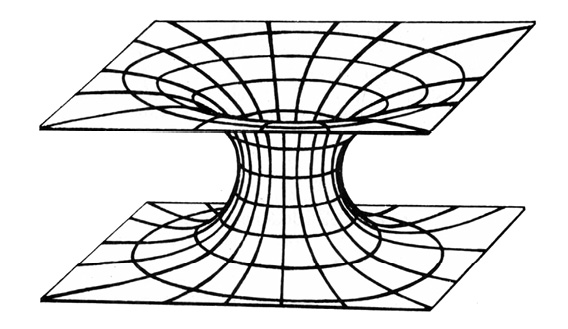

<section>

> Pan Rybka se najednou zastavil: právě když chtěl přejít přes běloučkou ulici ke svým vrátkům, viděl, že i ty šlépěje, které byly před ním, odbočují z chodníku a míří přes ulici k vrátkům. Kdo by to ke mně šel? řekl si zaraženě a sledoval očima ty šlépěje. Bylo jich pět; a přesně uprostřed ulice se končily ostrým otiskem levé nohy; dál už nebylo nic, jen neporušený a nedotčený sníh.

> To jsem blázen, řekl si pan Rybka.

KAREL ČAPEK: ŠLÉPĚJE

> „Člověk by myslel,“ řekl jsem, „že v dnešní době by jakékoli ‚zmizení‘ beze stopy mělo být nemožné.“

> Poirot přesunul o půl centimetru talířek s chlebem a zabručel stroze:

> „Buďte přesný, příteli. Co si představujete pod ‚zmizením‘? Jaký druh zmizení máte na mysli?“

> „Cožpak jsou zmizení různá, roztříděná a onálepkovaná?“ zeptal jsem se s úsměvem.

> Japp se také usmál a Poirot na nás pohlédl úkosem.

> „Samozřejmě! Dělí se na tři kategorie: první a nejčastější je dobrovolné zmizení. Druhá kategorie má původ ve ztrátě paměti, třetí – vražda a víceméně úspěšné ukrytí mrtvoly.“

AGATHA CHRISTIE:  
ZMIZENÍ PANA DAVENHEIMA

</section>

<section>

Jednou z pobuřujících myšlenek pana Charlese Forta je představa o mimozemských bytostech, jejichž identitu se nesnaží blíže určit, občas lapajících – patrně ze studijních důvodů – ubohé pozemšťany.

Většinou se jim to, jak se zdá, daří bez obtíží a aniž by vzbudili přílišnou pozornost. Každé světové město má zvláštní oddělení policie, pátrající po pohřešovaných. Jenom v Paříži se ročně ztratí několik tisíc lidí, o jejichž vyhledání je požádána prefektura. Zkušení odborníci obvykle většinu pohřešovaných objeví, živých nebo mrtvých. Stále však zbývají stovky případů, připisovaných na účet dokonalých zločinů, obchodů s bílým masem, útěků před spravedlností a dalšími známými důvody.

Jsou však i zmizení pozoruhodná a nevysvětlitelná, mezi něž patří jakési rozpuštění se britského diplomata Benjamina Bathursta na zalidněné návsi rakouského městečka Perleburgu 25. listopadu 1809 či farmáře Davida Langa na přehledné louce v Tennessee 23\. září 1880. Dodnes nebyl založen ad acta případ zmizení jedenáctiletého Oliviera Thomase ze dvora rodného statku poblíže Aberporthu ve Wallesu na Štědrý večer 1909 (jeho stopy končily stejně záhadně jako ony, nad nimiž žasl pan Rybka) i mnoho dalších.

Řekněme, že to vše jsou výplody okurkových sezón a zoufalé snahy novinářů, aby v jejich novinách konečně bylo Něco Pořádného Ke Čtení. Stěží však lze vysypat z rukávu hromadná zmizení, která, nejsou-li záměrně utajena, vzruší úřady i veřejnost a leckdy inspirují umělce – jen v české románové literatuře vznikly o tajuplné katastrofě lodi Mary Celeste tři knihy různých autorů. Týká se to především posádek a cestujících na lodích, které jsou nalézány na hladině prázdné, opuštěné a bez známek zápasu či paniky, ač zcela schopné plavby. Záchranné pomůcky i cennosti a osobní zavazadla bývají na palubě.

Nejznámějším případem byla právě Mary Celeste, nalezená lodí Dei Gratia 5. prosince 1872 mezi Azorami a Lisabonem, zcela prázdná a zřejmě v pořádku opuštěná. Skvrny, považované za krev, krví nebyly. Podrobnou zprávu přinesly londýnské Times 14. února 1873.

Mary Celeste nezahájila nešťastnou řadu, jen pokračovala v sérii nevysvětlitelných zmizení, odehrávajících se v trojúhelníku mezi Floridou, Bermudami a Portorikem, nazývaném „trojúhelníkem smrti“.

V červenci 1850 připlula k anglickým břehům poblíže osady Eastons Beach zjevně neřízená velká plachetnice Seabird, na níž posádku jako poslední živá bytost zastupoval vyděšený a třesoucí se lodní pes. Lidé zmizeli. Na lodi bylo vše v pořádku, nic nechybělo ani z navigačních přístrojů, ani z nákladu kávy a dřeva z Hondurasu. Poslední zápis – „Přepluli jsme podmořské skály Brenton“ – dokazoval, že ještě několik mil před Eastons Beachem bylo na lodi vše v pořádku.

Katastrofa je dnes vysvětlována úmyslným navedením vysloužilé lodi na břeh, aby bylo vyplaceno pojistné. Řada argumentů svědčí proti tomuto vysvětlení. Nechyběl ani jediný záchranný člun, pes byl do krajnosti vyděšen, a především by se takovým darebáctvím posádka odsoudila k doživotní nečinnosti nebo skrývání pod jinými jmény. A za to patrně pojistné Seabirdu nestálo.

3\. října 1907 vyplul z mexického přístavu Manzanillo německý Clipper, čtyřstěžník Freya. Po sedmnácti dnech byl nalezen silně nakloněný na bok a se zlámanými stožáry, ačkoli z této oblasti nebyla hlášena žádná bouře. Posádka zmizela.

8\. listopadu 1958 objevila posádka anglické lodi Rannie dvě stě mil od Nikobarských ostrovů nákladní motorovou loď Holkou, poškozenou bouří a opuštěnou posádkou, ačkoli záchranné čluny byly na svých místech a zásoby potravin i pohonných hmot – motor lodi fungoval – byly nedotčeny. Pět mužů zmizelo.

Roku 1955 v září zmizelo z paluby zcela nepoškozené lodi Cone­mara IV, plující po Tichém oceánu, pětadvacet členů posádky. Záchranné prostředky zůstaly na místě.

16\. července 1969 byly v oblasti Azorských ostrovů zjištěny současně dvě luxusní jachty s nedotčenými zásobami potravin, vody i se záchrannými prostředky. Prázdné.

Další nevysvětlitelná zmizení nebo opuštění lodi uveďme (podle Ch. Berlitze) alespoň telegraficky. Odehrála se vesměs v oblasti bermudského trojúhelníku a nezaznamenávají menší plavidla, případně utajené ztráty plavidel vojenských.

1840 byla nalezena opuštěná a nepoškozená francouzská loď (velký Clipper) Rosalie. Plachty byly napjaté, na palubě jen lodní kanárek.

1880 v lednu zmizela britská fregata Atalanta se 290 muži posádky.

1918 zmizela stejně záhadně mohutná americká nákladní loď Cyclops, 500 stop dlouhá a o 19 000 BRT s 309 muži posádky. Zmizení se odehrálo za ideálního počasí. Účast německých ponorek byla spolehlivě vyloučena.

1924 zmizela japonská nákladní loď Raifuku Maru po podivném a nevysvětleném vysílání signálu o pomoc. O rok později zmizel tanker Cotopaxi. Roku 1931 Stavenger s 33 muži posádky.

1932 nalezena opuštěná a zcela nepoškozená americká loď John and Mary.

1938 zmizel Anglo-Australian s posádkou 39 mužů záhy poté, co rádiem ohlásil „Vše v pořádku“.

1940 opuštěna nepoškozená jachta Gloria Colite.

1944 nalezena opuštěná kubánská nákladní loď Rubicon – v podpalubí zůstal jen zděšený pes.

1950 zmizela 350 stop dlouhá nákladní Sandra. Byla naposledy spatřena z floridského St. Augustinu.

1963 zmizela 425 stop dlouhá nákladní loď Marině Sulphur Queen zcela beze stopy. Poslední hlášení z blízkosti Dry Tortugas. Téhož roku zmizela rybářská Sno’Boy se 40 muži posádky.

V prosinci 1967 záhy po sobě zmizely dvě luxusní a na moři zcela spolehlivé jachty Revonoc a Witchcraft.

1970 nákladní loď Milton latrides.

1971 byla nalezena opuštěná portugalská loď Rangos, 24 mužů zmizelo.

1973 plně automatizovaná nákladní loď nejmodernější konstrukce Anita s dvaatřiceti muži posádky.

Ani tento výčet není zdaleka úplný.

Při pokusech o logické vysvětlení těchto záhadných událostí se novináři obvykle předstihují v domněnkách, mezi nimiž na prvém místě figuruje vzpoura posádky, k níž se, pokud jde o událost dávno minulou a slibující pěkný článek, „přizná na smrtelné posteli poslední člen posádky“. (V případě populární Mary Celeste to prý byl po třiceti letech plavčík Wellinghan, jeho „výpověď“ však patří do říše legend.) Je to velmi vratké vysvětlení, které ostatně ihned napadne pojišťovny, vyplácející vysoké životní pojistky, policii i postižené rejdařství. Vyšetřování pečlivě vylučuje tuto možnost, v poslední době naprosto výjimečnou a nevídanou. Velké moderní lodě jsou továrnami s přesnou dělbou práce, kde románový zarputilý podněcovač, např. topič, za celou plavbu kapitána ani nevidí a své případné, ač nepravděpodobné spory s ním řeší spíše prostřednictvím odborové organizace nebo osobního oddělení rejdařství než bambitkou.

Trochu krutým k ochotným zachráncům z posádky trojstěžníku Dei Gratia, spěchajícím zachránit na palubu Mary Celeste, co se zachránit dá, se mi zdá být tvrzení Harolda Wilkinse v knize _Tajemné příhody v čase a prostoru_. Domnívá se totiž, že námořníci z Dei Gratia byli zkrátka raubíři a hrdlořezové. Povraždili prý nejspíše posádku Mary Celeste a s ní i manželku a dcerku kapitána a poté ohlásili „objev“ lodi, aby získali odměnu.

Toto vysvětlení se hodí leda do námořnických hororů. Mary Celeste zkoumala komise pojišťovny, která by jistě objevila stopy zápasu. Kromě toho bylo daleko jednodušší ukořistěnou loď vyloupit (kromě peněz vezla v podpalubí náklad jemných lihovin, pravý poklad pro jistě neabstinující ničemy, za jaké pan Wilkins námořníky lodi Dei Gratia považuje) a poslat ke dnu.

Uvažovalo se i o chronické otravě vřeckatou houbou námelem, paličkovicí nachovou (Claviceps purpurea), jehož vlákna a později sklerocia parazitují na zrnech dozrávajícího žita a jiných trav. Než byla vypracována metoda odstraňování námele ze zrn zamořených a ochrana proti němu, dostával se námel do mouky a s ním i jeho velmi účinné alkaloidy, sice důležitá surovina farmaceutického průmyslu, ale také jed. Lodní chléb prý mohl vyvolat při delším požívání psychické poruchy a sebevražedné či vražedné šílenství, ba i smrt.

Lékařsky s tím nelze souhlasit. Otrava námelem, ergotismus, byla v minulosti velmi častá jak ve formě křečové, konvulzívní (známé „epidemie“ tzv. tance svatého Víta), tak ve formě snětivé, gangrenózní (té se zase, jak věděly naše babičky, říkávalo oheň sv. Antonína). Nevedla však ke stavům, vysvětlujícím podivná opuštění lodí. Psychické postižení otravou námelem vypadá zcela jinak. Typické jsou např. halucinace a záchvaty, dobře známé ze středověkých čarodějnických procesů. Psycholožka Linda Caporaelová (časopis _Science_, sv. 192) snesla přesvědčivé důkazy, že „výpovědi“ děvčat, které vedly roku 1691 v americké vesnici Salemu k odsouzení a popravě několika osadníků, byly učiněny pod bezprostředním vlivem otravy námelem. Objevila se v prosinci 1691 po vlhkém jaru a horkém létě, podporujících výskyt paličkovice nachové, když začalo být konzumováno obilí nové sklizně. V zimě roku 1691 (po suchém létě) záchvaty ustaly, jako když utne. Obzvláště citlivé na otravu námelem jsou mladé ženy a dívky; u námořníků máme právo očekávat větší odolnost.

Zkrátka – dosud nevíme.

Nepozemšťané důvtipného pana Forta, lovící „vzorky“ pozemské populace, se v poslední době zřejmě zmodernizovali a kromě lodí napadají i letadla, která nechávají zcela beze stopy zmizet. Dokonce se zdá, že pro tuto činnost vyhradili především stejnou oblast nedaleko amerického pobřeží, trojúhelník s vrcholy na Floridě, Bermudách a Portoriku. Tento prostor už dostal svůj název – sky-trap, nebeská past, nebo děsivěji „trojúhelník smrti“.

Název „trojúhelník smrti“ není nový – bermudskému troj­úhelníku se takto i jinak („ďábelský trojúhelník“, „moře přízraků“, „hřbitov Atlantiku“ atp.) říkalo již před rokem 1945, kdy zde tu a tam zmizelo jednotlivé letadlo. Piloti už dávno dávali přednost trasám, které se prostoru mezi Floridou, Bermudami a Portorikem vyhýbaly.

Název ovšem nevymysleli a nerozšířili jen romantičtí nebo přestrašení námořní kapitáni a piloti. Ve zcela oficiálním úředním oběžníku United States Coast Guard (Pobřežní ochrana Spojených států) číslo 5720 čteme jeho definici: „Bermudský“ neboli „ďábelský“ trojúhelník je oblast při jihovýchodním atlantském pobřeží USA, známá vysokým počtem případů nevysvětlených zmizení lodí, malých člunů a letadel. Vrcholy trojúhelníku jsou umístěny zhruba na Bermudách, Miami (Florida) a San Juanu (Portoriko).

Tolik tedy úřední dokument.

Díky intenzívní propagační činnosti ufologů, připisujících (jak jinak?) veškeré záhadné katastrofy na konto létajících talířů, jsou události v oblasti nebeské pasti dostatečně známy. Již několik let však zajímají i autory, odmítající UFO a jiná nebeská strašidla. O záhadných příhodách v této oblasti vyšlo několik knih, např. _The Bermuda Triangle_ Charlese Berlitze (Doubleday, 1974).

Spokojme se s jejich stručnou rekapitulací.

Na rozdíl od celkem nenápadného vynoření se UFO 21. června 1947 nad lodí Tacoma Harbour Patrol, jehož si novináři ani nepovšimli, zahájila sky-trap poválečnou činnost okázale a ve velkém měřítku nevysvětlitelnou zkázou pěti dokonale vybavených torpédonosných letadel typu Navy Grumman TBM 3 avenger s dvou a tříčlennými posádkami (celkem pět pilotů a devět členů posádek), jež 5. prosince 1945 startovala za ideálního letového počasí ke zcela obvyklému a mnohokrát provedenému cvičnému letu s kódovým názvem Flight 19 v délce pouhých 360 mil (pohonné hmoty stačily na 1600 km) po trase, nevzdalující se z dohledu pevniny nebo ostrovů. Plánovaná doba letu byla dvě hodiny. Letouny vzlétly ze základny Fort Lauerdale na Floridě jako vždy – první ve 14.02 hod., další do šesti minut za ním. Úvodní část letu proběhla bez závad při stálém spojení se základnou. První podivné hlášení došlo po cvičném bombardování v 15.45, kdy velitel letky poručík Charles Taylor (2500 letových hodin) ignoroval povel k manévru pro návrat na základnu, a stísněným hlasem oznámil: „Nevidíme Zemi… Nemůžeme si být jisti svou polohou… jsme na pokraji katastrofy…“

To samo o sobě bylo nepochopitelné – počasí bylo ideální, ovzduší průzračné, nejmodernější navigační přístroje na zemi i v letadlech v nejlepším pořádku. Posádky neodpovídaly na volání, hovořily mezi sebou (magnetofonový pásek se záznamem je zachován) a kladly si, jak se vyjádřila vyšetřovací komise, „podivné a absurdní otázky“. Další absurditou, zachycenou ve sluchátkách základny, byl rozkaz, jímž velitel letky v 16.00 hod. předal velení jinému důstojníku, druhému pilotovi kapitánu Stiverovi.

Stejně podivné bylo pokračování rozhovoru, který ve své knize _Bermudský trojúhelník_ zveřejnil Charles Berlitz:

Velitel: „… Zdá se, že jsme se odchýlili z kursu… Opakuji, nevidíme Zemi…“

Dispečer: „Sdělte své souřadnice!“

Velitel: „Je to obtížné. Vůbec nevíme, kde vlastně jsme. Zdá se, že jsme se odchýlili z kursu.“

Dispečer: „Obraťte směrem na západ!“

Velitel: „Nevíme, kde je západ. Všechno se popletlo. Je to divné. Nemůžeme zjistit směr. Dokonce i moře vypadá nějak neobvykle…“

Důstojníkům na letišti Fort Lauerdale bylo jasné, že s poručíkem Taylorem není rozumná řeč. Podařilo se jim spojit se s velitelem jednoho z letounů. Ani ten je nepotěšil – hlásil, že oba kompasy přestaly fungovat a že se pokouší letět směrem na Fort Lauerdale, „ztratili jsme se po obrátce… kompasy se zbláznily…“

Mimochodem poznamenejme, že vojenský tribunál i zvláštní komise vojenského námořnictva USA, vyšetřující katastrofu, shledaly, že přístroje byly řádně a podle předpisů před letem kontrolovány a se vší pravděpodobností v pořádku.

Spojení se nevysvětlitelně zhoršovalo. Letiště Fort Lauerdale totiž slyšelo vzájemné hovory posádek, vysílané slabými přístroji pro „domácí“ styk roje, jeho vlastní silná rádiová stanice však nedokázala navázat styk. Pasívním poslechem se letiště dozvídalo další Jobovy zvěsti: pohonné hmoty docházejí, vane silný vítr (ještě před hodinou hlásila letadla ideální počasí se slabým severovýchodním větrem), gyroskopické i magnetické kompasy přestaly fungovat, ručičky přístrojů se zbláznily a ukazují nesmyslné a diametrálně odlišné údaje.

Poslední jednostranný styk se základnou navázal kapitán Stiver v 16.25. Hlásil doslova: „… nevíme, kde vlastně jsme… moře je divné… jsme asi 225 mil severovýchodně od základny… Pravděpodobně přelétáme nad Floridou a jsme teď někde nad Mexickým zálivem… Jsme úplně ztraceni…“

Pak, aniž své rozhodnutí odůvodnil, změnil kurs o 180°, aby se vrátil na Floridu, ale vyhodnocení kvality a hlasitosti příjmu prokázalo, že se patrně i s celým rojem vydal právě opačným směrem nad širé moře. Je to takřka neuvěřitelné, uvážíme-li meteorologickou situaci (slunečno s několika obláčky) v celé oblasti, která umožňovala i nejprimitivnějšími prostředky alespoň hrubou navigaci podle zapadajícího Slunce. Svědkové, zdržující se v této vypjaté a tragické chvíli na dispečerském stanovišti letiště Fort Lauerdale, potvrdili, že poslední, špatně slyšitelná slova zněla: „Zdá se, že jsme… Obestírá nás bílá voda. Docela jsme ztratili orientaci…“ To byla poslední známka života posádek pětičlenného roje. Takřka současně se ozval i poručík Como, jeden z důstojníků pátracího letadla, které sotva před deseti minutami vzlétlo z Banana River Naval Air Station s třináctičlennou posádkou, aby pátralo po zmizelých avengerech letu Flight 19. Byl to velký záchranný hydroplán martin, osvědčený za II. světové války při vyhledávání a zachraňování spojeneckých letců i námořníků, a to i při velmi neklidném a rozbouřeném moři. Jištěn byl automatickými radiomajáky, uvolňujícími se při havárii, i dalšími zabezpečovacími prostředky.

Poručík Como hlásil, že ve výšce 1800 metrů, kde se martin nachází, vane silný vítr. Pak se odmlčel přímo uprostřed hovoru s pozemní službou a už se neozval. Je vůbec pozoruhodné, že žádný z pilotů a radistů nestačil před katastrofou sdělit konkrétní údaje – všichni zmlkli po nejasných hlášeních „moře je divné“, „obklopuje nás bílá voda (mlha?)“, „obloha se zbarvila žlutě (?)“ apod.

Spolehlivý „dělník války“ martin i s třinácti zkušenými muži na palubě zmizel. Nikdy po něm nebyla objevena ani stopa.

Kolem 19.00 zachytila rádiová vojenská stanice v Miami slabý signál FT, část kódového označení zmizelé skupiny FT 28. V té době však už musely být pohonné hmoty avengerů dvě hodiny vyčerpány a signál byl velmi nezřetelný.

Posádka nákladního letadla, prolétajícího vpodvečer v den zmizení roje Flight 19 nad Floridou, udala, že nad pevninou zpozorovala jakýsi červený záblesk. Byl-li to havarující hydroplán, je zvláštní, že za dlouhou řadu let nebyl nalezen ani pátracími jednotkami, ani Seminoly, indiánským kmenem, obývajícím po zatlačení z původních sídel i nejnehostinnější bažinaté oblasti Floridy a obeznámeným takřka s každou čtvereční pídí svého vnuceného domova.

Jakási obchodní loď hlásila, že v 19.30 spatřila nad mořem východně od Floridy „něco jako výbuch“, přesněji řečeno rovněž červený záblesk. S avengery měl tento světelný jev sotva co společného – v tuto dobu totiž byly už nejméně půltřetí hodiny bez pohonných hmot.

Druhý den se rozvinula jedna z nejrozsáhlejších záchranných akcí v dějinách. K předpokládané oblasti katastrofy vyplulo 240 civilních lodí všeho druhu, osmnáct plavidel pobřežní ochrany, čtyři torpédoborce, řada ponorek a nepočítané množství pátracích a záchranných člunů, soukromých jachet a rybářských škunerů, nehledě ke spolupracujícím jednotkám britského válečného námořnictva. Vzlétlo 67 letadel z letadlové lodi Salomon, která shodou okolností operovala v blízkých vodách, a tři sta dalších strojů vojenských i civilních. Bylo prohledáno 380 000 čtverečních mil souše i moře, nalétáno 4100 hodin. Marně. Nebyla nalezena žádná troska, žádný z pilotů ani žádné z automatických zařízení nevyslalo v posledních okamžicích signál SOS.

Zpráva komise končila neobvykle a nevojensky: „Nedokážeme ani uhodnout, co se mohlo stát.“

Jeden ze členů komise to vyjádřil důrazněji: „Zmizeli, jako by odlétli k Marsu.“ Instruktor letu z Fort Lauerdalu k tomu dodal: „Slovo zmizeli je důležité a rozhodující.“

Incident byl velmi vážný – nehledě ke ztrátám na životech, bylo v prvních vzrušených hodinách předpokládáno, že by mohlo jít o nepřátelský útok. Svět se, aniž to tušil, nebezpečně přiblížil třetí světové válce.

Naprostá záhadnost zmizení strojů i mužů Flight 19 a záchranného létajícího člunu (avengery jsou vybaveny samonafukujícími záchrannými čluny, uvolňujícími se při přistání na hladině, kde se stroj udrží nejméně 90 sekund, zatímco posádky byly vycvičeny opustit jej ve 30 sekundách) podnítily i celou řadu mimořádných pokusů o vysvětlení. Dr. Manson Valentine, který se již léta otázkou bermudského trojúhelníku zabývá, napsal v Miami News: „Jsou stále zde, ale v jiném rozměru, kam byli přesazeni magnetickými jevy, sledovatelnými i kolem UFO.“ Art Ford, novinář, sledující dění v této oblasti od roku 1945 dodnes, sdělil v roce 1974 v televizní relaci výsledky svého rozsáhlého pátrání, podporovaného rodinami zmizelých pilotů. Podle shodných výpovědí několika radioamatérů zněla poslední slova poručíka Taylora: „Nenásledujte mne… vypadají jako z jiného světa…“ Teprve pak se prý odmlčel. Oficiální vojenská místa to nepopřela, právě tak jako nepopřela několika svědky potvrzená poslední slova kapitána Mantella, první oběti střetnutí s čímsi, co se později proslavilo pod názvem UFO: „Proboha… vždyť v tom jsou lidé…“

Tragédií letu Flight 19 události nekončily.

V červnu 1947 zmizel v oblasti „nebeské pasti“ robustní americký bombardér B-29, jeden z devíti, který na pozvání maršála RAF lorda Teddera přilétly na návštěvu do Velké Británie. Naposledy se ohlásil asi 100 mil od Bermud. Odborníci považovali oficiální odůvodnění, rozlámání letadla turbulencí v kumulonimbu, za značně nepravděpodobné. Po osvědčeném a spolehlivém letadle se zkušenou posádkou jako by se slehla země, lépe řečeno moře.

Nevysvětlitelné tragédie v oblasti sky-trap pokračovaly. 29. ledna 1948 – opět zcela beze stopy za krásného počasí a po hlášení, že je vše v pořádku – zmizelo čtyřmotorové dopravní letadlo značky Avro-Tudor IV se 40 cestujícími čtyři sta mil od Bermud.

Stejně beze stopy se ztratil dopravní letoun US Air Force 29. pro­since 1948 s dvaatřiceti cestujícími na palubě. Pilot hlásil, že počasí je pěkné a že už vidí světla Miami, kam směřuje, vzdálen sotva padesát mil.

O tři týdny později, 17. ledna 1949, při letu na Jamajku, stihl týž osud čtyřmotorové letadlo britské společnosti za nejlepšího počasí a po naprosto normálním hlášení kapitána.

Stovky letadel marně hledaly sebemenší zbytek, slibující vysvětlit katastrofu. Žádná z početných lodí, křižujících v okolí, nepotvrdila pád letadla. Obrovský stroj zmizel jako všechny předcházející. Letadla nic podezřelého nezjistila, dobrovolníci, přeletující jako pokusná morčata nebezpečnou oblast za všech možných povětrnostních podmínek, nespatřili nic mimořádného, nesetkali se s anomáliemi, rušícími gonio, viditelnost, elektrický režim letadla, s mirážemi. Nic. Nic – nepočítáme-li ovšem články ufologických časopisů s obligátními létajícími talíři.

Letecké katastrofy jsou sice tragickou, ale nevyhnutelnou daní, kterou platíme pohodlí a rychlost cestování. Lze vypočítat, v jakém zlomku promile letů selže některý z podstatných mechanismů, nebo dojde k havárii z jiných příčin, jež obvykle nazýváme ne zcela vhodně „přirozené“. Nakupení tragédií letadel v bermudském troj­úhelníku v poměrně krátkém časovém období z „přirozených“ příčin je však stejně nepravděpodobné, jako kumulovaná smrt sedmnácti svědků, vyslechnutých ve věci zavraždění prezidenta Kennedyho. Do tří let byli všichni mrtvi. Podle výpočtů pojistných matematiků, vyžádaných londýnským listem Sunday Times, je taková epidemie smrti s ohledem na pravděpodobnou délku života zmíněných svědků vyjádřitelná pravděpodobností 1017 : 1 – jinými slovy sto tisíc bilionů k jedné.

Další šetření ostatně ukázalo, jak tomu s „přirozenými příčinami“ bylo: šest svědků bylo zastřeleno, tři přejeti autem nebo usmrceni ve svém automobilu jiným řidičem, u dvou byla zjištěna sebevražda, dva byli zjevně zabiti (proříznuté hrdlo a smrtící úder karate), tři zdánlivě zemřeli infarktem a zbylí dva – z „přirozených“ příčin…

Ještě se k nebeské pasti vrátíme a pokusíme se odpovědět, zda letadla postihla „přirozená“ havárie nebo zda i zde nezasáhly příčiny, s nimiž statistiky, pojišťovny ani konstruktéři letadel nepočítají.

Je si ovšem těžko takové příčiny představit – již dlouhá léta vydává společnost Aerospace Maintenance Stafety časopis _Aircraft Accident Briefs_ (Krátké rozbory mimořádných leteckých událostí), popisující podrobně všechny nehody v americkém letectvu a jejich příčiny, často velmi kuriózní. Poctivě jsem probral několik ročníků, ale nic, co by se podobalo „vypaření“ letadel v tzv. trojúhelníku smrti, jsem nenalezl, a ovšem ani vysvětlení pro ně.

Dalšími oběťmi se stal obří globemaster (březen 1950), britský York Transport (2. února 1952 – 33 cestujících), Super Constellation námořního letectva USA (30. října 1954 – 42 pohřešovaných), B 25, změněné v nákladní letadlo (5. dubna 1956 – 3 muži posádky), Navy Martin P 5 M (9. listopadu 1956 – 4 muži posádky), tankovací letadlo KB 50 (8. ledna 1962), dva čtyřmotorové stratosférické tankovací letouny KC 135, vzdálené v okamžiku katastrofy vzájemně 160 mil (28. září 1963), C 132 cargomaster (22. října 1963), C 119 (5. června 1965 – 10 cestujících), nákladní letadlo YC 122 (11. ledna 1967 – 4 muži posádky)…

V tomto výčtu nejsou uvedena menší soukromá a sportovní letadla ani letadla vojenská, jejichž zmizení bylo utajeno. Po roce 1967 byly potlačovány i zprávy o nehodách a neštěstích dopravních letadel v této oblasti.

K leteckým katastrofám, přesněji a výstižněji řečeno k dlouhé a úděsné sérii dosud nevysvětlených zmizení letadel nad „nebeskou pastí“ můžeme připojit i „mořskou past“, nastraženou trojúhelníkem smrti lodím. Ani ona nevstoupila v činnost teprve po II. světové válce, ale daleko dříve. První zmizelou lodí, kterou v lodních a pojišťovacích záznamech objevil Charles Berlitz, byla americká plachetnice Insurgent. Zmizela v pojednávané oblasti roku 1800. Následovala celá řada dalších – a jak se zdá, ztráty dosud neustaly. To lze koneckonců vysvětlit – zmíníme se i o přirozených, lidských příčinách –, nepochopitelné však je, že ani v případech zmizelých lodí, které obvykle nepodléhají bleskurychlým katastrofám, schopným v okamžiku zničit letadlo (turbulence, vzájemná srážka, exploze atp.), nebyly zachyceny signály volání o pomoc. A přece zde zmizela 119 metrů dlouhá loď Marině Sulphur Queen i americký osobní parník Cyclops o výtlaku 19 tisíc BRT s 309 cestujícími a početnou posádkou na palubě. V květnu 1968 zde zmizela americká ponorka Scorpion s 99 muži posádky – ta však byla záhy nalezena 740 km jihovýchodně od Azor v hloubce několika tisíc metrů, umožňující přiblížení jen batyskafům. V této oblasti ostatně nastala i katastrofa proslulé a již zmíněné Mary Celeste. Prostírá se zde Sargasové moře, objevené před pěti stoletími španělskými a portugalskými plavci. Jeho námořnická jména „moře ztracených lodí“, „hřbitov lodí“ či „moře hrůzy“ svědčí o nevalné pověsti, zapříčiněné změtí řas a chaluh (které však nikde nevytvářejí souvislé plochy a nebrání plavbě), bezvětřím a nedostatkem mořských proudů, což dohromady představovalo vážnou, ne-li smrtelně nebezpečnou překážku pro plachetnice. Dostatečně makabrózně to líčí Australan Allan Wollers, který roku 1957 Sargasové moře, jehož přesné obrysy nejsou dosud na námořních mapách zaneseny, přeplul – dobrodruh! – na plachetnici. Nalezl zde jednu ze zmizelých, dávno pohřešovaných lodí. Soudí, že „… loď, která je pro bezvětří nucena stát na místě, dokud jí nedojdou všechny zásoby, pravděpodobně začíná obrůstat vodními řasami a mušlemi, které ji nakonec zbavují možnosti pohybu… Tropičtí dřevokazi vykonají své a prohnilý trup lodi, plný koster, pomalu klesne pod mořskou hladinu…“

I to by mohlo být vysvětlení pro některá, ne však všechna, a rozhodně ne pro nedávná zmizení lodí v bermudském trojúhelníku.

Bermudský trojúhelník smrti není ostatně jedinou obávanou oblastí oceánu. Mezi Japonskem a ostrovem Bonin leží tzv. „ďábelské moře“ s pověstí mezi letci a námořníky tak špatnou, že ho dokonce japonská vláda prohlásila za nebezpečné pásmo. Jistě k tomu přispěla kuriózní a poněkud děsivá příhoda z roku 1955: když se totiž ztráty lodí a letadel v této oblasti opakovaly s tragickou pravidelností a navzdory všem bezpečnostním opatřením, vyslala sem komplexní vědeckou výpravu, která měla prozkoumat celou nebezpečnou část moře a odhalit příčiny opakovaných neštěstí. Výpravě byla dána k dispozici velmi moderní oceánologická loď Kaye Maru 5. Loď i s posádkou a vědeckým týmem v cílové oblasti beze stopy zmizela – ani ona nevyslala volání o pomoc a ani její trosky nebyly nalezeny…

Bermudský trojúhelník sice nebyl vyhlášen nebezpečným pásmem, jediný pohled na reklamní mapu některé z velkých leteckých společností, zajišťujících mezikontinentální dopravu, však ukáže, jak uctivě se letecké linky pro klid duše cestujících i akcionářů této oblasti vyhýbají.

„Trojúhelník smrti“ i „ďábelské moře“ mají z hlediska geomagnetismu, polohy vůči pevnině, kolizí studených a teplých proudů, konfigurace mořského dna, teplot v různých hloubkách, frekvence magnetických bouří, vyvolávajících poruchy nebo hluchotu bezdrátových pojítek a dalších charakteristik mnoho společného. A nejen ony – zdá se, že ve světovém oceánu je šest takových elipsovitých oblastí, vesměs mezi 30. a 40. stupněm severní i jižní šířky a v intervalu přibližně 73 délkových stupňů. Z nich je nejfrekventovanější bermudský trojúhelník, hned po něm se nejvíce letadel a lodí pohybuje v japonském „ďábelském moři“. Ostatní oblasti jsou mimo pravidelné dopravní linky a případné mimořádné události tu vzhledem k malé početnosti snáze uniknou pozornosti, zejména díky chladnokrevnosti námořníků, beroucích klidně na vědomí události, které by otřásly i značně otrlým suchozemcem.

Mám v této souvislosti na mysli „strašidelné“ lodi, jejichž posádky ze zjištěných nebo nezjištěných, přirozených nebo nepřirozených (nikoli nadpřirozených), zkrátka jakýchkoli příčin opustily svou loď, případně vylidněnou epidemií, aby pak bloudila často dlouhá léta světovým oceánem, jedna z posledních proslulých Köhlerových nautických ročenek odhaduje počet opuštěných lodí, bloudících pouze v mlhách severního Atlantiku, na plné tři stovky (!).

Některá setkání s těmito loděmi jsou takřka snová: roku 1960 narazil americký torpédoborec James Molton v širém Pacifiku na cosi, co se podobalo značně rozměrnému zanedbanému záhonu. Byly to dva spojené japonské těžké křižníky Kvanaku a Tokošima, podle amerických vědomostí a hlášení potopené v jedné z posledních bitev II. světové války roku 1945. Potácely se tedy, přízračné, prázdné a zarůstající tropickou vegetací, po moři plných patnáct let. „Strašidelná“ loď zkrátka není vzácnou výjimkou.

Mnohá záhadná zmizení lodí byla vysvětlena velmi přirozeným způsobem, ačkoli se zprvu zdála být přímo ukázkově tajuplná a mysteriózní.

Příkladem může být zkáza jednoho z největších supertankerů světa Berge Istra, 314 metrů dlouhé a 50 metrů široké lodi o tonáži 223 963 tun, podle tvrzení svého jugoslávského konstruktéra nepotopitelné. Berge Istra patřila norským rejdařům a plula pod liberijskou vlajkou s pouhými 32 členy posádky (z toho tři ženy). Byla zařazena do nejvyšší dosažitelné bezpečnostní kategorie 100 A 1 a její pečlivý kapitán Kristoffer Hemmes obdržel zlatou medaili AMVERu (Organizace vzájemné pomoci při lodních neštěstích) za vynikající dodržování spojení a pravidelná hlášení. A přece…

A přece supertanker zmizel na cestě z Brazílie, kde naložil 185 244 tun železné rudy, do přístavu Kimizu v Tokijské zátoce. Byla zahájena největší pátrací akce v dějinách civilní námořní dopravy, bylo propátráno 750 000 km2 oceánu. Marně.

Vyrojila se spousta hypotéz. Zatoulaná mina z II. světové války. Piráti. Napadení neznámou válečnou lodí torpédem nebo raketou. Výbuch munice, naložené v Brazílii pro muslimské povstalce na Filipínách spolu s diverzní bombou. Pojišťovací podvod majitele, dvaaosmdesátiletého loďaře Sigvala Bergesena, provázený výbuchem sabotážní nálože. Obrovská vlna tsunami.

17\. ledna 1976, osmnáct dnů po vyhlášení pátrání, objevil japonský rybář člun Hachihou Maru 6 tři sta mil severně od západního Irianu dva členy posádky, kteří jako jediní přežili. A mluvili.

28\. prosince 1975 vládla na palubě pohoda a klid. Část mužstva obnovovala nátěry, všichni se těšili na oslavu Silvestra. V 16.45 se ozvaly exploze, které ve třech minutách rozervaly levý i pravý bok lodi. Loď klesla jako kámen ke dnu.

Příčina je neznámá. Snad při vymývání zbytků ropy v Rotterdamu z nákladových prostor vznikla výbušná plynná směs. Snad explodovaly časované nálože. Pojišťovna vyplatila 27 miliónů dolarů.

Ufoni zde nezasáhli, prvotní záhada se rozplynula. Zůstala záhada mezi lidskou chybou a zločinem. Tak je tomu pravděpodobně ve většině případů, kdy se ve starobylých místnostech Lloydu rozezní neméně starobylý zvon Lutine, oznamující, že loď je definitivně uznána za ztracenou. Roku 1975 zazněl osmašedesátkrát. Celková ztráta lodí dosáhla 802 593 BRT. Některé z nich byly zničeny dost kuriózním, i když zcela přirozeným způsobem, např. řecký tanker Kriti Sun (61 054 BRT), který explodoval po zásahu bleskem. Nelze vyloučit ani celou řadu nezvyklých příčin katastrof, podmořské výbuchy, meteority (již několik lodí bylo meteoritem zasaženo nebo bezprostředně ohroženo), ba ani ony zprvu odmítnuté piráty – roku 1972 byl registrován až dosud, pokud vím, poslední pirátský přepad lodi na širém moři.

To je nepochybně rozumné, racionální vysvětlení mnohého. Vysvětluje to však beze zbytku vše? Odborníci soudí, že nikoli – bludných, opuštěných lodí nebo lodí s mrtvou posádkou je příliš mnoho.

Další vysvětlení, resp. cestu k němu, naznačil již roku 1935 sovětský akademik B. V. Šulejkin, když publikoval svůj objev „hlasu moře“, totiž infrazvukového vlnění, vznikajícího v oblasti bouří a rychlostí zvuku (330 m/sec) předstihujícího uragán, který vlnobití vyvolal.

Infrazvuk ostatně vstoupil na scénu velmi efektním a dramatickým způsobem: Jakési americké divadlo uvedlo počátkem třicátých let hru, v níž se děj na scéně pojednou vrací o tři sta let zpět. Režisér trval na tom, aby „těžký krok staletí“ byl doprovázen vhodným zvukovým efektem, navádějícím patřičnou atmosféru, a obrátil se o radu na proslulého fyzika Roberta Wooda (1868–1955) z Baltimore, mimochodem řečeno jednoho ze zahraničních členů AV SSSR. Ačkoli se Wood zabýval především optikou, odvedl fortelnou práci: navrhl použít mimořádně dlouhou varhanní píšťalu, vyluzující infrazvuk. Efekt byl dokonalý. Když se „těžký krok staletí“ ozval, uprchli z divadla všichni diváci a panika zachvátila i obyvatele sousedících domů…

Studium infrazvuku, zprvu výhradně fyzikální, se brzy přeneslo do oblasti biologie a lékařství; pokusné osoby totiž při pokusech s infrazvukem hlásily vysloveně nepříjemné pocity, ba i chorobné příznaky. Bylo to potvrzeno i později (1967) ve vědeckém středisku v Marseille, kde přímo nezúčastnění pracovníci. kteří se ocitli pouhou náhodou poblíže infrazvukového generátoru, byli postiženi nevolnostmi tak intenzivními, že křičeli bolestí. Po dalšim zkoumání bylo zjištěno, že se infrazvuk (tj. zvuk o nízkém kmitočtu a s dostatečnou amplitudou a intenzitou vln) může nešťastně setkat s biologickými rytmy ve velmi nepříznivé koincidenci. Při shodě s rytmem srdce může nastat zástava, při shodě s rytmickou činností cév může nastat jejich ruptura. Domy až do vzdálenosti pěti kilometrů od zdroje se mohou stát neobyvatelnými. V nejbenignějším případě dochází k tzv. mořské nemoci, totiž k atakování velejemného aparátu vnitřního ucha. Všechny tyto následky jsou experimentálně způsobované infrazvukem o frekvenci 7 Hz (tzn. o rytmu sedmi vln za vteřinu). Infrazvuk „hlasu moře“ má nebezpečně blízkou frekvenci 6 Hz.

Marseillští badatelé tedy konstatovali, že vrahem je v těchto případech nikoli obligátní zahradník, ale infrazvuk. Při jeho působení, jemuž jsou vystaveny oběti podle své individuální vnímavosti, dochází k záchvatu hrůzy, k dočasnému oslepnutí a následné panice, jestliže začne s infrazvukem rezonovat loď a jestliže se dokonce za naprostého bezvětří (neboť infrazvuk, jak bylo řečeno, předstihuje i děti moře, uragány) počnou lámat stožáry a padat komíny i palubní nástavby.

Vysvětlení je patrně přijatelné pro některé lodní katastrofy, jejichž objasnění dosud čekáme. Zejména takové, kde došlo k zjev­nému porušení psychiky posádky a velícího důstojníka; podle posledních vědeckých sdělení prof. Gavra je jeho příčinou koincidence amplitud infrazvuku s tzv. alfarytmem mozku, snímatelným elektroencefalografy. Pokusy opětovně ukázaly, že infrazvuk může vyvolat velmi pestrou škálu příznaků a poškození, od pocitu stesku až k náhlé smrti.

Některé námořní katastrofy se zdají potvrzovat mínění Gavra, Šulejkina i výzkumníků marseillské laboratoře CNRS (Národní středisko pro vědecký výzkum).

V září roku 1894 přirazil německý parník k trojstěžníku Ess Hart, potácejícímu se bezmocně na vlnách Indického oceánu. Na stožáru byla vyvěšena vlajka V, signalizující v mezinárodním vlajkovém kódu neštěstí na palubě. Němečtí námořníci nalezli na Ess Hartu osmatřicet mrtvých námořníků bez známek násilí nebo choroby a blábolícího kapitána, který pak dožil v ústavu pro duševně choré a nikdy katastrofu neobjasnil.

V únoru 1948 bylo poblíže Sumatry zachyceno SOS britské obchodní lodi Urang Medang: Loď pokračuje ve svém kursu stop, všichni členové naší posádky již asi zemřeli stop. Následovalo několik nesrozumitelných teček a čárek a pak poslední slovo: Umírám.

Zanedlouho dorazila k Urang Medangu anglická loď. Nalezla celou posádku mrtvou, s tvářemi zrůzněnými výrazem hrůzy. Když se pokoušeli nepoškozený Urang Medang odvléci do přístavu, vy­pukl v podpalubí požár a po explozi se loď potopila. V tomto případě tedy nelze vyloučit vývoj jedovatých plynů z nákladu (např. umělých hnojiv, schopných při vyšších teplotách vybuchovat jako dynamit).

Snad má infrazvuk na svědomí i některé případy již zmíněných „bludných Holanďanů“, lodí, plujících bez posádky světovým oceánem. Tak koncem minulého století narazil francouzský parník Vengeance na britskou plachetnici, která záhadně zmizela roku 1860 při plavbě z Rio de Janeira do Kapského Města. Vše zůstalo na místě, i záchranné čluny, a loď plula nikým neřízená pětadvacet let.

Podobná, jenže poněkud strašidelnější událost potkala roku 1921 peruánskou nákladní loď Francisco Moreno, jejíž posádka vstoupila na palubu zřejmě mnoho let opuštěné plachetnice, plující Tichým oceánem. V lodní kuchyni však ještě hořel oheň. Zdá se, že poslední člen posádky zahynul nešťastnou náhodou krátce před setkáním se spásnou lodí, nebo se v prudkém hnutí mysli sám zahubil – totéž ostatně provedl roku 1913 kapitán samojské plachentice Taoofa, když se po pěti měsících bloudění bez posádky, která padla za oběť choleře, vrhl při setkání s německým parníkem Friedrich Karl v nervové krizi do vln.

Pracovníci leningradského hydrometeorologického ústavu sestavili soupis několika desítek lodí, zmizelých nebo nalezených za podobných okolností. Vzhledem k tomu, že se infrazvuk šíří do značných vzdáleností plyny, kapalinami i pevnými hmotami (překážkou je pouze vakuum), ohrožuje podle jejich mínění i ponorky, ba i kosmonauty při průletu atmosférou, kde jsou vystaveni působení nízkofrekvenčních kmitů o značné aplitudě. Díky iniciativě vědců pracuje již několik stanic, zachycujících infrazvuk, vznikající při bouřích a podmořských zemětřeseních. Chystá se i zřízení signální služby, upozorňující lodě na nebezpečí.

Jak se tedy zdá, lze tímto způsobem vysvětlit část dosud záhadných lodních a snad i ponorkových katastrof. Pravděpodobně zdaleka ne všechny. Průvodní okolnosti některých z nich jsou zvláštní a celou řadou zjištěných faktorů se schématu zhoubného působení infrazvuku vymykají. A pak…

Proč kromě lidí umírají i psi, jsou-li jejich dosud ne zcela prozkoumané biorytmy jiné než biorytmy lidské? A proč naopak v některých popsaných případech jen lodní psi přežili? Proč umírající lidé skáčou přes palubu a proč nejsou nikdy jejich mrtvoly vyloveny? Proč nejsou nalézány trosky, havarijní bóje a radiomajáky, instalované na lodích i letadlech právě pro případ neštěstí? Proč se odmlčí i automatická signální zařízení?

Vysvětluje snad infrazvuk beze zbytku vše?

Myslím, že ne. Nehledě k určitým pochybnostem o působení infrazvuku na posádky letadel, kde nutně dochází k interferenci infrazvuku s vibracemi motorů i draků, měnící a deformující výsledný efekt infrazvukových vln, neodpovídají např. okolnosti ztráty avengerů, která, jak víte, stála u kolébky znovuzrození tzv. „trojúhelníku smrti“, tomuto mechanismu.

Smrt posádek zřejmě nebyla blesková a předcházelo jí postupně se prohlubující oblouznění. Velitel předal velení jinému důstojníkovi, došlo ke ztrátě orientace, přecházející ve vyhasnutí navyklých a reflexívních manipulací, které ovšem končilo katastrofou.

Snad lze za jistých okolností vysvětlit opakované havárie letadel nebo selhávání výbušných motorů automobilů a motocyklů nešťastnou koincidencí místních podmínek (pro letce jsou to tzv. vzdušné pytle, zkušení automobilisté zase znají kopce „magneťáky“) a povětrnostní situace. V těchto místech se patrně za mlhy a deště vytvoří jakýsi vodivý komín zemského elektromagnetického pole, produkující za příznivých podmínek indukční proudy, rušící zapalování výbušných motorů, zatímco Dieselovy motory fungují normálně. Také kompasy a snad i radiolokátory mohou selhávat, což by vysvětlovalo některá lodní ztroskotání, avšak ani za těchto podmínek by neměl zřetelně a tragicky selhávat člověk a jeho psychika.

V krajních případech jsme – bohužel – nuceni připustit i možnost zločinu: v říjnu 1976 zmizelo v oblasti Bermud letadlo kubánské společnosti. Za několik dní byly jeho trosky vyplaveny u břehů Barbadosu a expertiza dokázala, že na palubě vybuchla časovaná puma… Ani nejotrlejší z nás však asi nebude věřit v sériové hromadné vraždy, jež by zůstaly neobjasněny.

Svou úlohu v leteckých katastrofách může hrát i turbulence a prudké poryvy vichřice, vanoucí v horních vrstvách atmosféry ještě nedávno zcela netušenou rychlostí až 600 km/hod., a proudící víry, schopné takřka v okamžiku rozervat drak letadla. Je tu ovšem háček; do těchto výšek pronikají soudobá trysková letadla – záhadná zmizení se však, jak víme, týkala většinou spolehlivých, robustních a daleko níže létajících strojů s pístovými motory, které se za II. světové války osvědčily za všech režimů letu.

Infrazvuk, otrava závadnou potravou nebo výpary těkavých látek nákladu, vyplývající z nekázně, či dokonce masívní tok neutronů jsou ovšem schopny atakovat lidský centrální nervový systém a vyvolat dočasné či trvalé poruchy psychiky. Myslím však, že kromě uvedených a nepochybně racionálních vysvětlení bychom měli až do případného vyloučení této alternativy mít na mysli i další neprozkoumané příčinné faktory, řekněme faktory X.

Pro naše téma jsou zajímavé tím, že do jisté míry spojují kapitoly o podivných světlech s kapitolami o neméně podivných zmizeních. Navždy ztracené posádky opuštěných lodí nám bohužel nemohou prozradit, co se vlastně stalo – máme však svědectví kapitánů a posádek šťastnějších, které sice připluly v pořádku do mateřského přístavu, ale kromě nákladu přivezly i další doklady pro tvrzení snílků, že je nejen mnoho věcí mezi nebem a zemí, ale, a možná především, i v moři, milý Horatio…

Od nejstarších záznamů až k cestopisům všetečky Thora Heyerdahla, jehož malebná plavidla poháněná jen větrem a mořskými proudy měla daleko lepší možnost vniknout do diskrétně probíhajících dění v oceánech než motorové lodi, se setkáváme s líčením podivných světelných jevů. Německý oceánograf K. Kalle jich sebral 2239 z novinových zpráv, lodních deníků i z vlastního pozorování. Zabýval se jimi i známý zoolog (a připusťme, že tak trochu enfant terrible zoologie) Ivan T. Sanderson. Oč vlastně jde?

O světelné pásy, které se v moři objevují za tmavých nocí a pohybují se, často bez ohledu na směr větru a vln, buď rovnoběžně, nebo jako loukotě obrovských otáčejích se kol. Pověrčiví námořníci je nazvali „kola mořského ďábla“. Rázem se rozsvěcují a rázem mizí. O světelné nebo „ohnivé“ koule, vynořující se z oceánu nebo plující pod jeho hladinou. Zkrátka o mořskou analogii toho, co bylo mnohokráte popsáno i na souši.

Světélkování moře není samo o sobě žádnou záhadou, ať už jsou jeho zdrojem baktérie, plankton nebo větší živočichové (hlubinné ryby). Bioluminiscence drobných živočichů je stimulována např. rázovými vlnami lodního šroubu nebo pohybem vody v brázdě za lodí. Velmi účinně stimuluje luminiscenci ultrazvuk – a to nejen vybuzením světélkování planktonu. Akademik S. I. Vavilov upozornil, že v oblasti působení ultrazvuku může světélkovat i kyslík v mořské pěně. I. Sanderson připisuje zvláštní jevy, zejména loukoťovitá světla, luminiscenci planktonu, vybuzené ultrazvukem nebo zářením. Posuďme, zda lze tuto domněnku přijmout jako vyčerpávající, a posuďme to ve snaze o maximální objektivitu nejprve na případech, daleko předcházejících ufomanickou horečku, které se naneštěstí podařilo zkreslit a smazat nebo alespoň dokonale zpochybnit celou řadu zajímavých pozorování a zjištění.

18\. června 1845 oznámily noviny Malta Times svým čtenářům, že posádka brigy HMS Victoria pozorovala 900 mil od Adálie vynoření tří obrovských koulí („pětkrát větších než Měsíc“) asi půl míle od lodi. Byly žluté a spojovala je jakási zářící vlákna.

HMS Vulture se 15. května 1873 ocitla v Perském zálivu na klidném moři pojednou v oblasti silného vlnobití poté, co proplula delší úsek cesty mořem, pokrytým podivnou rosolovitou a zřejmě organickou hmotou, plující na hladině. Po obou bocích lodi se objevily zářivé rotující koule, vysílající popsané loukoťovité paprsky. Přibližně v téže oblasti se s týmž jevem setkal v květnu 1874 britský parník Patna. Případ prošel i odborným tiskem. Rotující světelné loukotě, ve všech případech asi 220 metrů dlouhé, otáčející se asi jednou za dvanáct vteřin a vydávající svištivý zvuk po dobu přibližně dvaceti minut, byly pozorovány roku 1891 a 1910 v Čínském moři, 1893 při pobřeží USA, 1901 uprostřed Atlantiku (loď Kilwa). Za první světové války a po ní se stávají pozorování nespolehlivými – nelze vyloučit působení ponorek nebo ovlivnění posádek úvahami o nich – a počátek sezóny létajících talířů, 24. června 1947, kdy se prý s formací UFO setkal obchodník Kenneth Arnold a vzrušil svým vyprávěním reportéry tisku (ačkoli zprávy o UFO byly publikovány již dříve), takřka vyloučil objektivní hodnocení materiálů. Vznikla dokonce tvrdošíjná sekta, věřící, že UFO a ufoni pocházejí z moře… Se svítícími kulovými objekty o průměru jednoho metru i více, „mrkajícími v nepravidelných přestávkách jako elektrické lampy, zapínané na krátké záblesky“, se setkal při plavbě voru Kon-Tiki i Heyerdahl. Kulový nebo přibližně kulový živočich (medúza apod.) žijící v moři a schopný „mrkat“ světelnými záblesky jako některé druhy světlušek nebo brouka rodu Pyrophorus není dosud vědě znám.

Některá novější hlášení bychom však snad mohli považovat za důvěryhodná, zejména opakují-li se „kruhy mořského ďábla“ na tomtéž místě, např. v Malackém průlivu, kde byly jen roku 1967 pozorovány třikrát a roku 1973 je zaznamenali námořníci sovětské lodi Anton Makarenko. Vyprávěli, že se skvrny na hladině oceánu měnily v podlouhlé pásy, pak se spojily a vytvořily pruh s loukotěmi, otáčející se proti směru hodinových ručiček. Pak vše zhaslo a zmizelo. Na témže místě viděly zajímavý jev i posádky britského Conceleru, holandské lodi Delta a dánského plavidla Gabe.

Je nesporné, že v několika případech propluly lodi, nalezené s mrtvou posádkou nebo záhadně opuštěné, oblastí, kde byly v této době nebo nedlouho před či poté spatřeny světelné kruhy. Takto postiženy byly lodě Santa Maria (portugalská briga), Abbie S. Heart a již zmíněný Orang Medan. Kapitán a posádka lodi Fort Salisbury spatřili při proplouvání „ďáblových kol“ na obzoru na hladině dlouhé tmavé těleso. Když k němu namířili, ponořilo se do hlubin. Roku 1902, kdy k tomu došlo, byly sice již v provozu první ponorky, stěží však lze předpokládat jejich přítomnost na širém oceánu.

Ostatně se domnívám, že některý z popsaných světelných feno­ménů, objevujících se v moři, je podkladem a reálným základem jedné z osmi „koncesovaných“ havajských oblud s impresivními jmény Otvor obrovské zévy na obzoru, Dlouhá a Krátká vlna, Osamocený korálový útes atp. Strašidlo, které mám na mysli, se jmenuje Tupe-‘i‘ o-ahu čili Zvíře se žhnoucím masem. Podle popisu, obsaženého v sáze tahitského krále Raty o jeho boji se všemi osmi příšerami, by mohlo jít o popsaná světelná kola s loukotěmi.

Chtěli-li bychom všechny popsané světelné jevy (a stovky, ba tisíce dalších případů) vysvětlit stimulací bioluminiscence ultrazvukem nebo zářením, bylo by svrchovaně užitečné najít jejich zdroj. Znamená to snad, že se v centru podivných světelných fenoménů, náhodou pozorovaných z palub nedaleko plujících lodí, ocitl dosud neidentifikovaný tvor, rotující a emitující ultrazvukové vlnění (jako delfíni, netopýři atd.) nebo vlnění elektromagnetické (jako rypoun nilský)? Snad – nelze to vyloučit. Avšak nevylučoval bych ani možnosti další. Podle zpráv námořníků i vědců světélkování (především Indického oceánu) valem slábne, snad znečištěním. Kde před několika lety v pravém slova smyslu všecko zářilo, je dnes tma tmoucí, jen tu a tam se objeví náznak světla. I brázdy za loděmi zůstávají temné.

Po tom, co jsme se v posledních několika letech dozvěděli o nepochybně existujících a měřením bioproudů zjištěných komunikačních kanálech, např. mezi rostlinou a člověkem (C. Backster, I. Gunar), ba dokonce i mezi oddělenými koloniemi buněk a snad i jednotlivými buňkami (V. P. Kaznačejev, S. P. Šurm, L. P. Michajlovová), není příliš fantastická myšlenka, že tyto prazvláštní světelné jevy jsou opticky zviditelněným příznakem „paniky“ a „obecného vzrušení“ značného počtu mořských organismů hrozícím nebo snad i fiktivním nebezpečím. Seskupování planktonu by nasvědčovalo svědectví posádky Vulture o rosolovité hmotě na hladině Perského zálivu. Snad je opravdu tímto hrozícím nebezpečím nebo jeho signálem subsonické vlnění, infrazvuk, který tragicky postihl posádky některých lodí. Snad je jím něco docela jiného. Na lodích, odkud posádky „loukotě“ a světelné koule pozorovaly, nebyl bohužel ani psycholog, ani psychiatr a prosolení námořní kapitáni si sotva všímali okamžité nervové stability či lability svých posádek, pokud nedošlo k porušení pravidel služby. Škoda. Naskýtá se totiž otázka, zda v tomto případě nefungoval kanál v opačném směru, zda takovým „obecným vzrušením“ nebyli postiženi i námořníci těch lodí, které se zanedlouho kolébaly prázdné, opuštěné a strašidelné na vlnách.

Z lékařského hlediska nelze tuto možnost kategoricky zavrhnout. Nejsou-li – jakože asi nejsou – feromony, přenášející rozličné emoce, druhově specifické, a působí-li tatáž chemicky přesně určená látka stejným způsobem nejen na příslušníky rozličných druhů, ale i čeledí a rodů, nemusí druhově specificky působit ani hypotetické pole schopné zviditelnění, emitované za určitých podmínek živočichy a snad i rostlinami.

Třeba jako světelné koule nebo zářící loukotě obrovitých kol…

Nabízena jsou ovšem i vysvětlení divočejší. Ralph Barker, autor knihy _Velká mystéria vzduchu_, napsané pod dojmem série leteckých katastrof především v bermudském trojúhelníku (ale i jinde), se domnívá, že viníkem je antihmota kosmického původu, hromadící se pod pevninami, většinou však pod mořským dnem, nepodléhající zákonům tíže, a tedy v případě proniknutí na povrch země nebo nad hladinu oceánu levitující do výše. Setká-li se s letadlem nebo lodí (například), dochází k interakci a anihilaci za uvolnění značného množství energie.

Není snad třeba dodávat, že tato hypotéza je naivní, fyzikálně absurdní a nepřijatelná.

Ivan Sanderson, neúnavný protějšek Isaaka Newtona, který ze zásady nevymýšlel hypotézy, je naopak pravou studnicí domněnek. Patří mu zásluha, že fyzikálně a geograficky charakterizoval zvláštnosti zmíněných nebezpečných zón světového oceánu a poukázal na mocné magnetické bouře a anomálie v těchto místech. Nespokojil se ovšem s krotkým vysvětlením o působení změn lokálního magnetického pole na člověka, případně na stroje, ačkoli bylo při určité intenzitě prokázáno a je vysvětlitelné jak biologicky, tak technicky: dostatečně zmagnetované železné jádro indukční cívky totiž brání cívce dávat jiskry, schopné zapálit pohonnou směs.

Domnívá se, že tyto poruchy jsou schopny měnit gravitaci a snad i působit na dosud nejneprobádanější fyzikální veličinu, na čas. Své tvrzení dokládá zjištěnými fakty, která se (což je u biologa sympatické) nesnaží fyzikálně nebo matematicky vykládat. Pouze je konstatuje a předkládá k úvaze.

</section>

<section>

„Kritické zóny“ světa podle Ivana Sandersona odpovídají i zjištění sovětských badatelů, vycházejících z přenosu povrchu geoidu Země na plášť dvanáctistěnu

Jde o případy, kdy letadla v těchto oblastech přiletěla po kontrolovatelném splnění svého úkolu na mateřské letiště daleko dříve, než připouštěla jejich maximální rychlost, o cestovní a průměrné rychlosti ani nemluvě. Je zajímavé, že téměř všechna pozorovaná a měřená zkrácení letové doby odpovídala nebo se velmi blížila urychlení o 780 km/hod., například vichřicí této rychlosti, vanoucí ve směru letu. Meteorologická služba však ve všech konkrétních případech tento faktor nejen vyloučila, ale mnohdy naopak prokázala nepříznivé a let zpomalující povětrnostní podmínky.

Téměř se zdá, jako by v oblasti bermudského trojúhelníku, kde byly tyto anomálie pozorovány především (patrně díky hustotě civil­ního i vojenského leteckého provozu), docházelo k tvoření jakýchsi „časových smyček“, tolik milovaných autory vědeckofantastických románů, a jako již celá řada ostatních rekvizit sci-fi od Vernových časů dodneška neočekávaně materializujících ve sféře přípustné reality…

„Časovou smyčku“ opačného znaménka se zdá naznačovat hodno­věrně zjištěná, ač dosud nevysvětlená příhoda dopravního letadla společnosti National Airlines, které po průletu bermudským troj­úhelníkem přistávalo jednoho dne roku 1970 v Miami se 127 cestujícími na palubě. Bylo sledováno radarem a obvyklým způsobem navedeno od severovýchodu téměř až nad přistávací plochu letiště, když se pojednou z obrazovky ztratilo, jak když sfoukne plamen svíčky.

Na letišti se zoufale, ač marně snažili spojit s letadlem radiofonií, byly upozorněny videostanice i radarové základny, organizovala se záchranná akce. Vzpomínky na sérii leteckých katastrof v této oblasti byly ještě příliš živé a varovné.

Než mohly vyplout pátrací čluny pobřežní ochrany, letadlo se po deseti minutách objevilo, jako by vykrystalizovalo ze vzduchu, a bez komplikací přistálo. Nikdo z posádky a tím spíše nikdo z cestujících netušil, jaké starosti v Miami nadělali, a nevěřili svému sluchu, když jim rozčilený dispečer věže hlásil: „Proboha, vždyť vy jste na deset minut přestali existovat!“

Největší překvapení přinesla kontrola palubních chronometrů, porovnaných dvacet minut před přistáním s letištními hodinami rutinní kontrolou, a po ní následující kontrola hodinek posádky i cestujících. Bylo zjištěno, že všechny časoměry v letadle se opozdily přesně o oněch rozčilujících deset minut, jako by se právě na tuto dobu zastavily. Pozoruhodným detailem je, že někteří cestující měli tzv. digitální hodinky staršího typu, řízené vibracemi křemenného krystalu, které úmyslně chybné nastavení ani v případě kolektivně domluveného kanadského žertíku nedovolují.

Zcela zjevně došlo v tomto ověřeném případě přinejmenším k dočasné poruše smyslu pro čas jak u posádky, tak u 127 cestujících. Takové příznaky dílčí depersonalizace znají psychiatři jako pocit naprosté cizoty u důvěrně známých zážitků, nebo naopak jako pocity dávno známé při setkání s novou situací označované déjà entendu (dříve zaslechnuté), déjà raconté (dříve vyprávěné) atd. Vyskytují se při epileptických záchvatech nebo za stavů únavy, vyčerpání – tedy při postižení mozkové kůry, ať už jsou způsobovány chorobným ložiskem nebo prostým útlumem. Porucha smyslu pro čas tyto stavy takřka pravidelně provází.

Nehledě k zatím patrně nevyřešitelné otázce, jak může, u všech všudy, fyziologická podmíněnost psychických pochodů ovlivňovat časoměry různých konstrukcí, naskýtá se značně fantastická domněnka, zda snad některé případy vyjmenovaných zvláštních příhod, mezi něž musíme přistání v Miami roku 1970 počítat, nesignalizují skutečnou „časovou smyčku“, jakýsi přeskok v čase, navozený zcela mimořádnými zevními i vnitřními vlivy. Snad něco podobného podivné a trochu strašidelné příhodě paní Moberleyové a paní Jourdainové, dvou starších a ctihodných britských učitelek, proslulých, jak známo, svým neúnavným cestováním, stejně jako jejich české kolegyně incidenty s jadranskými žraloky. Obě dámy se při své návštěvě Versailles roku 1901 nakrátko ocitly v roce 1789, soudě podle jejich výpovědi o věcech a dějích, o nichž nemohly mít ani ponětí. Svatosvatě se domnívaly, že se shodou okolností ocitly na jakémsi maškarním plese. Podvod je v tomto případě takřka úplně vyloučen, halucinace velmi nepravděpodobné.

Wellsův stroj času je ovšem dosud pouhou rekvizitou mnoha fantastických románů a dlouho jí patrně zůstane, ale sama fyzikální možnost teoretického cestování časem v obou směrech byla potvrzena jako jakýsi vedlejší produkt matematicko-fyzikálních úvah o hitu soudobé astronomie, černých dírách. V jejich blízkosti se dějí podivné věci a vytvářejí se dokonalé „časové smyčky“, jakkoli ovšem sama existence fyzikálního ani biologického času neustává a předpokládané hypotetické děje jsou zcela v souladu s Engelsovým postulátem: „Základní formy všeho bytí jsou prostor a čas, a bytí mimo čas je právě tak velký nesmysl jako bytí mimo prostor.“

Čas a prostor (a s nimi hmotnost, náboj a moment hybnosti) trvají i uvnitř oblasti, vymezené kolem černých děr tzv. Schwarzschildovým poloměrem, jako objektivní a nepopiratelné reality, nabývají však podob a vlastností, děsících náš zdravý neboli selský rozum.

Paradoxy, spojené se singularitou v černé díře, totiž mají vztah k našemu pojetí prostoru i času – čas by se pro pozorovatele „nad horizontem“ zcela zastavil, experimentátor v neopustitelném zajetí Schwarzschildova poloměru by mohl vidět celou budoucnost vesmíru, která by mu připadala velmi krátkou, naopak pozorování ze zevnějšku může sledovat proces gravitačního kolapsu postižené neutronové hvězdy „až téměř“ k vytvoření černé díry, ale ji samotnou pozorovat nelze atd. Dokonce dospíváme tak daleko, že v této prapodivné oblasti se čas měří centimetry a vzdálenosti sekundami…

Podotýkám, že možnost výskytu černých děr potvrzují téměř všechny gravitační teorie, nejen Einsteinova teorie obecné relativity, a že na ni upozornil již roku 1798 slavný Pierre Simon Laplace (1749–1827). Přímý důkaz zatím chybí, ale vedoucí kosmogonikové (Zeldovič, Thorne atd.) se domnívají, že nepřímých důkazů je více než dost (P. Andrle – následující odstavec čerpám z něho).

</section>

<section>

Názorná a o jednu dimenzi zjednodušená představa zakřivení prostoru hroutící se hmotou kolapsaru (podle Pavla Andrleho)

</section>

<section>

Otevře-li se prostor nerotující černé díry do jiného vesmíru, vzniká tam bílá díra a „chodba“, spojující oba vesmíry, se nazývá červí díra (podle Pavla Andrleho)

Ostatně astronomové již vytipovali dva velmi perspektivní kandidáty na černou díru, vykazující milisekundové pulsy, což omezuje poloměr emitující oblasti na méně než 100 km, a spolu s některými dalšími vlastnostmi ukazuje na možnost podvojného zdroje s černou dírou. Starším kandidátem je dnes už populární zdroj Cyg X-1 v souhvězdí Labutě, na druhý, Cir X-1 v souhvězdí Kružítka na jižní obloze, upozornily přístroje americké výškové rakety pro průzkum rentgenových zdrojů v červnu 1976.

O černých dírách bylo psáno v _Tušení stínu_, především na základě úvah J. Grygara (Hvězdy umírají vstoje, _Vesmír_ 53, 173, 1974) – od té doby byly navrženy fascinující kosmogonické aplikace. Jak známo, uplatňují se za kolapsu hvězd vzrůstající měrou relativistické efekty a zvětšuje se zakřivení prostoročasu. Vzniká černá díra (je-li kolabující hvězda hmotnější než dvě Slunce), „dokonalé nic“ se zdrcující a nepředstavitelnou gravitací. Za jistých okolností může rotující černá díra (cestu k poznání těchto možností otevřel Kerr novým řešením relativistických rovnic) proniknout z jednoho vesmíru do vesmíru druhého (oba jsou ovšem součástí našeho vesmíru, jediného a souborně obsahujícího vše, co bylo a bude objeveno) jako bílá díra. „Chodba“ spojující oba vesmíry se nazývá v astronomickém slangu červí díra a teoreticky (snad i prakticky) může podstatně zkracovat nebo prodlužovat cesty, spojující nekonečný počet vesmírů. Tato možnost naznačuje fascinující eventuality „manipulace“ s časem při zachování plné shody s fyzikálními zákony a bez nutnosti dosažení nadsvětelných rychlostí, zatím jen tušených v částicích, zvaných tachyony. I o tom již existuje rozsáhlá literatura (Feynmanovy diagramy atp.), nelze však zacházet do podrobností.

</section>

<section>

Červí díra snad může netušeným způsobem zkrátit cestu mezi vzdálenými body našeho vesmíru…

</section>

<section>

… případně ji naopak značně prodloužit (podle Pavla Andrleho)

Všechny tyto úvahy se týkají času blíže neurčeného („fyzikálního“) a byly by zajisté ještě podstatně komplikovány úvahami o různých časech, jak je chápou rozliční autoři, zabývající se touto problematikou.

Nepochybně existuje biologický čas, ustavičně se zrychlující, jímž se zabýval např. A. Carrel nebo L. du Noüy. Řídí se jím hojení ran i fyziologické a psychické dění. Sekunda padesátníkova života je biologicky čtyřikrát kratší, a tím i chudší než sekunda desetiletého dítěte, a čtyřiadvacetkrát kratší než sekunda dítěte ročního.

Zvláštní druh biologického času, zvaný mentální čas, a zároveň i šestý, časový smysl člověka, lokalizovaný převážně do spánkových mozkových laloků a nazývaných podle autora návrhu temp, uvedl do odborné literatury (_Časopis lékařů českých_ 1976, 39, kde je rovněž důkladný literární odkaz) a k diskusi prof. F. Kahuda.

Předpokládá existenci mentální energie, jejímiž nositeli jsou nadsvětelnými rychlostmi se pohybující specifické částice men­tiony a psychony. Jeho teorie (v podrobnostech jsem nucen čtenáře odkázat na citovanou práci a v ní uvedené prameny) vysvětluje originálním způsobem nejen řadu zjištěných fakt, především vývoje (ontogeneze) lidské psychiky, ale i jevy jinak stěží kauzálně vysvětlitelné, tzv. mimosmyslové vnímání, řadu otázek psychotroniky, reflexy vázané na čas, navigaci ptáků a hmyzu atd.

Autor této originální myšlenky je si sám vědom, že jeho teorie vyžaduje ještě více experimentálních dokladů i zkušeností – to se mu však jeví být otázkou času.

Jednota není ani v názorech na čas fyzikální, o němž už uvažovali antičtí filozofové a jejich následovníci až dodneška. Jako příklad může sloužit sv. Augustin (354–430 n. l.): „Tempus sine alique mobili mutabilitate non est – čas neexistuje bez nějaké proměny pohybem,“ i A. N. Whitehead (1861–1947), spolupracovník B. Russela: „Čas je, protože je dění, a mimo dění není nic.“ To není jediné stanovisko k času. Newton např. věřil v absolutní čas. „Absolutní, skutečný a matematický čas je chápán, jako by tekl stálou rychlostí, nepozměněn rychlostí nebo pomalostí pohybů hmotných těles.“ Podle Newtona i Galilea je námi pozorovaný a nás podrobující čas jen lidským výmyslem, jakousi pomyslnou mříží, kterou klademe na věci pohybující se kolem nás (F. Herčík). A moderní relativistická fyzika připouští tolik časů, kolik je pohybových stavů, resp. inerciálně se pohybujících soustav. Zcela nejnovější představy mluví o pravidelném kinematickém čase, který „začal“ existovat před miliardami let, a naopak o dynamickém čase, zkracujícím se podle logaritmické stupnice (E. A. Milne), jehož počátek je nekonečně vzdálen v minulosti.

To samo o sobě naznačuje, že za současného stavu našeho vědění je velmi obtížné zaujímat k otázkám možnosti časových smyček kategorická stanoviska, svědčící spíše o ráznosti a bujarosti než o filozoficko-fyzikálně-biologickém mandátu tyto otázky řešit. Tím spíše, že jsme zdaleka nevyčerpali všechny názory – jen jako příklad uveďme ještě stanovisko vlivného francouzského idealistického filozofa H. Bergsona (1859–1943): „Čas mrtvých věcí je bez trvání, děje nemohou následovat po sobě, věci nemohou existovat, ani bytosti stárnout.“ Jinými slovy, je potřebí lidského vědomí, aby vzniklo to, čemu říkáme trvání, aby „bylo vdechnuto živoucí trvání do času vysušeného v prostor“.

Narážíme i na obtíže srovnání měrných jednotek biologického a fyzikálního času. Nejkratší okem i ostatními smysly postřehnutelný časový úsek je 1/500 sekundy, psychologická přítomnost tedy nemůže být kratší než tento interval. Avšak jednotka fyzikálního času se aproximativně blíží úplné bezprostorové bodovosti – jeden chronon, jakýsi atom fyzikálního času, má trvání jedné kvadri­lióntiny sekundy, ve zlomku by to tedy bylo číslo se čtyřiadvaceti nulami. Dosud předpokládáme, že je to časový úsek dostatečně malý, aby postačil k uspokojivě přesnému měření i nejkratších, např. atomárních dějů. Zítra – kdo ví?

Prosím čtenáře, aby tuto odbočku do času, resp. časů omluvil. Měla být argumentem pro možnost aplikace myšlenky marxistického přírodovědce J. B. S. Haldana i na tento dílčí problém: „Jestliže některý vědec prohlásí, že to či ono je možné, pravděpodobně má pravdu. Prohlásí-li, že to možné není, pravděpodobně se mýlí.“

Zcela solidarizuji s jeho názorem.

Lektor rukopisu této knihy, jehož si mimořádně vážím jak pro encyklopedické vědomosti, tak pro vynikající výsledky ve vlastním speciálním oboru, doporučil, abych se i v tomto případě držel dobrého zvyku objektivity a poučil čtenáře, že a) moderní geofyzikální metody včetně družicových nijak nepotvrdily nějakou odlišnost bermudského trojúhelníku od jiných podobných oblastí, a b) může jít a pravděpodobně jde o tzv. výběrový jev: inkriminovaným místem nevedou lodní ani letecké linky, a proto, když se tam někdo dostane do nebezpečí, nemůže si obvykle přivolat pomoc. S časovým odstupem se zdá, jako by tam docházelo k mimořádným katastrofám.

Velmi rád bych vyhověl – ale bylo by to tvrzení příčící se mému upřímnému přesvědčení. V bermudském trojúhelníku buď jak buď něco mimořádného nepochybně je, a právě moderní geofyzikální metody to potvrzují: radiolokátor americké kosmické stanice Skylab objevil v této oblasti asi 300 km od pobřeží nevysvětlitelnou proláklinu mořské hladiny hlubokou 25 m, jejíž „svahy“ jsou ovšem tak povlovné, že je pomocí techniky, umístěné na Zemi, takřka vyloučené je objevit. Byl uveřejněn projekt speciální stacionární družice opatřené velmi přesným radiolokátorem a laserem, která má pokračovat ve zkoumání. K i tak dost bizarním tvarům zemského „bramboroidu“, jak náš nepovedený geoid neuctivě nazývají kartografové, přibyla další kuriozita.

Rovněž je nepochybná pravda, že tu selhávají nejen kompasy, ale i elektrické přístroje a automatická zařízení, vracející se po opuštění oblasti zase k rozumu a normální funkci. Věděli to kapitáni plachetnic a vědí to kapitáni dnešních lodí – s některými jsem mluvil a četl záznamy v lodních denících.

A pokud jde o frekvenci dopravy, málokde je tak hustá jako právě tady. Ostatně nejde o ztráty, o ztroskotání – ty nikoho neudiví. Jsou na světě místa s daleko horší pověstí, ostrovy s pobřežím posetým vraky, nebezpečné úžiny a oblasti dosud nezmapovaných skalisek a útesů. Děsivá a podivná jsou zmizení právě proto, že by zde měla být pomoc takřka vždy na dosah ruky. A jak je vidět, není.

Ne, s bermudským trojúhelníkem to opravdu není v pořádku, ačkoli by se to mohlo zdát např. podle prohlášení vedoucího sovětské expedice dr. Baranova, jež se zúčastnila roku 1977 v rámci programu Polymod mezinárodního průzkumu bermudského trojúhelníku (pět sovětských a pět amerických lodí, sovětští, američtí, britští, kanadští a francouzští odborníci). „V bermudském trojúhelníku prokáže podrobný a pečlivý průzkum, že se tam neděje nic nadpřirozeného,“ řekl po návratu. Totéž stanovisko až do těch hrdel a statků zastávám i já. Jenže…

Jenže Baranov jedním dechem referoval o již zmíněné proláklině v hladině oceánu, o svislých světelných sloupech, nesouvisejících s východem ani západem slunce, o několikanásobném a spektakulárním pozorování jinak krajně vzácného „zeleného paprsku“, jehož až dosud nabízená fyzikální vysvětlení se nezdají být dostatečná, o magnetických a gravitačních anomáliích, o možnosti spolu­působení jistých konstelací Země, Měsíce a Slunce na poruchy magnetismu a tím frekvenci katastrof, i o dalším znázornitelném všestranném výzkumu této oblasti, pokračujícím za podpory OSN.

O zázracích vůbec nemůže být řeči…

Naprosto chápu a respektuji stanovisko dr. Baranova. Sdílí je ostatně řada vědců, považujících např. nerezavění sloupu v Dillí za prostý úspěch staroindické práškové metalurgie, a platinové odlitky v Andách za neméně prostý důkaz šikovnosti předinckých zlatníků. Ani já nevěřím na zázraky, ale nijak by mne nepřekvapilo, kdybych se dočetl o průzkumu lesa Řáholce, Rumcajsova působiště, kde komise spatřila toliko vodníka standardního typu (zelené šaty, botky rudé, obuvnická malovýroba), dva hejkaly obecné a vokálně taneční skupinu rusalek se zastaralým repertoárem, tedy vesměs jevy dávno známé a mnohokráte popsané. Nic mimořádného nebylo, jak se dalo očekávat, nalezeno. (Prosím za prominutí.)

„Vrozenou mimořádnost“ některých regionů na zemském povrchu, které zjistil Ivan Sanderson, potvrzují nezávisle na něm tři týmově pracující sovětští badatelé, jejichž výsledky vzbudily v poslední době jistou pozornost nejen u čtenářů populárního tisku, ale i vědců. Historik umění N. Gončarov, elektronik V. Makarov a stavitel V. Morozov došli podle záznamů o střediscích dávných kultur a díky sledování celé řady dalších ukazatelů k vlastnímu modelu zemské aktivity všeho druhu, nejlépe znázornitelného převodem zemského geoidu v dodekaedr, dvanáctistěn, složený z pětiúhelníků. Takové zjednodušení není ovšem nic nového – o Zemi jako dvanáctistěnu psal již Platón a stejnou podobu naší planety předpokládali již pythagorejci. Kromě toho je to jen jeden z nesčetných způsobů, jak přibližně přenést plášť koule na těleso, omezené rovinnými plochami. Výsledek týmu GGM však není, zdá se, jen jednou z možných variant. Naše planeta, pojímaná tímto způsobem, se podobá krystalu, kde k nejaktivnějším molekulárním a atomárním dějům dochází na hranách a vrcholech krystalové mřížky. Zjednodušený glóbus tří sovětských badatelů jeví přirovnatelné vlastnosti na styku jednotlivých pětiúhelníků a v jejich středech.

Hrany do značné míry souhlasí s podmořskými hřebeny, zlomy a geotektonicky aktivními oblastmi. Na pevninách všech světadílů jsou v těchto oblastech koncentrována nejvydatnější ložiska nafty.

Ještě zajímavější jsou geometrické středy pětiúhelníků nebo středy jejich hran. Takřka přesně souhlasí s místy vzniku nejstarších nám známých civilizací od protoindické civilizace Harappy a Mohendžodára, až k Peru a Kyjevské Rusi. Ve středech pěti­úhelníků leží meteorology zjištěná centra průměrného minimálního a maximálního atmosférického tlaku, kde se rodí ničivé větry, vanoucí namnoze v souhlase s obvodem pětiúhelníků. V oceánech jsou to centra rodících se proudů, např. Golfského. Jsou tu nejvýznačnější zimoviště ptáků i refugia, která z dosud ne zcela jasných příčin zůstala nezaledněna i při největším rozšíření ledovců.

Nejzajímavější však je shoda center pětiúhelníků s nebezpečnými oblastmi, v čele s bermundským trojúhelníkem a japonským „Ďábelským mořem“, které jsou nejfrekventovanější. Autoři zemského dodekaedru jsou si toho vědomi a pokládají toto zjištění za jeden z nejsilnějších argumentů nenáhodnosti své konstrukce. Škoda, že v zaujetí uvádějí „prastaré znalosti“ tohoto rozdělení aktivních oblastí Země, dokazujíce je archeologickými nálezy přibližně pentagonálních dodekaedrických zlatých a měděných předmětů, nejspíše šperků, ve Vietnamu a ve Francii (zřejmě nevědí o nálezech v severních Alpách) – tento důkaz bude sotva vážně přijat.

Shoda je však opravdu nápadná a není vyloučeno, že uměnovědec, inženýr a stavitel narazili na jakousi dosud neznámou zákonitost planetárního vývoje a planetární struktury, která snad v budoucnosti pomůže vysvětlit i tak ryze „neplanetologické“ jevy, jako je tvrdošíjné mizení lodí a letadel v určitých oblastech. Ani analogie s krystalem není, ač odvážná, mimo dosah chápání. V posledních letech se řada vědců snaží nalézt obecné zákonitosti pro jevy napohled naprosto odlehlé, mají-li nějakého „společného jmenovatele“. Tak se zrodila např. nukleologie, nauka o jádru, hledající principiální zákony a analogie pro jádro atomu, buňky, krystalu, planet i galaxií. Výsledky jsou povzbuzující.

Nelze vyloučit, že zprvu zdánlivě náhodná shoda objektivní reality s matematickou či geometrickou konstrukcí obsahuje dosud neznámou zákonitost. Nebyla-li přijata Keplerova představa o geometrické harmonii vesmíru, zveřejněná v jeho díle Mystérium Cosmographicum (1596), připisující planetám dráhy vepsané a opsané mnohostěnům vycházejícím z ústřední kulové sféry rozložené kolem Země, pak rozhodně nelze kategoricky zavrhnout např. Titiusovu-Bodeovu řadu. Tato matematická konstrukce, vytvořená Titiusem roku 1766 a ve všeobecnou známost uvedená ředitelem berlínské hvězdárny J. E. Bodem (1747–1826), vyjadřuje vzdálenosti planet od Slunce řadou (v astronomických jednotkách, tj. v násobcích střední vzdálenosti Země od Slunce = 149 600 000 km) 0−0,3−0,6−1,2… +0,4. Zdánlivě náhodná koincidence předpověděla existenci neznámé planety mezi Marsem a Jupiterem, kde byl později (od 1. ledna 1801) objeven pás planetek. Osvědčuje se však i v konfrontaci s rodinou Jupiterových měsíců, ve složitém systému Barnardovy hvězdy, a patrně vyjadřuje nenáhodnou kosmickou zákonitost, jejíž podstata nám zatím uniká. (Podle dosud nezveřejněné práce brněnského vědce ing. dr. R. Ned­věda vyplývá tato zákonitost z „gravitačních sfér“, určujících oblast samostatné existence planet. Tak např. náš Měsíc by mohl při nynějším směru oběhu obíhat až ve vzdálenosti asi 900 000 km, při obráceném běhu dokonce 1 500 000 km, aniž by unikl z oblasti zemské přitažlivosti.)

Postupme však k dalším možným příčinám záhadných mizení lidí i strojů.

Ve svých románech a povídkách jsem několikrát použil myšlenku, že existují objekty, přicházející k nám z budoucnosti, časové výzkumné sondy našich zvědavých a všetečných potomků, využívající nadrelativistických fyzikálních zákonů a pohybující se libovolně v čase i prostoru, nebo v mimočase a mimoprostoru. Podobný nápad měl i George Langelaan, nejen spisovatel hororů (u nás je známá Moucha), ale i stálý vědecký spolupracovník časopisu _Planéte_, pro který se vydal po stopách velmi pozoruhodného Philadelphia Experimentu.

Uskutečnil se prý v listopadu 1943 pod patronací amerického válečného námořnictva a pod vedením mladého vědce Morrise K. Jessupa. Jeho úkolem bylo realizovat fantastickou myšlenku H. G. Wellse a Julese Verna o neviditelnosti. Neviditelnými však neměli být lidé, ale válečná plavidla, dosahující tak ideálního maskování a snad i úspěchů proti japonským lodním svazům, sice nevybaveným radarem, přesto však manévrujícím daleko obratněji. Pokročíme-li v divokých spekulacích o kus dále, smíme soudit, že Jessup, podoben Saulovi, jenž při hledání oslů nalezl království, objevil cosi daleko významnějšího.

Vše, co bylo možné. Langelaan asi vypátral. Nalezl ve Filadelfii, kde jednoho listopadového dne 1943 vykrystalizovali (ke svrchovanému zděšení číšnice) u pultu tři námořníci ve vojenských stejnokrojích, zatímco se podle přísežných výpovědí přístavních dělníků v téže době (patrně) zhmotnil u mola menší motorový člun, který naopak jako sfouknut zmizel (k nemenšímu zděšení náhodných svědků) od mola v Norfolku, pět set padesát kilometrů vzdáleného. Námořníci si po dobrém zvyku objednali whisky, ale ke konzumaci nedošlo – záhy opět zmizeli před očima všech hostů.

Jeden filadelfský list přinesl o strašidelném baru v prvním vydání článek – vydání bylo ihned zabaveno a v dalším článek chyběl. Pentagon existenci pokusu popřel. Palubní deníky lodí všech druhů, pohybujících se toho dne kolem Filadelfie, ač podle zákona povinně uschovávané a volně k nahlédnutí, podivnou shodou okolností bez výjimky neexistují.

Dr. Jessup žil ještě po druhé světové válce a sdělil FBI (Langelaan získal kopii dopisu), že obdržel od jakéhosi Allena matematické zdůvodnění nutného katastrofického konce pokusu. Experiment byl prý odsouzen k samovolnému pokračování, jako když kyvadlo pokračuje v pohybu. Námořníci i čluny se prý skutečně periodicky objevovali a mizeli, většina prý byla navždy přesunuta do jiné dimenze, zbylí zemřeli nebo zešíleli za zvláštních okolností a s objevením se těžkých popálenin. Langelaan nalezl několik pozůstalých, jimž byla zaslána nic nevysvětlující obvyklá zpráva na předtištěném formuláři.

Těžko v této souvislosti nevzpomenout samovolného periodického „rozkývání“ zemské magnetosféry po jaderném výbuchu 9. července 1962, popisovaném na jiném místě. Pokud měly magnetické anomálie, navozené explozí, nějaký vztah k Philadelphia Experimentu, používajícího prý mimořádně silných magnetických polí, indukovaných s použitím supravodivých materiálů, nelze podobnost obou umělých poruch vyloučit.

Morris K. Jessup, poměrně známý astronom a astrofyzik, byl nalezen mrtev ve svém automobilu. Policie oznámila, že šlo o sebevraždu.

Kromě Langelaana se Philadelphia Experimentem zabýval po řadu let filadelfský rodák dr. Valentin, který vyslechl mnoho svědků, pátral v denících atd.

Podle jeho soudu bylo na moři dosaženo částečného úspěchu. Použité lodě, mezi nimi jeden torpédoborec, byly prý po nějakou dobu obklopeny zelenavým svitem (podobný se prý objevil podle nejasných výroků posádek i kolem letounů tragického letu Flight 19), pak se jejich obrysy znejasňovaly, až lodě na nějakou dobu zcela pohledu zmizely. Posádky několika letadel, Valentinem vyslýchané, popsaly a v denících uvedly na mořské hladině podivné imprese konkavity, „jako by tam plula skleněná mísa“. Valentin soudí, že Jessup nespáchal sebevraždu. Byl sledován FBI, dopisy, které prokazatelně před smrtí rozeslal, nedošly adresátům. Prý v nich prozrazoval některé informace o posledních Einsteinových výzkumech v oblasti unitární teorie pole…

Byl Philadelphia Experiment opravdu jen výmyslem, blufem, kachnou, výplodem narušených mozků? Je vůbec něco takového možné, teoreticky přípustné?

Přestup hmoty, případně i živého tvora a člověka do jiné dimenze, nebo chcete-li, do jiného vesmíru se stává jako hypotetická možnost názornější a méně fantastický ve zjednodušeném podání, modelovaném vymyšlenými světy, ovládanými fyzikálními zákony nám známými, které použilo několik autorů jako dějiště utopických satir lidské společnosti. Nás v této souvislosti zajímají především dvojrozměrné vesmíry, jejichž bytosti žijí podobně jako postavičky filmových grotesek svým zvláštním, dvojrozměrným životem, nevyhnutelně vázaným na plochu a provždy zbaveným dimenze výšky.

Roku 1884 uveřejnil londýnský duchovní Edwin Abbot svou dnes už zcela zapomenutou vědeckofantastickou satiru _Flatland_ (Plochozemě). Flatland je plocha, po níž se obyvatelé pohybují klouzavým pohybem. Obyvatelstvo je rozděleno třídními propastmi, zjevnými z tvarů: dělníci jsou velmi protaženými rovnoramennými trojúhelníky, střední vrstvy trojúhelníky rovnostrannými a šlechta i duchovenstvo oplývá hranami až k vládnoucím aristokratickým kruhům. Jen ženy Abbot ponížil do tvaru pouhých úseček s okem na jednom konci jako ouško jehly. Zezadu jsou neviditelné: aby nedocházelo ke srážkám, musí se stále nakrucovat ze strany na stranu.

Vyprávěč (čtverec s okem v jednom z rohů) navštíví i pozoruhodnou zemi Lineland (Čározemě), jednorozměrnou říši, jejíhož krále marně přesvědčuje o možnosti existence své „vícerozměrné“, totiž dvojdimenzionální vlasti. Sám pak dostane návštěvu z trojrozměrného Spacelandu (Prostorozemě), jehož kulovitý obyvatel se zvolna „ponořil“ do roviny Flatlandu, až jeho největší průměr vytvořil kruh, tvar vyhrazený nejvyšší aristokracii. To ho ostatně zachránilo. Méně šťastným byl čtvercový vyprávěč, přesvědčený posléze o existenci třetího rozměru vyzdvižením nad plochu Flat­landu, což se mu dříve zdálo být fyzikálně zcela vyloučené a absurdní. Pokoušel se svým úsečkovitým nebo plošně geometrickým spoluobčanům kázat evangelium trojrozměrnosti a pochopitelně prošel přes blázinec a vězení až na popraviště…

Abbotovu roztomilou fikci rozvinul roku 1907 autor mimořádně povolaný, profesor Princetonské univerzity a univerzity v Minnesotě, matematik Charles Howard Hinton. Zabýval se především čtvrtým rozměrem, experimentoval se zvláštními konstrukcemi, představujícími čtyřrozměrné útvary, a tvrdil, že po řadě let těchto pokusů je schopen názorné čtyřrozměrné představy.

Jeho román _Epizoda z Flatlandu_ se odbývá na planetě Astrii, jejíž obyvatelé se pohybují – jak kruté! – pouze po obvodu kruhu, asi jako trojrozměrní lidé na povrchu Země. Aby se navzájem vyhnuli, musí se podlézat a přelézat po vzoru produkujících se provazolezců. Je to pro Astriány gymnastika častá, protože se všichni muži rodí s tváří obrácenou k východu, ženy k západu, a ve světě své kružnice se nemohou nijak „obrátit“.

Vyvrcholením románu o 181 stránkách je hrozící kosmická katastrofa, které se podaří Astriánům v posledním okamžiku vyhnout nápaditým využitím třetí dimenze. Postačí totiž sebenepatrnější posun do prostoru o rozměr vyššího a objekt pro své okolí nenávratně zmizí.

Jen vtipné nápady? Jen kratochvilná myšlenková cvičení, umož­ňující úvahy o různých problémech, jež se mohly vyskytnout ve Flatlandu, Linelandu, či na Astrii?

Myslím, že podstata věci je daleko vážnější.

Nevěříme ovšem v dvojdimenzionální, a tím spíše v jednodimenzionální světy. Neslučují se s nezbytností hmotné podstaty těles a jsou jen geometrickou fikcí – ale jak je tomu s možností existence světů vícerozměrných, s existencí hyperspaciálních vesmírů, ovlivňujících snad i náš svět?

Pokus o myšlenkový model, jak by takový svět a život v něm mohly vypadat, přinesli s výslovným zdůrazněním, že nejde ani o hypotézu, ani o teorii, čeští vědci, matematik Otakar Borůvka a marxisticky orientovaný přírodovědec Ferdinand Herčík, světově uznávaný v oboru kvantové biologie (_Sborník lékařský_, sv. XLV, 1943, str. 164–175, a _Věda a život_ 1944, str. 481–484). Materiál je velmi bohatý a podnětný pro snahu a objevení metod, jimiž by se dal ověřit nebo zamítnout – i to by byl metodologický přínos uzavřením jedné z cest, které musí být dříve nebo později prozkoumány. V podrobnostech jsem nucen poukázat na původní práci. Ve stručnosti jde asi o toto:

Neúplnost světa, zprostředkovaného pouhým smyslovým vní­máním, je zřejmá (viz např. rádiové vlny) a nutí počítat i s nevnímanými a dosud neznámými realitami. Autoři myšlenkového modelu předpokládají, že náš trojrozměrný prostor R3, v němž žijeme, je částí jakéhosi nadprostoru R4, kde se odehrávají všechny životní děje a který je složen jednak z množiny míst, tvořících i prostor R3, dějiště pohybu hmoty v našem světě, jednak z dalších míst, vlastních toliko prostoru R4, pro nějž patrně platí geometrie čtyřrozměrného prostoru. Názorná představa prostoru R4 je pro nás stejně nepřístupná, jako pro fiktivní obyvatele Flatlandu představa světa trojrozměrného.

Je třeba znovu opakovat, že čtyřrozměrný i vícerozměrný pro­stor není ani fikcí, ani pouhou matematickou ekvilibristikou. Ředitel bonnského ústavu pro výzkum silových polí, válečný invalida a slepec fyzik Burghardt Heim konstruoval pro své v praxi úspěšné hypotézy dokonce „hyperbarický“ a „kontrabarický“ šestirozměrný prostor, v němž byl možný pohyb nadsvětelnými rychlostmi a představitelná ochranná pole, umožňující „vyprosit si výjimku“ ze zákona setrvačnosti a např. na místě zastavit fiktivní ultrarychlý dopravní prostředek bez nepříjemných následků pro posádku.

Také nové obrazy našeho vesmíru se neobejdou bez úvah, hraničících se spekulacemi, především v oblasti kosmogonie. Vzrušující je hypotéza o Vesmíru (s velkým V), složeném z vesmírů jiných řádů, schopných komunikovat díky černým nebo červím děrám. Potvrzení tohoto dohadu by změnilo mapu našeho znepokojujícího kosmického horizontu stejně důkladně, ba neskonale důkladněji, než objev nových kontinentů kdysi změnil představy o Zemi, jejíž plochá deska končí hranou, spadající do propasti (viz o tom přístupně psané práce P. Andrleho ve _Vesmíru_ 1976, 10, 259, a J. Grygara, tamtéž, 1974, 173), a otevřelo doširoka dveře perspektivním možnostem cestování nejen v prostoru, ale i díky možnostem výběru cílového bodu prostoročasu v čase, aniž by byly jakkoli porušeny fyzikální zákony.

K podrobnému pochopení myšlenky Borůvkovy a Herčíkovy je nezbytná znalost čtyřrozměrné geometrie – pro objasnění snad postačí simplifikace: trojrozměrný prostor rozděluje čtyřrozměrný na dvě části – jestliže bod prochází spojitě z první části R4 do druhé, projde v jistém okamžiku prostorem R3, asi jako bod, pohybující se v „našem“ prostoru, rozděleném plochou, musí tuto plochou projít. Nazvěme obě části prostoru R4 + (plus) a – (minus). Jsou rozdělené trojrozměrným prostorem R3, jako např. list papíru může rozdělit prostor R3.

Borůvkův a Herčíkův model života spočívá na dvou předpokladech:

</section>

<section>

1\. Všechny organismy jsou čtyřrozměrné útvary v prostoru R4, pronikající naším prostorem R3 a zasahující do něho.

2\. Všechny organismy v našem prostoru R3 jsou výsledkem průniku těchto čtyřrozměrných organismů z prostoru R4 do prostoru R3.

</section>

<section>

Podle této představy je vše živé vlastně čtyřrozměrnou bytostí v prostoru R4, zasahující do našeho prostoru jakýmsi difúzním dějem pomyslných částic z oblasti + do oblasti – Souhrn částic, nacházejících se právě v prostoru R3, vytváří aktuální stav a podobu rostliny, zvířete či člověka. Dynamickou stránkou a podobou této difúze, tohoto postupného pronikání, je zrození, růst, stárnutí a zánik. V místech průniku v prostoru R3 dochází ovšem k interakci čtyřrozměrné bytosti s atomy a molekulami „našeho“ světa. (Uvozovky proto, že i možné světy R4 i vícedimenzionální jsou stejně „naším“ světem jako prostor R3; nejsme však schopni názorně si je představovat, snad proto, že se náš mozek vyvinul v konfrontaci s výhradně „trojrozměrnou“ problematikou, zprostředkovanou smysly. Atomární děje, odehrávající se patrně ve vícerozměrných prostorech, nejsou a nikdy nebyly v oblasti našich bezprostředních zkušeností.) Prostor R3 působí zpětně na čtyřrozměrný organismus, který se tím pozměňuje. Sama představa pohybujících se (difundujících) částic čtyřrozměrného organismu vnáší do myšlenkového modelu čas jako pátou dimenzi.

Trojrozměrný organismus žije v našem světě, vymezeném pro­storem R3, tak dlouho, dokud trvá průnik částic čtyřrozměrného organismu mezi částmi prostoru R4 + R4 –. Smrt znamená definitivní přechod do R4 –. To, co zbývá v prostoru R3, mrtvé tělo, je výsledkem minulé interakce obou prostorů. Jeho molekuly se časem rozptýlí a stanou se součástí anorganické přírody až do té doby, než budou zapojeny do dalšího difúzního děje. Lze to přirovnat v našem trojrozměrném světě např. k rentgenovému obrazu, vznikajícímu interakcí rentgenového záření s molekulami fluoreskující látky štítu. Skončí-li emise (trojrozměrného) kužele rtg paprsků, pronikajících stínítkem štítu, zhasne obraz na tak dlouho, než opět dojde k interakci nového svazku paprsků s molekulami fluoreskujícího nátěru.

Borůvka a Herčík nepodlehli idealistické představě o prostoru R4 + jako o místě, v němž by bylo všechno životní dění předem dáno – naopak zdůrazňují vzájemné dialektické ovlivňování čtyřrozměrných organismů podmínkami v prostoru R3 a snad i (nám zcela neznámými ději) v prostoru R4, který sám může být – ale tak dalece již nebudeme původní myšlenkový model obou autorů komplikovat – místem průniku a difúze „čehosi“ z řádově složitějších prostorů R5 atd.

Přijali-li bychom tento model jako pracovní hypotézu, shledáme, že jeho jedinou stránkou, přístupnou exaktnímu zkoumání, je vlastní průnik čtyřrozměrných organismů „naším“ trojrozměrným světem, jehož dynamika je určována tzv. růstovou křivkou a průběhem stárnutí všeho živého. Zde je ostatně stéblo, jehož bychom se mohli matematicky i biologicky zachytit při dalších nespekulativních úvahách o hledání zákonitostí, snad se blížících nebo shodných se zákonitostmi fyzikální difúze hmoty hmotou, pohybu plazmy v pevných hmotách atd.

Oba autoři podotýkají, že jejich myšlenkový model umožňuje nerozporné a z fyzikálního a biologického hlediska přijatelné vysvětlení „pozadí“ rozličných dějů, např. principu dědičnosti, mimořádného čichového smyslu některých zvířat a způsobu jejich dorozumívání, vztahů mezi tělesnými a duševními stavy, imunobiologických reakcí při auto- i heterotransplantacích, některých nemocí a náhlých úmrtí; a ovšem i jevů, zkoumaných psychotronikou, přinášející až dosud kolem pětatřiceti různých variant vysvětlení (např. telepatie). V prostoru R4 a v jeho projekci do prostoru R3 by bylo možné tyto fenomény vysvětlit i matematicky bez valných obtíží.

(Podotýkám, že se při lektoraci setkala zmíněná teorie i s prud­kým odporem jako exhibice matematické symboliky bez fyzikálního obsahu, vylučující věcnou polemiku. Ponechávám na čtenáři, aby zaujal vlastní stanovisko, prosím jen o rozlišování a nezaměňování obvykle nepochopeného časoprostoru s prostory vícerozměrnými, z nichž každý n-rozměrný prostor nutně obsahuje nekonečné množství prostorů (n–1)-rozměrných).

Borůvkův a Herčíkův model nezůstal osamocený. Celá řada dalších vědců uveřejnila nepochybně nezávisle na citované práci, která v tísnivých podmínkách II. světové války nezískala mezinárodní publicitu a není ani, pokud vím, citována, podobné úvahy. Ty připouštějí interakci našeho smyslového světa s neméně reálnými podmínkami vícedimenzionálních prostorů, případně našeho biologického nebo fyzikálního času s časy jinými, se všemi vyplývajícími důsledky.

Anglický teoretický fyzik Herbert, předsvědčivý zastánce reálnosti psychotroniky vůbec a telekinetických fenoménů zvláště (vede laboratoř parafyzikálních výzkumů a vydává časopis _The Journal of the Paraphysics_), navrhuje pro skupiny jevů, mezi něž bychom mohli patrně zahrnout i některé případy nevysvětlených a na úrovni našich dnešních vědomostí dosud nevysvětlitelných zmizení, velmi odvážné a nesporně vzrušující vysvětlení.

Tvrdí totiž, že nelze prostě na základě fyzikálních zákonitostí, nutně platících jak ve světě „všedního dne“, tak v jistě nevšedním světě psychotroniky, vysvětlit některé případy telekineze, ač byly dobře doložené. Telekineze menších, lépe řečeno méně hmotných objektů, je fyzikálně přístupně vysvětlena, předpokládáme-li i sotva pozorovatelnou konverzi tepelné energie (např. v místnosti o 1/20 °C), způsobenou nám neznámým mechanismem, v energii mechanickou, případně zvýšení stavu napětí nebo potencionální energie v dosud rovněž neznámém silovém poli, ovladatelném za normálních i mimořádných okolností centrální nervovou soustavou. Pro vysvětlení telekineze hmotnějších objektů navrhuje Herbert hypotézu transferu fyzikální energie z jiného vesmíru, uloženého v hyperprostoru, v jiné dimenzi. Tato myšlenka není tak sebevražedně odvážná, jak by se snad na první pohled zdálo. Jaderná fyzika i astronomie dnes dedukují mnohé své úvahy na podkladě tzv. ideálních experimentů ve vícerozměrném prostoru a dosahují tím velmi praktických výsledků. Je to mimo jiné důkazem oprávněnosti prohlášení A. N. Whiteheada: „Nyní je plně přijat za správný paradox, že krajní abstrakce jsou pravé zbraně, jimiž ovládáme naši myšlenku a konkrétní skutečnost.“ Dalším nepřímým argumentem pro možnost takového transferu mezi dvěma názorně nepředstavitelně komunikujícími vesmíry je ostatně i již zmíněná a rozvíjející se fyzika černých a bílých děr, o nichž bylo napsáno dost i v populární literatuře a která, alespoň v hypotézách některých badatelů, takový transfer hmoty a energie nejen předpokládá, ale nabízí jím i jedno z východisek, obcházejících zdánlivě nevyhnutelnou tepelnou nebo entropickou smrt námi pozorovaného vesmíru. Potud by tedy bylo vše jakžtakž střízlivé a – bude-li vědou uznána realita telekineze jako fyzikálního jevu – nijak zvlášť mimořádné.

Herbert však jde ve svých vývodech dál, řekl bych až na hranice šoku: síly, pohybující velmi těžkými předměty, nemohou být vybuzeny akcí centrálního nervového systému samotného subjektu, byť by i mohla způsobovat místní „časoprostorové zvrásnění“, a interakcí mezi přítomnými a za této situace sousedícími hmotami vesmírů A a B vést k měřitelným fyzikálním efektům. Herbert pro tyto „strašidelné“ případy navrhuje jako pracovní hypotézu existenci mimolidských bytostí ve vesmíru B, spojených svou podstatou s hyperprostorem. Nazývá je neutrálně „hypidové“, aby zabránil jakýmkoli asociacím se „strašidly“ či „poltergeisty“ a s nimi souvisejícím emocím. Tito hypidové se podle jeho mínění občas – není jasno, zda je k tomu nezbytná přítomnost člověka či nikoli – energeticky vměšují do našeho vesmíru. A víceméně cílenými akcemi, jejichž fyzikální efekt přesahuje, jak se zdá, možnosti psychokineze navozené některou z nám známých fyzikálních interakcí (silnou interakcí v atomovém jádře, elektromagnetickou interakcí, slabou interakcí neutrin, gravitační interakcí).

Otázkou ovšem zůstává, proč by hypidové pro zásahy ze svého hyperprostoru zvolili dost kuriózní „strašení“ ve vytypovaných domech nebo v advokátních kancelářích. Těžko říci. Tak nebo onak se ovšem zase dostáváme nebezpečně blízko panu Charlesu Hoyovi Fortovi, nadšenému sběrateli záhadných zmizení, který bez jakékoli fyzikální erudice a bez pokusů o jejich vysvětlování termíny věd soudil, že si nepozemšťané občas zkrátka na naší planetě zaloví a že se v jejich tenatech tu a tam ocitne i člověk. Zmizení mravence nebo sviště zůstane ovšem nepozorováno…

Osobně v hypidy ani lovící nepozemšťany nevěřím, přesto se však domnívám, že cesta za záhadnými zmizeními, která nás nakonec dovedla až k hyperspaciálním prostorům, časovým smyčkám a pozoruhodným myšlenkovým modelům života, nebyla zbytečná.

A nejen to – nebyla ani slepá. Světově proslulý teoretický fyzik, profesor moskevské univerzity I. J. Tamm (1895–1971), poctěný Nobelovou cenou, považoval např. za naprosto nezbytný a blízký úkol svého oboru „přestavbu“ kvantové teorie novou teorií, zahrnující další okruh jevů a nerozporně vysvětlující objevená fakta (např. více než 300 elementárních částic) i pozorované jevy (např. vysoké energie malých prostorových drah). Za nejschůdnější cestu považoval pokračování ve směru amerického fyzika Snydera, tvůrce hypotézy čtyřrozměrného impulsového prostoru, názorně zcela nepředstavitelného. Sám Tamm se po této cestě pustil, jak říká, „se střídavým úspěchem“ velmi komplikovaných a obsáhlých matematických operací.

Na jiném místě knihy citovaný Einsteinův výrok o složitosti světa, k jehož poznání se můžeme toliko aproximativně přibližovat, objevujíce stále nové a nové jemnosti pohybu hmoty, má obecnou platnost. Doufám, že čtenář autorovi této kapitoly neupře upřímnou snahu o co nejpřirozenější vysvětlení případů, sloužících jako indicie. Část jich byla sprovozena ze světa dobrými argumenty. Část však trvá a dožaduje se vysvětlení. Tušíme v nich jevové stránky dějů, jejichž podstatu dosud neznáme. A to je výzvou nám, lidem, abychom se pustili do díla.

Snad i tímto způsobem lze přispět k formování světového názoru jako jedné z nejobecnějších forem sociálního uvědomění, nebo, podle Marxe, praktického i rozumového osvojení si světa. Světový názor je souborem představ, norem a hodnocení, vyjadřujících vztah člověka ke světu a světa k člověku, obzvláště pak vztah člověka k přírodě. Díky soudobé astronomii a jakési revoluci, probíhající v ní, vyvstala řada nových světonázorových problémů.

Nejde jen o rozšíření hranic námi pozorovatelného vesmíru, umožňující přenést zájem ze sluneční soustavy a Galaxie na Metagalaxii, nejde jen o objevy nových vlastností dávno známých objektů a o objevy objektů nových s překvapujícími až fantastickými fyzikálními charakteristikami, především objektů nestacionárních. Stále zřetelněji se nám rýsuje obraz vesmíru dynamického, nestacionárního, relativistického v zakřiveném prostoru, možná konečném, možná nekonečném, nehomogenního a neizotropního. Nekonečně složitějšího, než jak si představovaly kosmologické modely v prvních etapách rozvoje relativistické kosmologie, snažící se v nich o vlastní zobecnění.

Zdá se, že bude úkolem materialistické dialektiky pokračovat v cestě, nastoupené zakladateli relativistické kosmologie, kteří se sami posléze zalekli svých výsledků; Albert Einstein označil závěr o nestacionárnosti vesmíru za „podezřelý“, E. Hubble, objevitel zákonitostí „rudého posuvu“ se domníval, že se v rozporu s jeho vlastními výsledky Metagalaxie nerozpíná. Chápali, že pokračovat v cestě znamená definitivně rozmetat veškeré kreacionistické názory, a světový názor, odrážející nezbytně uvědomění sociálních tříd a skupin, jim zabránil učinit další krok. Zvolna si získává půdu i zcela nový pohled na definování vesmíru nikoli již jako aristotelské totality všech věcí, ale jako totality všeho existujícího z hlediska určitého stupně poznání a praxe, s připuštěním možnosti, že vedle naší Metagalaxie existují vesmíry jiné, autonomní nebo kvazi­autonomní a s nejrůznějšími, možná svrchovaně překvapujícími vlastnostmi.

Všemi těmito problémy se zabývají proslulí sovětští astronomové a kosmologové V. A. Ambarcumjan a V. V. Kazjutinskij v neobyčejně závažném pojednání Revoluce v soudobé astronomii a problémy světového názoru (informační bulletin problémové komise představitelů akademií věd socialistických zemí _Otázky ideologického boje v souvislosti s existencí dvou světových soustav_, Praha 1975, č. 5, 61–86, zkráceně _Kosmické rozhledy_ 1976, č. 3–4, 101–108). Cituji doslova: „Obohacuje se též stará myšlenka o mnohosti světů, vyslovená již starověkými mysliteli; nyní však nejde o mnohost světů ve vesmíru, ale o _mnohost samotných vesmírů_. Samozřejmě všechny tyto četné vesmíry (kromě našeho vlastního) jsou doposud jen hypotetickými objekty. Avšak skutečnost, že je můžeme myšleně konstruovat na základě teoretické fyziky, nás opravňuje zabývat se ideou o mnohosti světů zcela vážně. Tato myšlenka si v současné době sice pomalu, ale neustále probojovává svou pozici jako jedna z nejpodstatnějších složek přírodovědného obrazu světa. Konečné řešení dilematu ‚jeden svět nebo mnoho světů‘ však mohou dát jen empirické údaje; zatím jde jen o nastolení tohoto problému.

Je zřejmé, že toto dilema úzce souvisí s problémem postavení člověka ve vesmíru. Již ve své nejjednodušší variantě, kterou vypracovala relativistická kosmologie – teorii homogenního izotropního vesmíru – jde o další krok na cestě k odstranění antropocentrismu. Jestliže se ukáže, že Metagalaxie není jedinou soustavou, ale jednou z mnoha, naše postavení (ostatně též postavení kterékoli jiné civilizace) ve světě bude ještě skromnější…

… Ať se již ukáže kterýkoli z naznačených přístupů jako správný, ani jeden z nich nepřipouští spekulace o existenci nadpřirozených sil jakéhokoli druhu…“ (překlad Z. Pokorný).

Není třeba k této kapitole dokládat víc.

</section>