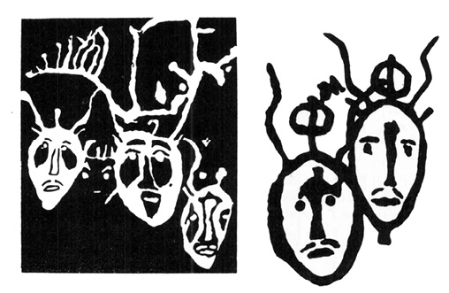

<section>

> Dějiny člowěčenstva jsau Próteus; kterýž rozličným jednotliwcům rozličně, ano i jedné a též mysli w rozmanitých jewí se podobách. Potřebí k tomu zwláštní jeho přízně, aby na otázku: „Co bylo a jest?“ poněkud zewrubně odpověděl; na otázku: „Co bude?“ obyčejně mlčíwá, aneb jen nejobecnějších odpowědí udílí.

JAN SLAWOMÍR TOMÍČEK:  
DOBA PRWNÍHO ČLOWĚČENSTWA  
ANEB AUPLNĚJŠÍ WYLÍČENÍ STAWU  
PRWNÍHO POKOLENÍ LIDSKÉHO, 1846

> Číkoveneg připevnil ten kousek hvězdy doprostřed na svůj štít, kde hned počal svítit v zářivé kráse.

> Od té chvíle viděl již lépe na cestu v hluboké noci vesmíru, protože ta malá hvězdička na štítě mu svítila.

> Jeho malomyslnost zmizela. I začal cítit sílu a odvahu jako mladý bůh.

> Skákal z hvězdy na hvězdu.

BRUNO TRAVEN: STVOŘENÍ SLUNCE

</section>

<section>

Posunování mezníků v čase i prostoru, avšak především v čase, se stalo jednou z charakteristických známek poznání a věd naší doby. Někdy je prováděno nenápadně, skrytě, jaksi úkradkem, jindy za hlučného sběhu vědců (obrazně řečeno) a nadšené účasti veřejnosti. Platí to i o vzniku světa, což v tomto případě znamená vesmíru.

První, kdo se pokusil „vědecky“ vypočítat podle biblických údajů stáří světa, byl papež Urban VIII. u příležitosti revidování římské martyrologie Řehoře XIII. z roku 1580. Roku 1640 vyvodil ze starozákonních textů, že svět (vesmír) byl stvořen roku 5199 před Kristem.

Tato práce nebyla po zásluze oceněna, protože Urbanovo datum neodpovídalo chiliastické symbolice, předpokládající tisícileté trvání každého dne Geneze. I dal se do práce arcibiskup Usher a odvážil se polemizovat se samotným papežem – prohlásil totiž (ve spise _Annales Veteris et Novi Testamenti_ 1650), že „po pečlivém desetiletém studiu dospívá k výpočtu, že svět byl stvořen 4000 let před letopočtem křesťanským“. Není známo, kolik let studia věnoval upřesnění Usherova data vicekancléř univerzity v Cambridgi John Lightfood, ale jeho výsledek je imponující: „Nebe a země, střed i obvod byly stvořeny pospolu v téže chvíli i s dešťovými mraky a toto dílo bylo dokonáno a člověk byl stvořen Trojicí boží dne 23. října 4004 před Kristem v devět hodin ráno“.

To byl i na církev trochu silný tabák. Dala přednost kulatému datu Usherovu, provázejícímu ostatně jako výchozí chronologické datum biblické děje v anglické tzv. St. Jamesově bibli dodnes.

Autorita papežů, arcibiskupů a církevních badatelů s odborností teologů, podpořená nenapadnutelnou autoritou Starého zákona, ovlivňovala evropské myšlení celou řadu let a působila i na duchy tak probudilé, jakým nepochybně byl Isaac Newton, který o osmdesát let později v knize _Chronology of the Ancient Kingdoms Amended_ napsal doslova: „Netvrdím, že bych dovedl vznik vesmíru určit přesně na rok. Může dojít k omylům o pět nebo deset let, třeba i o dvacet let, ale ne o mnoho více.“ Na jiném místě knihy výslovně uvádí, že v průběhu 1656 let od stvoření světa proběhl celý planetární i biologický vývoj přes Adama a Evu až k potopě světa. Podobný názor o trvání vesmíru měl i Galileo Galilei i Jan Kepler. Snad se tu projevil jakýsi strach z propastnosti času, časová agorafobie, promítající se v jiné podobě i do teorií o rozměrech vesmíru.

V jedné knize jsem popsal pobloudilý korešismus, nauku o dutosvětosti, přijímanou ještě za II. světové války řadou nacistických pohlavárů v čele s Göringem, a odůvodnil její motivaci touhou po „útulném“ vesmíru s alespoň představitelně lidskou mírou. Toto přání, stávající se otcem myšlenky, proniká lidskými dějinami a ovlivnilo celý starověk, uzavírající kosmos do hvězdné sféry, otáčející se nevysoko nad viditelnými planetami. První náznaky tušení, že Slunce je sice jen jednou z hvězd, ale Zemi neskonale bližší než ostatní viditelné hvězdy, nacházíme teprve u kardinála Mikuláše Kusánského (1401–1465) a v nedávno přečtených a uveřejněných denících Leonarda da Vinci. Giordano Bruno, upálený roku 1600 pro domyšlení a rozšiřování této myšlenky, byl další vzácnou a světlou výjimkou. S lítostí musíme konstatovat, že se sám Kepler ve své korespondenci s církevním verdiktem ztotožňoval, a to ne proto, že by byl Brunovy názory o mnohosti obydlených světů a o nespočetných hvězdách ve věčném vesmíru považoval za heretické (sám měl s církevním pronásledováním smutné zkušenosti; o matce, nařčené později z čarodějnictví, ani nemluvě), ale protože je považoval za šílené, nesmyslné a nevědecké. Po přečtení Brunovy _Hostiny na Popeleční středu_ a spisu _O nekonečném vesmíru a světech_ napsal (_Opera omnia, sv. I. a sv. VI_); „Když jsem slyšel, že Bruno učí o nekonečnosti světů, že hvězdy považuje za slunce a Slunce že prohlašuje za jednu z nesčetných hvězd, jež jsou rozsety od sebe v nekonečných vzdálenostech, a že každé z těchto sluncí-hvězd chová kolem sebe svět oběžnic naší Zemi podobných, tu mne pojala závrať a zmocnila se mne tajemná hrůza z toho, že mám bloudit v nekonečném prostoru, který nemá středu, který nemá vůbec pevného, určeného místa.“

Jak je vidět, i sám hvězdář Kepler snášel Kopernikovu představu vesmíru jen díky uklidňujícímu vědomí vcelku nedaleké křišťálové klenby se světélky hvězd. Její prolomení Giordanem Brunem v něm vyvolalo závratnou hrůzu z prostoru, z nekonečnosti…

Smutným paradoxem, jedním z mnoha v dějinách věd, je skutečnost, že první, kdo se odvážil teoreticky podloženého pokusu o odhadnutí vzdálenosti hvězd srovnáním jejich zdánlivé jasnosti se zdánlivou jasností Slunce, Christian Huygens (1629–1695), použil právě Keplerova zákona (z roku 1604) o zmenšování intenzity světla úměrně s druhou mocninou vzdálenosti jeho zdroje… Teprve roku 1837 se však podařilo jakžtakž změřit vzdálenosti několika nejbližších hvězd triangulací a bezpochybně rozšířit našemu pozorování přístupný vesmír daleko za hranici lidské míry.

Usherův odhad délky života malého a přehledného vesmíru zcela dobře souhlasil s představou Slunce jako hořlavé, patrně uhelné koule, schopné vydávat zjištěnou zářivou energii (3,9 × 1033 ergů s−1) asi 6000 let, než dojde k úplnému vyhoření, a tím ke konci světa. V polovině 19. století prodloužili Helmholtz a Kelvin minulost naší sluneční soustavy desettisíckrát – předpokládali totiž přeměnu gravitační energie v teplo při zmenšování Slunce z nekonečně velkých rozměrů až k dnes pozorované velikosti. Vypočetli dobu trvání Slunce na padesát miliónů let.

Atomová fyzika umožnila poznat charakter energie rozsvěcující hvězdy, a stanovením poměru izotopů určit i stáří pozemských hornin. Podle nových, revidovaných údajů se Země vytvořila z protoplanetárního oblaku přes 4,5–4,75 miliardy let. Stáří naší Galaxie je odhadováno na deset, nejvýš dvanáct miliard let, což ostatně již před třiceti lety tvrdili Američan Bethe i Francouz Paul Labérenne. Zákonitě se ovšem objevil i druhý extrém jakéhosi astronomicko-kosmologicko-chronologického furiantství, jehož představitelem je J. Jeans, odhadující stáří Slunce na přibližně 8 trilionů (!) let a stáří vesmíru na dobu o řád vyšší. Vycházel z představy o získávání hvězdné energie anihilací hmoty. H. Faul se spokojí se stamiliardami let (což je kupodivu sice číslo rovněž veliké, ale přece jen desetmiliónkrát menší než trilion), Mpc−1, které připisuje jakýmsi superoscilacím vesmíru, za nichž při rozpínání a následném smršťování až k finální a zároveň pro novou superoscilaci počáteční singularitě vznikají a zanikají všechny hvězdné systémy. Tato představa v podstatě vychází z nejjednoduššího relativistického modelu rozpínajícího se vesmíru, vytvořeného již roku 1922 sovětským matematikem Friedmannem, a není závislá na mechanismu přeměny energie ve hvězdách.

A. S. Eddington (1882–1944), jeden z nejvýznamnějších aplikátorů Einsteinovy teorie relativy, a po něm belgický astronom G. Lemaître (nar. 1894) zavedli ve snaze vyhnout se konečnosti vesmíru v čase tzv. „kosmologický člen“ do rovnic pole (1930). Tím může být odsunut vznik vesmíru – ať už byl jakýkoli (v _Tušení stínu_ je podrobněji probrána teorie big-bangu, velkého třesku) – do neurčité, resp. nekonečně vzdálené minulosti. Vesmír se tedy v tomto obraze stává „polonekonečným“: nemá konec, má však počátek.

Až dosud – tzn. v době, kdy toto píši – je poslední, hraničářský mezník, společný pro rozměry i stáří námi pozorovaného vesmíru umístěn v souhvězdí Vozky, kde byl r. 1971 objeven silný zdroj rádiového záření. Byl označen OH 471, ztotožněn se slabým (bodovým), jen velmi výkonnými dalekohledy viditelným svítícím objektem 18. magnitudy (M. R. Gearhartová a G. Hazard) a určen jako kvazar (kvazistelární objekt, vedle černých děr nejhýčkanější dítě soudobého hvězdářství). Arizonská hvězdárna (R. F. Garswell a P. A. Strittmatter) získala svým devadesáticoulovým reflektorem (o průměru zrcadla 229 cm) spektrum zajímavého objektu. Není právě všední; jeví největší až dosud zaznamenaný rudý posuv. Vysvětlujeme-li ho Dopplerovým efektem (Christian Doppler, pražský fyzik, 1803–1854), totiž změnou vlnové délky světla způsobenou vzdalováním hvězdy od Země – můžeme ovšem zjistit jen radiální složku jejího pohybu –, pak se zdroj OH 471 od nás vzdaluje rychlostí 270 000 km·s−1, což je asi 90 % rychlosti světla, je vzdálen dvanáct až šestnáct miliard světelných let (tj. 3,7 až 4,9 miliardy pc), a tedy v každém případě je nejvzdálenějším až dosud pozorovaným vesmírným objektem. Jeho existence, vzhledem k limitní rychlosti jakéhokoli pohybujícího se objektu, je ze všech zjištěných zřejmě nejdelší.

Od Johna Lightfooda s jeho minuciózně přesným hodinovým datováním počátku kosmu, před nímž byla nad propastí jen tma a Duch se vznášel nad vodami (Mojžíš, I, 2), až k nekonečnu, je to dost slušný kus cesty. I na ní však nacházíme podivná rozcestí a zvláštní slepé odbočky.

Soudobá kosmogonie může říci (a také ústy svého představitele řekla): „Tak nám vesmír za posledních pětatřicet let zestárl o šestnáct miliard let.“

Poněkud absurdní tvrzení se týká ustavičných změn tzv. Hubblovy konstanty, určující vztah mezi rudým posuvem spektra kosmických objektů, vysvětlovaných Dopplerovým efektem, a jejich vzdáleností. Nelze zde zacházet do podrobností – jisto je, že se Hubblova konstanta, nacházející své uplatnění v Hubblově zákonu, nechovala jako své cti dbalá konstanta, tedy veličina stálá a neproměnná, naopak jevila proměnlivost a bystrý pohyb jako pulec. V době svého objevu roku 1937 činila 536 km·s−1·Mpc−1, takže přepočtené stáří vesmíru dosahovalo toliko 1,8 miliardy let, již tehdy příliš málo ve srovnání se stářím pozemských hornin, odhadovaným na dvojnásobek. Záhy přišly opravy, o něž se postarali Baade a po něm Sandage, jenž stanovil velikost Hubblovy konstanty na 75 km·s−1·Mpc−1 (tento údaj je uveden i v _Astronomickém a astronautickém slovníku_). Naposledy provedli revizi Sandage a Tammann, jejichž konstanta je již pouhou desetinou původní – jen 59 km·s−1·Mpc−1.

Výzkum byl prováděn podle celé řady kritérií a zdá se, že jeho korekce v budoucnosti budou nejvýše několikaprocentní a že stáří námi pozorovatelného vesmíru je jím poměrně přesně určeno na 18 miliard let, což je v dobré shodě i s dalšími, různým způsobem získanými údaji.

Neoddával se však stejně blahé jistotě i veledůstojný biskup Usher…?

Ruku v ruce s prodlužováním stáří vesmíru se zvětšily i další veličiny a vzdálily další hranice. Nechci přetížit knihu astronomií – proto jen jeden, poslední příklad.

Roku 1965 ohlásili Penzias a Wilson objev rádiového šumu, přicházejícího rovnoměrně z celého prostoru a odpovídajícího svým spektrem Planckově křivce záření černého tělesa s teplotou 2,7 K. Toto záření se svými vlastnostmi stalo nejsilnějším argumentem pro teorii velkého třesku, big-bangu, jímž vznikl námi pozorovaný vesmír, a přes určité obtíže a nejasnosti se zdá představovat ideální souřadnicový systém, k němuž lze vztáhnout pohyby všech kosmických těles i celých hvězdných soustav. Záření je totiž izotropní – anizotropie, nesourodost, vyvolaná např. pohybem Země, vlastně odráží směr a rychlost jejího pohybu vůči této „nejabsolutnější“ souřadnicové soustavě.

O zjištění absolutní rychlosti Země se tímto způsobem pokusil astronom princetonské univerzity P. S. Henry s pomocí přístrojů (Dickeova radiometru), vynesených stratosférickým balónem do výšky 24 km. Výsledek byl překvapující. Kromě velmi přibližného zjištění souřadnic bodu, k němuž se Země prostorem pohybuje, byla určena i její „absolutní“ rychlost: (400 ± 200) km·s−1. Připouštěné chyby jsou zatím nepříjemně veliké, ale i průměrná odhadová rychlost 400 km za sekundu dvacetkrát převyšuje údaj, zafixovaný takřka ve všech astronomických publikacích i v povědomí jejich čtenářů – asi 20 až 30 km·s−1. Tolik asi činí oběžný pohyb Země kolem Slunce, považovaný donedávna za rozhodující složku celkové rychlosti Země ve vesmíru. Oběžný pohyb Slunce s celou planetární rodinou vůči středu Galaxie je odhadován asi na 200 až 250 km·s−1. Není vyloučeno, že pohyb Země reliktového záření, související se strukturou celého nám známého vesmíru (tedy nejen naší Galaxie), byl P. P. Henrym ještě řádně podceněn.

Je ovšem pravda, že naměřená rychlost se nám, odchovancům vědeckofantastických románů, v nichž vesmírem proletují fotonové kosmolety, nezdá ničím nepředstavitelným, ještě před několika desítkami let by však byla čímsi obludným. A pro nekonečnou řadu starověkých i středověkých vědců, snažících se podvědomě upevnit a odůvodnit idylickou představu skálopevné Země, nehybné a bezpečné, zajisté šokem. Dnes jsou tyto údaje publikovány jen v odborné literatuře a mezi neodborníky se setkávají toliko s mírným a spíše zdvořilostním zájmem. Člověk je zkrátka náramně přizpůsobivý tvor.

Až dosud jsme však mluvili většinou o astronomických a fyzikálních teoriích, zatímco se – podle J. W. Goetha – žití strom zelená. Vydejme se tedy po stopách zelených stromů žití, ohraničujících les trvání biosféry na naší planetě.

Jednou z nejzávažnějších otázek pro veškeré úvahy paleontologické, biologicko-taxonomické a exobiologické je pokud možno přesné datování vzniku života na Zemi. Ponecháme-li stranou představy rozličných náboženství přírodních národů o stvoření světa a života na něm, dokonce nezřídka tyto kreativní akty přesně datující skoro tak pedanticky jako nedocenitelný pan dr. Lightfood, dostáváme se přes dosti nejasné antické zprávy o zkamenělinách pravěkého tvorstva a rostlinstva, zachované u Xenofana, Strabóna, Anaximandra, Empedokla a především Aristotela k pokročilejším renesančním názorům o fosiliích jako o zbytcích zvířat, jež skutečně kdysi dávno žila. Tento názor zastával Leonardo da Vinci, Fracastor i Bernard Palissy. Vzhledem k pátravému zraku církve se ani neodvážili pokusu datování. Jejich hlasy však byly i přesto potlačeny církvi přijatelnějšími hypotézami o zkamenělinách jako o hříčce přírody (Olivy, Gessner), o zkamenělinách jako výsledku působení hvězd (Mercati), výronu zvláštní vodní páry, nasycené semeny živočichů (Luidius). Po prvních vystoupeních vědců, opatrně naznačujících, že život na naší Zemi trvá patrně déle, než dovolují církevní dogmata (Steno, Woodward, Hooke atd.), došlo k prudkému protiútoku reakce. Jediným únosným vysvětlením mělo být, že zkameněliny jsou zbytky tvorstva, zahynulého poměrně nedávno při potopě (Tertullian), hříčky boží – ludi Dei –, na nichž bůh jaksi nanečisto zkoušel plán tvoření, nebo ďáblovy pokusy napodobovat boží dílo.

Koncem 17. století (století složeného drobnohledu, vlnivé teorie světla, logaritmů, infinitezimálního počtu…) je zničeno paleontologické dílo tří profesorů Sorbonny De Claveho, Bitause a De Villona a autoři vypovězeni z Paříže.

O sto let později se odváží slavný George L. Buffon (1707–1788) podotknout, že zkameněliny nemohou být jednodenním či dvoudenním výtvorem božím, ale že potřebovaly ke vzniku a mineralizaci celá tisíciletí. Na zásah teologické fakulty byl vyhozen z univerzity a nucen vydat ponižující prohlášení, v němž se zříká „všeho ve své knize, co řekl o vývoji Země, a obecně všeho, co by mohlo odporovat vyprávění Mojžíšovu“.

Teprve devatenácté století do jisté míry odstranilo neomezenou možnost vměšování církve do vědy – ale opravdu jen do jisté míry. Poslední „opičí proces“, končící odsouzením učitele, vysvětlujícího žákům vývojovou nauku, proběhl v USA nedlouho před II. světovou válkou, a církevní spisy dodnes pateticky popisují „onu noc, čtyři tisíce let trvavší, onu dobu tmy, smrtelného spánku, touhy a trudného očekávání, představovanou církví čtyřmi nedělemi adventními, ježto jsou zimou roku církevního“ – totiž čtyřtisíciletou „noc“ od prvotního hříchu Adama a Evy do roku 0 n. l. Zkrátka věda sem, věda tam – my máme arcibiskupa Ushera…

Není divu, že se za těchto okolností vyvíjelo poznání o skutečném trvání života na Zemi velmi zvolna a váhavě. Jeden mezník za druhým padal. Dnes už je hranice nejen desetiletí po desetiletí, ale rok od roku posunována stále hlouběji do minulosti. Zprvu po tisíciletích, pak po statisících a miliónech let. Dnes se tempo tohoto pohybu tak zrychlilo, že ani nějaká stovka miliónů let odborníky příliš nepřekvapí – je ovšem nutno uvědomit si, že podvědomé vnímání prahor, prvohor, druhohor, třetihor a čtvrtohor jako alespoň řádově trváním podobných epoch je zcela scestné: Zatímco prahory trvaly asi 2000 miliónů let, prvohory 350 miliónů, druhohory 100 miliónů, zbylo na třetihory jen 60 miliónů a na čtvrtohory dokonce jen drobeček 1,5 miliónu let.

Až asi do roku 1975 se předpokládalo, že život na Zemi je o něco málo starší tří miliard let, což je stáří sinic, nalezených např. v Rhodesii, nebo díky výzkumům A. Vologdina, vedoucího laboratoře pro pravěké organismy při Ústavu pro paleontologii v Moskvě, v předprvohorních horninách Amurské oblasti, v pohoří Chingan a ze severních výběžků Aldanského masívu. Poslední nálezy prokázaly, že v této době byl již život poměrně značně diferencován. Kromě řas a sinic, žijících v předprvohorních mořích jako fytoplankton, byla zjištěna i seskupení původních řas, ba i zbytky vyšších živočichů, jejichž zařazení je velmi obtížné – podobají se koloniím prvoků typu váleče koulivého (Volvox globator) nebo primitivním láčkovcům. Existovaly přirozeně i baktérie, v této době neobyčejně „geologicky aktivní“, což samo o sobě dokazuje značnou strukturalizaci a dokonalost řízení nitrobuněčného enzymatického aparátu – kromě jiného vytvořily baktérie rozsáhlá ložiska tzv. páskovaných železných rud, jimž dnes vděčíme za 70 % veškeré světové produkce železa.

Ač se to netýká tématu naší knihy, je popis vytvoření ložisek železných rud pěkným příkladem úzké spojitosti nejstarší minulosti naší planety s dneškem a zároveň důkazem i pro nevěřící, že za příbor, jímž pojídali vydatnou večeři, i za automobil a za potěšení z úspěchů kosmonautiky opravdu vděčí mj. předprvohorním baktériím. Podle množství organického fosilního uhlíku, obsaženého v jílovitých břidlicích a karbonátových horninách (obsah uhlíku v uhlí a ropě je v této souvislosti zanedbatelný) lze vypočítat celkové množství všeho kyslíku vyprodukovaného organismy – asi 2,7·1021 g. Dnešní atmosféra však obsahuje jen asi 1,3·1021 g kyslíku, rozdíl tedy musí být chemicky vázán, a to především jako kysličník a síran železitý. K jejich vzniku došlo při rozšíření kyslík produkujících a tedy „kvasně dýchajících“ organismů ve světovém oceánu, kam byly jako produkty terestrického větrání zanášeny řekami soli dvojmocného železa a oxidovány na sloučeniny trojmocné, usazující se jako sedimenty. Podařilo se v nich dokonce prokázat i produkty rozkladu chlorofylu. Po celou dobu trvání této biochemické reakce byla v mořích jakási rovnováha mezi produkcí a spotřebou kyslíku. Teprve po oxidaci všeho dvojmocného železa v oceánu (asi před 1,8 miliardy let) mohl unikat produkovaný kyslík do atmosféry, mohlo docházet k oxidačnímu větrání na souši. V podmínkách souše probíhá oxidace dvojmocného železa relativně velmi pomalu, takže nabídka kyslíku převyšovala poptávku a jeho koncentrace stoupala, až dosáhla stabilní hodnoty kolem 20 %. Pomalost tohoto procesu umožňovala genetickým mechanismům organismů bránit se novými enzymatickými systémy proti zprvu toxickým účinkům kyslíku, a posléze dokonce přejít od „kvasného dýchání“ k energeticky mnohem vydatnějšímu dýchání kyslíkovému.

Tento vývojový model pozemské atmosféry, navržený C. E. Jun­gem, R. Eichmannem a M. Schiddlowskim z Chemického ústavu Maxe Plancka v Mohuči roku 1975 velmi znatelně posouvá počátky jednotlivých etap vývoje života na naší planetě a je dobře dokumentován, mj. i zkoumáním rozdílného poměru zastoupení izotopů uhlíku C12 a C13 v karbonátových horninách zemské kůry a dalšími spolehlivě zjistitelnými ukazateli. Podle toho by na Zemi existovala kyslíková atmosféra v přibližně dnešním složení asi dvě miliardy let. Fotosyntéza živé hmoty z vody a kysličníku uhličitého za využití sluneční energie a za přítomnosti katalyzujícího chlorofylu však byla v malém měřítku přítomna již před 3,7 miliardy let. Tehdy také počala kumulace organického uhlíku, podílejícího se již za 400 miliónu let (jak snadno dnes manipulujeme časovými dimenzemi, které si vůbec nedovedeme názorně představit!) asi jednou pětinou na složení celkové sedimentární zásoby uhlíku zemské kůry.

Fotosyntéza je však atributem relativně dokonalého a složitého života, jemuž nutně předcházely stamilióny let života primitivnějšího, „kvasně dýchajícího“ a s jednodušším enzymatickým aparátem, snad analogického dnešním eukaryontům nebo primitivním baktériím s jadernou hmotou rozptýlenou v cytoplazmě.

Pak by se nám počátek života „překulil“ zcela určitě přes hranici čtyř miliard let od současnosti. Nevzrušuje vás to? Máte pravdu – miliarda let sem, miliarda let tam… Vždyť je to jen sotva stotisíckrát delší doba, než jakou prožila podle dnešních předpokladů lidská civilizace…

Vedlejším výsledkem nové datace vzniku života a jeho postupu od „kvasného dýchání“ anaerobiontů k prvním nesmělým pokusům o fotosyntézu až k vcelku obecné oxibióze s efektivním kyslíkovým dýcháním, je silný argument proti oblíbené teorii panspermie, prazárodků, přenesených na naši planetu z vesmíru. Právě v prvotních fázích vývoje života docházelo, jak vidíme, k výrazným změnám modelu látkové výměny a je těžké si představit vesmírný zárodek tak plastický, aby byl schopen při zachování základního principu předávání genetického kódu rozštěpením molekuly DNK takové zásadní změny přijmout a přizpůsobit se jim. Naopak je velmi posílena materialistická představa o zákonitém vzniku života vrcholného zjemnění pohybu hmoty všude, kde jsou k tomu dány podmínky. Jak je vidět, na Zemi si život přispíšil a vloudil se vlastně do sotva pootevřených dveří, aby svým působením udělal ze Země mimořádnou planetu, jako jedinou z celé sluneční soustavy obklopenou kyslíkovou atmosférou.

Zastánci panspermie se ovšem nevzdávají. V poslední době počal za pozměněnou koncepcí Svanta Arrhenia a lorda Kelvina lámat kopí molekulární biolog a nositel Nobelovy ceny F. Crick (časopis _Icarus_, sv. 19, 1973). Domnívá se, že objevil důkazy (opatrnější a přiměřenější by bylo říci „silné argumenty“) o odpovědnosti mimozemských civilizací za vznik dnešního pozemského modelu. Hlavním Crickovým argumentem je univerzálnost jednoho jediného typu genetického kódu pro veškerý pozemský život – ostatně na rozšiřování tohoto kódu má právě Crick podíl. Vysvětlení, nabízená biology, se mu zdají být nedostatečná. Tvrdí, že život byl na naši planetu, pustou a nesličnou a výhradně anorganickou, zanesen záměrně a uměle asi před čtyřmi miliardami let speciálně vybranými nebo zvláště připravenými zárodky. Crick se svým spolupracovníkem L. Orgelem dokonce soudí, že zájem nepozemské civilizace „rozsévačů“ mohl být motivován jejím ohrožením a snahou připravit na sterilní živné půdě slunečního satelitu Terra vhodné životní prostředí, tedy v podstatě to, co navrhl Carl Sagan, totiž „naočkování“ horních vrstev atmosféry Venuše vybraným druhem modrozelených řas, které by se, nadnášeny turbulencí, množily a po určité době by nejen fotosyntézou přetvořily složení atmosféry Venuše obohacením kyslíkem a snížením podílu CO2, ale odstraněním skleníkového efektu by se i přičinily o podstatné snížení extrémních na Venuši panujících teplot (480 °C). Jinými slovy – připravily by tuto sesterskou planetu pro příchod a život člověka.

V _Tušení stínu_ jsme již zaujali k jednotě formy genetického kódu stanovisko, že první bezchybný aparát DNK (samozřejmě s potřebnými enzymy, převodním systémem RNK a vhodnými zdroji látek ze zevního prostředí) byl díky nesmírnému zvýhodnění zároveň typem posledním. Všechny ostatní zpola nebo bezmála podařené kombinace mu posloužily jako energeticky vydatná potrava. Toto se nám zdá být dostatečným vysvětlením. Jisto však je, že i Crick, který zcela určitě se svou vědeckou pověstí zachází opatrně, posunuje první výskyt života na Zemi do minulosti vzdálené čtyři miliardy let a jeho vznik kdesi v kosmu ovšem ještě podstatně dále. Vždyť sami „rozsévači“ by byli neobyčejně vyvinutou inteligencí.

Z celého košatého stromu vývoje života nás – jak jinak? – zajímá především vznik a vývoj člověka. Málokde je posunování hraničních kamenů tak zjevné jako v jeho historii, vědecky studované poměrně nedlouhou dobu – vždyť racionální přístup k této problematice umožnilo teprve oproštění od mytických „stvoření“, vestavěných do základních kamenů takřka všech náboženství. Všechna „stvoření“ kladla vznik člověka do dob útulně blízkých, ať již způsobem života prvních lidí, nebo přímo vypočítáním generací, které od „stvoření“ do zapsání nebo jiné fixace legendy uplynuly. Zajímavé je, že tento generační sled udává u Polynésanů, Mayů, Sumerů i Židů (rodokmen Krista) dobu řádově shodnou – několik tisíciletí.

Po prolomení bariéry předsudků byl vznik člověka kladen do doby vzdálené desetitisíce let. Statisíce let již byly odvážným a vědeckou pověst ohrožujícím odhadem. A celý milión? Ne – to už je pouhá fantazie…

</section>

<section>

Mnoho antropologů se ještě dnes domnívá, že nejstarším známým článkem ve vývoji člověka a jeho přímým předchůdcem je Homo erectus, člověk vzpřímený, druh, příslušející do doby asi před miliónem let a s obsahem mozkovny 750 až 1100 cm3. Australopithecus („jižní opice“), objevený roku 1924 profesorem johannesburské univerzity R. A. Dartem a s obsahem mozkovny asi 500 cm3, žijící před (necelými) třemi milióny let na afrických bezlesých stepích, a tedy víceméně donucený alespoň občas a z bezpečnostních důvodů ke vzpřímené poloze těla, je pro malý obsah mozkovny počítán mezi předlidi a zároveň druh, který se velmi časně odštěpil z kmene, jehož posledním výhonkem je Homo sapiens sapiens. Nepatří tedy mezi naše pradědečky a není ani hledaným „chybějícím“ (dnes už patrně nalezeným) článkem, společným a spojujícím hominidy s opicemi, ačkoli prokazatelně používal nástrojů, které si zhruba a neuměle opracovával.

V Olduvai George v Tanzánii byly roku 1960 nalezeny badatelským týmem L. S. B. Leakeyho pozůstatky nepochybného pračlověka a druhu Homo habilis. Po provedení datace se ukázalo, že to byl pračlověk, který, podobaje se poněkud typu Australopithecus afrikanus, ale s lidštějšími rysy, a pojídaje zřejmě rostlinnou i masitou stravu, splnil jednu z podmínek dalšího rozvoje. Žil před 1 800 000 lety. Mezník se pořádně pohnul.

Senzanční objev byl učiněn v srpnu roku 1972 v Keni v blízkosti Rudolfova jezera: Keňan Bernard Ngeneo z týmu Richarda E. Leakeyho, syna proslaveného Louise S. B. Leakeyho, nalezl asi třicet úlomků, umožňujících rekonstruovat hominida, naprosto se lišícího od dosud známých forem pravěkých lidí. K lebce 1470, jak byla rekonstrukce v keňském národním muzeu zcela prozaicky označena, byla přiřazena nová forma člověka dosud nepojmenovaného, s přibližným obsahem mozkovny 800 cm3, tedy daleko více, než čím se pyšní např. Australopithecus, jeho současník.

„Buď tuto lebku odhodíme, nebo změníme své teorie o dávném člověku,“ prohlásil R. Leakey. Má pravdu tím spíše, že v okolí bylo nalezeno 300 sečných a řezných kamenných nástrojů – jejich přiřazení k lidskému typu, jehož reprezentantem byl vlastník lebky 1470, však není dosud dostatečně prokázáno. Naopak je jisto, že lebka 1470 je nejméně 2 600 000, ale spíše 2 800 000 let stará. Minulost člověka byla prodloužena o milión let, do třetihor. Jak však správně konstatují autoři článku v sovětském časopise _Priroda_ (6/1974), zajímavost a senzačnost lebky není jen v jejím stáří. Daleko pozoruhodnější je, že třetihorní pračlověk byl morfologicky a v porovnání se „vzorovým etalonem“ Homo sapiens sapiens (tj. s námi) daleko vyspělejší než o milión let mladší Homo habilis, o Australopithekovi ani nemluvě, ba dokonce vyspělejší než o 2,5 miliónu let mladší Pithecanthropus erectus. Měl méně výrazné nadočnicové oblouky, „pokročilejší“ stavbu obličejového skeletu a zubního oblouku atp.; nejvýraznějšími „opičími“ rysy lebky 1470 je úzký nosní otvor a chybění kostního septa nosní dutiny, což by mohlo naznačovat podobnost např. s nosem goril.

Nález lebky 1470 byl doplněn nálezem stehenních kostí mimořádně pokročilého hominida v téže „oblasti 131“, jak ji R. Leakey nazval (nálezce paleontolog J. Harris), a zbytků lebky dítěte (nálezce opět Bernard Ngeneo). Souvislost s lebkou 1470 je pravděpodobná – zkoumání však stále pokračuje. Snad stojí ještě za zmínku, že se podstatně do minulosti odsunula i časová zóna, v níž očekáváme nález „chybějícího článku“. R. A. Dart za něj ještě v šedesátých letech považoval svého tři milióny let starého Australopitheka. Dnes je jasné, že dobu, která od života společného předka lidí a lidoopů uplynula, musíme prodloužit asi desetkrát – přinejmenším. Na fajjúmských nalezištích jižně od Káhiry byly objeveny pozůstatky šestatřicetizubých praopů Apidia a Parapitheka, staré asi 30–40 miliónů let, a ve stejných vrstvách Propliopithecus, daleko morfologicky pokročilejší a s pouhými 32 zuby. Zdá se, že právě Propliopithecus by mohl být oním proslulým chybějícím článkem – „missing link“, až donedávna hledaným v dobách daleko mladších.

Východoafrická příkopová vpadlina, bohatá paleoantropologickými nalezišti, není omezena jen na Keňu, tím méně na Olduvai. Táhne se z Tanzanie až do Etiopie a odtud k Rudému moři. Obzvláště slibné jsou mocné hlinité profily z minulosti 1,7 až 4 i více miliónů let dávné při ústí řeky Omo do Rudolfova jezera. Jejich šikmé uložení usnadňuje výzkum a dataci.

Průzkum je zde již prováděn od roku 1932 (prof. Arambourg, Y. Copena, C. Howell, R. Leakey a další) a vydal celé tuny kostrových zbytků zvířat. Pozůstatky hominidů jsou skromnější, ale v poslední době se díky úsilí francouzských vědců množí, právě tak jako nálezy zjevně opracovaných nástrojů, starších úštěpových, i mladších, náležejících tzv. olduvajské kultuře, valounovitých a hrubě, avšak přesně a záměrně obitých. Není vyloučeno, že staré vrstvy etiopských nalezišť vydají nálezy, umožňující další posunutí mezníku lidského rodu za mezník dnešní, označený jménem Olduvai.

Antropologické výzkumy jsou prováděny v etiopském údolí Afáru a v Asii v pohoří Siváliku v Pákistánu, kde byl objeven Ramapithecus, pravděpodobný předek Australopitheka, žijící asi před 10 milióny let. Spojený tým Yaleovy univerzity a Pákistánského geologického ústavu tu objevil řadu čelistí a zubů. Byla vyslovena dokonce odvážná domněnka, že Ramapithecus, nebo tvor jemu podobný, žil v Keni, v Turecku a v Maďarsku a že v těchto zemích byly jeho pozůstatky sice nalezeny, ale vzhledem k dosažené úrovni poznání vývoje člověka chybně zařazeny.

Buď jak buď, paleoantropologové se stěhují k lokalitám, jejichž stáří by ještě před několika lety bylo považováno za naprosto se neslučující s možností nálezů fosilního člověka nebo jeho přímých předků. Donald C. Johnson se chystá kopat v údolí Afáru a Leakey už přesídlil i se svou početnou skupinou na místo jižně od jezera Turkany v Keni, kde jsou vrstvy staré pět až jedenáct miliónů let…

Pro pořádek poznamenávám, že nový pohled od nejdávnější minulosti člověka ani v nejmenším neznamená rehabilitaci nebo dokonce vědecké oprášení „třetihorního“, ba i „druhohorního člověka“, předpokládaného Hansem Hörbigerem, tvůrcem teorie „světového ledu“. Lebka 1470 nebo Propliopithecus rozhodně nemají nic společného s nadčlověčenskými obry, učiteli a předky ušlechtilých nordických blonďáků, o nichž halucinuje Hörbiger. Tyto nálezy neznamenají ani vzdálenou možnost zadostiučinění pro Roberta Charrouxe, odmítajícího uznat neandertálce za typické reprezentanty své doby (až do vystřídání pokročilejšími cromagnonci) a považujícího je – podobně jako zpočátku slavný R. Virchow (1821–1902) – za jakési odpadky rodu, klošáry, somráky a sanktusáky, trpící v mládí rachitidou a ve stáří artritidou, lišící se od daleko ušlechtilejšího průměru tehdejší lidské společnosti. Teprve anatom Schwalbe se odvážil roku 1901 proti tomuto výkladu vzepřít. Rozdíl mezi Virchowem a Charrouxem je v možnostech poznání. Co bylo u prvního vědeckou hypotézou, je u druhého pošetilou fixní ideou a službou vlastní zaujatosti.

Prostor minulosti lidstva se nám tedy znamenitě rozšířil a navíc nové nálezy velmi plasticky předvedly nerovnoměrnost vývoje jednotlivých forem našich předků. Přidejme k tomu podle mého soudu velmi cennou pracovní domněnku některých sovětských paleoantropologů, totiž že se zjevný pokrok schopností myšlení nemusel bezprostředně zobrazit somaticky, např. zvětšením mozkovny lbi, nebo že tyto změny mohly být též velmi diskrétní a na fosilních reliktech těžko rozpoznatelné. Docházíme opět jednou k rozpakům: jací opravdu byli naši prapředkové? Byl Australopithecus se svými 500 cm3 mozku pouhým zvířetem řízeným reflexy? Nemáme ani zdání, jak mohl být velký – až dosud byly nalezeny jen zuby a úlomky lbi. Byl-li z dnešního hlediska trpaslíkem, není to tak docela málo. Objem mozkovny formy Homo erectus (1100 cm3) by při malém vzrůstu – a ostatně i při pořádném vzrůstu – sám o sobě mohl postačit i dost značným nárokům za předpokladu, že bychom se pro tohoto pradědečka spokojili např. se schopnostmi mozku Anatola France o objemu 1190 cm3 (já bych okamžitě měnil). O strukturalizaci mozku dávných předků člověka, členění vrstev jeho kůry, bohatosti závitů, umožňujících s jistou, i když zdaleka ne absolutní mírou pravděpodobnosti soudit na intelektuální schopnosti, nevíme ovšem téměř nic.

Či snad přece?

</section>

<section>

Mezi sporné, avšak nesmírně zajímavé indicie o nejstarším člověku a jeho vývoji patří žlutohnědá křemenná hrouda, nalezená roku 1925 v lomu cihelny u Odincova poblíže Moskvy anatomem N. A. Grigo­rovičem, která se velikostí, tvarem i všemi povrchovými detaily podobá jak vejce vejci lidskému mozku, včetně rozdělení na hemisféry, rýhování atd. Lehkou deformaci napodobil Grigorovič mírným zmáčknutím dosud nezatvrdlého sádrového odlitku skutečného lidského mozku – shoda pak byla téměř naprostá.

Roku 1926 byly odlitky bizarního nálezu předloženy k posouzení berlínskému Ústavu pro výzkum mozku a odborníkům z Lipska, Heidelbergu, Lutychu a Paříže. Byly demonstrovány a diskutovány na vědeckých antropologických sjezdech v Salzburgu a v Düsseldorfu. Většina odborníků potvrdila, že jde určitě o fosilii lidského mozku, jen čtyři vědci o tom vyjádřili pochyby. Poznamenejme, že takové nálezy jsou sice vzácné, ale existují – např. jedním z nejznámějších pozůstatků neandertálce je travertinový výlitek jeho mozkovny, nalezený roku 1926 v Gánovcích jihovýchodně od Popradu a uložený ve sbírkách Národního muzea v Praze.

Katastrofální byly však verdikty geologů. Akademik A. Pavlov se vyjádřil kategoricky: „Křemenná hmota nalezená u vesnice Odincovo a podobná lidskému mozku se utvářela v kamenouhelném vápenci, a je-li to lidský mozek, musel se dostat do usazeniny vznikající na dně kamenouhelného moře. V době kamenouhelné (karbon – před asi 350–270 milióny let – pozn. L. S.) však člověk neexistoval, pročež z geologického hlediska nelze odincovský nález považovat za zkamenělý lidský mozek.“ Akademik P. Suškin uzavřel diskusi 6. dubna 1927 poněkud smířlivěji: „Ke konečnému rozhodnutí, zda jde, či nejde o mozek, je zapotřebí ještě mnoho práce a nových důkazů.“

Sovětský populárně-vědecký časopis _Znanije_ – sila se k problému před nedlouhou dobou vrátil. Upozornil na úspěšné pokusy N. A. Grigoroviče s impregnacemi mozku roztoky, bránícími rozkladu a způsobujícími ve vhodném prostředí postupnou mineralizaci mozkové tkáně, podobnou, jaká byla pozorována v rozporu se staršími tvrzeními obecné paleontologie např. u fosilií červů nebo u zachovaných vnitřností některých vyšších živočichů. Svůj článek zakončil otázkou: Nevylili jsme tenkrát s vodou i dítě?

Psal jsem již v roce 1967 o poněkud podobném případu u nás, kdy byly T. Smieškem poblíže vsi Koňské v martinském okrese ve vápencových balvanech prohlubeniny, velmi přesně a do detailů odpovídající otiskům plosek nohou, což lze na třech velmi dobře zachovaných „šlépějích“ určit lépe než na řadě ostatních, porušených erozí. „Šlépěje“ odpovídající plosce nohy Homo sapiens sapiens, ne tedy neandertálce, respektují i klenutí plosky, i tvar nohy člověka, který hodně a často chodil bos – podle širokého, avšak k ostatním prstům přivráceného palce. Pražští i bratislavští antropologové, upozornění na nález roku 1960, to potvrdili a prohlásili, že noha, která snad otisky vytvořila, nemohla brouzdat tímto světem dříve než před sto, ale spíše padesáti tisíci lety.

Posudek geologů i paleontologů byl ovšem zdrcující. Podle skořápek drobných živočichů, kteří vápenec spoluvytvářeli a zůstali v něm inkorporováni, vznikla dotyčná hornina ve starších třetihorách, a je tedy stará přibližně padesát pět miliónů let. O procházkách Homo sapiens v této době ovšem nelze podle všech našich znalostí hovořit.

Stojíme před otázkou: jsou nálezy v Odincovu a u Koňského nedaleko vrchu Kopa, kam všechny šlépěje směřují, rafinovanými a pracnými podvrhy? Chybí zde rozumný motiv – dušičku romantického patriota snad může napadnout podvrhnout literární památku nebo výtvarné dílo, ale kamenný mozek a šlápoty? Měly šlépěje snad být směrovníkem, ukazujícím k dosud neprozkoumané jeskyni na Kopě, jako tomu bylo v případě tzv. Obrinské nohy pod Oblíkem u Hermanovců (okres Prešov), kde obří šlépěj ukazovala k místu bohatého bronzového pokladu? A měly-li být, proč jich bylo vytesáno tolik a proč s takovou anatomickou přesností, které dosáhla teprve renesance vypracováním základů plastické anatomie, rozhodně však ne bronzová doba?

Mýlí se snad geologové? Sotva.

Mýlí se paleontologové tak dalece, že přehlédli druh Homo sapiens, jemuž bychom byli nuceni připsat jak křemenný mozek, tak podivné šlépěje v prvohorách nebo na začátku třetihor? To určitě ne, taková myšlenka je absurdní.

Může se mozek změnit v kamenný valoun? Nechci to popírat. Máme dostatek argumentů připustit tuto možnost, i když za zcela výjimečných podmínek.

Ale co když tomu bylo docela jinak? Co když jsme nalezli stopy dávných a pradávných návštěv nepozemských bytostí zjevně humanoidních a anatomicky velmi blízkých člověku? V _Tušení stínu_ jsem se pokoušel co nejstřízlivěji doložit pravděpodobnost takového tvora, vynořujícího se ze spleti exobiologických úvah, konfrontovaných s výsledkem „pozemské“ vědy. Lze si snad představit iracionální nebo racionální rituál nebo racionální posmrtné opatření, při kterém byl bytosti X vyňat a snad i na místě impregnován mozek, ať už z jakýchkoli důvodů – např. k pozdějšímu zjištění příčiny smrti na mateřské planetě. Naši kosmonauté na cizích planetách budou patrně v případě náhlého úmrtí druha nějakou místní chorobou, zjevně napadající centrální nervový systém, činit totéž, už kvůli nepříjemným otázkám vyšetřující komise. Lze si představit, že náhlá mimořádná situace, na něž asi nebyly prvohory se svým bouřlivým vulkanismem a mladistvě živou tektonikou chudé, mohla způsobit ztracení preparátu nebo jeho ponechání na místě. Snad by nepozemšťan jako deus ex machina pomohl vysvětlit i stopy v kamení, nacházené ostatně na různých místech světa, kde bychom jejich pracné a anatomicky i technicky náročné vytesávání rozhodně neočekávali. V pohádkách černochů Pobřeží slonoviny, obývajících oblast mezi řekami Nzi a Bandama, vystupuje bůh Anangama, který sestoupil z nebes na Zem, aby naučil lidi všelijakým dovednostem. Jako trvalé znamení svého dočasného hostování vtiskl nedaleko Sakassi svou levou nohu do skály. Je tam dodnes, velikostí i tvarem přesná. A takových pohádek je velice, velice mnoho…

</section>

<section>

Ke kamennému valounu, podobnému mozku, nalezenému N. A. Grigo­rovičem, mám ostatně pěkný protějšek: jednu z domorodých kreseb z jihozápadní Afriky, jak je nalezli a roku 1974 publikovali manželé Ernst a Anneliese Scherzovi. Nazvali ji „abstraktní kresba“, ačkoli se nepochybně podobá mozku a zřetelně zachycuje i jeho nejmarkantnější dělení závity a laloky.

</section>

<section>

Petroglyf z jihozápadní Afriky, nazvaný manželi Scherzovými „abstrakce“, se nápadně podobá kresbě lidského mozku

</section>

<section>

Z blízké oblasti pochází skalní kresba „lovci pod ochrannou stříškou, na níž jsou odloženy jejich toulce“. Romantikové nepotřebují mnoho fantazie, aby tento obraz chápali spíše jako rozfázovaný start létajícího talíře, pozorovaný skrytými obyvateli

</section>

<section>

A do třetice „tančící loutky“ – nu budiž, ale…

Stáří jihoafrických maleb není dosud přesně určeno – přímou radiokarbonovou analýzu pomocí radioizotopu C14 nelze provést vzhledem k několika nezbytným gramům zkoumané látky (barvy). Postupný rozklad barev, jehož použití jako datačního měřítka navrhl Denninger ze Stuttgartu, sahá nejdále 2000 let do minulosti a není příliš spolehlivý ani přesný. Donedávna tedy vládly dohady, pohybující se od několika desítek do několika set let – většinou byly malby připisovány posledním generacím domorodců před jejich decimováním nebo úplným vyvražděním bílými, především holandskými kolonisty. Rok 1971 přinesl překvapení: archeolog Wendt nalezl kameny s obrazy velmi zručně kreslených zvířat, typologicky srovnatelnými se skalními kresbami, v obytné jeskyni spolu se zbytky zuhelnatělého dřeva v ohništi. V tomto případě ovšem nepřinášela radiokarbonová datace žádné obtíže. Výsledek: stáří 14 000 let… Nechci se zatím pouštět do vzrušujících spekulací kolem tohoto „prokletého“ data, o ovlivnění umění jihozápadní Afriky importovaným výtvarným impulsem atd. Jisto je, že tehdejší obyvatelé neprojevovali sklon k vytváření anatomických atlasů. Nebyli, pokud je nám známo, antropofágy, a sotva otevírali svým nepřátelům nebo zesnulým příslušníkům kmene lebky. Otázka, proč považovali za účelné – neboť tyto malby asi nebyly výsledkem estetické hry ani potřeby výtvarného sebevyjádření – nakreslit právě lidský mozek (byl-li to ovšem mozek), může mít i nečekanou odpověď. Nesetkali se snad s objektem, podobným nálezu N. A. Grigoroviče, a dokonce za okolností, které na ně velmi mocně zapůsobily?

Vždyť není pravděpodobnou domněnka o znalosti velevýznamné funkce mozku přírodními národy a dávnými předchůdci dnešního člověka. Existovala sice znalost o jakési souvislosti mozku s duševním životem člověka; empirie poučila už dávno o následcích vážných zranění lbi a zrodila i pradávné techniky trepanací lbi – avšak takřka celá antika věřila, že mozek je jakýmsi chladičem krve (a duševní poruchy po jeho postižení připisovala „horké krvi“). Teprve v pátém století př. n. l. provedl Anaxagorás pitvu lidského mozku a vytušil, že v tomto orgánu „končí smysly“. K témuž závěru došel takřka současně Alkmaión, zkoumající mozky zvířat. Jejich hlasy však zůstaly voláním na poušti a sídlo „duše“ bylo hledáno v srdci, sluneční nervové pletení poblíže pupku, v játrech atd. atd. Středověk odmítl jakýkoli orgán „duše“ vůbec a mozku přisoudil… vyměšování nosních hlenů, což se podařilo teprve roku 1660 vyvrátit německému anatomovi Schneiderovi.

Očekávat tedy u Křováků racionální zájem o lidský mozek vzhledem k jeho rozhodující a vitální funkci je přinejmenším velmi odvážné a značně vědecky riskantní.

Buď jak buď, hranice existence a vývoje člověka jsou díky pa­leontologii v pohybu. Moderní výzkumy o vývoji lidské civilizace rozviklaly naše nedávné jistoty i na tomto úseku vědy o člověku.

Platí to například o osídlení Ameriky, které jsem se v _Tušení stínu_ odvážil klást do období před několika desítkami tisíců let a pro migraci z Asie do Ameriky jsem připouštěl i možnost neklasické cesty, totiž nikoli přes „Beringii“ a Aleuty, ale jihozápadním směrem od Austrálie, řetězem tehdy existujících ostrovů. V březnu 1977 oznámil na konferenci archeologů ve Filadelfii profesor R. Berger z Kalifornské univerzity, že vykopal na ostrově Santa Rosa u jižní Kalifornie sídliště pravěkých lovců trpasličích mamutů s ohništi, mnoha nástroji a kuchyňskými zbytky. Radiokarbonové datování bezpečně určilo stáří tohoto sídliště, dosažitelného podle mého soudu nejspíše neklasickou trasou, na 40 000 let. A profesor B. Reeves ho přetrumfl zprávou o výkopech v Mission Valley nedaleko kalifornského města San Diego, datovaných radiokarbonovou analýzou zřejmě umělých ohnišť na 100 000 až 120 000 let do minulosti, tedy do doby, kdy v Evropě a v Asii žil – podle našich dnešních představ – neandertálec, slepá větev lidského rodu, která nedala vznik dnešnímu Homo sapiens sapiens.

Tím se ovšem nad antropologickým vývojem lidského rodu na americkém kontinentu a ostatně obecně na celém světě objevil pěkný a tučný otazník.

Hranice se posunula, i pokud jde o osídlení Evropy. Předseda Řecké archeologické společnosti Aris Poulianos sdělil roku 1977, že skončil průzkum lebky, nalezené roku 1960 řeckým rolníkem v krápníkové jeskyni Petralona na poloostrově Chalkidiké a všemi dostupnými metodami (paleomagnetickým měřením, uranothoriovými testy krápníků, typologickým rozborem nástrojů, srovnáním s fosiliemi živočichů a rostlin v téže vrstvě atd.) určil jeho stáří na 700 000 let, což je o 200 000 let více, než připisuje paleoantropologie tzv. heidelberskému člověku (Homo heidelbergensis), jehož čelist byla nalezena roku 1907. Petralonský člověk žil zřejmě sto či více tisíců let před obyvatelem ze Zlatého kopce v Přezleticích u Prahy, jehož úlomek zubní korunky první či druhé levé dolní stoličky, objevený roku 1968, je dosud považován za nejstarší kosterní pozůstatek člověka na evropském kontinentu.

A sto tisíc let je dvacetinásobek trvání toho, co obvykle nazýváme civilizací…

Archeologie sama se stará o celou řadu překvapení, jejichž vedlejším konečným výsledkem je obvykle posunutí toho či onoho mezníku lidské civilizace či kultury hlouběji do minulosti.

V roce 1965 přineslo takové překvapení naleziště Lepenski Vir v soutěsce Železných vrat mezi Jugoslávií a Rumunskem. Docent archeologie bělehradské univerzity Dragoslav Srejovič navštívil tuto oblast jako jeden z pracovníků týmu, který měl prozkoumat území, jež bude zatopeno přehradou mohutné hydroelektrárny v Železných vratech. O Lepenském Viru již zaslechl – za třeskuté a kruté válečné zimy 1940 zde narušil tlak ledu zamrzlého Dunaje příbřežní svahy, jejichž kusy se zjara sesouvaly a na několika místech odhalily cosi jako cementové plošiny. Místní rolníci, ve snaze si přivydělat, nález hlásili do Bělehradu, ale zpráva byla za čtvrt století dávno odložena a břeh proti Lepenskému Viru zarostl trávou a křovisky.

Tím radostnější byly výsledky. Srejovič se nedal odradit, když ve svrchní vrstvě nalezl vcelku nezajímavé zbytky římské silnice a strážní věže. Se dvěma studenty a deseti kopáči tvrdošíjně pokračoval. Země postupně vydávala svá tajemství.

Zbytky římského osídlení.

Pod nimi doklady raně neolitické starčevské kultury ze 4. tisíciletí př. n. l., spirálová a malovaná keramika.

A pod ní…

Pod starčevskou vrstvou mohly být podle platného archeologického schématu nejvýše doklady mezolitu, střední doby kamenné, umísťované v Evropě mezi 9. a 5. tisíciletím př. n. l., „temného věku“ po ústupu ledovců, kdy drsné klima bránilo růstu populací lovné zvěře a nevelké tlupy lidí, podle kosterních nálezů soudě nevalného zdraví, podvyživených a strádajících (poprvé se objevuje i zubní kaz, ach, ubozí pradědové!), žily v jeskyních nebo zemnicích na úrovni kořistnického stadia společnosti.

Srejovič však nalezl něco zcela jiného: především hladké plošiny jakoby z cementu, zhotovené z tuhnoucí směsi vápence, písku a vody – dokonce v několika vrstvách –, a na nich boční stěny, nad nimiž byly patrně napnuty zvířecí kůže. Domky jsou stejných rozměrů, což mělo jistě svůj význam a odůvodnění. Mezolitické osady u Lepenského Viru mají – poprvé v dějinách – jakési „urbanistické“ řešení: jsou všechny tvaru lichoběžníku s užší stranou vyklenutou a širší obrácenou k téže světové straně a k řece. Stejně standardizováno je umístění ohnišť, představující jakousi miniaturu celé stavby. Tento skok od nahodilosti k plánovité a řízené výstavbě sídlišť byl až dosud přisuzován teprve klasickému Řecku – sídliště Lepenského Viru je však radiokarbonovou analýzou spolehlivě datováno do doby kolem roku 5400 př. n. l., tedy bezmála pět tisíc let před dobu Periklovu…

Kromě radosti a lokálně patriotického uspokojení, které není (což je sympatické) ani archeologům cizí, přinesl Lepenski Vir otazníky.

K čemu sloužily kameny s důlkem, nalezené u všech ohnišť? Byly to snad jakési oltáře, a tím důkazy kultu?

Co je vyryto na balvanech z načervenalého pískovce, donášených ze strže vzdálené asi tři kilometry? Představují vlnovky a krokvice jen abstraktní ornament, nebo snad hady, červy, vlasy, rybí kosti?

Rok 1968 znamenal pro archeology, odkrývající mezolitické sídliště Lepenski Vir, vítězství: po omytí jednoho z kamenů vystoupila z šera více než sedmi tisíc let – lidská tvář, vytesaná do kamene. Záhy byly odkryty další, a s nimi i celé postavy. Vesměs v nadživotní velikosti. První monumentální plastiky lidstva – pokud dnes víme –, následované nesmělými pokusy o něco podobného v Mezopotámii asi dva tisíce let poté, co sídliště Lepenski Vir dávno zaniklo. Sochy, nesrovnatelné s figurkami mladopaleolitických kultur (především aurignacienu, gravettienu a magdalénienu) nebo s jílem doplněnými a nabílenými lidskými lebkami asi z téže doby, kdy rozkvétal Lepenski Vir, nacházenými ve vykopávkách v Jerichu. Nestor britských archeologů Mortimer Wheeler označil sochy z Lepenského Viru za jedinečné a originální, bez spřízněnosti s jinou známou kulturou.

Enkláva Lepenského Viru, jehož obyvatelé žili z lovu, rybolovu a sběru bobulí a hlíz, žila asi 120 generací (2500 let) odříznuta od světa. V době, kdy se rozhodovalo o bytí a nebytí lidského druhu v Evropě, v „temném věku“ mezolitu, zde žili lidé – pokud můžeme podle koster soudit – zdraví a silní. Robustní ženské kostry lze jen stěží rozeznat od koster mužských. A co nejpodivnějšího: dožívali se bez znetvořujících nemocí vysokého věku, často až osmdesáti let. Je to věk v mezolitu naprosto fantastický a v nejvlastnějším slova smyslu metuzalémský.

Lepenski Vir neimportoval žádné zboží, alespoň pokud můžeme z vykopávek soudit. Příklad této podivné malé society, která nikdy neměla více než asi 125 obyvatel (pětadvacet domků, z nichž každý pojal asi pět lidí) a kterou jsem tak trochu v pokušení přirovnávat k Šangri-la Jamese Hiltona, však ovlivňoval dvanáct satelitních míst v okruhu čtyřiceti kilometrů, zjevně napodobujících Lepenski Vir, ovšem bez opracovaných kamenů, bez soch a značně primitivnějších. Zvláštní ojedinělá a izolovaná kultura zřejmě zanikla pod náporem „neolitické revoluce“ (název není ani přesný, ani výstižný, ale vžil se). Těsný prostor terasy nad řekou neumožňoval totiž ani pastevectví, ani zemědělství.

Vykopávky Dragoslava Srejoviče, zachráněné dnes přenesením o dvacet metrů výše a nad hladinu přehradního jezera, posunuly několik až dosud zdánlivě nevyvratitelných hraničních kamenů lidského kulturního vývoje. Měly však ještě své pokračování.

Roku 1956 byl u Karanova, obce v jihovýchodním Bulharsku u Nové Zagory, odkryt značně veliký tell (tj. návrší, vzniklé dlouhotrvajícím osídlením) se sedmi vrstvami, čtyřmi neolitickými, dvěma eneolitickými a jednou časně bronzovou. Nalezly se tu předměty a nářadí z kamene, pazourku, kostí a jeleních parohů, sošky a první doložený evropský srp z parohu. A také hliněná pečeť, které nebyla věnována zvláštní, nebo lépe řečeno přednostní pozornost. Zájem archeologů upoutala především nesmírná cena karanovského tellu pro relativní chronologii uvedených kultur v Bulharsku i na celém Balkáně, který se právě v této době počal dostávat do popředí vědeckého archeologického zájmu a hlásit se o členství v „klubu prvních“, o nichž bývá psáno: na počátku byl… Podle teorií jednotlivých badatelů následuje Sumer, Egypt, Mohendžodáro či Atlantida…

Pečeť byla prozkoumána paleografy a lingvisty teprve roku 1968 a víceméně shodně uznána za první evropskou epigrafickou památku, tedy památku s prvním v Evropě nalezeným písmem, a vzhledem k radiokarbonovému datování neolitických vrstev Karanova na 3800–3600 let př. n. l., tedy do doby, kdy ještě nevznikly nejstarší sumerské písemné záznamy (asi 3000 let př. n. l.), tím méně krétské písmo, jež se znakům na karanovské pečeti nejspíše podobá (asi 2500 let př. n. l.), možná nejstarší dosud známou písemnou památku vůbec. Protoelamské obrazové písmo ze sídliště Uruk je o několik století mladší.

Tak šťastný nález je ovšem vždycky trochu podezřelý. I když okolnosti odkrytí tellu takřka vylučovaly analogie např. rukopisných podvrhů, totiž podstrčení pečeti mezi ostatní předměty, pochyby zůstaly. Nález byl unikátní, bez protějšku. Je možné, aby nám zůstala dokonale utajena kultura, používající písmo a po této stránce ve své době nejrozvinutější? Představovala snad pečeť import z některé vzdálené oblasti, např. z protoindického civilizačního okruhu Harappy a Mohendžodára, zachycených archeology už ve stadiu úpadku, jejichž starší dějiny jsou zatím zahaleny neprůhledným závojem? Nejsou na pečeti jen kultovní znaky, známé už ze starčevské keramiky, z maďarského starčevsko-krišského okruhu nebo z Makedonie?

Vedoucí odkryvu Vladimir Georgijev opatrně prohlásil: „Aby bylo možno kombinacemi dešifrovat tuto pečeť, musí být nutně k dispozici další podobné texty.“

A další podobné texty přišly jako na zavolanou.

Počátkem roku 1970 byla u vsi Gradečnica nalezena další, tento­krát přibližně čtverhranná tabulka se zaoblenými hranami a s řádky znaků, nepochybně připomínajících písmo. Podle radiokarbonového datování ležela tabulka z Gradečnice v zemi dokonce o pět set let déle než její sestra z Karanova.

Ani na tom nebylo dost. V řecké Makedonii v Sitagorji nalezli roku 1969 Bogdan Nikolov a Colin Renfrew další, takřka navlas podobný objekt, vyrytými znaky podobnější pečeti z Karanova než z Gradečnice, avšak alespoň o sto let starší než gradečnická tabulka, tedy o šest století předcházející pozoruhodný nález z Karanova.

Budou-li tyto písemné památky uznány za pravé, posune se nejen hraniční kámen znalosti písma, ale s ním i veledůležitý hraniční kámen počátku historické doby, jím vymezené, o pěkný kus. A naše představy o kolébce civilizace – i když „kolébek“ bylo patrně více a monocentrismus vzniku a vývoje kultury nemá valné argumenty na svou obhajobu, se – alespoň pokud jde o Evropu – pořádně změní.

Ale…

Ale znaky, vyryté do karanovské pečetě, v nichž vědci spatřovali značně stylizované a abstrahované hlavy zvířat, ptáka, znak pro číslo 2, bič, vázu s uchy, oko nebo luk, nohu, vidle ba i dvounohého tvora (při nejlepší vůli a zjevně nedostatečné fantazii je nevidím), nápadně připomínají zmíněné písmo z Glozelu, „objevené“ od roku 1924 na mnoha stech kamenů spolu s nespornými archeologickými objekty, opracovanými pazourky, čepelemi, kostmi zdobenými rytými ornamenty atp. – což vše nenasvědčuje kulturní úrovni znalé písma. Zastánci pravosti „glozelské knihovny“, nacházející se poblíže Saint-Germain-en-Laye ve Francii, odhadují její stáří na 15 000 let.

Vědci ji odmítli jako pracný, avšak naivní podvrh, o čemž svědčí i snaha tvůrce vytvořit „cosi jako písmo“.

Ale kultura, schopná zachytit své památky a své myšlenky písem­ně, by neměla zmizet ze světa jako dým. Je ovšem třeba připustit, že vysoký stupeň kultury nemusí být vždy provázen civilizačními vymoženostmi, které jsou archeologicky snadno k nalezení. Vztah ekonomické základny a nadstavby je mnohotvárný, složitý a vzájemný. Dokazoval jsem to v jiné knize na příkladu Polynésanů s minimálními materiálními potřebami, avšak se skvělým mořeplavectvím, podloženým vynikajícími nautickými a astronomickými vědomostmi, fantastickou rodovou pamětí, nádhernou poezií atd. Podobným, snad trochu odvážným příkladem je chudičký i hladový Island, nejnepohostinnější osídlená krajina Evropy, který dal středověké literatuře nejsvéráznější díla ve více než čtyřiceti zachovaných tzv. rodových ságách – mnoho dalších je navždy ztraceno a známo jen z odkazů a zmínek, a kromě toho existuje řada islandských ság jiného typu.

Materiální památky staroislandského vikinského osídlení jsou dnes pracně objevovány (někdy pod vrstvami lávy) a dojímají svou chudobou a spartánskou prostotou.

Jsou tedy nalezené pečetě dobře míněným podvrhem, opožděným plodem nacionálního romantismu, burácejícího v 19. století a produkujícího u nás „nálezy“ slavných Rukopisů, „Rastislavských“ mincí i náhrobku praotce Čecha, ve Skotsku Ossiana, v Anglii Chattertonem „nalezené“ středověké básně mnicha Roxleyho, Sulukadzevovy „objevy“ tzv. Bojanových hymnů atd. atd?

Jsou importem z některého nám známého kulturního centra? Ani to nelze vyloučit; protoindické i sumerské importy byly již nesporně na území Balkánu nalezeny. Ale jak písmo harappského kulturního okruhu, tak prvotní sumerské písmo vypadají zcela jinak než znaky na všech třech až dosud nalezených destičkách.

Co tedy k tomu říci?

Dovoluji si navrhnout poněkud odvážnou pracovní domněnku:

</section>

<section>

1\. Pečetě jsou pravé, staré, stářím odpovídají vrstvám, v nichž byly nalezeny. Nejde o podvrh a falzifikáty.

2\. Vznikly na Balkáně a nebyly importovány z daleka – je velmi nepravděpodobné, že by se tři takřka shodné objekty nalezly blízko sebe v oblasti vývozu a zůstaly by archeology nepovšimnuté v místě zhotovení. (Ačkoli i to je možné, viz např. aggry, záhadné skleněné perličky nejasného původu, o nichž je zmínka v _Tušení stínu_.)

3\. Znaky na destičkách nejsou písmem, ale pokusem o napodobení písma, jde tedy o tzv. nápisy anepigrafické, nepísemné.

</section>

<section>

Jak to všechno spojit dohromady?

Z doby vlády dáckého krále Decebala (na území dnešního Rumunska a z poslední čtvrtiny 1. století n. l.) máme doloženy nálezy velmi podobných, rovněž anepigrafických památek, předstírajících písmo. Používali je jako pečetí amfor nepoctiví obchodníci vínem, sice rafinovaní a chtiví bezpracného zisku, ale, žel, neznalí písma. Do hliněných pečetí amfor s domácími víny ryli znaky, které se podle jejich představ podobaly písmu, a víno pak prodávali důvěřivým Dákům jako vynikající značkové víno řecké nebo jiný osvědčený a žádaný nektar. Podobně se ostatně kdysi dávno zachoval hokynář v mé rodné ulici, když vlastnoručně vyvedenou reklamu čaje doplnil několika klikyháky, ztvárňujícími představu Hurvínka o čínských ideogramech.

Myslím, že nalezené destičky nejsou ničím jiným než pečetěmi zboží, které předstíralo osvědčený původ od spolehlivého vývozce. Snad to byla tatáž země, která vyslala koráb, odsouzený stát se k svrchované nevůli zoufalé posádky Noemovou archou a lodí sumerského Utnapištima. Snad ne. V každém případě taková hypotéza není zklamáním – naopak předpokládá rozvinutou civilizaci, znalou písma, v době, kdy Evropa teprve vstupuje do období „neolitické revoluce“, civilizaci starší než dnes nám známý úsvit Sumeru, Egypta či Mohendžodára. Bude-li nalezena – velmi bych si to přál a celkem tomu i věřím – pohnou se mezníky o pořádný kus cesty v čase.

Nepřímým důkazem nebo, skromněji, podporou této domněnky je nález, učiněný nedaleko odtud, poblíže sedmihradské Tartarie (RSR), roku 1961. V neolitickém sídlišti byly nalezeny tři hliněné tabulky (a ostatně kromě Tartarie i v Bulharsku, Jugoslávii, Albánii a Maďarsku), primitivně napodobující mezopotámské ideogramy, tištěné pečetítky kolem roku 3000 př. n. l. Nejvíce se podobají reliéfům na zbožních pečetích města Ur. Ačkoli je nápodoba opravdu naivní a primitivní, na první pohled zjevná (kresba je neuměle vyryta, nikoli jako při otisku pečetního válečku nebo kamene vypouklá), přece jen snad přesvědčily lehkověrnější spotřebitele, že jde o luxusní zboží Made in Ur, které se na Balkán a do Karpatské kotliny dostávalo výměnou za zlato a měď.

Pro úplnost dodávám druhé možné vysvětlení podivných tabulek, i když proti němu svědčí celá řada argumentů: snad by přece jen mohlo jít o předchůdce protoindického a dosud nerozluštěného písma kulturního okruhu Harappy, Mohendžodára a Čhanudára, vyvíjeného jeho budoucími obyvateli (a snad dnešními Drávidy) ještě v jejich staré vzdálené vlasti. Někteří vědci totiž soudí, že se nositelé protoindické civilizace, později vytlačení ze svých sídel bojovnými Árji, dostali do povodí Indu přes Balúčistán odněkud ze západu, ze středomořské, snad egejské oblasti. Prehistorik Suniti Kumar Čaterdží dokonce spojuje samo jméno národa Drávidů s Hérodotovým názvem obyvatelů Lydie Termiloi (Modern Review 36, 1924). Nemyslím, že by tomu tak bylo, obyvatelstvo údolí Indu bylo v době rozkvětu tamních kultur značně typově smíšené – ale vyloučit tuto možnost nelze.

Tabulky z Gradečnice, Karanova a Sitagroje by tedy posunovaly vznik písma nejméně o tisíc let do minulosti – a jde-li o hláskové písmo, tedy ještě daleko podstatněji. Orientalista a paleograf Segert např. klade vznik tak zvané protosinajské egyptské abecedy, vyvinuté z hieroglyfického písma, asi do poloviny 17. stol. př. n. l. (nápis na soše bohyně Hathor v měděných a tyrkysových lomech). Předpokládá, že toto písmo přinesli „displaced persons“, násilně přestěhovaní dělníci (zajatci, otroci) z Palestiny či Foinikie. Zde podle tradice vzniklo hláskové písmo v přístavu Gebalu (Byblos) – ani ono však není starší než z poloviny II. tisíciletí př. n. l. (M. Dunand, B. Hrozný, E. Dhorme). Starší není ani klínová abeceda města Ugaritu, objevená roku 1929 Claudem Schaefferem. Znaky na anepigrafických pečetích (jak předpokládám) se podobají nejspíše foinickým nápisům z Byblu – např. nápisu z hrobky krále Achiráma (asi 1000 př. n. l.) –, kdo však vysvětlí časovou propast mezi tímto písmem a pečetí z Karanova a Gradečnice s předpokládanou předlohou, neuměle napodobovanou, a tedy v době vzniku „falz“ alespoň jakžtakž mezi obyvateli Balkánu známou?

\[Pro srovnání dodejme, že první použití písma v našich zemích je doloženo asi z let 70–60 př. n. l. tzv. biatekovými ražbami mincí keltským kmenem Bójů. Mince mají nápisy latinským písmem, nejčastěji právě „Biatec“ (proto biateky), ale i Devil, Busu, Iantumarius, Ainorix aj. Nevíme, zda šlo o keltské velmože. Patrně ano, návrh lepšího vysvětlení nebyl dosud poskytnut. Mezi předpokládaným vznikem pečetí a prvními nápisy u nás uplynulo tedy přibližně 4000 let…\]

Snad potěším kynology a milovníky psů sdělením, že doba domestikace jejich miláčků se prodloužila (a tím byly prodlouženy i dějiny skutečné domestikace – nikoli zajetí – zvířat člověkem vůbec) o dobrých deset tisíc let. Až dosud se znalci shodovali, že k ochočení vlka a k jeho metamorfóze v psa neustálým vzájemným křížením bez příměsi „divoké“ vlčí krve došlo v mezolitu, tedy mezi rokem 8000 a 4000 př. n. l. Profesor Bruce Howe z Harvardské univerzity nalezl nedaleko iráckého města Kirúku kosti, které považoval za vlčí. Byly pohřbeny zároveň s člověkem. – Howe celkem logicky usoudil, že šlo patrně o oběti vzájemného zápasu. Barbara Lawrencová z téže univerzity však zjistila značné rozdíly těchto kostí a fosilních kostí nepochybných vlků z okolí naleziště a prohlásila rozhodně: jde o relikt psa. Radiokarbonová analýza určila jeho stáří na 14 000 let. Vzhledem k tomu, že došlo již k markantnímu odlišení od vlků, nepovažují odborníci předchozí chov za kratší dvou tisíc let. Docházíme tedy ke stáří 16 000 let, potvrzenému ostatně i nálezy v duryňské jeskyni Kniegrotte, zatímco nejstarší pozůstatky domácích ovcí a koz nepřekračují 10 000 let, prasat ještě o něco méně.

Jaký byl motiv domestikace v době, předcházející pastevectví? Snad pomoc při lovu, zadržení a dohledání nebo dokonce stržení zvěře. Snad docela prostá potřeba věrného společníka a hravých kamarádů solutréenských capartů (lépe řečeno jejich současníků v dnešním Iráku). Svědčí o tom společný pohřeb, při němž pes následoval do hrobu svého pána. I to je zajímavý pohled do psychiky našich dávných předků, k níž se ještě v závěru kapitoly vrátíme.

Pěkný příklad posunování hraničních kamenů do stále vzdálenější minulosti lidstva nám nabízí i srovnávací jazykověda, byť i mnohé její vývody jsou – a vzhledem k nemilosrdnému času patrně navždy zůstanou – hypotetické. Přístup badatelů je však od potlačení církevních předsudků, že původní jazyk, udělený Adamovi, byl hebrejský, že jej uchovala rodina patriarchy Noema a že se moderní jazyky vyvinuly ze změti po zhroucení grafikonu stavby babylónské věže, objektivní. Jejich výsledky v konfrontaci s výtěžky jiných vědních oborů mohou být pro naši při zajímavé a cenné.

Odedávna byla uznávána jazyková rozlišenost jazyků např. slo­vanských, germánských, románských apod., a pokud vůbec kdo uvažoval o jejich vzniku, předpokládal samozřejmě autochtonní, svébytné zrození v „pravlasti“ té či oné skupiny kmenů. Devatenácté století pokročilo o dva stupně poznání výš: jazykovědci prokázali pradávnou jednotu jazykových skupin, odvozených z původního praslovanského (spojujícího slovanské kmeny až do doby Velkomoravské říše, což, mimochodem řečeno, usnadnilo i přenos slovanské liturgie z Balkánu do střední Evropy), pragermánského, prarománského. Přehrada navyklého myšlení byla proražena a záhy se vynořila domněnka odvážnější, předpokládající společný prajazyk takřka pro celou Evropu, totiž pro skupinu slovanskou, baltskou, germánskou, keltskou a italskou. A ještě dále: z tohoto prajazyka vyšla prý i řada jazyků asijských, živých i mrtvých. Tento společný indoevropský prajazyk vznikal v neolitu a vrcholu dosáhl ve 4. až 3. tisíciletí před n. l. – písemně je doložen svými odnožemi, např. chetitštiny z 2. tisíciletí před n. l.

Dalšími takovými skupinovými jazykovými rodinami je, podle předpokladu jazykovědců (většinu materiálu čerpám z práce A. Lamprechta a M. Čejky) rodina uralská, zahrnující i maďarštinu a finštinu, altajská, semitohamitská, tibetočínská, bantuská, sdružující se v některých případech do hypotetických velkorodin, např. severokavkazské, niger-kongo a indiánské.

Moderní srovnávací jazykověda hledá další a hlubší příbuznosti, sahající do vzdálenější minulosti a spojující i velkorodiny a dávná jazyková společenství. Prokazují to nepochybnou příbuzností např. osobních zájmen, elementárních substantiv (matka, voda, oheň) a základních číslovek. Sovětští badatelé V. Iljič-Svityč a jeho žák A. Dolgopolskij se odvážili ještě hloub a dál: na základě jinak stěží vysvětlitelné hláskové shody (pravděpodobnost náhodné shody je méně než 0,000000000000000000001 – čili žádná) 600 slovních kořenů postulují společný prajazyk borejštinu („severštinu“) neboli jazyk nostratický („našinecký“) pro celou Evropu, část Asie a Afriky. Za zcela nepochybné příslušníky této jazykové veleprarodiny pokládá Dolgopolskij jazyky indoevropské, kartvelské (jihokavkazské), semitohamitské, drávidské (dnes v jižní Indii), uralské, altajské a korejštinu. Za pravděpodobné příbuzenstvo pokládá (nastojte!) jazyk Etrusků a Elamitů, prajaponštinu a další staré jazyky severovýchodní Asie, prajukagirštinu, jazyk Čukčů a Kamčadalů a giljáčtinu. Možnými aspiranty příbuzenství jsou jazyky eskymácko-aleutské a vymřelá hurri-urartština. Podle Dolgopolského je pravlastí borejštiny území mezi Indií, Tureckem, Kavkazem a Perským zálivem proslulý „úrodný půlměsíc“, kam klademe (jak ukazují výzkumy, patrně ne zcela právem) vznik prvních zemědělských civilizací a městských aglomerací. Soudě podle slovní zásoby, postrádající dosud výrazy zemědělské, pastevecké, kulturní i abstraktní pojmy, jakož i podle kmenového příbuzenství slov klade Dolgopolskij (1973) existenci tohoto kompaktního, jazykově spjatého borejského (nostratického) společenství do doby asi před 12 000 lety, ke konci poslední doby ledové, kdy se zlepšením klimatických podmínek došlo k uvolnění migračních cest, umožňujících rozšíření borejských jazyků v nejvlastnějším slova smyslu od moře k moři.

S touto zajisté podmanivou hypotézou je spojeno několik zajímavých otázek a snad i otazníků.

Především se opět dostáváme do oné takřka „prokleté“ doby, označované Platónem za dobu zkázy světovládné Atlantidy s následným rozkladem a rozpadem civilizační kontinuity. Jsme v době dopadu vesmírného projektilu, tak důkladně pojednaného Ottou Muckem, do Atlantiku, a vzniku Golfského proudu, měnícího klima severní Evropy. Blíží se „chmurný mezolit“ (v Evropě a na Blízkém východě asi kolem roku 10 000–8000 před n. l.)… A jemu, jak se zdá, předcházela – což lze dosti těžko vtěsnat do konvenčních schémat – jakási teritoriální i civilizační kontinuita borejského území, obydleného, navzdory (na tehdejší poměry) obrovskému rozsahu lidem vzájemně komunikujícím a vyměňujícím si své skromné civilizační výdobytky, první rybářské sítě, košíky, chatrče pletené z proutí. Co asi způsobilo relativně velmi rychlý rozpad tohoto společenství, existovalo-li ovšem ve skutečnosti, a ne pouze ve svůdné, až znamenitě doložené hypotéze? Přelidnění? Sotva. Klimatické změny „úrodného půlměsíce“? Nebyly paleoklimatology prokázány a nejsou předpokládány. Ostatně jak by mohly vyhnat do okolních daleko neúrodnějších, většinou hornatých krajin kmeny, které právě přecházejí od kořistnického způsobu obživy k zemědělství, nalézajícímu v přirozeně (Nil) či uměle (Eufrat, Tigris) závlahové oblasti ideální podmínky?

Otázek je daleko více. Z rozboru jazykových shod vyplývá, že borejština neznala desítkovou soustavu a používala soustavy dvojkové a čtyřkové. Jsem dalek toho romanticky fabulovat o binární soustavě dnešních (a patrně i velmi vzdáleně budoucích) počítacích strojů v souvislosti s binární soustavou borejců, ovšem zajímavé je to přece. Dvojková a čtyřková soustava je, abych tak řekl, biologicky nepřirozená, nepředpokládáme-li ovšem počítání „na údech“, odpovídající počítání na prstech. Pětková, desítková i dvacítková soustava je přirozená, rozhodně pro elementární numerické výpoč­ty na prstech schůdnější než dvojková nebo čtyřková. A obyvatelé borejského teritoria znali kolo, ovládali košíkářství a rybolov sítěmi, dovedli vrtat, řezat, stavět, domestikovali psy – to vše nám prozrazuje nebo naznačuje jazykověda. Vzhledem k pestrosti biotypu teritoria a předpokládaným vzájemným stykům tedy provozovali i výměnný obchod – a že by přehlédli svých pět prstů?

A ještě něco: Lamprecht a Čejka, kteří se těmito otázkami zabývají již dosti dlouho, správně upozorňují na obtížnost a problematičnost takových jazykovědných „ponorů“. Jazyky totiž prodělávají v hláskosloví, gramatice i slovníku nejen změny zákonité, a tedy předvídatelné a rekonstruovatelné, ale i změny jazykovými zákonitostmi nepodmíněné a v tomto smyslu nahodilé. V jisté časové hloubce tedy je jakákoli rekonstrukce prajazyka hypotetickou, ne-li nemožnou.

Kromě toho se setkáváme s nevítaným, leč, bohužel, nesporným faktem: na rozdíl od představ vzdělaných laiků a ostatně i starších absolventů filologických oborů nevznikají jazyky postupným štěpením z původního kmene a dalším odštěpováním haluzí národních jazyků a dialektů z hlavních větví. Tato představa, poplatná darwinovským rodokmenům živočichů a rostlin a vnucená především Augustem Schleicherem (byl v letech 1850–1857 profesorem srovnávací jazykovědy na pražské univerzitě), ustoupila připuštěním opačného procesu. Nedocházelo jen k dělení kmenů, ale i k jejich slučování ve větší celky, a souběžně s tím i k podobným procesům jazyka, k integračnímu procesu. K míšení a slučování dia­lektů ve větší celky (svazy). Zvlášť nápadné je to např. v řečtině, vzniklé nikoli odštěpením od indoevropského prajazyka, předpokládaného asi v 5. tisíciletí a ve 4. tisíciletí se již rozpadajícího v rozměrný svazek dialektů, ale smíšením, konkrecí několika indoevropských složek, protoionské, protoilyrské a dalších. Platí to ovšem i o jiných jazycích.

Je podivuhodné, jestliže předpokládaná borejština dosáhla takové kompaktnosti a lingvistické stability, že je možné sledovat ji s jistým – a to podle Dolgopolského značným – stupněm pravděpodobnosti ve stovkách jazyků přes propast dvanácti tisíců let. Je zřejmé, že tento teritoriální prajazyk byl relativně jemným a přesným nástrojem komunikace, takřka kosmicky vzdáleným od prapůvodní pohybové řeči, doprovázené především afektivními akustickými projevy. Nepodobal se rovněž asi (znovu opakuji, existoval-li) jazyku, který vkládají do úst pravěkým lovcům spisovatelé oblíbených románů, blížícímu se nejspíše pidgin-english nebo žvatlání žertovných černošských figurek „massa Bobů“. Měl za sebou, jak potvrzují antropologové z nálezů na lebečních kostech (asymetrie), čelistech, hrtanových chrupavkách a vazech, nejméně 100 000, spíše však daleko více let vývoje. (Nepatrné základy mozkových center řeči byly nalezeny dokonce i u některých primátů, především šimpanzů a goril.) Tak daleko se ovšem lingvista dostane, jak vtipně poznamenávají Lamprecht a Čejka, už jen na létajícím koberci fantazie. A tohoto vozidla se chcem pokud možno vystříhat – přesto však se zdá, že jsme díky jazykovědě narazili v případě „slávy a pádu“ – který byl daleko spíše pádem než vítěznou expanzí – borejského (nostratického) teritoria, kvetoucího v době bollingské oscilace (kde jsem se již v _Tušení stínu_ doporučoval poohlédnout po hledaných ztracených civilizacích), na pozoruhodný jev, hodný pozornosti archeologie, etnologie i dalších věd. Lingvistice náleží zásluha, že takřka z ničeho vytyčila jakousi trasu další cesty, když podle mého soudu sleduje studiem artikulované řeči, tvořené mluvidly, jen nejmladší způsob mezilidské komunikace. Stále více se diskutuje o možnosti fylogeneticky staršího, melodického, nejspíše hvízdavého jazyka, tzv. silbo, jehož řetěz se táhne po dlouhé a pradávné cestě ze Starého do Nového světa. Anatomické předpoklady k tomuto nebo podobnému druhu vokální komunikace mají např. šimpanzi a orangutani a podle významných antropologů (F. B. Livingstone, U. Wescott aj.) jimi byl vybaven už Australopithecus. Zvuky jazyka silbo mohly vzniknout napodobením hlasů ptáků a – což je takřka neuvěřitelné a snad i smysluplné a významné – sonogramy jazyka silbo jsou nejen podobné, ale bezmála totožné se sonogramy komunikace delfínů.

Zbytky hvízdavého jazyka se podle ještě nedávného mínění etnologů ztratily s vyhynutím původního obyvatelstva Goméry, jednoho z Kanárských ostrovů, kde jej roku 1877 studoval Quelenfeld a roku 1881 Laillarde. Naštěstí to byl omyl. Hvízdavý jazyk ještě žije, byť i doznívající, u afrického kmene Gurunsiů-Nankanseů v západním Súdánu v ohbí Nigeru, ve starobylém pyrenejském Beárnsku, u kmene Bvabů v Horní Voltě, mezi Masatéky v mexickém státě Oaxaca, kde jej ovládá 60 000 lidí, dále v kmenech Pueblo, Zapotéků, Činanteki, Tepehuana. Objeven byl i v Oklahomě (USA) v kmeni Kikapu, znovuobjeven na Goméře. Východní Slované se kdysi dostali do styku s hvízdavými kmeny Muromů, Meščerů a Mokšů a dalších postav staroruských bylin.

Roku 1946 byl objeven hvízdavý jazyk v tureckých Pontských horách ve vesnici Guskói při hranicích starodávné Kolchidy, zvané Ptačí ves. Hvízdavý jazyk proniká i do sousední Abcházie a do některých oblastí Balkánu, především v Rodopech.

Je zajímavé, že se oblasti jazyka silbo překrývají s oblastmi antropologicky nejstarších typů obyvatelstva, většinou v horách – např. hvízdavý jazyk čepang v Nepálu –, kde kolují zprávy o hvízdajících yettiích, gulbijabanech či saskvančích, zkrátka „divokých lidech“, že mají mnoho společných prvků… Sovětský lingvista G. Jeremin, z jehož materiálu většinou čerpám, nevylučuje jeho odvození od dávno zmizelé společné komunikační soustavy. Snad existuje možnost ještě hlubších sond do minulosti lidského dorozumívání, ale ač mne to mimořádně svádí, ponechávám si tyto úvahy do jiné knihy.

Sám sestup k borejštině je náznakem úchvatných možností, které vědu v blízké budoucnosti očekávají. Možná ostatně, že ani tak hluboký sestup nepostačí k ověření nebo opravě umístění nejzazších časových mezníků dovedností, schopností a znalostí v dávné minulosti. Překvapující objevy přinesla archeologie například z oblasti zdánlivě archeologům neobyčejně vzdálené.

Mám na mysli důkazy o dávných astronomických znalostech lidstva. Materiál je dnes už tak rozsáhlý, že si vynutil zrození zvláštního oboru paleoastronomie. Je potěšující, že právě této disciplíně věnuje mimořádnou pozornost historická sekce Československé astronomické společnosti při ČSAV, která ve spolupráci s archeology přešetřuje problém výskytu možných paleoastronomických lokalit a nálezů na území naší vlasti.

Na 2. semináři k otázkám paleoastronomie roku 1975 byly např. diskutovány astronomické aspekty eneolitického sídliště v Makotřasích u Kladna (polovina 4. tisíciletí př. n. l.), totiž příkopy, umožňující fixaci nejen světových stran, ale i dalších astronomicky důležitých směrů. Velmi zajímavé byly výsledky průzkumu tzv. kounovských řad (Z. Horský), považovaných až donedávna za poměrně nedávný vedlejší výsledek zvyšování bonity polí odklízením vyorávaných kamenů. Dnes se zdá být prokázáno jejich značné stáří a kalendářní význam; vzdálenost krajních řad v západovýchodním směru je 302,16 m, což představuje 365 tzv. megalitických yardů po 0,829 m. V modulu těchto megalitických yardů je konstruována většina evropských megalitických staveb, což je zjištění sice takřka fantastické a – opět jednou – značně cuchající naše představy o pravěké společnosti, její úrovni a vzájemných stycích, avšak dokázané a nesporné. Fantastičnost ostatně téměř mizí, připustíme-li existenci nostratického společenství. Kromě toho byly v areálu nalezeny celkem očekávatelné vizíry: dva kameny, jejichž spojnice vedla k bodu východu Slunce o letním slunovratu a umožnila tak určit zahájení slavnosti vítané (ač rituální) obecné nevázanosti.

Jak je vidět, i naši paleoastronomové patrně přispějí k definitivnímu pádu donedávna platné domněnky, že totiž skutečná historie hvězdářství začíná teprve ve 34. století př. n. l. mayskou zprávou o zatmění Měsíce. Ba nechybějí hlasy o daleko pozdějším původu této zprávy.

Nepředbíhejme však. Posunování počátku dějin astronomie do minulosti není úkol lehký a vyžaduje především pořádnou porci kritičnosti a zdrženlivosti, zejména objeví-li se výjimečný nález, zaměstnávající senzacechtivé redaktory sobotních příloh deníků. V několika předchozích knihách, zabývajících se mj. astronomickou tematikou, jsem se poctivě o střízlivý postup snažil. Odmítl jsem již roku 1967 připustit pravost rytiny komety, nalezené na zlomku mezolitické kamenné sekery u Lhanic na Moravě, ačkoli se ocitla i v odborných astronomických publikacích. Padělek je dost naivní. Čáry zpodobující ohon komety se ohýbají podle lomu, znehodnocujícího sekeru, vznikly tedy po jejím poškození, kdy byla určitě jako bezcenná ihned odhozena a nahrazena jinou. Především však obraz komety neodpovídá dávným „samoznakům“ hvězd, jak je známe např. ze skalní astronomické mapy v Herrebrö – hvězdy byly vždy zpodobovány jako body. Kometa z Lhanic připomíná nejspíš papírové betlémské hvězdy nad jesličkami.

A kromě toho by bylo dobré před publikováním vědět, že neolitické nástroje byly lidovou tradicí především na Moravě nazvány „hromové kameny“ a obestřeny pověrami o nejrůznějších léčitelských a ochranných schopnostech. Pověra byla tak silná, že byly podle svědectví H. H. Gallase již koncem 18. a počátkem 19. století z obchodních důvodů falšovány, neboť představovaly (K. J. Maška) výborný prodejní artikl… na poutích. Třebíčský „hromový kámen“ byl zjevně rytinou „vylepšen“; ostatně nejstarší tradice, vážící se k jinému, ježovickému exempláři, je stará sotva dvě stě let.

Odmítl jsem i poněkud výstřední přirovnání např. proslulého Stonehenge k moderním observatořím a jeho označování jako „neolitický Computer“ (R. R. Newton a R. E. Jenkin z univerzity J. Hopkinse v Marylandu a další), umožňující množství astronomických výpočtů a předpovědí zatmění Slunce i Měsíce atd. atd. Ve skutečnosti šlo o stavbu patrně zcela jiného, kultovního účelu, do níž byl podle zvyku zabudován vizír (Sluneční kámen, Heelestone), umožňující – ne zcela přesně – určit okamžik letního slunovratu a přinést tak dobrou zvěst, že Slunce pokračuje na své staré známé cestě a že není důvod k obavám, což muselo být pochopitelně oslaveno ve Stonehenge jako v Kounově za účasti všech příslušníků kmene; ti kteří byli hodní, postili se, a směli proto na vlastní oči spatřit zlaté prasátko, tj. Slunce. Nic méně, ale také nic více. Podobná zařízení měla ostatně řada kultur po celém světě, jakmile počaly usilovat o stabilizaci kalendáře. Po rekalibraci radiouhlíkové časové stupnice porovnáním s daty získanými dendrochronologickými metodami, tj. počítáním letokruhů kalifornských sekvojí, bylo zjištěno, že až dosud udávaná radiouhlíková data pro prehistorickou Evropu je třeba o několik století zkrátit. Wessexská kultura, jejímž plodem je i Stonehenge, byla datována kolem roku 2000 př. n. l., tedy před mykénskou kulturou v Řecku (1600–1200 př. n. l.).

Nové výsledky naznačují daleko menší stáří asi 1300–1100 př. n. l., což se dobře shoduje i se zkoumáním K. Barnigana z Bristolské univerzity a H. McKerrella ze Skotského národního muzea zde nalezeného mykénského či egyptského, Mykénami zprostředkovaného zboží, fajánsových korálků, zlatých a bronzových předmětů apod.

Tím by bylo ostatně vysvětleno i případné „zašifrování“ méně známých cyklů slunečních a měsíčních zatmění do stavby. Vedle pradávného sarosu (perioda 18 let, 10 dní, 7 hodin a 43 minut) znali staří Číňané už ve třetím tisíciletí př. n. l. Metonův cyklus (19 let) pod názvem čong. Pojmenování po Řeku Metonovi (5. stol. př. n. l.) není asi přiměřené. A astronomům mykénské kultury byly známy i cykly inex, semestr, hepton a tritos. Hovořit tedy (jako R. R. Newton) o „poznatcích moderní vědě neznámých a zapomenutých“ je značně zpozdilé.

Urážlivě jsem se vyjádřil i o teoriích, pokládajících hrobní ko­mory pyramid za „ideální astronomické observatoře se stálou teplotou“. Chudák astronom by z této „ideální observatoře“ viděl vstupní chodbou kousíček málo zajímavé cirkumpolární oblasti nebe velikosti asi měsíčního úplňku. Myslím, že by záhy raději přešel k jiné profesi.

A tak dále a tak dále.

Nevylévejme však se špinavou vodou falzifikátů a bludů nadšenců, případně psychopatů, dítě poznání. Radikální kriticismus může totiž dojít v extrémním případě ke stejně pošetilým paradoxům jako romantická touha po iluzi. Varovným příkladem, který by měl mít čtenář této knihy ustavičně na paměti, může být následovník anglického učence Richarda Bentleye, francouzský jezuita P. Hardouin. Bentley svým spisem z roku 1697 rozmetal od antiky se datující víru v pravost válečných deníků „přímých účastníků“ trojské války Diktyse a Dareta Fryžského, listů Themistokla, Sokrata, Euripida atd. Hardouin, který se sám nazýval „hominum paradoxatos“, to však vzal pěkně od podlahy a „dokázal“, že vlastně všechna antická literatura je podvrhem, že díla Vergilova a Horatiova sepsalo kolegium křesťanských učenců ve 13. století, že Aeneida je alegorií zničení Jeruzaléma a příchodu křesťanů do Říma…

Tedy všeho s mírou. I nedůvěry a z ní vyplývající kritičnosti. Tím spíše, jsou-li k dispozici objektivní, materiální nálezy, o něž se nové a odvážné hypotézy opírají.

Roku 1911 nalezl francouzský archeolog Louis Didon u pahorku nazvaného Blanchardova skrýše poblíže archeologicky proslulé vesnice Les Eyzies opracovanou sobí kost, tvarem podobnou noži. Za její výrobce označil zcela správně cromagnonce, první reprezentanty Homo sapiens sapiens, nazvané podle nálezu z Cro-Magnonu právě u Les Eyzies-de-Tayac v Dordogni roku 1869. Cromagnonci byli pohlední svalnatí chlapíci, vysocí až 190 cm (muži průměrně 180 cm, ženy 166 cm), s mozkovnou stejně objemnou nebo objemnější, než jakou se honosíme my. Podle dosavadních vědomostí předpokládáme, že se tento druh vyvinul asi před 50 000 lety.

Didonův nález byl uložen v depozitářích muzea v Saint-Germain-en-Laye mezi celou řadou podobných výrobků, jimiž jsou francouzská muzea bohatě zásobena nejen díky neúmorné píli našich prapředků, ale i díky značnému množství až dosud objevených sídel cromagnonců především v jihovýchodní Francii.

V červnu roku 1965 si kostěného „nože“ povšiml americký archeolog Alexander Marshak z Harvardské univerzity a vyžádal si ho k podrobnějšímu zkoumání. Trvalo déle, než on i kustod muzea předpokládali, a dosud není zcela skončeno. Marshak použil binokulárního mikroskopu, různých stupňů zvětšení a rozličného osvětlení. Dejme mu slovo:

„Náhle jsem pocítil, že nahlížím do vědomí a doby muže, který tento nástroj zhotovil a používal před více než třiceti tisíci lety… Objevil jsem lidské poznání, zaznamenané v dokonalé soustavě. Bylo to více než dvacet tisíc let před vývojem písma, aritmetiky a vznikem kalendáře pozdějších kultur, které jsme pomalu zušlechťovali do dnešní podoby…“

Kostěný předmět totiž nese několik desítek značek jednak na ploše, jednak na hraně. Podle Marshakova zkoumání vznikaly tyto vrypy různými nástroji a v časových odstupech. Jejich interpretace poskytla nerozporný výsledek: byly zde přesně za více než dvouměsíční období zaznamenány měsíční fáze a pohyb Měsíce. První až dosud zjištěné lunární výpočty pravěkého, paleolitického Kopernika či Keplera (stáří nástroje bylo moderními metodami zpřesněno na 35 000 let), génia, který nepodléhal pasivně prastarému zděděnému strachu z bezměsíčných nocí a snažil se přijít na kloub jejich periodicitě, člověka v nejvlastnějším slova smyslu sapientního, jenž nepřipisoval období ohrožení, přicházejícímu s tmavými nocemi, silám, s nimiž se nemohl vyrovnat a jejichž poznání bylo mimo lidskou sféru.

Předešel tím o desetitisíce let Sumery a ostatní civilizace, jimž připisujeme první kalendářní úsilí – a ještě něco: nesmírně povzbudil zájem o myšlení paleolitického člověka, na něž vrhl nové a neočekávané světlo. Výklady symbolického náčiní, spekulace o ritech, a snad dokonce i kultech této doby jsou dosud značně voluntaristické, vycházející spíše z předjatých představ badatelů, než z pokusů o nalezení odpovědi na tuto základní otázku s po­užitím nejmodernější techniky. Obzvláště se dnes o tyto problémy zajímají vědci Archeologického institutu Akademie věd SSSR, neboť francouzské a španělské jeskynní obrazárny dostaly protějšek v nedávno objevených nejstarších sibiřských kulturách, vykazujících po výtvarné stránce četné analogie se západoevropskými díly paleo­litických lovců. V této souvislosti se počíná část archeologických výzkumů ubírat zajímavou cestou, hodnotící i památky ekonomické a materiální základny cromagnonců z hlediska objasnění jejich myšlení, představ a přání. Získávat a hodnotit tyto nitky je velmi obtížné.

Vraťme se však k neznámému lovci, současníku mamutů, jeskynních medvědů, divokých koní a evropských bizonů.

Nevíme o něm mnoho – jen to, že byl vyznavačem a snad i jedním ze zakladatelů či hlasatelů lunárního kultu, uctívání Měsíce, daleko staršího než kult solární, sluneční. Luna jako dárce života a záchranná lampa temných nocí byla uctívána především v horkých a teplých krajích – beduínské kmeny dodnes personifikují Slunce vyschlou, hubenou a nebezpečnou ženou, obrazem naší polednice. Podobný vztah ke Slunci měly i nejstarší dnes známé peruánské kultury Močiků a Čimuánsů, žijící na vyprahlém břehu Pacifiku při ústích řek. A pokus faraóna Amenhotepa IV., který se přejmenoval na Achnatona, tj. Příjemného bohu Atonovi (1387–1366 př. n. l.) o zavedení výsadního kultu Slunce pro celý Egypt, ztroskotal nejen díky politickému radikalismu a neobratné taktice, ale i díky vše­obecnému odporu lidu, uctívajícího daleko spíše boha Luny Chonse, syna nejvyššího boha Amona a bohyně Mut, než krutého slunečního boha Atona. S lunárním kultem je spojováno pohřbívání tváří k západu, kde se rodí obnovený srpeček Měsíce, i mýty o Západní zemi znovuvzkříšení mrtvých, platné mj. v Egyptě. Náš kalendář je kompromisem kalendáře slunečního a lunárního – rok je sluneční, ale dělí se na měsíce. Menstruace byla všemi prehistorickými kulturami logicky připisována působení Luny a podle jejích fází si ženy, jako dodnes na ostrově Samoa i jinde, pamatovaly cyklus svých „měsíčků“. Jestliže se očekávaná menstruace nedostavila, zbývalo k porodu deset lunací (W. v. Bulow). Toto počítání prenatálního věku dítěte pak pokračovalo i po porodu – odtud patrně pramení neuvěřitelné údaje o věku patriarchů v rozličných náboženských spisech, nejen v bibli (Metuzalém aj.). Jestliže uvedená léta přepočítáme přibližně na měsíce, je výsledek obvykle v rámci biologických možností člověka. Jestliže bychom toto zaměnění slunečních let s měsíci připustili např. i pro Platónovy údaje o dataci Atlantidy mudrcem Solónem (asi 638 až 559 př. n. l.), došli bychom opravou textů dialogů Kritiás a Timaios k rozkvětu Atlantidy asi kolem roku 1300 př. n. l., což dobře souhlasí jednak s obdobím bojů starousedlíků východního Středomoří s dosud ne zcela uspokojivě identifikovanými „námořskými národy“ a později těchto „námořských národů“ s Libyjci, jednak s datací sovětského atlantologa V. Zenkoviče, o níž píšeme na jiném místě – pokud ovšem není Platónovo vyprávění o bojích Atéňanů s Atlanty jen vlasteneckou fantazií. Tuto opravu doporučuje např. i německý archeolog Borchardt, kladoucí ovšem Atlantidu do severní Afriky k Malé Syrtě. Jeho mínění podpírá podivná Hesiodova poznámka v Básni rolnické, na niž rovněž upozorňuje A. Dittrich:

</section>

<section>

> Dítě až do sta let drželo se v blízkosti matky,  
> oddáno dětinským hrám a nevyšlo z rodného domu.  
> Když potom dorostli věkem a dospěli statného mládí,  
> krátký jen žili čas a strasti trpěli stále  
> vinou své pošetilosti, neb zpupných neznali rukou  
> zdržovat od druha druh, ni bohům nechtěli sloužit.

(Překlad A. Salače)

Vyplývá z toho, že dětská léta počítala matka patrně v lunárních jednotkách, kdy sto let odpovídalo asi devíti létům. Dítě pak přešlo do výchovy mužů, vyjadřujících léta slunečními roky, takže mladíci relativně „krátký jen žili čas“.

Zcela určitě v lunárním kultu kotví některé, ne-li všechny iniciační obřady, doznívající dnes v církevní konfirmaci (biřmování), i jejich průběh, např. vyrážení jednoho z horních řezáků mezi Yüiny (Arnhemská země v Austrálii) – zub představuje srpek Měsíce, právě tak jako např. svlékající se had Měsíc, vždy znovu obnovovaný.

Našeho cromagnonského komputistu (kalendářního odborníka) následovalo v příštích tisíciletích mnoho dalších, používajících většinou (Aztékové, Číňané aj.) šňůr s uzly. Ostatně samo jméno „měsíc“ má týž základ jako slovo „měřiti“, rozumí se čas.

V řecké i germánské mytologii nalézáme zvláštní oblibu osmiletých cyklů, čítajících přibližně 99 lunací, a naopak čísla 99, určujícího počet smírných obětí v dánském Hleidru, švédské Uppsale i jinde – např. v Seelandu se každoročně obětovalo 99 lidí, 99 koní a 99 kohoutů. Empirický prehistorický lunární kalendář byl nalezen počátkem století Wernerem Timmen v Boitinském lese v Meklenbursku. Jde o čtyři megalitické kruhy, v lidové tradici nazývané „velký“ a „malý kamenný tanec“ s 29 a 13 kameny, poukazující na měsíční kalendář s přestupným měsícem, podobný kalendáři řeckému. „Velký tanec“ sloužil k počítání dnů v měsíci, „malý“ k počítání měsíců v roce, přičemž jeden z kamenů, rozdvojený, sloužil k jednoduchému, ale uspokojivému provedení potřebné časové opravy vzhledem k slunečnímu roku a ovšem i důležitým agrotechnickým lhůtám. Kolísání lunárního kalendáře mezi 29 a 30 dny zaznívá ještě z perské básně Abulkásima Firdausího (zemřel asi 1025 n. l.), uvádějící třetí hádanku Zálzärovu (cit. A. Dittrich):

„Třicet jezdců viděl jsem táhnout kolem vznešeného šacha. Přihlédneš-li přesně, bude jeden scházet, a přec jich třicet uvidíš, opět počítaje.“ Řešení je, jak se sluší, připojeno: „Nuže, tak počítá se měsíce běh…“

Víme, že tvůrci meklenburského Stonehenge si poradili lépe.

Nejméně stejně důvtipnou byla megalitická stavba z deseti kamenných kruhů nedaleko polského městečka Odry (staroslověnsky odr – kůl) při ústí Visly do moře. Památka byla proměřena už roku 1913 geometrem Stephanem a představuje velmi důvtipný lunární kalendář, svými vizíry pak umožňovala fixaci dat letního i zimního slunovratu a kromě toho ještě další – velmi důležitý – směr, totiž místo heliakických západů a východů Capelly, nejjasnější hvězdy souhvězdí Vozky. Capelly si horlivě všímali nejen staří Řekové, ale dávno před nimi budovatelé mohutných megalitických staveb na Hebridách, pocházejících podle Somervilla asi z roku 1800 př. n. l., i jejich duchovních spřízněnců, kteří vztyčili bretaňské kamenné řady. Heliakické východy a západy Capelly byly sice spojovány i s meteorologickými jevy, ale především asi sloužily přesnému stanovení počátku roku a předcházející slunovraty umožnily řádně připravit bujaré slavnosti, s nimi spojené. Ovšem v Odrách jen do roku 1760 př. n. l. Od té doby tu Capella ani nezapadá, ani nevychází, stala se jednou z cirkumpolárních hvězd. Stavba je tedy určitě starší, mnohem starší, a není patrně přehnané tvrzení některých autorů (K. Sedláček, _Říše hvězd_ 1973, 11, 213–216), považujících ji pro dějiny astronomie za významnější než proslulé megalitické stavby britské a jiné, vesměs vzniklé daleko později.

Uctívání Luny snad bylo – podle J. Sadila – prvotním impulsem ke kultovní domestikaci rohatého skotu, teprve později využívaného hospodářsky.

Luna, obnovující se v novu, stojí patrně na počátku prastarých úvah a doufání v posmrtné znovuzrození člověka – aby byla tato myšlenka posílena a „právnicky“ potvrzena a zajištěna, bývá Měsíc považován za praotce člověka, např. Daramulun, bůh Luny pro australské Yüiny nebo podobně vykládaný maorský bůh Raitubu. Mechanické přenášení zvyků a kultů dnešních „svědků pravěku“ na skutečná pravěká společenstva je sice ošidné, ale v tomto případě nejspíše přiměřené a možné. Ostatně i žebro, z něhož byla podle Geneze stvořena Eva, není ničím jiným než tvarem zhruba odpovídajícím srpku Měsíce po novu.

Zjištění racionálního zájmu o Měsíc a jeho fáze není tedy jen důkazem povznesení mysli člověka k hvězdnému nebi. Do našich úvah se dostalo jen proto, že signalizuje celou řadu souběžných spekulací (o znovuzrození, plynutí času, předvídatelnosti budoucnosti), kultů (iniciace, směrování hrobů) i dovedností (pastevectví), snad i rozšíření číselné řady za hranici dosud mezní cifry pět či deset. Vždyť z přepočítání plyne, že přibližně je

</section>

<section>

1 rok

12 lunací

2 léta

25 lunací

3 léta

37 lunací

8 let

99 lunací

11 let

136 lunací

19 let

235 lunací atd.

</section>

<section>

Kdysi byla prostá enumerace, počítání členů množiny, nejvyšší matematikou. Prolomení hranice cifry 5 či 10 bylo slavným překročením Rubikonu, v důsledcích otevírajícím cestu k nejsložitější problematice soudobé matematiky.

Toto vše budeme patrně nuceni po dalším ověření archeologickými nálezy a snad i stejně šťastnou a důvtipnou interpretací objektů ležících v depozitářích muzeí celého světa jako kultovní předměty nebo prostě „varia“ posunout desetitisíce let před stavbu Stonehenge, Čatal-Hüyüku i Jericha…

Je ovšem nezbytné upozornit na nebezpečí zaměnění dočasných civilizačních vrcholů a poklesů s výsledky lineárního, rovnoměrného vývoje. Můžeme je sledovat i v dějinách číslic. Tak například staro­egyptské hieroglyfy měly znak pro číslo 100 stočený provazec, patrně původně stoloketní, jímž se vyměřovalo. 1000 byl lotosový květ a znamenal původně nespočetné velké číslo, množinu semínek v plodu lotosu (viz tisíc a jedna noc v arabské oblasti, ve skutečnosti „více nocí, než lze spočítat“). 10 000, řecká myriáda, byla hieroglyficky označena prstem, snad památkou na počítání na prstech, prvním „computerem“ člověka, hieroglyf pro 100 000 byl pulec, rovněž naznačující nespočetné množství, což vzhledem k hojnosti žab v nilských bažinách bylo docela přiměřené. Existoval i samostatný znak a slovo pro milión. Byl jím hieroglyf boha (Hh), při čtení foneticky podobný.

Tento stav byl zachycen v době kolem 3000 let př. n. l. Koncem 2. tisíciletí znak pro milión vymizel – nahradil jej znak pro 100 000 s desítkou, jejímž znakem byla podkova. Později v démotickém písmu vymizela i číslovka 100 000 a koptština, řeč potomků původních Egypťanů, nezná již kolem roku 300 n. l. ani znak pro 10 000. Tisíc je tedy maximum matematického umu (Vetter). Jak je vidět, bylo by chybou považovat proto staré Egypťany za matematické primitivy, kteří to do samého sklonku starověku dotáhli jen k tisícovce… Ale to jen mimochodem.

Zbývá velmi stručné vysvětlení, proč byl tak podrobně pojednán lunární, a nikoli sluneční kult, nám, zimomřivým seveřanům, emocionálně bližší. Mýtus Slunce mohl vzniknout právě jen v chladných oblastech, tedy mimo dnes známá prvotní kulturní centra. Mohl se objevit v prehistorických kulturách doby ledové a poledové, kdy teplo a s ním spojené lovecké i sběratelské možnosti byly ovšem otázkou života či smrti – nebylo to však jednoduché. Bylo zjištěno, že dítě, je-li mu poskytnuta možnost, si nejprve povšimne Měsíce, později hvězd, a teprve naposledy, pokud vůbec, – Slunce – nemám ovšem na mysli naše dnešní děti, na něž se z ilustrací pohádkových knížek i z obrazovky televize usmívá žlutý sluneční koláč s obličejem. Světlá, a tedy relativně bezpečná noc byla samozřejmě odevždy spojována s Měsícem, ne tak samozřejmé bylo spojení Slunce a dne. Slunce bylo považováno za atribut dne, jakýsi jeho šperk, dostavující se po svítání a mizející před setměním. Zřetelný ozvuk nacházíme v Genezi, kde hned první den bůh stvořil světlo a oddělil světlo od tmy a nazval světlo dnem a tmu nocí. Pak se zabýval vodami, soušemi a rostlinami, až teprve čtvrtý den stvoření řekl: Buďte světla na obloze nebeské, aby oddělovala den od noci a byla na znamení a rozměření času, dnů a let.

Je to dostatečně jasné. Snad hrálo svou roli i oslnění zraku prehistorického člověka, žijícího patrně zcela jinými biologickými rytmy než člověk dnešní. Sovětský vědec V. Levi se domnívá, že kategorie dnešních nespavců je vlastně atavistickým dědictvím pradávných dob, kdy část kmene byla pověřena noční službou při hlídání tábořiště. Z těchto nočních tvorů povstaly generace lidí se spánkem proti našim zvyklostem a biorytmům posunutým. Není ovšem vyloučeno, že noční život prehistorického člověka nebyl omezen jen na skupinu stráží. Býložravci, jeho kořist, odpočívali za dne v nepropustných houštinách, napájeli se a pásli za šera a v noci – jako dnes. Jestliže tomu přizpůsobil rytmus bdění a spánku, byly jeho oči pravděpodobně snadno oslněny – svědčí tomu i mohutné nadočnicové oblouky neandertálců –, takže identifikaci Slunce s místem nejvyššího jasu oblohy nemohl dost dobře provést. Nočnímu bdění nasvědčují i kalendářní hvězdy, jejichž poloha určovala primitivním kmenům závažné sezóny a obvykle i počátek roku. Australští původní obyvatelé pozorovali Arktura (Alfa Bootis) a Křováci Kanopis (Alfa Carinae) za stejným účelem: nastal čas hledání jedlých mravenčích kukel, tzv. „křovácké rýže“. Kanopus se ostatně mezi africkými Křováky vskutku jmenoval „Hvězda křovácké rýže“, a pro svůj význam dostal dokonce pět pojmenování. Egypťané, jak známo, počínali rok heliakickým vý­chodem Síria (egyptsky Sopdet, řecký Sothis), oznamujícím po­čátek záplav. A kořistnické kultury si Slunce jako kalendářního ukazatele nevšímaly vůbec. Pro severoamerické indiány byla rozhodující první jarní bouře nebo tah bizonů, Polynésané řídili kalendář podle vanutí monzunů nebo podle pravidelného tahu za lahůdku považovaných mořských červů palolo (Eunice viridis), kteří na pobřeží ostrova Samoa každoročně v říjnu nebo v listopadu, den před poslední čtvrtí, vypouštějí na hladinu zadní části těl, nabité pohlavními buňkami. Jev se opakuje vždy po dvanácti nebo třinácti luňácích, tedy za 353 nebo 382 dní.

(V zájmu spravedlnosti pro indiány budiž uvedeno, že na území od Texasu po jižní Kanadu bylo objeveno několik tzv. kamenných kol, označených roku 1922 etnologem G. B. Grinnellem za magický půdorys čejenské magické sluneční chýše a umožňující díky kamenným „loukotím“ a navršeným kamenným pyramidám určovat slunovraty a snad i východy nejnápadnějších hvězd severní oblohy, Síria, Aldebaranu a Rieglu. Doba stavby není známá a odhady kolísají od 3000 let př. n. l. až k roku 1760 podle radiokarbonové dotace kolíku, nalezeného u kamenného kola z Little Bighornu. Jisto je, že kočovní indiáni, kteří se tu setkali s bělochy, Vraní indiáni, Čejeni, Šošoni, Arapahové a další kmeny kola nedovedli používat. Shromažďovali se tu však ke každoroční slavnosti Slunce – a doplatil na to generál Custer, když se svou 7. kavalerií narazil na mnohonásobnou přesilu tancem rozvášněných bojovníků…)

Luna se svými fázemi byla daleko lepší kalendářní pomůckou, svým osvětlením noci daleko užitečnějším přítelem (nikdo netušil, že jde vlastně o odražené světlo opomíjeného Slunce), svou předpokládanou souvislostí s ženským menstruačním cyklem daleko „lidštější“ a častými zatměními, dobře pozorovatelnými (zatímco naprostá většina částečných zatmění Slunce bezpochyby unikla pozornosti), i proměnami „tváře“ a polohy srpku, naklánějícího se podle sklonu ekliptiky k obzoru rozličně v různých ročních obdobích, daleko tajuplnější než Slunce.

Po této odbočce k prvotní astronomii, zahájené pozorováním Měsíce, jemuž vděčíme i za řadu našich pohádek (ačkoli by tomu babičky neuvěřily, vyprávějí-li vnoučkům o závodu zajíce s ježkem, o neposlušných kůzlátkách, o Červené karkulce atd.), vybereme alespoň jeden další příklad.

Pozoruhodné indicie o astronomických znalostech dávných kultur objevili roku 1963 arménští archeologové u vrchu Mecamor a v Araratském údolí, kde od 3. do 1. tisíciletí př. n. l. existoval a prosperoval na svou dobu takřka obrovský hutnický komplex, těžící a zpracovávající měď, vzácný cín, dovážený jinak za bezmála sebevražedných podmínek z Irska a Cornwallu, zlato, stříbro, železo, olovo atd. Kovy a výrobky z nich byly z Urartu, jehož území se tu rozkládalo, exportovány do východní a střední Evropy, ale i do Egypta, Mezopotámie, Skýtie, ba i do Indie. Mimořádný rozvoj výrobní základny podnítil i vědy a umění – v rámci vykopávek neznámé civilizace (nám známá starověká říše Urartu, žijící ve stálých střetech s mocnou Asýrií, byla kladena do 9.–6. stol. př. n. l., kdy ji rozvrátil nájezd indoevropských Médů) byla objevena asi 4000 let stará astronomická observatoř na úpatí Mecamorského vrchu, datovaná do 19. stol. př. n. l.

Stará Arménie zřejmě patřila astronomicky k velmi aktivním oblastem dávného světa, potvrzujícím Flammarionův názor, že „lidé, kteří rozdělovali oblohu na souhvězdí, žili mezi 36° a 42° severní šířky“, nebo tvrzení anglického hvězdáře W. Alcotta, podle něhož „ti, kdo vymysleli staré figury souhvězdí (našich, evropských, pocházejících většinou z tradic Blízkého východu; Polynésané např. mají souhvězdí zcela jiná – pozn. L. S.), pravděpodobně žili v povodí Eufratu a v okolí hory Araratu“. Není konečně divu, že si lidé již v dávnověku osvojili znalost rozmístění hvězd na obloze a seskupili je do obrazců souhvězdí, obvykle s doprovodem krásné báje, a že podle pohybu mezi hvězdami odlišili neteleskopické planety.

Svědčí o tom i nález kamenných „hvězdných map“ v Gegamských a Varděnických horách, popsaných B. E. Tumanjanem (_Priroda_ 3/1972): na hlazené ploše kamene jsou velmi věrně a přesně zpodobeny (ve tvaru větších či menších důlků, označujících přibližnou magnitudu) hvězdy souhvězdí Lva, Štíra, Střelce, Orla a Delfína, mělkými vrypy je znázorněna část Mléčné dráhy a jednu z výrazných čar interpretují sovětští archeoastronomové jako záznam průletu jasného bolidu. Pro existenci dobře stabilizovaného lunárního kalendáře svědčí kruhy, dělené 29 delšími a jednou kratší úsečkou, i další petroglyfy, dokončující rozdělení roku na dvanáct měsíců (A. A. Martirosjan, A. P. Israeljan, 1971). V nekropoli Lšačenu, odkryté roku 1967 archeologem A. Mnacakanjanem, byl nalezen jako hrobní dar bronzový předmět se znázorněním Země a Slunce a mezi nimi Merkura, Venuše, Marsu, Jupitera a Saturna spolu s Měsícem, považovaným rovněž za planetu, vesměs rozmístěné kolem rombických sfér, patrně ohnivých, vzdušných a vodních, redukovaných později antikou na „nebeský oheň“. Země je symbolizována vnitřním znakem, obklopeným dvojitým mezikružím, což by mohlo v tomto plošném zpodobení, odlévaném do jediné negativní matrice, znamenat představu Země jako okrouhlé desky nebo dokonce koule. Pro druhou, odvážnější možnost svědčí i některé astronomické petroglyfy, objevené v Gegamských horách. Na jednom z nich je cosi, co nelze při nejlepší vůli interpretovat jinak než jako představu Země s kvadranty a zpodobenými protinožci – myslí si to i S. Petrosjan, který o této skalní malbě přinesl zprávu. Jako další alternativa mne napadl jakýsi kolotoč nebo mlýn, pohybovaný párem zvířat (podivný znak na dolním okraji kresby) – ale raději bych setrval u romantičtějšího vysvětlení, které se mi zdá pravděpodobnější.

</section>

<section>

Nevíme ani přibližně, co chtěl vyjádřit např. tvůrce petroglyfu v Kazachstánu, když kolem roku 1000 př. n. l. vyryl postavu s hlavou Slunce, obklopeného dvanácti hvězdami

</section>

<section>

Bronzový objekt z nekropole v Lšačenu představuje čtyři tisíce let starý model sluneční soustavy se Zemí, Sluncem, Měsícem a pěti neteleskopickými planetami

</section>

<section>

Podle tohoto petroglyfu se zdá, že obyvatelé Gegamských hor už před čtyřmi tisíciletími znali kulový tvar Země a tušili i existenci protinožců

Vzhledem k tomu, že tento petroglyf pochází nejpozději z doby kolem roku 2000 př. n. l. – nejspíše je však daleko starší – posunula by se hranice poznání kulatosti Země až milo pohledět. Vždyť ještě antika považovala celkem shodně Zemi za plochou desku. Představa, pocházející patrně od Thaleta z Milétu, a podle podání dokonce zpodobená rytinou jeho žákem Anaximandrem, ovlivnila celý starověk. Ve středu Země byly Delfy, kde byl také v Apollónově chrámu umístěn mramorový omphalos, pupek světa. Stejný názor zastával i Aristagorás ze Samu a národy Středního východu.

Prvními, kdo věřil v kulovitou podobu Země, byli Pythagoras a po něm Aristoteles, jehož důkazy pro kulatost Země (tvar zemského stínu při zatmění Měsíce) použil ještě po takřka dvou tisících letech Philipp Cluever. Eratosthenés dokonce (podle Strabona) změřil zemský obvod s mimořádnou přesností na 41 400 km, pokud ovšem používáme pro tento výpočet řecké délkové míry stadion. V posledních dvou stoletích př. n. l. se představa o kulovitosti Země všeobecně prosadila, snad vznikly i první globusy (Kratés z Mailu), ba i astrolabia (Hipparchos).

To vše ovšem alespoň 1500 let po vyrytí kresby v Gegamských horách. Teprve mnohem, mnohem později padly biblické obrazy Země jako zcela plochého koláče (sv. Jeroným), případně koláče v truhlici s kopcem uprostřed, za nímž se schovává Slunce v noci (Kosmas Indikopleustes), a než papež Benedikt VIII. (pomazán roku 1012) daroval císaři Jindřichu II. říšské jablko, „obraz Země, která se považuje za kulovou“ (kronikář Rudolf Glaber). Ještě Kolumbus se od teologů univerzity v Salamance dověděl, že se na okraji světa zřítí do bezedné hlubiny…

Bude zkrátka třeba poněkud upravit knihy, pojednávající o dějinách představ o vesmíru. Začínají obvykle teprve starořeckými filozofy, ba i tak znamenitá kniha jako stejnojmenné dílo J. G. Perela Dějiny představ o vesmíru, má na samém počátku osvědčená civilizační centra Egypt, Babylónii, Čínu a Indii.

Hranice jsou v pohybu.

Zanechme však hvězdaření a povšimněme si posunování hranic v oblasti většině moderních čtenářů rozhodně bližší, v technice.

Že byly technické schopnosti našich prapředků krutě podceňovány a milníky lidských dovedností svévolně vsazeny daleko blíže domýšlivé současnosti, než kam by patřily, dokazují např. nové archeologické objevy v negevské poušti, kde se již podle starozákonních textů dolovala měď. Haldy strusky tu objevil americký archeolog Nelson Glueck, ale teprve západoněmecký archeolog Beno Rothenberg s pomocí důlních expertů zjistil, že tyto haldy jsou jen zbytkem a signálem pravého archeologického pokladu; až dosud nejstaršího podzemního důlního systému, pocházejícího z období 1400 let př. n. l., tedy podle místního vývoje ze sklonku bronzové doby, a předcházejícího o dobrých tisíc let Římany, jimž bylo připisováno průkopnictví v podzemním dolování. (Jámy i s krátkými větvícími se chodbami, sloužící těžení pazourku nebo jiných nerostů, jsou prokázány již v mladší době kamenné, rozsáhlé hallstattské solné doly se šachtami hlubokými až 330 metrů a s labyrintem čtyř kilometrů chodeb byly však v provozu až asi mezi lety 750–500 př. n. l.)

Horníci nově objevených dolů, patrně Midianité, označovaní v Genezi za první zpracovatele kovů a později, asi kolem roku 1250 př. n. l., po odchodu spojeneckých Egypťanů vytlačení Filištíny a Izraelity, byli vynikajícími odborníky. Vybudovali při úpatí 660 metrů vysokého srázu červených pískovců bludiště dvou set šachet, štol a větracích komínů, vše vybavené podpůrnými pilíři, schůdky, žebříky a držadly. Těžená ruda, malachit, byla dopravována necelý kilometr daleko k metalurgickým pecím, produkujícím až desetikilogramové ingoty s obsahem 97–98 % mědi. Touto tzv. hydrometalurgickou výrobou pomocí železa, vytěsňujícího z roztoků měďnatých solí měď, dosahovali tedy v 15.–13. stol. př. n. l. čistoty, nedosažitelné pro příští věky až do objevu elektrolytické rafinace mědi v kyselé lázni koncem 19. století. Římské a řecké těžení mědi na Kypru a v Cornwallu je daleko pozdějšího data.

S rozvojem archeologie a díky „příčnému poznání“, spojujícímu archeologii s ostatními vědami, byla revidována i řada interpretací nalezených objektů, především těch, jež byly zahrnovány pod společnou nálepku kultovních předmětů a kultovních symbolů.

Ukázalo se, že nádobky nalezené Wilhelmem Königem nejsou obětními předměty, ale galvanickými články, zhotovenými důvtipně a se zjevnou znalostí potřebné technologie od spojení kovů až k obratné izolaci anody a katody. I. H. Pidopličko, s nímž se ještě důkladněji setkáme v kapitole o mamutech, objevil před několika lety se svým týmem rozsáhlé 15–12 tisíc let staré sídliště v Čerkaské oblasti, takřka úplně vybudované z mamutích koster a klů. Každá kost byla podrobně prozkoumána a na jedné z nich byl nalezen podivný geometricky souměrný obrazec, podle obvyklého schématu vysvětlený jako kultovní symbol, jakási „paleolitická ikona“. Bylo proto překvapením, když jakási důvtipná hlava v Pidopličkově výpravě zjistila, že se kresba „kultovního předmětu“ takřka dokonale kryje s rozmístěním odkrytých jurt, jejichž kostru tvořily mamutí kly, i ústředního „domu“ o plošné rozloze třiadvaceti čtverečních metrů. Nešlo tedy o „ikonu“, ale o náčrt sídliště, asi takový, jaký dnes v poměrně velmi raném věku pořizují děti, zachycující dům, ve kterém žijí, i jeho nejbližší okolí. (Podobná kresba sídliště byla nalezena v domě VII 14 v Čatal Hüyüku, kvetoucím v VII. tisíciletí př. n. l.)

Ostatně nad mnoha nálezy váháme dodnes, a nemusí to být ani nálezy pravěké, ale třeba i středověké. Dobrým příkladem jsou železné objekty protáhlého tvaru, opatřené očkem, snad na provlečení drátu nebo řemínku, nacházené v oblasti někdejší Velké Moravy, tedy i na Slovensku a v Polsku. Jsou dlouhé 5 až 47 centimetrů, váží 8 až 700 gramů, složeny jsou buď z dost nekvalitního železa, nebo z měkké svářkové oceli, jakou poskytovaly vlčí pece. Celkem jich bylo až dosud nalezeno hodně přes tisíc kusů, šlo tedy o předměty zhusta používané a obecně známé. Jenže jaké?

Až dosud byla navržena řada vysvětlení.

Sekery – ale bez ostří, navařovaného a nakovaného u slovanských seker z oceli, a s otvorem tak malým, že by jím topůrko rozhodně neprošlo.

Dláta k tesání proslulých slovanských člunů – ale dláta z materiálu, který by se při prvním nasazení zlomil jako suchá větev. A ke všemu bez úderné plochy.

Tkalcovská závaží – ale nepraktického tvaru a tak lehká, že by je nahradil kdejaký kámen, vhodnější a určitě levnější než předměty z úzkoprofilového železa.

Peníze – železné hřivny, ačkoli metrologická měření (srovnání váhy a délky) nenalezla žádné vnitřní vztahy, obvyklé mezi měnovými jednotkami. Přesto se toto vysvětlení zdá být nejpravděpodobnější.

A ovšem i ty nešťastné kultovní předměty – ale že by si ještě dosti dlouho úkradkem úřadující bohové Velké Moravy obzvláště oblíbili cosi na způsob polovin železných vrtulí?

Ne, archeologové to nemají vždy lehké…

Při výzkumném pobytu v pravěku a ve starověku se ovšem setkáme s kameny, jedním z objektů, na nichž člověk nejdříve změřil své síly s neživou hmotou.

Přemísťování obrovských kamenných bloků, kamenná posedlost, jak jsme ji v _Tušení stínu_ nazvali, nesla v sobě určité znaky furiantství, pýchy nad vlastními schopnostmi a snad i výzvu času – obrovité kamenné vizíry megalitických astronomických observatoří, určující okamžik slunovratu, mohly docela dobře, ba lépe, zastoupit např. dva do země zaražené kůly, faraónův hrob mohl být stejně bezpečně skryt v tajné jeskyni, nikoli v pyramidě atd.

Přesto jsme však věřili, že vynaložená námaha a společensky potřebná práce, byť z našeho hlediska leckdy motivovaná iracionálně, přece jen byla investována s ohledem na co nejsnazší proveditelnost předsevzatého úkolu. Že kamenné masy byly vytesávány z blízkých lomů (Baalbek, pyramidy, Sacsayhuaman), že bylo používáno pokud možno místních surovin a že výjimky měly svůj důvod, např. doprava pětitunových kvádrů doleritu ke Stonehenge výrobu exportního zboží – doleritových seker.

Zdá se, že jsme se mýlili, přinejmenším v některých případech. Kamenná posedlost byla zřejmě vážnější.

Egyptologové byli až donedávna celkem shodní a jistí, že gigantické thébské Memnonovy kolosy, hmotné 720 tun, byly vytesány z materiálu, vytěženého v křemencových lomech, vzdálených 60 km od Théb, a žasli nad tímto transportem. Křemenec těchto lomů se k sochařské práci hodí stejně jako kterýkoli jiný, proto byl lom jaksi automaticky považován za samozřejmý zdroj, pokud snad nebude objeven lom příhodněji položený, bližší.

Roku 1973 se však problémem počal zabývat všetečný sedmičlenný tým vědců z Kalifornské univerzity pod vedením R. F. Hei­zera, který materiál Memnonových kolosů velmi pečlivě chemicky i petrograficky analyzoval a zjistil, že „blízké“ lomy určitě nepřicházejí v úvahu. Následoval výzkum řady dalších egyptských křemencových lomů a pozoruhodné zjištění: kolosy byly vytvořeny z obrovitých kamenných bloků o hmotnosti nejméně 1000 tun, pocházejících z lomů při Gebel-el-Ahmar u Káhiry, vzdálených plných 680 km po proudu Nilu od místa, kde kolosy byly (velmi pravděpodobně) opracovány a vztyčeny, od Théb, staroegyptského Vésetu. Otázka, jak byl transport těchto kamenných obrů na takovou vzdálenost proveden, byla R. F. Heizerem sprovozena ze světa podle nejlepších tradic umění likvidovat nepříjemné otazníky. Kamenné bloky byly prý naloženy na dřevěné sáně a po nich dopraveny k Nilu, tam přeloženy na prámy a převezeny do Théb. K přemístění bloků po souši bylo prý třeba asi 3000 až 15 000 lidí, k přepravě po Nilu asi 1000. To vše ve 14. století př. n. l.

Omyl v určení zdroje kamene je vyloučen. Křemenec z lomů u Gebel-el-Ahmaru má kromě shodných petrografických charakteristik i naprosto shodný obsah europia a kobaltu, pro zjišťování identity rozhodující. Méně jisti jsme si správností vysvětlení takřka dětsky jednoduchého transportu.

Pokud je nám známo, byly ve starém Egyptě jediným dopravním prostředkem pro transport těžkých břemen na souši sáně, tažené lidskou silou a provazy. Jediným dokladem, že sáně s kvádrem objemu asi 2 m3 byly taženy třemi páry volů, je obraz z 22. roku vlády krále Ahmosa z XVIII. dynastie, tedy z roku asi 1558–1557 př. n. l. (F. Lexa). Všechny ostatní úvahy jsou založeny v podstatě na jediném obraze v hrobce velmože Dhuthotepa, žijícího za faraónů XII. dynastie Amenemheta II., Senvosreta II. a III. a Amenemheta III., vládnoucích v letech 1938–1801 př. n. l. Velmož, který pochoval tolik vládců, si dal do své hrobky poblíž dnešního El Beršehu namalovat mj. i dopravu své alabastrové nebo aragonitové sochy vysoké asi 6,8 m a tedy přibližně (podle Lexy) 60 tun hmotné z Hatnubských lomů, vzdálených asi 25 km od místa určení.

Socha je upevněna na dřevěných saních, k nimž jsou připoutána čtyři vlečná lana, tažená 168 muži (první spíše určuje směr tahu). Na kolenou sochy stojí dozorce, určující patrně rytmus práce, jiný muž polévá vodou z vědra terén před smykem…

Tato ilustrace putuje od roku 1895, kdy ji poprvé ve svém díle použil G. Maspero, z knihy do knihy jako neocenitelný dar, umožňující zbavit se nepříjemných otazníků.

Poznamenávám, že Lexův odhad váhy (nemluvě o nesrovnatelnosti s hmotností kvádrů pro Memnonovy kolosy) je velmi nízký – pravděpodobnější odhad je asi 130 tun – každý z táhnoucích by při ideální synchronizaci práce, plném nasazení a teoretiky optimálním (a nedosažitelném) uspořádání vlečných lan táhl asi 800–900 kg, podle původního Lexova odhadu asi 350 kg. I to je dost.

Doporučuji pokus. Na vypůjčená vrata od stodoly, která dost dobře napodobují staroegyptské sáně, vlastně dřevěnou plošinu, postavme na písku hmotnější osobní automobil, manželku s kbelíkem vody a táhněme. Podaří-li se vám pohnout břemenem o jeden jediný decimetr, velmi rád se na to podívám na vlastní oči. Kromě toho je těžko představit si prám o nosnosti alespoň 1200 tun (kámen a potřebná posádka) v zemi a v době, stavící i pro faraóny lodě z papyrových stébel – Thor Heyerdahl by po zkušenostech s Ra I i Ra II mohl vyprávět…

A to se nezmiňujeme o nedostatku dřeva v deltě a především v sídelním městě faraónů ve Vésetu, o svízelích s výrobou dostatečně pevných a dostatečně dlouhých lan atd. atd.

Tyto problémy však ustupují před náročnější otázkou: proč? Proč nebylo použito „blízkých“, tedy 60 km vzdálených a v době vzniku Memnonových kolosů prokazatelně otevřených a fungujících lomů? Proč ta úděsná námaha, která by kladla mezní a kdoví zda splnitelné nároky i na soudobou, dnešní techniku?

Od vydání prvního dílu této knihy se objevila nebo upřesnila řada příkladů „kamenné posedlosti“ našich předků, posunujících ještě více do popředí otázku motivace těchto mimořádných výkonů daleko spíše než vyznavači „fantastické archeologie“ tak oblíbenou šarádu technického provedení a použitých prostředků. Zdá se, že mimořádné výkony, spojené s opracováním, případně i transportem kamenných objektů, působily jako imponující a možná nadpřirozené i na naše dávné předky, což bylo dochováno nejen např. v lokálních názvech megalitů (piedras cansadas, tj. unavené kameny, Sluj čarodějů, Alej skřítků atd.), ale i daleko dříve nálezy kamenných neolitických nástrojů, nebo dokonce jejich zdrobnělých replik v žárových hrobech lužické kultury, vyvíjející se od rozhraní 14–13. stol. př. n. l. a patřící již k plné střední bronzové době, kdy byly kamenné zbraně a nástroje nepotřebné a zastaralé. Protože u reprezentantů lužické kultury nepředpokládáme burácení sběratelských vášní, vedoucích dnes např. k vydražení pistolí s kolečkovými nebo křesacími zámky za horentní sumy, musíme tyto předměty pokládat přece jen za kultovní, a tedy pro současníky významné a vzácné.

V posledních letech byly provedeny další výzkumy podivné stavby, objevené při leteckém snímkování roku 1968 severně od ostrova Andros (Bahamy) v hloubce 2–3 m pod hladinou moře. Podrobnější průzkumy prokázaly, že průměrně deset metrů silná zeď je jen částí poměrně složité stavby členitého půdorysu, jejíž pouhá jediná západní zeď zřejmě přesahuje délku 500 m. Vše je sestaveno z pravoúhle tesaných kvádrů o hmotnosti asi 25 tun, spojených šesticentimetrovou vrstvou malty. Důmyslnost a důkladnost stavby, pravoúhlé ke skalnatým břehům, dokazuje skutečnost, že odolala dlouhá tisíciletí tajfunům a uragánům, které tu vanou rychlostí až sto mil za hodinu, zdvíhajíce desetimetrové vlny.

Zajímavým zoologickým otazníkem je nepřítomnost korálů a jiných mořských živočichů, jinde záhy pokrývajících každou stěnu a každý balvan pod hladinou – snad byla stavba teprve zcela nedávno některým z uragánů zbavena nánosu písku.

Pro nás je nejzajímavější otázka datování bahamské soustavy zdí. Řešili ji postupně odborníci univerzity v Miami, Juárezova muzea v Mexiku, pařížského Musée de l’Homme, laboratoře pro dynamickou geologii při Sorbonně a konečně účastníci Mezinárodního kongresu pro podmořskou archeologii v Saint Raphaelu. Dohodli Se na několika definitivních závěrech:

</section>

<section>

– nález u Androsu není přirozeným, přírodním útvarem;

– je vyloučeno, že by zdi postavili v 16. století Španělé;

– stavby se nepodobají žádnému ze zachovaných děl předkolumbovské architektury;

– vznikly zcela určitě na pevnině, nikoli pod mořskou hladinou;

– Great Bank, podmořský útvar, vytvářející podklad stavby, byl zaplaven v 6.–5. tisíciletí př. n. l., stavby tedy musely být zbudovány v 7. nebo 8. tisíciletí př. n. l., což bylo potvrzeno i radiokarbonovou datací vzorků rašeliny z různých hloubek v okolí stavby a extrapolací výsledků. Nejpravděpodobnější doba vzniku je podle shodného mínění 8. tisíciletí před naším letopočtem.

</section>

<section>

Je pozoruhodné, že se toto datování výborně překrývá např. s před­pokládaným vznikem mohutné pyramidy Cuicuilco na jihovýchod od Mexico City, pokryté lávou sopek Cerro Xitle, které naposledy zahovořily před 8000 lety. Shoduje se i s dalšími podobnými stavbami v Mexiku, Kolumbii, Brazílii a Peru, pocházejícími zřejmě z hluboko předklasické doby.

Tyto nálezy spolu s mnohými jihoamerickými a středoamerickými bájemi o hrdinech a učitelích lidstva, kteří se vynořili tak či onak z moře (Kon-Tiki, Viracocha, Kukulkan, Quetzalcoatl) a do moře se většinou opět vrátili, velmi podporují úsilí atlantologů o důkaz staré kyklopské civilizace, kvetoucí v oblasti dnešních Kanárských a Azorských ostrovů v 10. tisíciletí př. n. l. Vzestup hladiny tuto civilizaci zničil. Nemusel být překotný. Sovětský atlantolog V. Zenkovič soudí, že příčinou zkázy Atlantidy nebylo „těleso X“, jehož pád byl vypočítán O. Muckem a doložen nálezem pole impaktních kráterů na východě Spojených států i na mořském dně Atlantiku, ale odtávání ledovců a postupné zvyšování úrovně mořské hladiny, poměrně pomalé v 13.–10. tisíciletí př. n. l., avšak zrychlující se v 9.–8. tisíciletí. Předpokládá, že se zbytky této civilizace mohly ve vyšších polohách v zeměpisné šířce Azor udržet až do doby asi 1300–1200 let př. n. l., v rovníkové oblasti snad až do 6. století př. n. l. Přijetí této hypotézy by ovšem umožňovalo celkem nesporně vysvětlit mnohé „z nebe spadlé“ nálezy, od podivné a gigantické stavby při ostrově Andros až k podivuhodnému sochařství Beninu a Joruby v západní Africe jako památky zbytků kolonizace Afriky, Středomoří a středoamerického pobřeží.

Nehodláme však rozšiřovat dnes již i tak dost rozsáhlou atlan­tologickou literaturu, dosahující asi 25 000 odborných knih a ne­spočet románů, článků, básní, divadelních her. Susemehl již v 19. století podotkl, že soupis toho všeho „… by byl docela slušným příspěvkem k poznání lidského bláznovství“.

Buď jak buď, zeď u Androsu je skutečností. A odpověď na otázku, proč byla taková stavba, schopná odolávat i modernímu dělostřelectvu, vybudována právě na nevelkém ostrově s omezeným počtem obyvatel, a ke všemu v době, kdy se podle našich představ měly tlupy přistěhovalců z Asie teprve protloukat nekonečnými prostorami amerického kontinentu, dosud chybí.

Abych unikl výtkám, podotýkám výslovně, že jsem četl knihu Jean-Pierre Adama, architekta a ředitele Ústavu pro starověkou architekturu v Paříži, _Archeologie tváří v tvář podvodu_ (1975). Jedna kapitola je věnována soupisu technických prostředků, jimiž disponovaly antické civilizace. Autorovým záměrem je polemika s nadšenci (Charroux, Däniken, Steinhäuser, Kohlenberg aj.), kteří v mimořádných technických výkonech starověku spatřují zásah lvího spáru nepozemšťanů, laskavě pomáhajících pozemšťanům s budováním megalitických staveb, případně inženýrů Atlantidy, disponujících dokonce lepšími technickými prostředky, než jakými se chlubí naše již poněkud kosmická civilizace. S tímto záměrem lze jen vřele souhlasit a podporovat jej. Méně sympatické jsou ovšem vývody samotné knihy, poučující překvapeného čtenáře, že všechny tyto stavby vznikly neobyčejně snadno, takřka mimochodem a rekreačně.

Tak například všech sto tisíc dělníků (Adam má za to, že šlo o otroky) na stavbě Chufévovy pyramidy by prý byl nahradil jediný motorek o výkonu 40 koní. Zdá se tedy, že se dělníci vůbec prací nepřetrhli. Adam ví, že bylo používáno – jako že asi skutečně bylo – pískových ramp s velmi mírným sklonem. Jejich zřízení, boční zajištění, vytvrzení povrchu písku atd. atd. nepovažuje za hodné zmínky, ačkoliv představovaly, existovaly-li, práci nejméně ekvivalentní vlastní „čisté“ stavbě pyramidy. Ví, že kvádry vážily obvykle dvě až tři tuny – Lexa i Zamarovský ovšem píší o sedmi až patnácti tunách jako o průměrné váze použitých kvádrů. Předpokládá ne dostatek, ale přímo hýřivý nadbytek cedrového dřeva, jímž byly podkládány kvádry v celých hranicích, z něhož byla roubena složitá lešení apod. Jiní autoři kupodivu soudí, že staří Egypťané tímto materiálem šetřili jako šafránem – v nilské deltě není a nebyl ani jediný dobrý přístav a doprava z Libanonu byla obtížná, nehledě ke skutečnosti, že ani v době stavby pyramid nebyly tamní cedrové háje, omezené na poměrně malou plošnou rozlohu, nevyčerpatelné. Rovněž autorova pevná víra v nezmarnou pevnost papyrových lan není po mém soudu plně oprávněná.

Velmi důvtipné jsou Adamovy rekonstrukce dopravy kvádrů, z nichž je sestavena tzv. baalbecká terasa – do jeho hypotéz se bohužel vloudila malá chyba. Předpokládá totiž, že baalbecká terasa vznikla ve třicátých letech 1. století současně se stavbou propagačního komplexu římských chrámů za císaře Augusta a že bylo použito všech vymožeností aplikované námořní techniky, kladek, vrátků a kladkostrojů.

To je ovšem omyl, který uvádí všechny další spekulace vniveč. Nevíme, kde a kým byla baalbecká terasa z kvádrů až 800 tun hmotných (další, jen zčásti vybavený z masívu asi jeden kilometr vzdáleného lomu, by dosáhl hmotnosti nejméně 1000 tun) zbudována, víme však docela určitě, že ne Římany. Ti jen odstranili fénický chrám boha Slunce, nalézající se snad ve zříceninách, a na jeho místě, na třech obrovských kamenných blocích, nazývaných trilithon, vztyčili Jupiterův chrám s nejvyššími až dotud použitými sloupy, vysokými 20 metrů. Sama terasa byla tehdy už úctyhodně stará a je pochybné, zda jejími budovateli byli Féničané. Je velmi těžké, ne-li nemožné, provést typologické srovnání – trilithon totiž nemá, snad kromě zdi u Androsu, obdobu a protějšek. Myslím však, že vznikl značně dávno, nejspíše před stavbou pyramid nebo přibližně v téže době. Není vyloučen ani původ ještě daleko starší. I když nepodlehneme víře v báje a legendy, je jistě zajímavé, že v nich je Baalbek počítán k nejstarším městům světa nebo za nejstarší sídliště vůbec – arabské rukopisy jej považují za sídlo Adama a praotce Noeho. Podle jiných pramenů, uváděných historikem Baalbeku M. M. Aloufem v knize z roku 1896, jej vystavěl Kain. Patriarcha maronitů Estfan Doyhi soudí, že Baalbek povstal díky obrům, které Kain povolal roku 133 po stvoření světa, ba dokonce že právě zde stála babylónská věž, smetená později i s obry potopou. Pověst vylepšil Angličan David Urghart, předpokládající při transportu kamenů trilithonu a dalších bloků účast spřežení mamutů nebo mastodontů „žijících tu před potopou“. Rovněž židovské legendy považují Baalbek za prastarou rezidenci Abraháma a za Šalamounovo sídlo.

V každém případě je Adamova hypotéza o vlečení kamenných bloků šestnácti vrátky o osmi pákách, z nichž každou ovládalo dvaatřicet mužů, a o znásobení síly složitou soustavou kladkostrojů o čtyřech kladkách, nereálná. Tak složité zařízení by patrně nezvládla ani předpokládaná římská technika, tím spíše ovšem ne technika daleko starší, neobeznámená ani s vrátky, ani s kladkostroji, o nichž první zmínku nalézáme v pseudoaristotelském spisu _Mechanické problémy_ asi z r. 300 př. n. l.

Adamem vymyšlené důmyslné zařízení, jen u vrátků obsluhované 512 muži, by prý vyvinulo sílu asi 979 200 N (newtonů), podle – jak jsem s odborníky konzultoval, naprosto chybného – Adamova odhadu sníženou třením na 780 000 N, tedy o pouhou šestinu. Kromě toho uvažuje Adam pouze o horizontálním transportu, kvádry však bylo nutno zdvihnout do výšky více než osm metrů.

Zkrátka vysvětlení, nabízená J. P. Adamem v dobré víře a s chvályhodným úmyslem nápravy chorobných romantiků, mne neuspokojila. Autorovo jistě rozsáhlé a důkladné vzdělání v technických vědách není doprovázeno stejně poučenou znalostí dějin období, v nichž pojednávané stavby vznikaly. Bohužel.

</section>

<section>

Snad měly deformace hlav (vlevo ze španělské jeskyně z doby ledové, uprostřed z raného Egypta, vpravo keltský bůh Kernunnus s jeleními parohy) zdůraznit mimořádné psychické schopnosti

Až dosud nemáme pravděpodobnější vysvětlení než domněnku, že dávné civilizace disponovaly daleko pokročilejšími nebo jinými technickými prostředky, než připouštíme a než jim přisuzujeme.

A nedisponovaly-li, což je rovněž možné, pak je třeba přiznat, že megalitické stavby celého světa absorbovaly značnou část společenských výrobních sil, vedly k pauperizaci, hladu a snad i k hladomorům (Velikonoční ostrov), sociálně motivovaným revoltám (Egypt) a v každém případě k prudkému poklesu životní úrovně. V tom případě je zjevně nutné nalézt pro tato díla, technicky v pod­statě zbytečně pracná (Baalbek, Sacsayhuaman, překlady Černé pagody v Konáraku) a furiantská, dostatečně přesvědčivou motivaci. Jednoduše řečeno: muž, zanedbávající své pole, své stádo či lov a tonoucí v nejistotě, zda po návratu nalezne svou rodinu naživu, musel být k této práci přidržen buď brutálním nátlakem, nebo hlubokým a nezvratným přesvědčením o její nezbytnosti.

Ostatně „kamenná posedlost“ je jen jedním z mnoha možných příkladů a týká se nejen transportu (ba ani ne především jeho), ale i opracování kamene v různých formách a s rozličným cílem.

O tzv. „lebce prokletí“ vím již pořádně dávno, ale odmítal jsem ji přijmout mezi zajímavé indicie naší pře jednak pro její, na můj vkus příliš senzační název, jednak proto, že v amerikanistických příručkách nebyla uváděna a zprávy o ní se objevovaly jen v populárním tisku, což potvrdil i český amerikanista M. Stingl. Teprve Burlandova kniha _Amerika před Kolumbem_ vzala lebku na milost a patrně jí tak otevřela cestu do vědeckého světa.

Lebka byla nalezena roku 1927 americkým archeologem F. A. Mit­chelem-Hedgesem v Lubaantunu, starém mayském sídlišti na území dnešního Britského Hondurasu.

Zde došlo, mimochodem řečeno, k dalšímu znamenitému posunu hranic, jenž jistě potěší romantické milovníky mayské kultury a jejích záhad. Zatímco až donedávna byly kladeny počátky předklasické mayské kultury asi do doby 900 let př. n. l., prokázaly současné vykopávky britských archeologů v honduraské Belize, že první Mayové osídlili toto území již kolem roku 2600 př. n. l. Vyráběli velmi kvalitní tzv. swaseyskou keramiku (podle blízké řeky Swasey), pěstovali kukuřici, vyráběli rozmanité nástroje a udržovali obchodní styky se sousedními kraji. Již tehdy byli obratnými architekty.

C. A. Burland, dlouholetý ředitel etnografického oddělení Brit­ského muzea v Londýně považuje křišťálovou lebku za aztéckou plastiku (1975) a datuje ji do 15. stol. n. l. Vročení je odhad na základě srovnávací typologie a může být jen velmi přibližné nebo dokonce docela chybné. V tomto případě lze připustit i velmi značnou chybu – lebka je naturalistická, je tedy výrazem výtvarné koncepce, realizované s větším či menším úspěchem už v neolitu. Situování jejího vzniku do aztéckého kulturního okruhu (navzdory nesporně mayskému nalezišti) je však pravděpodobné. Zatímco Mayové požívali atributů lebek a koster pouze pro své bohy smrti a zmaru, Aztékové morbidností přímo hýřili a jejich panteon výtvarného umění se podobá nejspíše pouťovým „palácům hrůzy“, kde jsme se – ach, tak krásně! – báli celých souborů kostlivců. Tyto tradice jsou v Mexiku dodnes živé v akademickém i lidovém umění, podobajícím se svými celaveras nejspíše karnevalu smrti. Dětské chrastítko v podobě lebky, pečivo ozdobené pocukrovanými hnáty, smrťácké masky atd. atd. jsou pokládány nejen za přirozené a běžné, ale za roztomilé a kratochvilné.

Je zhotovena (úmyslně používám neutrální výraz) z velikého krystalu horského křišťálu a její hmotnost činí pět kilogramů. Je vypracována s obdivuhodnou přesností a zřejmě pod vlivem výtečných znalostí anatomických detailů, umožňujících bezpečně určit, že předlohou byla lebka ženy. Hedges sám jako první vyslovil domněnku, že lebka – soudě podle zachovaných zlomků popisu starých kultů a čarodějných praktik – sloužila ke koncentraci kněží, soustřeďujících se při pohledu na ni na přání zahubit některého nepohodlného spoluobčana. Snad to dokonce skutečně byla ona lebka smrti, o níž se zmiňují báje. Odtud vzal původ její pochmurný název Skull of Doom, Lebka prokletí. Je od roku 1974 uložena jako dar Mitchel-Hedgesovy dcery v Muzeu amerických indiánů v New Yorku.

Lebkou se šest let zabýval vynikající muzejní restaurátor Frank Dorland, z profesionálního zájmu obdivující dokonalost provedení: dolní čelist je např. pohyblivá a jako u člověka uložená kloubními hlavicemi v kloubních jamkách. Podle drobnohledného zkoumání byla lebka zhruba vytesána z krystalu bez použití kovových nástrojů (měď by nebyla schopna křišťál rýt, řezat nebo jinak opracovávat) a pak vybroušena směsí křemenného písku a jakéhosi brusného prášku, nanášeného jako kaše na povrch křišťálu, zcela analogicky dnešnímu postupu broušení a leštění např. skleněných astronomických zrcadel, ovšem bez karborundu a patrně i bez všeobecně používaných kysličníků železa ve formě tzv. rouge. Celá práce trvala při nasazení jednoho tvůrce – a více jich současně na poměrně nevelkém objektu pracovat nemohlo – podle Dorlanda… tři sta let. Tento odhad označuje za spodní hranici.

</section>

<section>

Kresby hlav z Čingirské jámy u osady Nungur v Jakutsko-sajanském kaňonu Jeniseje naznačují spíše halucinace a požívání halucinogenních hub. Pocházejí z doby kolem přelomu letopočtu

A opět se vynořuje neodbytná otázka: proč?

Dorland se experimenty přesvědčil o mimořádných optických vlastnostech lebky, které sotva vznikly náhodou – již vzhledem k složité soustavě opticky účinných tvarů a naopak „neanatomických“ dutin na skryté spodině lebky. Umístí-li se pod lebku svíčka, rozzáří se očnicové dutiny, dokonce lze docílit projekce dvou úzkých paprsků přímo z nitra zornic. Za určitých podmínek se předměty, umístěné pod lebkou, promítají do ní.

Dorland o svých pokusech s lebkou a o jejím výzkumu napsal: „Dovedeme si představit, jaký účinek vyvolala lebka visící v polotmě nad oltářem, lebka se svítícíma očima, lebka pohybující čelistí a vyslovující rozkazy bohů. Zvláště když v ní bylo možné vidět různé předměty jako lidské obličeje, zvířata a nadto výplody vlastní fan­tazie v blýskavé hře světel a stínů. Sám jsem zkoumal, jak působí křišťálová lebka na citlivé osoby. Některým se zrychlil puls, jiné začaly pociťovat žízeň, cítit různé pachy, některé osoby dokonce usínaly. Kněží, kteří ovládali tajemství lebky, museli získat pověst všemohoucích bytostí.“

To je dobré, věcné vysvětlení, za něž Dorlandovi rádi odpustíme jeho domněnku o původu lebky z Egypta nebo z Babylónu, snad ve formě polotovaru, dohotoveného na místě Aztéky. Plyne patrně z dnes opuštěného panbabylónismu či panegyptismu, strašícího ve třicátých letech v nejedné hlavě a dnes už neudržitelného nejen pro prokázaný mnohotný vznik krystalizačních center kultur a civilizací, ale i, a především, pro posunování mezníků dějin, které se právě v tomto oddílu knihy pokoušíme prokázat.

Jinak všechna čest. Snaha kněží o ohromování věřících oveček různými kejkly je zřejmě stejně stará jako pěstování kultů samo.

Jsem např. přesvědčen, že již zmíněné elektrogalvanické články, nalezené poprvé roku 1936 u Khujut Rabueah v Iráku a popsané rakouským archeologem Wilhelmem Königem a po něm více či méně přesně mnoha populárními časopisy, dále (a to už není obecně známo) v Seleukii, dokonce s několika propojenými anodami i katodami ze železa a mědi, a v Ktesifonu dokonce v deseti exemplářích, sloužily tomuto cíli. Při naplnění pětiprocentním octem by, jak prokázaly pokusy na modelech, dávaly plných osmnáct dní elektrický proud o napětí půl voltu. König se domníval, že takto byly pozlacovány stříbrné nádoby. K tomuto účelu sice používají přesně stejné články šetrní bagdádští kovotepci, ochotní podívat se hlouběji do kapsy důvěřivým turistům, dodnes – ale původní použití bylo patrně jiné. Je známo, že v těchto oblastech byly obětovány zlaté nádoby bohům, a to ve značném množství. Byly házeny do ohně, kde na znamení, že je bůh přijal, zmizely, což u zlatého výrobku nelze očekávat. Daleko spíše šlo o výměnu zlatých nádob za hliněné repliky (odlitky), potřené grafitem a pozlacené. Jiným způsobem, jak články využít pro větší slávu boží, mohlo být podivení a zděšení věřících, když při doteku ucítili škubnutí elektrického výboje. Nešlo ovšem o úplnou novinku – na Středním východě dodnes praktikované léčení kloubních onemocnění elektroléčbou v kádi s elektrickým úhořem je sice poněkud drastické, ale prastaré – bez přítomnosti ryby však musela procedura působit jako zázrak.

Také působení pohledu na lebku samotnou je nejen možné, ale pravděpodobné. Je známo, že citlivé subjekty upadají do hypnotického spánku při pohledu na křišťálovou kouli nebo i bodový světelný zdroj a že spánek lze u většiny lidí navodit zvolna se otáčejícím segmentovaným kotoučem nebo jiným optickým jevem, způsobujícím patrně souladem s mozkovými rytmy korový a podkorový útlum.

Křišťálová lebka, objednaná s výrobní lhůtou tří set let a tedy překonávající proslulé japonské či čínské porcelánové soubory, na nichž pracovala po jednu nebo dvě generace celá rodina, aby je posléze odevzdala žasnoucímu a nic netušícímu potomku objednatele, je ovšem krajním případem dovednosti v rámci „kamenné posedlosti“, srovnatelným snad jen s mayskými excentrickými čepelemi. Pozoruhodné jsou i případy méně exkluzívní, možno říci ve své době zcela všední.

Charakteristický, i když na první pohled skromný příklad dnešní úrovně poznání a především představ o možnostech a dovednostech našich dávných předků mi laskavě sdělil paleobotanik a spolupracovník akademika Poulíka dr. E. Opravil. Z nesporně neolitického naleziště od Mohelnice mu byly předány zbytky roubeného dřevěného nádobí, aby složitými paleobotanickými metodami zjistil kůru, z níž bylo zhotoveno. Naprosto bezpečně verifikované výsledky byly překvapením a zdrojem rozpaků, které dosud trvají. Nejde totiž vůbec o kůru, tím méně o březovou kůru, jak se víceméně automaticky předpokládalo, ale o 2–3 mm silné dubové dýhy, jejichž loupání je dnes předpokládanými technickými prostředky mladší doby kamenné stěží představitelné. Dubová dýha vyrobená bez kovového břitu je zkrátka absurdum.

Konzultoval jsem tento problém s odborníky truhláři. Jednomyslně prohlásili, že tvrdé, např. dubové dřevo nelze zpracovat do dýh jinak než kovem. Měkké dřevo by snad bylo možné po řádném napaření loupat do dýh i ostrým kamenem nebo kostí. V Mohelnici však jde zcela bezpečně o dub.

Ani s daleko prostšími technikami to však asi nebylo tak jednoduché, jak si rádi namlouváme. Můj brněnský spolupracovník J. K., ač velmi mladý, značně sečtělý a především neúnavně experimentující, se po seznámení s veškerou dostupnou literaturou o technologii neolitické výroby kamenných nástrojů úštěpovou a jádrovou technikou (dnes již je podchyceno více než 500 sdělení) a po opatření dostatečného množství pazourků pustil do díla. Za půl roku tvrdého cvičení se mu podařilo odštípnout čepelky předem neodhadnutelné velikosti (mikrolity). Přes veškerou snahu, hraničící s umíněnou tvrdošíjností, se nedostal dál. Tvrdí, že technikou, popisovanou renomovanými autory (např. Gordonem Childem) jako zábavná samozřejmost, prostě nelze vytvořit ani tzv. vavřínový list, tím méně ovšem dokonale tvarovanou kamennou dýku, o mayských rituálních čepelích ani nemluvě. Je třeba s plnou vážností uvědomit, že zde pracovala jemná a zručná ruka, vedená přesnou představou cíle.

Snad stojí v této souvislosti za zmínku skutečnost, že výroba hlazené sekery, resp. sekeromlatu postupným ubíráním materiálu – obrušováním ostrohranným pískem – je nejen daleko snazší, ale především bezpečnější a spolehlivěji vedoucí k cíli než odštěpováním kamene kamenem. Přesto jsou broušením a hlazením vyrobené sekery všeobecně považovány za daleko mladší než – podle úsudku archeologů – méně dokonalé zbraně, vzniklé úštěpovou nebo jádrovou technikou (v případě seker obvykle jádrovou).

Pokusů o napodobení pravěkých technik a dovedností nechybělo ani v minulosti. Někdy neskončily dobře; v polovině minulého století se dr. Ball z Dublinu pokoušel získat nějaký zvuk ze zakřiveného rohu, jaké jsou vykopávány v Irsku. Při maximálním úsilí vydal roh „hluboký tón, podobný chrčivému zabučení býka“, jak čtenáře informovaly soudobé noviny, nebohý Ball však se sesul k zemi, raněn mrtvicí. Podobnému nebezpečí se nedávno vydávali brněnští archeologové, kácející experimentálně patnácticentimetrové kmeny neolitickými kamennými sekerami. Jde to, ale těžko a s největším vynaložením energie, podle leningradských výzkumníků pateronásobným, než jaké vyžaduje sekera železná, resp. s ocelovým břitem. Všechny tyto zkušenosti shrnul a vlastní pokusy popsal docent archeologie na cambridgeské univerzitě John Coles, zakladatel systematické experimentální archeologie, vědního boru, který „nejen objasňuje dosud nevyřešené problémy, ale odpovídá i na otázky, které si dosud nikdo nepoložil“. Nápad padl na úrodnou půdu. V několika zemích (dokonce i v Nigérii) vznikla specializovaná výzkumná střediska, zabývající se prehistorickými výrobními metodami, univerzita ve Washingtonu vydává zvláštní časopis s touto tematikou.

(Pokud jde o kamenné sekery a kácení s nimi, považuji pateronásobný koeficient obtížnosti proti sekerám ocelovým za výrazně podceněný a vyplývající – učenci ať mi prominou – z neobratnosti při práci těmi i oněmi. Australští experimentální archeologové nechali pracovat profesionální dřevorubce: práce s kamennými sekerami trvala 200–300× déle. S tím jsou plně v souladu i mé vlastní skromné pokusy i např. skutečnost, že výroba maorských velkých kánoí trvala celá léta, průměrně pět až sedm.)

Některé pravěké techniky se podařilo uspokojivě reprodukovat, jiné nikoli. K fiaskům patří pokus o vaření usmrcených zvířat ve vlastní kůži, což zcela určitě dovedli staroirští lovci. Kůže sice vydržela, vodu však nebylo možné uvést do varu a maso zůstalo nejedlé. Nepodařilo se ani uspokojivě rekonstruovat orbu pravěkých seelandských zemědělců dřevěným hákem a volským potahem. Obsluha vyžadovala tří silných mužů, zorání půl hektaru trvalo neúměrně dlouho a bylo při něm zničeno šest velmi pracně zhotovených rádel. Vzhledem k tomu, že k výživě jednoho člověka bylo nutné obdělat nejméně dva hektary (v mayské oblasti, plodné a rodící velmi výnosnou kukuřici 1,2 až 1,6 ha – i za tyto údaje vděčíme experimentální archeologii), je zřejmé, že orání mělo jakýsi fortel, který nám dosud uniká.

Vraťme se však ještě jednou na závěr stati o pravěké a starověké technice k neobyčejně oblíbenému tématu, k pyramidám, tentokrát z jiné strany než v _Tušení stínu_, kde jsme se snažili nalézt vysvětlení a do jisté míry i omluvu pro jejich samotnou existenci. Teď nás bude zajímat technika opracování kvádrů, pro stavbu pyramid použitých.

Projektantem první kamenné pyramidy a patrně iniciátorem myšlenky kamenných egyptských staveb vůbec byl velmož prvního faraóna III. dynastie Džósera (30. stol. př. n. l. – podle „krátké chronologie“ 28. stol. př. n. l.) všeuměl Imhotep. Vystavěl svému vládci stupňovitou pyramidu (jejíž podobnost se sumerským zikkuratem je spíše nahodilá a nepříliš věrná), která Džósera i Imhotepa proslavila, jako architektu se mu však podařil daleko husarštější kousek: přesně podle jeho plánu Esetina chrámu na ostrově Phile byla stavba dokončena za vlády Ptolemaiovců, ač s malým prodlením… 2500 let. Vzhledem k tomu, že chrám byl považován za stavbu ryze užitkovou, je to něco podobného, jako bychom dnes vystavěli v Praze např. interhotel podle nezastaralých projekčních podkladů stavitele aténského Parthenónu…

Na stavbu Chufévovy (Cheopsovy, Velké) pyramidy bylo spotřebováno po odečtení kamenného jádra pod středem pyramidy a vnitřních prázdných prostor (64 000 m3) celkem 2 521 000 m3 stavebních hmot, většinou kvádrů 8000–15 000 kilogramů hmot­ných. Celkem bylo použito asi 2 300 000 kvádrů. Podle Diodóra Sicilského (druhá polovina 1. stol. př. n. l.) pracovalo na staveništi 100 000 dělníků. Odborníci dnes soudí, že maximální počet mohl být 30 000, aby byla vůbec naděje dodržet rytmus a ekonomii práce – Lexa však správně upozorňuje (_Organizace práce ve starověkém Egyptě. Věda a život_ XI, 16–24, 1945), že na staveništi žily i rodiny dělníků, stavitelé, úředníci a dozorci, všichni rovněž s rodinami, takže celá kolonie stavbařů mohla Diodórova odhadu dosáhnout.

Jaké byly předpoklady stavby?

Musíme především počítat s poměrně dobrou produktivitou práce – stavebníky nebyli, alespoň rozhodně ne většinou, lhostejní a pasívní rezistenci či aktivnímu odporu a sabotážím naklonění otroci, ale dělníci s relativně rozsáhlou samosprávou, obsazující úřady nejnižších instancí vlastními, mezi sebou vybranými lidmi (Lexa). Faraón s nimi uzavřel jakousi „kolektivní smlouvu“, zaručující jim osvobození od daňových břemen a ochranu před královskými verbíři do vojska a k jiným veřejným pracím. Zásobování potravinami bylo předem, a jak se zdá, v dostatečné míře zajištěno.

I když jsou tyto „výhody“ minimální a nijak nebránily brutálnímu vykořisťování práce stavbařů, představujících asi nejpauperizovanější vrstvu relativně svobodného (neotrockého) egyptského obyvatelstva, v podmínkách faraónské despocie se málo lišící od otroků, přece jen přispěly k pracovnímu tempu celé stavby.

Zajímavější je však pohled na materiál pyramid a jeho opracování. Hlavním stavebním materiálem pyramid Staré říše byl vápenec – stále častěji se však uplatňovala velmi tvrdá a vzdorná asuánská žula pro některé části pyramid, pyramidových chrámů a přístavních staveb, které si náročností mnoho nezadaly se samotnou pyramidou. To představovalo nesmírné komplikace, o nichž nás zpravuje např. velmož Veni, pověřený stavbou pyramidy čtvrtého faraóna VI. dynastie Merenrea v Sakkáře. Zatímco kameníci připravovali v Asuánu potřebné žulové kvádry, byly v Núbii stavěny lodě (Egypt neměl dostatek dřeva a Libanon byl příliš daleko) a nejpočetnější armáda dělníků prokopávala katarakty, aby mohla flotila dvanácti lodí proplout daleko přes 1000 km dlouhou cestu z Núbie do Asuánu a odtud s naloženými žulovými kvádry do Sakkáry.

Nelze si ani představit, jak obrovskou daň lidské síly v celostátním měřítku pyramida vyžadovala. Přesto se však setkáváme s podivným jevem: žulové i vápencové kvádry jsou opracovány s pečlivostí a přesností, daleko překonávající skutečnou potřebu, zejména vzhledem ke skutečnosti, že pyramida byla na závěr pokryta skvěle vyleštěnými jemnozrnnými vápencovými deskami z lomů u dnešních vesnic Tury a Masáry. Lícují takřka dokonale.

O opracování kamene starými Egypťany píše Lexa ve vzpomenuté studii doslova:

„Na otázku, jakými nástroji a jak se pracovalo, nám starověcí Egypťané přímou odpověď nezachovali, ale nepřímo se to přece dovídáme. Z dob předhistorických a z počátků dob historických se nám zachovalo množství krásně vypracovaných kamenných váz z alabastru, z kamenných žul, z dioritu, a dosti často nacházíme v malbách nebo na reliéfech znázorněnou výrobu těchto nádob. Egypťané je vrtali svidříkem s hrotem centrálním, nebo je vybírali svidříkem s hrotem excentricky nasazeným a vyhlazovali je uvnitř svidříkem s nasazeným obloukovým nožem. Hroty a nože byly z pazourku nebo z rohovce, v nedohotovených nádobách Flinders Petrie našel mezi zbytky odvrtaného kamene a štěpinek pazourku také stopy smirku, takže to nebyl pazourek, nýbrž smirek, který pazourkem tlačen vrtal žulu a diorit. Je pravděpodobno, že při uvolňování obelisku se takto vyvrtávaly do skály válcové otvory o dosti velkých průměrech – u chrámu Chafréovy pyramidy byly nalezeny žulové vývrtky o průměru až 7 cm –, hmota mezi nimi se vytloukala, a takto vzniklé prohlubeniny se rozšiřovaly dříve uvedenými způsoby (tj. řadou klínů, botnajících ve žlábku, naplněném vodou – L. S.).“

Nehledě na skutečnost, že experimentální archeologie nepotvrdila odedávna za samozřejmost považovanou účinnost bobtnajících klínů (doporučuji pokus v přírodě), je Lexou popisovaný postup nesmírně zdlouhavý, pracný, a pokud jde o pazourkové nebo rohovcové svidříky, vrtající žulu a dolerit, velmi pochybný.

V naší až dosud nejlepší a nejsouhrnnější knize o pyramidách z pera V. Zamarovského (_Jejich Veličenstva pyramidy_, ČS, 1975) nalézáme podrobnější, odlišný, a řekněme upřímně, pravděpodobnější výklad:

„Předně je tedy jasné a nesporné, že Džóserova pyramida, stejně jako ostatní, byla postavena výhradně silou lidských svalů a nejjednoduššími pomůckami. Stroje jako zdroje síly Egypťané v té době pochopitelně neznali; tažné síly zvířat dovedli tehdy využít jen v omezeném rozsahu. Nenašly se doklady, ani nepřímé, že by ve stavebnictví používali kola nebo kladky, o složitějších technických pomůckách nemluvě. V době pyramid znali páku, válec a šikmou plochu; znali také rumpál, ale jeho používání je doloženo jen při spouštění uzavíracích bloků do pohřební komory. Inventář jejich nástrojů byl velmi prostý; tvořily jej dláta, kladiva, krumpáče, palice (koule), tyče, klíny a pily na kámen. Pokud byly tyto nástroje kovové, byly výhradně z mědi; kamenné hlavně ze žuly a doleritu. Měděné nástroje z posledních nálezů překvapují však tvrdostí; zdá se, že na rozdíl od opačných tvrzení ve starší literatuře Egypťané tehdy už dovedli kalit měď. K bronzovým nástrojům dospěli až později, k železným teprve v době Nové říše.“

O vybavování kvádrů pro pyramidy z lomů Zamarovský píše:

„Krumpáčem nebo dlátem srovnali povrch skály, po vyznačených čarách vytesali záseky a postupně je prohlubovali; když už takto vznikající kvádr držel na skále jen úzkým pruhem, srazili jej mocnými údery doleritové palice nebo měděného kladiva. U vápence to celkem šlo, ale u mnohem tvrdší žuly museli postupovat jinak. Vydlabali do skály hluboké díry a záseky, kladivem do nich zarazili kovové tyče nebo klíny, pak se do nich opřeli a kvádr odlomili…

Z lomů se dodávaly kvádry už v určených rozměrech a v hrubém opracování; jejich konečná úprava se prováděla na staveništi. Nejdřív uhladili kameníci kladivy a dláty postranní plochy, aby těsně na sebe přiléhaly… Vnější plochy uhlazovali měděnými dláty až po definitivním uložení kvádrů. Kontrolu prováděli pomocí obarvených desek, které přetahovali přes jednotlivé kvádry; barva zanechala na výčnělcích stopy, které pak odstranili… Přesnost, se kterou dovedli tyto kvádry uhladit, je podivuhodná; na dotek jsou stejně hladké jako nejjemnější alabastrové vázy.“

Tento pracovní postup je daleko realističtější než domněnky Lexovy, uvážíme-li však, že pyramidy byly patrně stavěny jen tři měsíce v roce (platí to alespoň o pyramidě Džóserově a Chufévově)… Je vůbec možné dokončit takové dílo těmito prostředky v rozmezí jediného, byť i dlouhého lidského života? Většina egyptologů tvrdí, že ano. Po konzultaci s kameníky a po jednoduchém propočtu tvrdím ve vší skromnosti, že ne. Ne bez nějakých znalostí a racionalizačních opatření, která nám dosud unikají. Zbytečná a luxusní dokonalost lícování kvádrů naznačuje dokonce, že byly k dispozici časové i lidské rezervy. Jaké znalosti, jaká opatření to mohla být?

Nejmenším, co v dané situaci musíme asi podniknout, je pátrání po železných nástrojích v době, která používání železa podle představ historiků připouští jen zcela výjimečně, a to železa meteoritického, jehož vhodnost pro výrobu nástrojů, opracovávajících kámen, je nevelká.

Pro úvahy o hromadném používání železa při stavbě pyramid máme – kromě vědecky pramálo působivého argumentu, že si to vlastně jinak nelze představit – celkem dva záchytné body a proti nim pravý oceán námitek. Záchytnými body je především Hérodotovo (asi 484 až 425 př. n. l.) svědectví. Hérodotos ovšem navštívil Egypt dva tisíce let po dokončení pyramidového pole u Gízy. Přesto však nalezl – což je svrchovaně podivuhodné a do jisté míry doplňuje naše úvahy o možnostech trvání společenské paměti – dosud živou tradici, vzpomínající faraóna Chuféva (právě Hérodotos ho nazval Cheopsem) jenom ve zlém – před ním prý bylo v Egyptě „celkem dobré zřízení“, stavba pyramid však „uvrhla celou zemi po všech stránkách do bídy“. Další dějepisec, již vzpomenutý Diodóros Sicilský, jenž si ovšem co do schopnosti konfabulací leckdy nezadá s naším Hájkem z Libočan, doplňuje tyto údaje pikantními a krajně nedůvěryhodnými historkami.

Hérodotos se obzvláště vzrušil, když mu tlumočník přečetl hieroglyfický nápis zvěstující, že pouze na ředkev, cibuli a česnek pro dělníky, pracující na stavbě Velké pyramidy, bylo vydáno 1600 talentů stříbra – tedy podle našich přepočtů nejméně 16–20 miliónů Kčs (talent = 37,2 kg stříbra v Athénách, jinak v Řecku kolem 150 kg), a povzdychl si „… kolik se teprve muselo vydat peněz za železo, se kterým se pyramidy stavěly, a na potraviny a šatstvo dělníkům…!“

Železo by tu tedy bylo – ovšem zároveň s ním námitky. První z nich se týká samotného znění tohoto odstavce Hérodotových Dějin; termín „železo“ se nevyskytuje ve všech přepisech – u nás ho použil např. Roman Valach ve studii Utajené železo – častěji nacházíme prostě výraz „nástroje“, ostatně v kontextu logičtější. I když však připustíme, že Hérodotos opravdu vzpomněl na železo, nelze to rozhodně považovat za důkaz skutečného používání železa při stavbě pyramid. Hérodotos žil už oběma nohama v „železné“ době (v níž žijeme i my) – obecné a zcela uspokojivě dokumentované pronikání železa do zbrojířství a nástrojářství se v Egyptě datuje od desátého, v Řecku od jedenáctého století př. n. l. Ani proslulá kritičnost, jež dala Hérodotovi přízvisko „otec dějepisu“, nemohla být dostatečnou ochranou proti anachronismům, vyplývajícím z tehdy obecného statického pojetí dějin, promítajícího současný stav do minulosti.

Druhým záchytným bodem je místopřísežné prohlášení egyp­tologa J. H. Hilla, sepsané v Káhiře 27. června 1837, kde Hill, prostřelující si podle tehdy velmi oblíbeného způsobu průchod do nitra Chufévovy pyramidy výbušninou, potvrzuje nález kusu železa, 15 cm dlouhého a 5 cm širokého, ve spáře mezi dvěma bloky „blízko ústí vzduchového kanálu“. Hill se domníval, že jde o úlomek páky, používané při umisťování kvádrů do žádoucí polohy.

Také tato zpráva těžko obstojí před kritikou. Blízkost větrací šachty naznačuje, že se zmíněný úlomek mohl mezi kamenné bloky dostat (ačkoli to Hill výslovně popírá) při některém z četných pokusů o vloupání do nitra pyramidy. Železo – pokud vím – se nezachovalo a nebylo ani analyzováno, aby bylo možné určit jeho pravděpodobný původ. Nelze očekávat, že by zlomení páky nebylo zpozorováno a že by kus tak velevzácného kovu byl zanechán na pospas osudu. Konečně je, alespoň podle dnešních představ o znalosti a výrobě kovů v Egyptě za doby Staré říše, kdy vznikaly pyramidy, svrchovaně nepravděpodobná taková produkce, umožňující nejen výrobu poměrně malých dlát, ale i rozměrných pák, tím spíše, že se grafomanští Egypťané nikde takovým bohatstvím, jež by je nesmírně zvýhodňovalo nad všemi okolními národy, nepochlubili ani slovem, ani obrazem. Domněnka o přísném udržování výroby železa jako „státního tajemství“ neobstojí ani po podpoře argumenty o rodinných, klanových a posléze cechovních kovářských tajemstvích, jež vtiskly jména nejpočetněji zastoupená ve světových adresářích všem Kovářům, Šmídům, Kovácsům, Smithům, Kuzněcovům atd. Egyptské vojsko bylo totiž ještě více než tisíc let po stavbě pyramid vyzbrojeno bronzovými meči a dýkami, bronzovými hroty kopí (v období hospodářské deprese dokonce jen červeně malovanými dřevěnými…) a válečnými vozy s bronzovým nebo měděným kováním, což bylo při střetnutí např. s Chetity v syrském pohraničním pásmu, k nimž docházelo již za faraóna Setchiho (1308–1298 př. n. l.), značnou nevýhodou. Ani nejmocnější armáda, jakou byl Egypt s to za Setchiho syna Ramesse II. postavit, železem vyzbrojené bojovníky chetitského krále Muvatalliše nezničila – Egypt musel dokonce, skřípaje zuby, s říší Chatti uzavřít smlouvu, zpečetěnou sňatkem Ramesse II. s chetitskou princeznou.

Teprve rychlé vyzbrojení okolních států železnými zbraněmi, jež měly (jak správně Valach podotýká) stejně výjimečný vojenský význam jako dnes štěpný materiál pro atomové pumy, znamenalo (ovšemže kromě jiných důvodů) kolem roku 1190 př. n. l. konec technicko-taktických výhod a zkázu chetitské říše. O vzácnosti železa v Egyptě ještě ve 14. století př. n. l. svědčí i z dnešního hlediska poněkud kuriózní dar jediné (!!) železné dýky vládcem Chetitů faraónovi jako vybavení jeho prosebné objednávky železa. A populární, ač naprosto bezvýznamný faraónek Tutanchamón (kolem 1350 př. n. l.) měl mezi zlatými a jinými drahocennými dary jako rovnocennou hodnotu i železnou dýku a šestnáct malých železných dlátek – patrně řezbářských – jejichž analýza poměrně značným podílem niklu prokázala meteoritický původ. I když zčásti mohl být důvodem „nebeský“ původ kovu, jistě nebyl bez ceny i kov sám.

Stojíme před otazníkem, jehož rozluštění, jsem si tím jist, opět posune hranice dávných dovedností a objeví i u jinak velmi sdílných starých Egypťanů cosi, co patrně ze státně bezpečnostních důvodů tajili. Nemyslím, že by tato domněnka byla příliš odvážná. Egypt ustavičně válčil se svými sousedy, ať už šlo o války obranné, nebo dobyvačné. Jeho vládcové a všemocní kněží rozhodně neměli zájem na tom, aby sousední státy byly schopny na hranicích i ve vnitrozemí budovat nedobytné kamenné pevnosti. Prozrazení by bylo stejnou velezradou, jako např. sdělení formule pevnostního betonu nebo speciální oceli pro pancéřování bitevních lodí nepříteli. Z nějakých podobných důvodů nepoužívali Mayové kolo, které by se jim bylo i při nedostatku tažných zvířat velice hodilo, ačkoli jejich děti a předtím i olmecké za sebou tahaly psíky na kolečkách, zcela podobné hračkám našich dětí. Snad to bylo dokonalé kalení mědi, jakého prý dosáhly i jihoamerické indiánské kultury – jinak by totiž dláto z kalené mědi prasklo při prvním úderu, jako by bylo ze skla; nekalené by naopak nebylo schopno zmoci žulu nebo diorit.

Jak je vidět, cesta k dalším mezníkům ještě zdaleka není uzavřená.

Z nespočtu příkladů, které jsme pro tuto kapitolu mohli zvolit, promluvme ještě o nových a překvapujících pohledech na umění pravěkého člověka, umožňujícího do jisté míry rekonstruovat jeho myšlení, jeho psychiku, stupeň jeho lidství.

Zdá se, že právě v drsném a pro „holou opici“-člověka krutém klimatu před 25 tisíci lety zahořela pochodeň humanizace již hominizovaného tvora, jehož mozek byl dostatečně nasycen magicky strukturalizovanou systematizací přírody i sebe sama nejen v počátcích věd, ale i vyššího stupně umění, usilujícího o vytvoření autonomní reality. (Opětovně opakuji prosbu, aby termín „magie“ či „magický“ v souvislosti s pravěkými nebo dnešními přírodními společenstvy nebyl považován za ekvivalent čarodějnictví nebo za tápavý předstupeň vědy, ale ve smyslu, na němž se dohodla soudobá antropologie a etnologie.)

Mladý západoněmecký archeolog Joachim Hahn rekonstruoval roku 1970 s trpělivostí archeologům vlastní objekt z dvou set úlomků mamutího klu, roztroušeně nalezených při vykopávkách v jeskyni Hohenstein v letech 1937 až 1939. Výsledkem byla 28 cm vysoká soška muže, pravděpodobně s nasazenou zvířecí (medvědí nebo lví) hlavou. Vzhledem k fragmentárnosti sošky nelze rozhodnout, zda šlo o masku nebo o hybridní pololidskou, polozvířecí bytost – Hahn se přiklání k první možnosti, neodmítal bych však ani druhou, již vzhledem k technickým obtížím, se kterými by úprava masívní lebky některého z jmenovaných dravců v masku paleolitickými nástroji byla spojena.

Hahn datuje lebku do doby asi 30 000 let př. n. l., kdy se v této mladopaleolitické kultuře teprve počaly objevovat velmi schematizované postavy zvířat, ryté na bloky vápence, představující podle dosavadních představ prvopočátky figurálního umění. Soška z Hohensteinu svědčí o neskonale pokročilejším přístupu, neobávám se dokonce říci o neskonale pokročilejším výtvarném názoru.

Proslulé paleolitické venuše, jichž bylo na euroasijském kontinentě nalezeno zatím asi tři sta a na území našeho státu (přesněji řečeno Moravy a Slovenska) deset (Věstonická, Pavlovská, Petřkovická, z jeskyně Pekárna aj.), vznikaly asi před 25 000 až 10 000 lety v oblasti kultur aurignacienu, gravettienu a magdalénienu, a pak znovu v mladším neolitu. Jsou obvykle velice schematizované až abstrahované, zřejmě z kultovně symbolických příčin.

Hohensteinský nález potvrzuje, co bylo možné tušit již z ojedinělého a dost neprávem opomíjeného nálezu z Dolních Věstonic, 7 cm vysoké jemně řezané hlavičky mladíka z mamutího klu, pocházející ze svrchního aurignacienu: Od samého počátku výtvarného umění se vzájemně pronikají, proplétají a ovlivňují aktivity, usilující o zpodobení, zobecnění i abstrakci. Vedle zmíněného věstonického nálezu, nesporně charakterizujícího, byla nalezena ve stejných vrstvách obecně známá Věstonická venuše. Impuls k jejímu vytvoření (modelaci ze směsi tuku, popele, jílu a kostního prášku) byl nepochybně zobecňující, generalizující; představuje ženu-roditelku, matku rodu, snad i dobový ideál krásy. A do třetice zde nacházíme tzv. idoly, předměty ušlechtilého tvaru a vyvážených proporcí, v nichž však jen po poučení poznáme krajně abstrahované ženské tělo, první a trvalý kánon krásy.

Hohensteinská figurka má rovněž zpodobňující charakter, zachycuje konkrétní postavu v konkrétní situaci nebo duchovní mytické poloze. Je velmi významným příspěvkem do diskuse, nejen pokud jde o absolutní stáří výtvarných aktivit vůbec – až dosud se aurignacienu připisovaly jen primitivní rytiny do kamenů v Belcaire, Le Ferrasie a jinde a první realistická zobrazení měla spatřit světlo světa přibližně teprve v solutréenu, asi 18 000 let př. n. l.

Použijeme-li jiné estetické nomenklatury, můžeme mluvit o umění ideoplastickém (abstraktním, imaginativním) na straně jedné a o umění fyzioplastickém (naturalistním, senzorickém) na straně druhé. Nezbytné srovnání s uměním současných (a posledních) opravdu přírodních národů, „svědků pravěku“, a s vnucujícím se studiem dětských kreseb, doplněných rozborem výtvarných projevů duševně postižených, jejichž choroba dovede za jistých okolností „zařadit zpáteční rychlost“ a verifikovat stupně výtvarného ztvárnění světa jejich opačným sledem, přináší zajímavý výsledek: první projevy umění jsou výrazně fyzioplastické, zpodobující, charakterizující. Platí to jak u dětí, tak u přírodních národů. Podle základního biogenetického Haeckelova zákona – ontogeneze je rekapitulací fylogeneze (vývoj jedince je zkráceným opakováním vývoje druhu) bychom měli vysloveně naivně fyzioplastickou kresbu, podobnou „rentgenovým“ kresbám australských „abo“, indiánů, černochů, tvůrců železné doby a do jisté míry i starých Egypťanů (schéma: hruď a oko en face, ostatní tělo z profilu, oděv „rentgenován“) nalézt i v paleolitu jako prvotní fázi výtvarného uchopení světa.

Paleolitické umění se vynořuje z hlubin minulosti bez těchto prvotních vývojových předstupňů, ať již jde o zpodobení, zobecnění či abstrakci, o aktivity fyzioplastické či ideoplastické. Mladík z Věstonic a hybridní bytost či kouzelník z Hohensteinu jsou stejně málo „naivní“ jako proslulé jeskynní kresby z Lascaux, La Madeleine, Altamíry atd. Spatřovat jejich „naivitu“ ve výhradně profilovém zobrazení je scestné – jedině tak představovala zvířata pro pravěkého lovce možnost být ulovena, jedině tak se k nim přibližoval, jedině tak je poznával. Abstrahované idoly rovněž nejsou „naivní“ – podle našich dnešních představ by měly stát na konci vývojové řady, počínající zobrazením fyzioplastickým, geneticky a vývojově psychologicky prvotním. Velmi zajímavý, ač poněkud odvážný pokus podnikl v tomto směru brněnský výtvarný pedagog R. Čermák, který svou dcerku až do jejích šesti let vzdálil všech knih, ilustrací a obrazů, takže jediné opticky zafixované vjemy těchto let byly pro ni vytvářeny životem malé a odlehlé dědiny. Neměla výtvarné předlohy a neznala je. A přesto ve věku čtyř let začala spontánně kreslit naivně fyzioplastické obrázky se stejným zaujetím, vytrvalostí a výsledkem jako všechny ostatní děti, vystavené vlivům ilustrovaných dětských knížek, domácích obrazů atd.

To je ontogenetický počátek výtvarného umění, svázaný s okolím, se životním prostředím a jeho problematikou. Existuje-li od samotného počátku souběžně s ním umění ideoplastické, v konkrétní pravěké realizaci ornamentální, odvozoval bych je nejspíše ze zcela odlišného zdroje, totiž z biorytmů, odrážejících se v opakování zprvu velmi prostých geometrických motivů, např. na keramice. Jinou možností, kterou naznačil nám již známý lunární kalendář pravěkého lovce, je metamorfóza záznamu v ornament – někteří paleoastronomové jsou o této genezi pravěkého ornamentu svatosvatě přesvědčeni a takřka všechny keramické a jiné ozdoby vykládají jako zachycení nějakého pozorování nebes. Domnívám se, že jako všichni nadšenci přestřelují.

Přinejmenším nelze opomenout možný vliv fosilií, které byly v pravěku užívány k dekorativním účelům a jejichž tvar je výrazně ornamentální. Pravěký člověk horlivě sbíral fosílie; např. v únětické kultuře je přímo charakteristickým prvkem náhrdelníků Denta­lium, v halštatské kultuře Cardium, otiskované i v časném neolitu do středomořské tzv. kardiové keramiky, Ostrea a Melanopsis, odjinud jsou známé zuby pražraloka Carcharodona (používané patrně jako dýka nebo nůž), jurské ježovky a belemniti. Souhrnná monografie o této problematice s výjimkou Schilderova díla o Cypreidách, pokud vím, dosud neexistuje. Možná, že by naznačila fyzioplastický vznik i těch ornamentů, považovaných za výrazně ideoplastické.

První stupně výtvarného umění zkrátka dosud chybí. Snad jsme je nenalezli, snad na nás čekají jako Šípková Růženka v dosud neodkrytých jeskyních, pod náplavy či pod vrstvami sopečného popela. Snad byl genetický skok, šťastná proměna mozku člověka v dokonalý nástroj druhu Homo sapiens sapiens, uskutečněný v uspokojivém kontextu s potřebami složité hry mezi vnitřním a zevním prostředím člověka, tak náhlý a výrazný, že tápavé předstupně naivního fyzioplastického umění byly jen mžikem, jenž nám unikl, aby se pak plně rozvinut vrátil v dobách neskonale pozdějších. Osobně považuji za nejpravděpodobnější domněnku třetí: že totiž námi dnes pracně nalézaná nejstarší výtvarná díla jsou jen dočasným vyvrcholením dlouhé předchozí cesty, která snad byla jakousi planetární katastrofou smazána. Že byla rozrušena relativní kontinuita vývoje, i výtvarného, a na její místo nastoupila jednotlivá atomizovaná střediska, vyzařující dnes z hlubin pravěku světlo proměny, jíž se stal Homo sapiens, Homo consumens kvalitativně novou bytostí, Homo faber a konečně Homo artifex, tvůrcem krásy.

Souhlasím s J. Zvěřinou, jestliže píše (_Výtvarné dílo jako znak_, Obelisk, 1971): „Nemůžeme-li určit letopočtem zrod umění, můžeme jej stanovit jinak. Bylo to tehdy, kdy člověk vystoupil z holých potřeb a nutností, kdy se rozvilo jeho poznání a stanul tváří v tvář tajemství bytí, kdy se rozvinula jeho svoboda a uzrála v tvůrčí čin, kdy se vydělil z ostatní přírody tím, že hmotě vtiskl nové bytí, aby zvěstovala jeho poznání, jeho setkání s tajemstvím vlastního života a s tajemstvím ostatního bytí. Celý člověk vstoupil do tohoto projevu, celý člověk se otevřel druhému člověku. To je počáteční otevřenost, počáteční komunikabilita uměleckého díla.“

Datování počátků výtvarného umění a rekonstrukce jeho prvotních fází je patrně daleko méně důležitá než skutečnosti odpovídající rozšifrování nám známých estetických artefaktů, slibující přispět k odpovědi na otázku, jaký vlastně vskutku byl náš paleolitický, mezolitický a neolitický prapředek. Považuji je však přesto za možné, a to i nebudou-li učiněny další nálezy, což by byla myslitelně nejnepříznivější možnost. Bude to svízelnější než rekonstrukce, vlastně konstrukce společného prapředka hmyzu protentomona, než mlhavé evokace ztracených historických pramenů z děl následovníků, kompilátorů a epigonů, než extrapolace vývoje člověka až k populárnímu „chybějícímu článku“ a jeho fiktivní zpodobení, ba snad i než „vypočítání“ nepozemšťana, o které jsem se pokusil v _Tušení stínu_. Nicméně známe dnes dost o společenském pohybu i v tak speciální oblasti, jako jsou estetické kategorie, o proměnách přístupu k přírodě, máme dostatek srovnávacího materiálu v kresbách dětí i přírodních národů – namátkou uvádím obrovskou shromažďovací a interpretační práci Maxe Verworna z počátku 20. století. Domnívám se, že záhy bude mezník počátku výtvarného umění posunut daleko před hranici 35 000 let př. n. l. (počátek aurignacienu) a s ním ovšem i nabytí řady dovedností a znalostí, nezbytně umělecké aktivity doprovázejících a umožňujících „vystoupení člověka z holých potřeb a nutností“. Rozhodujícím datem by mohla být doba kolem asi 44 000 let př. n. l., na kterou poukazují… sibiřští mamuti… Ale o tom později.

Ostatně nejen historikové pravěkého umění, i muzikologové budou patrně potěšeni.

K dosud známým dějinám reprodukovatelné a zaznamenané hudby přibylo roku 1967 dalších tisíc let, což je jistě slušný posun mezníku. K dnes velmi oblíbenému rčení „Již staří Sumerové…“, které nahradilo kdysi učebnicové „Již staří Římané…“, přistoupil nový fakt: již staří Sumerové znali systém hudební notace.

Zjistily to vědecké pracovnice Duchesne-Guilleminová z Lutyšské a A. Kraffkorn-Kilmerová z Kalifornské univerzity při studiu hliněné tabulky z depozitářů Pensylvánské univerzity. Tabulka byla před osmdesáti lety vykopána v Nippuru a pochází asi z roku 1500 př. n. l. Relativní vypracovanost záznamu a neočekávaně vysoká hudební kultura, užívající diatonické stupnice a melodického systému, naznačují, že objevený záznam rozhodně není jedním z prvních. Zdá se, že počátky sumerské hudební notace musíme klást alespoň k roku 2000 př. n. l., z něhož pocházejí (přibližně) nálezy hudebních nástrojů, lyr a harf z královských hrobů v Uru. Notace, zachycená na hliněné tabulce, ostatně vycházela právě ze strun hudebních nástrojů a jejich vzájemného ladění. Řekové, považovaní donedávna za vynálezce systému hudební notace, přišli teprve o tisíc let později.

Předběhli je i Židé. Roku 1975 byly konečně uspokojivě interpretovány zvláštní značky v nejstarších hebrejských rukopisech Starého zákona, považované až dosud za ozdobu či tzv. plámky středověkých písařů, sloužící jako pomůcka kaligrafa nebo iluminátora. Bedlivější výzkum prokázal, že jde o notaci – Starý zákon byl tehdy při bohoslužbách zpíván. Problému se ujali muzikologové, kteří převedli tyto staré zápisy do moderního notového písma, a ovšem i komerčně zdatní výrobci gramofonových desek, připravující na základě jejich práce svůj nejnovější tři tisíce let starý hit…

Samotný prvopočátek hudby byl také posledními výzkumy posunut. Až dosud jsme předpokládali, že první hudební, nebo snad lépe řečeno protohudební projevy člověka lze sice klást do mladého paleolitu (nálezy snad signálních píšťal ze sobích kostí pod Pavlovskými vrchy na Moravě nebo z Molodovy na Ukrajině), hudba jako doprovod k magickým obřadům – o estetické složce např. tanečního doprovodu ani nemluvě – byla však připisována teprve pozdnímu neolitu (hliněné bubínky a chřestítka) a především době bronzové.

Roku 1974 objevili sovětští archeologové na břehu řeky Děsny nedaleko Černigova paleolitické sídliště a v něm soubor hudebních nástrojů pro šestičlenný „orchestr“, vyrobený vesměs z mamutích kostí. Radiokarbonové datování určilo nález do doby kolem roku 18 000 př. n. l. Obsazení orchestru vypadalo takto: píšťala z mamutí kosti, syrinx z několika kůstek různé délky, xylofon ze dvou dolních čelistí, buben z části lebky, tympán z lopatky a pánevní kosti – k tomu paličky z mamutího klu, a konečně chřestítko z pěti kostěných destiček. Vzájemnou souvislost nástrojů potvrzuje „výrobní značka“, shodný geometrický vzor zvýrazněný vyplněním vrypů okrem.

Zdá se zkrátka, že duchovní svět paleolitu byl daleko bohatší, než jsme si zatím představovali.

Zdá se dokonce, že bychom měli revidovat svůj názor i na „omezenou opičí kreaturu“ neandertálce, tím spíše odsuzovaného, že zmizel jako slepá odnož kmene hominidů z jeviště pozemského života a nestal se předkem člověka, nejvýše jeho vzdáleným bratrancem.

Delší dobu probíhající průzkum Šanidárské jeskyně v Iráku přinesl roku 1961 francouzské prehistoričce Arlettě Leroi-Gourhanové zajímavý objev: ve vzorcích půdy, spěšně odebraných pro časovou tíseň (stavba přehrady), byla nalezena pylová zrna v takové frekvenci, konfiguraci uložení a druhů, že umožnila rekonstrukci pohřbů, odehrávajících se před 50 000 lety. Mrtví příslušníci tlupy byli ukládáni na lože z květinových věnců, spletených nejčastěji ze žlutého svízele, modré luční chrpy, bílého řebříčku a modrého hyacintu, propletených ohebnými větvičkami chvojníku, podobného kručince. Pod vrstvou věnců byly nakladeny smrkové a jalovcové větve. A nad mrtvým mávali nebo potřásali živí kvetoucími slézy, rozprašujícími pyl – snad na rozloučenou, snad v jakémsi gestu zaříkávání…

Není sporu, že zde šlo o uvědomělý citový vztah k mrtvému a o schopnost vyjádřit tento cit esteticky účinnou výzdobou hrobu, jak zvláštní! Vždyť to byli „jenom“ neandertálci…

Po těchto několika málo příkladech posunování časových hranic moderními vědeckými poznatky by mohla kapitola skončit. Cítím se však povinen památce Jana Slawomíra Tomíčka alespoň stručně (nikoli zewrubně) zmíniti se o odpovědi „co bude?“, na niž, jak víme, Próteus dějin člowečenstwa obyčejně mlčíwá aneb jen nejobecnější odpowědi udílí.

Nebudeme se zabývat futurologickými předpověďmi jednak proto, že se futurologie dnes stala specializovanou vědou, nemyslitelnou bez počítacích strojů, jednak varováni a upozorněni Chestertonem na oblíbenou hru přírody i společnosti „blamujte proroky“. Jisto je, že valná většina prognóz ještě nedávno počítala s lineárním civilizačním, populačním, informačním a jiným vývojem, zatímco křivky, vyjadřující skutečný stav, jsou exponenciální. To, co proroci minulého století kladli k roku 3000, je dávno uskutečněno dnes, právě tak jako postupné cíle kosmonautiky, jejichž realizace byla ještě roku 1950 slibována teprve v prvém století třetího tisíciletí. Nedovedeme si ani přibližně představit rozvoj techniky v příštích sto letech, tím spíše, že právě dnes stojíme, jak se zdá, na samém prahu epochálních a kvalitativních objevů fyziky, chemie, biologie, astronomie a dalších věd. Proto se o to nepokoušejme.

Poněkud jistější půdu nalezneme pro prognózu budoucího antropologického vývoje lidstva, pro nás zatím zajímavějšího, že může být s jistou opatrností aplikován i pro exobiologické úvahy o možných inteligentních bytostech na planetách cizích sluncí, o nepozemšťanech. V této souvislosti byla také problematika stručně zmíněna v _Tušení stínu_. Podívejme se jí teď na zoubek poněkud podrobněji a hlouběji.

Do jisté vývojové fáze, zaujímající miliardy let od vzniku prvního chuchvalečku živé hmoty, první makromolekuly, schopné bezchybné reprodukce, až k počátku pochopení zákonitostí, řídících vývoj jedince i rodu, byl člověk odkázán slepě poslouchat přírodu a nezbylo mu, než se spokojit s tím, co mu s mateřskou štědrostí (antický typ héroů), nebo naopak s macešskou skoupostí (např. hlady a bídou degenerovaní obyvatelé skomírající vikinské kolonie v Grónsku) na těle i na duchu přidělila.

Úpravy a opravy tohoto „přídělu“ jsou stejně staré jako lidstvo samo – dlouhou dobu však byly odkázány jen na zásahy, řekněme, kosmetické, zakrývající retušemi nedostatky, aniž postihovaly tělesný vývoj nebo duševní schopnosti. Dnes je lidstvo na počátku epochy, jež mu patrně umožní různými způsoby ovlivňovat kvalitu lidského rodu po stránce duševní i tělesné (a není důvodu domnívat se, že by ke stejnému poznání nedošly dříve nebo později i civilizace nepozemské).

Snahy o víceméně důmyslné odhady, jak bude lidstvo vypadat v obraze charakteristického jedince ve vzdálenější budoucnosti, jsou oblíbeným námětem nejen sobotních příloh deníků, ale i váž­ných vědeckých zamyšlení. Někteří antropologové přisoudili lidstvu budoucnosti fyziognomii Selenitů z Wellsova románu _První lidé na Měsíci_: hlavatých bytostí s obrovskou mozkovnou, pod níž jsou značně redukované a zřejmě ustupující údy, s bezzubými ústy a bez jediného chloupku na zakrnělém holém těle. Pierre Rousseau např. tvrdí, že již kolem roku 3000 nebo 4000 lze očekávat dědičné změny některých tělesných lidských znaků, např. „… brada, která u prvních lidí vůbec chyběla, vystupuje stále zřetelněji dopředu, takže naši potomci budou mít pravděpodobně bradu hodnou čarodějnic z dnešních pohádkových knížek. Lebka má tendenci se zvětšovat a nabývá výrazněji kulaté formy, vlasy pravděpodobně úplně zmizí. Krátkozrakosti stále přibývá. Podle dnešních estetických hledisek nebude tedy člověk třetího a čtvrtého tisíciletí právě krásný…“

Tyto a podobné poznámky vycházejí obvykle z mechanického pokračování vývoje uplynulých statisíců a miliónů let: neandertálec měl bradu ustupující, dnešní průměrný člověk (jehož „portrét“ lze získat např. superpozicí několika set fotografických snímků, zpodobujících ve stejném měřítku a pod stejným úhlem rozličně osoby) má bradu výraznější – nuže, čeká nás brada „hodná čarodějnic“. Neandertálec byl – patrně – ochlupený na celém těle, dnes je lidská srst redukována, čeká nás tedy úplná lysost. Atd.

Bohužel – nebo bohudíky – přírodní vývoj nekráčí tak přímočarými a neměnnými cestami. Jak se zdá, uchování účelných mutací je podmíněno především silným tlakem prostředí, nutícím organismus k energeticky náročným protiopatřením. Naprostá většina těchto tlaků se však podstatně zmírnila, nebo úplně odpadla okamžikem, kdy člověk ovládl oheň, ne již jako občasný a nahodilý dar bouře či sopky, ale jako služebníka, spoutaného dokonce do ohniště s vestavěným komínem. Od tohoto předělu nebylo důvodu k dalším výrazným změnám tvaru brady – lidská čelist jako produkt funkce již nemusela přemáhat odpor syrové masité potravy a tuhých hlíz, promísených pískem (zuby neandertálců jsou často obroušeny až do dřeňové dutiny – „k nervu“ – a musely být zdrojem krutých bolestí), ale vyrovnávala se s jídlem předem zvolené a žádoucí konzistence. To je jen jeden z nespočetných argumentů, jež bychom mohli uvést. Ostatně: holičem upravený cromagnonec by, soudě podle pečlivých rekonstrukcí, nepůsobil na mezinárodním kongresu paleoantropologů (například) nijak nápadně. A i bez úpravy vlasového porostu by se patrně docela snadno ztratil mezi mladistvými intelektuály.

Obzvláště pošetilé a ještě ke všemu velice ješitné se mi zdá být tvrzení o ustavičném zvětšování objemu mozku – nehledě na skutečnost, že sám objem mozku naprosto není určujícím měřítkem jeho schopností a že další zvětšování lbi novorozenců by nás patrně donutilo vzdát se ve většině případů fyziologického mechanismu porodu. Patnáct miliard nervových buněk, obsažených v mozku, se zdá být „nadnormativní“ zásobou nejen pro běžné úkoly, jež před každého z nás, občanů 20. století, život klade, ale i pro vysloveně geniální mozkovou funkci De Broglieho, Einsteina, Landaua či Heisenberga. Nejvýše 1/10 – a patrně daleko méně, snad i řádově méně – může být současně použita. A důvodů, _proč_ by měly všechny tyto nesčetné spoje vstupovat do hry, je stále méně, právě tak jako je díky nástrojům a přístrojům stále méně důvodů ke zdokonalování chápavosti lidské ruky… Kde je zde vývojový mutační impuls?

Není vyloučeno, že tak zřejmě naddimenzovaný mozek se všemi svými schopnostmi je naopak dědictvím minulosti, kdy člověk v nejvlastnějším zachování jedince a rodu musel vynakládat neskonale větší energii nejen fyzickou, ale i duševní. Být neustále, každou vteřinu na stráži, ostražitě sledovat okolí, zvládnout nespočet znalostí o životě a zvycích zvířat, aby je mohl ulovit primitivními zbraněmi, být lovcem, sběračem, bojovníkem, pastýřem, kameníkem, umělcem – to vše současně.

(Pro srovnání: průměrná váha mužského mozku Evropana je asi 1400 g. Nejtěžší zjištěný mozek měl choromyslný epileptik – 2850 g. Ze známých osob následovali sestupně Turgeněv 2012 g, Bismarck 1965 g, Cuvier 1830 g, Beethoven 1750 g, Kant 1600 g, Napo­leon III. 1500 g, Schubert 1420 g, Helmholtz 1350 g, Gambetta 1247 g a hluboko pod normou A. France 1190 g.)

Jestliže by skutečně k pronikavému vývoji mozku došlo – a, jak uvidíme, tvrdí to řada vědců, jejichž mínění nelze brát na lehkou váhu –, byl by počátek tohoto neočekávaného procesu patrně jinde nežli v kvalitativně obvyklých vývojových změnách, adaptujících genetickou strukturu buněk novým, náročnějším podmínkám.

V tom jsou zajedno i zastánci tvrzení, že se již mezi námi objevili první mutanti, kteří projevují, jak se vyjádřil anglický školní psychiatr J. Ford Thompson (cit. Pauwels a Bergier), „prudký vzestup horečky inteligence“. Soudí tak ze značného procenta dětí mezi sedmi a devíti roky, které dosáhly inteligenčního kvocientu blížícího se genialitě. Podobné mínění zastávají i Američané C. Brooke Worth a Robert K. Enders, ohlašující ve své knize _Povaha žijících věcí_, že „seskupení genů je dnes neznámými příčinami rozvráceno“ (?) a že působením dosud záhadných vlivů se objevuje lidský rod, obdařený mimořádnými intelektuálními schopnostmi. A do třetice genetik Lewis Terman si povšiml, že zatímco většina „zázračných dětí“ své schopnosti dříve s dospělostí ztrácela, podržují si je dnes trvale, projevujíce třicetkrát větší aktivitu než normální člověk, dosahujíce pětadvacetinásobného „indexu úspěchu“ a ještě ke všemu – což zní poněkud nedůvěryhodně – projevují mimořádnou odolnost nejen vůči psychosomatickým nemocem, ale i vůči zhoubným nádorům. Byla dokonce vypracována schémata výchovy pro 300 000 těchto mimořádně inteligentních jedinců za rok.

Vysvětlení nabízí jen Thompson, a je to vysvětlení šokující: stroncium 90, hromadící se ve stále zvýšeném množství v organismech již od první exploze jaderné bomby.

Nepovažuji se za kompetentního vyjadřovat se o těchto úsudcích, a sám podvědomý i vědomý odpor uznat jaderné zbraně za biologicky jakkoli blahodárný faktor ovšem není argumentem. Zdá se mi však, že tato zjištění lze vysvětlit zcela přirozeně řadou dalších příčin, o nichž se zanedlouho zmíníme, i když je nepochybné, že pronikavé záření představuje jeden z nejmocnějších prostředků, vyvolávajících experimentální i spontánní mutace. Vcelku považuji zjištění jmenovaných autorů za výjimečná, rozhodně neopravňující k představám, že si již za tisíc let budou naši prapotomci posílat své děti pro pět kilogramů brambor do čepičky…

Stejný názor zastává např. Hugo Spatz. Sama skutečnost, že se lidský mozek nezměnil od poslední doby ledové (přinejmenším – starší nálezy nedovolují definitivní soudy), je mu argumentem proti případnému zvětšení nebo funkčnímu zdokonalení mozku, s jedinou výjimkou části mozkové kůry, nazývané bazální neokortex. V nejlepším případě však lze – podle Spatze – očekávat pozorovatelné anatomické změny této části mozku až za 30 000 let.

Souhlasíce s Alexem Viggo Blomem, že kybernetické stroje jsou proti mozkům „automaty, které se od biologické skutečnosti liší stejně jako mapa od zobrazení krajiny“, nemůžeme nepoznamenat, že v celé řadě parametrů na tom není lidský mozek tak špatně. Může sice ve vteřině přijmout jen asi padesát základních informací, bitů (binary dignit – ano, nebo ne, nulu nebo jedničku) proti asi miliónu bitů, jež přijímá nebo vydává stroj, k vyhledání určité informace potřebuje nejméně setinu vteřiny – obvykle daleko více – proti mnohatisíckráte rychlejším strojům. Je však schopen uchovat několik bilionů až trilion základních informačních jednotek. Nejdokonalejší dosud existující stroje nejvýše 100 miliónů.

Konečně se nezdá, že by jakékoli kvantitativní hledisko vedlo k úspěchům při studiu funkcí mozku vůbec a při zjišťování podstaty geniality zvláště. Mozek Alberta Einsteina, „velkého osamělého“, nebyl nijak mimořádných rozměrů ani tvaru a elektroencefalografický záznam jeho činnosti se nelišil od činnostních proudů zcela průměrných lidí. Tím spíše, že dnes už je, doufejme, definitivně opuštěna vulgárně mechanistická představa mozku jako telefonní centrály, zapojující podle potřeby tu či onu oblast. Moderní neurofyziologie zjistila nade vši pochybnost, že se mozek každé „akce“ účastní jako celek, byť i s rozdílnou intenzitou angažovanosti jednotlivých částí, že je mimo jiné i významným producentem celé řady hormonů a dalších látek s řídící a koordinační funkcí, zkrátka že to s myšlením není tak jednoduché, jak jsme se domnívali.

Naprosto chybný je však Rousseauův odhad potřebného času. Tisíciletí je v biologickém, genetickém měřítku minutou, vteřinou, pokud nezasahuje záměrný a cílený postup pěstitele – např. psů, akvarijních rybek nebo okrasných květin. U lidí tento cílený postup dosud uplatněn nebyl – a zdá se, že metody, jež se snažili uvést v život nacisté a jež byly v příkrém rozporu s elementárními zásadami humanismu a demokracie, nadlouho zabránily jakýmkoli úvahám v tomto směru. Je tedy třeba považovat iniciativu antropologa Teilharda de Chardina, vracejícího se k tomuto tématu, i za projev osobní statečnosti. Teilhard de Chardin projevuje ve svých dílech obavu, že se nejlepší a nejinteligentnější lidé tváří v tvář všem hrozícím důsledkům populační exploze dobrovolně podrobí kontrole porodnosti, zatímco by se méně nadaná část populace bez překážek a zábran množila dál. Světový názor učeného padre Chardina zaznívá z odůvodnění jeho stanoviska: Bůh chtěl vývoj člověka k vyššímu typu – jde teď o to, vrátit tento Bohem programovaný vývoj do původních, přirozených kolejí. Mimochodem podotýkám, že známá a velice nepopulární papežská encyklika, zakazující křesťanům používání antikoncepčních pilulek, je založena mj. i na Chardinových argumentech (T. de Chardin zemřel roku 1955).

Nedejme se mýlit zřetelným fyzickým rozvojem mladé populace, přerůstající obvykle nás, ubohé rodiče. Teprve poslední desítky let přinesly podstatné zlepšení prenatální i novorozenecké péče, odstranily nedostatek vitamínů, křivici, choroby z částečné podvýživy (alespoň u nás) a tím i řadu handicapů, poznamenávajících dospělého jedince. Dalším mocným faktorem, kladně působícím, je moderní tělovýchova a sport, v genetickém ohledu pak dopravní technika a daleko živější pohyb obyvatel.

Ještě před sto a někde snad i padesáti lety bylo zcela obvyklé, že se sňatky uzavíraly v rámci vesnice, městečka či města, čímž docházelo k zahušťování svrchovaně složité a většinou ani netušené sítě příbuzenských endogamních styků – což, jak víme, je geneticky zcela nepříznivé. Mládenec, který si zašel do sousední vsi k muzice, byl obvykle tamními čekateli sňatku brachiálně varován, aby jim nepřebíral místní děvčata. Jeník z Prodané nevěsty zpívá podle Sabinova libreta, že přichází z daleka, až od moravských hranic, s takovým patosem a s tak soucitnou odezvou, jako by právě dorazil po strastiplné pouti z Jupiteru…

Ostatně – proč se zabývat výhradně člověkem se všemi složitostmi, z takových úvah vyplývajícími? Angličtí biologové Barghoorn a Schopf publikovali roku 1969 výsledky své práce, usilující o odhad rychlosti vývoje organismu na podkladě určení vzestupu obsahu desoxyribonukleové kyseliny v jádrech buněk a změn pořadí nukleotidů v molekulách DNK, nositelkách dědičných znaků. Nalezli v náplavech, starých tři miliardy let, fosilní organismus, Eobakterium isolatum, srovnatelný např. s dnešní recentní baktérií Escherichia coli.

(Tyto a další podobné nálezy, mimochodem řečeno, rovněž posunuly naše představy o „hodinách života“ na naší Zemi dost podstatně dozadu: donedávna jsme se domnívali, že se před třemi miliardami let v prvotní zemské atmosféře díky fotochemicky účinným ultrafialovým paprskům a snad i zvýšenému pozadí radio­aktivního záření teprve vytvářely první sloučeniny, jež měly být až v daleké budoucnosti stavebními kameny života. Vysoce vyvinuté organismy – a těmi baktérie ve srovnání např. s viry bezesporu jsou – byly překvapením.) Eobakterium obsahuje v buněčném jádru 3,8 × 106 párů nukleotidů. Jádra buněk dnešních živočichů obsahují v jádrech svých buněk nukleotidových párů asi tisíckrát více – kolem 3,2 × 1010. Vyplývá z toho, že ke zdvojení obsahu DNK v buňce, a tím ke zdvojení genetické informace, jež však v žádném případě nemusí znamenat (a obvykle ani neznamená) stejně výraznou změnu znaků, došlo asi za 300 miliónů (!) let, a to u organismů, jejichž genetická reaktivita na změnu zevních podmínek je nesrovnatelně pružnější než u organismů vyšších. Tím spíše nelze očekávat rychlejší změny u člověka, obklopujícího se uměle vytvořeným mikroklimatem, a tudíž vystaveného pravděpodobnosti vzniku účelných genetických změn v neskonale menší míře. Dokazuje to např. i rozbor struktury lidského hemoglobinu, lišícího se od krevního barviva jiných savců průměrně ve 22 aminokyselinách hemoglobinového řetězce. Za několik miliónů let, uplynuvších od vzniku lidského druhu, bylo tedy odlišeno relativně velmi malé procento struktury této veledůležité látky: sotva 15 %.

S touto pomalostí se ovšem vědci nesmířili a moderní biologie v poslední době s oblibou koketuje s myšlenkou manipulace genetickou výbavou buněčného jádra, aby se změnily vlastnosti a činnost buňky. Matkou těchto projektů byla zdařilá laboratorní výroba umělého genu.

Genetické inženýrství, jak se tato rodící se disciplína experimentální biologie nazývá, přineslo řadu vážných problémů lékařských, morálních i etických. Mnozí vědci žádají zákaz těchto pokusů vůbec, protože nelze vyloučit možnost, že by se zásahem do genetického fondu baktérie – nejpřístupnějšího pokusného materiálu – mohla pro člověka tragicky změnit její choroboplodnost a že by následující epidemie krutě zdecimovala lidstvo, zbavené ochrany léků, účinných pro baktérie „neupravené“. Na konci cesty, počínající genetickým inženýrstvím baktérií, by měly být cílené změny vadných lidských karyotypů, nenormálních chromozómových vzorců. Již dnes lze před porodem takové odchylky zjistit tzv. amniocentézou, prozkoumáním buněk fétu v plodové tekutině.

V podstatě by šlo buď o náhradu vadného genu správným genem umělým nebo přirozeným, odkrytí nebo zakrytí účinnosti toho či onoho genu, amputování vadného genu, nebo transplantace cizího genetického materiálu, případně o klonování totožných jedinců. Do podrobností nelze zacházet.

Akademik Charvát ve své studii o genetickém inženýrství připouští, že se tento obor pokusné biologie může rozvinout rychleji, než dnes tušíme. Zároveň však uvádí i nejzávažnější etický problém: kdo a jak bude mít právo experimentovat s lidským genomem (souborem genů)? Pro moralisty je toto počínání naprosto tabu – opatrnější prognostici odsouvají genetické inženýrství do oblasti science-fiction, ale jak Charvát podotýká, tu a tam byla realita méně reálná než sen…

Ať se budoucnost vyvine jakkoli, neočekávám osobně od genetického inženýrství dohledné zásahy do lidského genomu, a po prvních malérech v laboratořích bude patrně tento obor „zmrazen“ alespoň do té doby, než si budeme jisti zvládnutím i nejexotičtějších „upravených“ infekcí.

Zdá se, že daleko spíše než řízením genetických pochodů bude podoba člověka ovlivňována individuálními zásahy cílenými tak, aby se jedinec fyzicky (a obávám se, že především fyzicky) přiblížil aktuálnímu ideálu. Tyto tendence nejsou nijak nové – již Ralph Waldo Emerson (1803–1882) konstruoval předchůdce vzorového typu amerických obrázkových seriálů, plusmana, zdravého, silného, vitálního, úspěšného, vítězného atd., o němž Ernst Benz vtipně poznamenává, že vlastně „předpovídá hrdinu tehdy neexistující americké filmové produkce“.

Takový hrdina není novinkou – zahrnuje v sobě ideál řecké vyrovnanosti, kalokagathie, ideály renesančního uomo universale, anglického gentlemana zplozeného průmyslovou revolucí, i představitele „zlatého věku sportu“, kdy se sportu věnovali chlapi těžkého kalibru, kdy Terront hnal svůj 25 kg těžký bicykl z Paříže do Brestu a zpět bez zastávky, kouře přitom jako doping těžké doutníky, kdy vévoda Borghese se svou 7,5koňovou italou absolvoval cestu z Pekingu do Paříže, při níž tahal vůz zpod zřícených mostů a u venkovských kolářů jej opatřoval novými koly, kdy se do oblak vznášely balóny, řízené sebevražedně odvážnými vzdušnými kapitány dynastie Godardů a Yonů…

Věřím, že budoucnost, a zejména socialismus jako její předvoj, vytvoří svůj ideál člověka, formulovaný jak psychicky, tak fyzicky, a nevidím důvodu, proč by po stránce fyzické nemohl být Emersonův plusman dobrým pracovním vzorem. Hluboce věřím, že nebudu obviňován z přízně k debilitě a sadismu supermanů amerických comics, ani z náklonnosti k „übermenschovi“ Friedricha Nietzsche, jenž jako „plavá bestie“ stál na počátku šíleného árijského ideálu obyvatel hitlerovské říše. Jde spíše o to, cílit zásahy do vývoje jedince tak, aby fixovaly žádoucí fyzické znaky člověka a vytvořily tak vhodné podmínky i k fixaci nejprogresívnějších (v biologickém smyslu slova) vlastností duševních. Občasné ústupy se obvykle nevyplácejí. Nedávný kult anglické modelky Twiggy, představující takřka úplné popření biologických funkcí ženy, má na svědomí přinejmenším stejný počet vážných chorob zažívacího traktu, nervového systému a plic, jako např. kterákoli sice chybná, ale zato direktivně uplatňovaná ekonomická doktrína.

Podmínky k takovým zásahům i bez genetických intervencí se v posledních letech počínají uspokojivě rýsovat – byla nalezena, a zčásti dokonce vědci v Berkeley úspěšně syntetizována, takřka zázračná látka HGH, Human Growth Hormon, lidský růstový hormon, nazývaný též STH, somatotropní hormon, schopný v dostatečných dávkách podstatně a příznivě ovlivnit růst a vývoj člověka takřka k fyzickému optimu. Podobných zásahů připouští moderní lékařství celou řadu. Spolu s výběrem „nejperspektivnějších“ zárodečných buněk pro početí nového jedince, které už dávno přešlo z polohy polofantastických úvah do sféry dopracování metodiky, zajistí tento způsob ne další fyzický vývoj člověka, ale zabrání regresi, ústupu od užitečných tvarů a funkcí, jež si Homo sapiens sapiens za 300 miliónů let svého vývoje vytvořil. Lidstvo má dnes prostředky, jak se účinně bránit nežádoucím fyzickým změnám i tam, kde by zřejmě byly v souladu se ztrátou původní funkce. Proto nevěřím v holohlavé potomky, v potomky s „čarodějnicky“ vyčnělou bradou a dýňovitými lebkami – právě tak jako nevěřím v další „zlepšování“ struktur a funkcí, jež by teoreticky přinášely užitek: „orlí“ zrak s větší rozlišovací schopností a přesnějším stereoskopickým odhadem vzdálenosti i za mezí devět metrů, delší, obratnější a citlivější prsty, ostřejší sluch atd. V mikroklimatu, které si každý člověk kolem sebe stále dokonaleji a se stále významnější pomocí automatických zařízení vytváří, není tlak požadavků na tyto úpravy k lepšímu ani zdaleka tak silný, aby je umožnil vybrat z nahodilých genetických změn, způsobovaných mutací, a zachovat. Právě naopak – lidstvo se bude v budoucnosti daleko spíše utkávat s určitou regresí znaků, struktur a funkcí, jež by bylo žádoucí zachovat buď vzhledem k zafixovanému ideálu fyzické dokonalosti (tvary obličejového skeletu, výška těla), buď jako významný sekundární pohlavní znak (vlasy a tělové ochlupení), nebo z preventivně lékařských důvodů (např. i třetí stoličky, tzv. zuby moudrosti, jež sice, pravda, občas chybí, daleko častěji se však prořezávají v abnormální, nevýhodné poloze, nebo zůstávají retinovány s celou řadou nepříznivých následků vedoucích před objevem antibiotik leckdy i k smrti – což je dědictvím již od okamžiku, kdy se při odvíjení lidské lebky se zásadně vzpřímenou polohou těla počal měnit úhel dolní čelisti).

Tím rozhodně nechci – probůh! – tvrdit v souladu s filozofickými tendencemi pozdních výhonků karteziánské vědy koncem 19. století, že by člověk byl jakési epifenomenon, konečný, ve své podstatě dokonalý a neměnný svrchovaný zjev. Smím-li použít tak přízemní paralely, přirovnal bych ho raději ke kladivu. Také ono se od eolitů a pěstních klínů vyvíjelo přes kamennou sekeru desetitisíce a snad statisíce let ke svému definitivnímu, funkčnímu, a tedy zcela stabilizovanému tvaru, který bude sotva budoucími věky podstatně modifikován. Pravda – objevila se pneumatická kladiva na zcela jiném principu – ale proč se pro přibití hřebíku dožadovat pneumatického kladiva? A proč, u všech všudy, očekávat, že evoluce, mutace v řetízcích DNK, pohyb hmoty, bůh (chcete-li…) nevystačí k tak jednoduché funkci, jakou je projekce rozumu, představovaného funkcí dnes již napodobitelného lidského mozku, s jednoduchým a funkčně osvědčeným… člověkem?

Povšimnutíhodným argumentem pro toto tvrzení je ostatně i skutečnost, že značná část terapeutických disciplín moderního lékařství, zejména léčba fyzikální, klimatická, lázeňská, reflexní atd. nejsou ničím jiným než snahou obnovit zcela zlenivělé schopnosti organismu, mobilizovat energetické zdroje a neurohumorální rezervy k účelnému přemáhání odlišností a výkyvů zevního prostředí bez navyklé ochrany umělého „mikroklimatu“.

Všechno nasvědčuje tomu, že ideál, jehož zachování je geneticky žádoucí, je představován stavem, dosaženým v okamžiku zastavení nebo téměř zastavení se rovnajícímu zpomalení vývojového tlaku, určeného vzájemným vztahem zevního a vnitřního prostředí, jejž musí organismus svými energetickými zdroji vyrovnávat ve směrech, kde je další optimalizace možná. Toto pravidlo se netýká jen člověka – žraloci dosáhli optimálního aerodynamického tvaru již před 140 milióny let a od těch dob přetrvávají jako živé fosilie, schopné ovšem plného uplatnění v konkurenčním boji o život s daleko progresivnějšími rybami kostnatými. Mravenci, téměř neodlišitelní od současných druhů, jsou doloženi již v prvohorách, právě tak jako termiti. A jednobuněčné organismy se od samého počátku organizovaného života morfologicky změnily pramálo, ačkoli, pokud jde o matematickou možnost mutací, jsou jí vzhledem k rychlému sledu nových generací obdařeny řádově asi 10 000krát více než např. člověk.

Můžeme tedy očekávat, že morfologické změny lidského organismu jsou v podstatě u konce, nebo přinejmenším souhrou objektivních podmínek i možných umělých zásahů výrazně zpomaleny až do té doby, než by se lidstvo ocitlo v nových podmínkách, s nimiž by se muselo vyrovnávat přizpůsobením sebe sama, nikoli přizpůsobením těchto podmínek. Ani to není vzhledem k důvtipu vědců a pozoruhodnému optimismu politiků vyloučeno. Do té doby můžeme považovat současnou podobu člověka (přičemž málo záleží, zda zvolíme člověka 20. století, antického Řeka, obyvatele Sumeru, nebo i cromagnonce) za cílovou a trvalou jednak jako ideál, podléhající geneticky jen nevýznamným výkyvům, jednak jako objekt, jenž se účelným souborem opatření vyhnul dalším vývojovým tlakům.

Snad mně přesvědčení zastánci biologické evoluce za každou cenu prominou, odvážím-li se jít ještě o krok dál: další biologický vývoj člověka v naznačených trendech je vysloveně nežádoucí a ohrožující druh Homo sapiens sapiens stejně vážně jako škodlivé vedlejší produkty technického rozvoje – i když ovšem s dlouhodobější perspektivou.

Touto problematikou se u nás zabýval např. fašisty umučený embryolog profesor Florian. Upozorňuje, že velkorysý dar přírody, totiž vzpřímená poloha, umožňující člověku uvolnit přední končetiny k jemným manipulacím a rozvíjet mozkovnu do netušených rozměrů, je zároveň darem danajským. Na rozdíl od takřka všech ostatních čtvernožců tlačí totiž útroby vlastní vahou na pánevní východ, jehož rozměry by měly být proto co nejmenší – skutečně také k redukci prostoru, omezeného pletencem pánevních kostí, zjevně dochází. S tímto vývojovým trendem je však v přímém rozporu zvětšování lbi novorozenců. Střetnutí obou evolučních jevů dosáhlo již meze vzájemné slučitelnosti – další růst lbi nebo další zužování pánevního vchodu by vylučovalo fyziologický porod.

Ještě závažnější je problematika plodového koláče, placenty. Zatímco u všech ostatních tvorů, vybavených placentou, je plodový koláč v pouhém kontaktu s vnitřní děložní výstelkou a přijímá látky z jejích žláz, u primátů vrůstá do děložní sliznice početnými klky a u člověka je jeho vbujení do stěny mateřské dělohy tak výrazné, že můžeme mluvit dokonce o analogii se zhoubným nádorem. Vzájemná výměna látek mezi matkou a dítětem značně zatěžuje organismus matky především odstraňováním odpadových zplodin látkové výměny embrya, vedoucím leckdy k obecně známým těhotenským ledvinovým obtížím. Sama placenta člověka pracuje, jak se zdá, bez rezerv a s maximální možností látkové výměny. Ke konci těhotenství se její značné plochy pokrývají fibrinem, nebo dokonce odumírají. Vlastním signálem vypuzení plodu je pravděpodobně neschopnost zajišťovat nadále dostatečný přívod kyslíku a odvod katabolických látek z organismu plodu. Kdyby došlo k dalšímu anatomickému vývoji mozku, byl by nepochybně spojen s delším vyzráváním plodu a s prodloužením u člověka i tak nápadně dlouhé doby těhotenství. V tomto případě by placenta vyčerpala své mož­nosti už před fyziologickým datem porodu a bylo by třeba počítat jednak s pravidelným pobytem novorozenců v inkubátorech, jednak s nefyziologickým mechanismem porodů tzv. císařským řezem. I při dokonale vypracované chirurgické technice nedoporučují porodníci více než jeden, maximálně dva porody tímto způsobem. Hrozí totiž nebezpečí děložní kýly a výhřezu plodových obalů i částí plodu samotného zeslabenými místy děložní stěny. Velmi často je proto druhý porod císařským řezem doprovázen podvázáním vaječníků, aby se zabránilo dalšímu těhotenství. Případy, kdy bylo tímto chirurgickým způsobem vedeno více porodů (v literatuře se dokonce uvádí fantastické číslo šestnáct), jsou rozhodně výjimečné a nemohou sloužit jako předloha.

Kdyby vývojovými mechanismy k této situaci došlo, následovalo by pochopitelně prudké snížení porodnosti, vedoucí k postupnému a patrně stále rychlejšímu poklesu lidské populace. Konec by se mohl podobat konci druhohorních hromovládných dinosaurů, jejichž vymření bylo rovněž způsobeno nejspíše poruchami a závadami v tvorbě a dozrávání vajec.

Doufejme tedy, že fyzická stabilita člověka jako druhu, který se z geologického hlediska konstituoval teprve včera, nezůstane pozadu za stabilitou genomu žraloků, vačic opossum nebo mravenců.

Co bylo řečeno o fyzickém habitu člověka, platí nejspíše i o jeho psychice. Trefně to vyjádřil italský historik G. Ferraro:

„Je zvykem domnívat se, že čím více je nám člověk časově vzdálen, tím více se od nás liší svými pojmy a city a že psychologie lidstva se mění z období do období jako móda nebo jako literatura. Avšak v historii jen poněkud vzdálených dob sotva se najde nějaká ústava, nějaký zvyk, zákon nebo víra, které pro svůj odlišný ráz od oněch, které vidíme denně, by vyžadovaly nejrůznější složitá vysvětlení, jež nejsou ničím jiným než větami, jejichž význam není příliš jasný. Člověk se přece nemění tak rychle, jeho psychologie zůstává v podstatě stále táž; i když kultura z období do období se velice mění, neznamená to ještě, že by se měnila samotná činnost jejího ducha. Základní zákony lidského ducha zůstávají stále tytéž, alespoň pro ta krátká historická období, o kterých jsme informováni, a skoro všechny fenomény, i ty nejpodivnější, musí být vysvětleny obecnými zákony lidského ducha, které můžeme zjistit v nás samotných.“

Ferrarův citát byl, jak se sluší, přeložen doslova – je v něm však třeba upřesnit významy záměnou psychologie (vědy, studující psychickou činnost) se správnější psychikou, tj. v marxismu produktem specifického vzájemného působení subjektu a objektu, vztahem vědomí k bytí, funkcí nejvýše organizované hmoty, šedé kůry lidských mozkových hemisfér. Psychika člověka je výsledkem dlouhodobého vývoje hmoty samé, ale i společenské práce, řeči, sociálních kultivačních impulsů, a její výzkum, prováděný přírodovědnými (Pavlov aj.) i psychologickými a sociologickými metodami, musí vycházet z nedílné jednoty organismu a prostředí.

Poslední dvě metody výzkumu však spíše postihují další, přísně odlišenou kategorii psychologie, totiž psychiku společenskou, součást společenského vědomí, tvořenou mentalitou jednotlivých vrstev a tříd a vytvářející se pod vlivem společných životních podmínek a způsobů života. Projevuje se např. podobnými či společnými citovými reakcemi, náladami, postoji, zvyky a zájmy. Společenská psychika pochopitelně podléhá změnám – její vývoj je však ve srovnání s formami společenského vědomí pomalejší a z celé jeho oblasti bývá právě ona nejkonzervativnější, což je jednou z příčin existence reakčních stereotypů, předsudků a přežitků v lidském myšlení. Jsme v pokušení použít názorného obrazu: společenská psychika je strhována k pohybu prudkým vývojem společenského vědomí, zároveň však brzděna třením o stabilní a po dlouhá tisíciletí prakticky neměnnou strukturu psychiky člověka jako biologického druhu Homo sapiens sapiens. Změna, „odbrzdění“, nebo dokonce uvedení této struktury do genetického pohybu není v dohledu. Dia­lektický materialismus dovoluje ve společenskovědní oblasti činit závěry do budoucnosti pouze potud, pokud obsahem výpovědi není nic jiného než odhad proměny historické a společenské možnosti v historickou a společenskou skutečnost. Z tohoto hlediska ochotně a rádi připustíme podstatné změny společenského vědomí i rozsáhlou proměnu společenské psychiky, vedoucí posléze k realizaci ideálního modelu socialistického člověka i po této stránce – ne však změny psychiky, zjistitelné v rytmu generací, pokud ovšem nezasáhne zmíněné genetické inženýrství nebo jiné faktory, jejichž charakter si dnes nedovedeme představit. Snad i je měl na mysli Lem ve své Summae technologiae, předvídá-li v budoucnosti netechnický, biologický vývoj lidstva. Obávám se však, že by se v tom případě dostal značně blízko žánru, v němž se mu tak zalíbilo a v němž vynikl, k science-fiction.

Všechno nedobré je i k něčemu dobrému: výtěžky dnešní psychologie a obzvláště průzkumy psychiky člověka jako druhu, ať již jsou prováděny kterýmkoli vědním odvětvím a jakýmikoli prostředky, mohou být aplikovány vcelku bez obav a bez rozpaků na ekvivalentní psychiku dávného člověka od onoho okamžiku, „kdy vystoupil z holých potřeb a nutností“, tedy kdy si osvojil řeč, společenské pracovní návyky a kdy počaly působit sociální kultivační impulsy. Tato skutečnost nám dovoluje opatrné a rezervované pohledy do „duše“ našich velmi vzdálených prapředků se slušnou pravděpodobností správných a plodných výsledků.

Od budoucnosti jsme se jakousi smyčkou dostali opět ke vchodům do paleolitických jeskyň s jejich obyvateli, k pradávným táborovým ohňům a snad i – kdo ví? – ke stezkám, vedoucím do oblasti dávných a ztracených civilizací, využívajících klimatické oscilace k horečnému rozvoji, jako by tušily nad hlavou Damoklův meč opět se blížících ledových dob nebo ničivých kosmických kataklyzmat. Při jejich hledání je nutné vydat se za hranice, donedávna platící za nepřekročitelné. Tato kapitola měla dokázat, že mezníky nebyly postaveny jednou provždy. Taková představa by byla stejně pošetilá a nevědecká jako motivace ředitele patentního ústavu ve Washingtonu roku 1832, který v žádosti o penzionování prohlásil: „Všechno už bylo vynalezeno a nic nového nelze objevit.“ A co více: leckdy se domníváme, že jsme opustili území poznání, možností, vědy a zdravého rozumu, abychom pak s radostí zjistili, že se dosud nacházíme v jejich vnitrozemí a že hranice jsou v nedohlednu, za devaterými horami a řekami.

</section>

<section>

Bronzový Zeus, údajně nejkrásnější antická socha. Nalezeno v moři u ostrova Antikythéra

> Posunování hranic do stále vzdálenější minulosti nás přivádí i ke zjištění některých schopností a dovedností, které se vynořily jakoby z ničeho, rázem, a ke všemu bez zjevných kauzálních důvodů.

> Mohl jsem zvolit celou řadu příkladů. Vybral jsem poměrně nepříliš senzační případ proutku Jeho Veličenstva pana císaře Yü i proto, že není rozsáhlý, a nerozšíří proto kapitolu o posunování hranic, kam by vlastně patřil.

</section>
