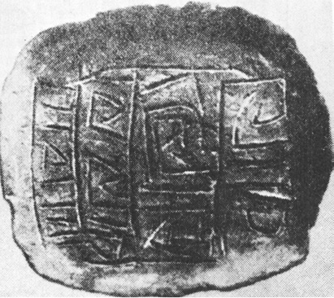

> Člověk už dříve jednal z nevědomosti: nyní si nevědomost vyžadovala vysokou daň. Van Allenovy pásy, prstencovitá pole záření kolem zeměkoule, byly jadernými výbuchy mocně aktivovány. Radiační pásy počaly pulsovat, stahovat se a opět roztahovat. Viditelný efekt těchto poruch byl pramalý a omezoval se zejména na efektní polární záře, viditelné až v severní Africe. Účinky pro život na Zemi byly daleko trvalejší. Biosféra byla skropena dvěma krátkými, ale řádnými sprškami tvrdého záření. Dlouhodobé výsledky těchto vysokých dávek záření nebylo lze dosud, sotva rok po události, předpovědět. Avšak bezprostřední výsledky byly zřetelné ažaž. Většina obyvatelstva Země dočasně onemocněla příznaky nemoci, podobné chřipce a spojené s dávením. Děti utrpěly nejvíce. Mnohé – jako Frank – zemřely, jiné pozbyly vlasy nebo nehty. Většina těhotných žen potratila nebo porodila zrůdy. Zvířata, zejména žijící pod širým nebem, trpěla stejně. Zprávy z afrických rezervací hlásily, že velká zvířata byla těžce postižena. Jen polární tur pižmový a plachý sob netrpěli, jak se zdálo, žádné škody. Vysoké procento – odborníci mluvili o 85 % – domácích koček a psů onemocnělo rakovinou a prašivinou a muselo být utraceno.

> To všechno byla lekce, kterou jsme se měli naučit už dávno, pomyslel si Artur. Nikdy nevěřit bandě všivých politiků, že obstarají myšlení za nás. Měli mít alespoň dost rozumu, aby své prokleté bomby odpálili na Měsíci…

BRIAM W. ALDISS: GREYBEARD, 1964 

> Tvář Země odhaluje povrch naší planety, její vnější oblasti, které ji oddělují od kosmického prostředí. Tato tvář Země stává se viditelnou díky světelným paprskům nebeských hvězd, které ji pronikají, a v prvné řadě paprskům Slunce. Ze všech bodů nebeských prostorů dostává nekonečný počet rozmanitých záření, z nichž námi viditelné světelné záření tvoří nepatrnou část. Dosud známe jen malý počet neviditelných paprsků. Sotva si začínáme uvědomovat jejich rozmanitost, chápat, nakolik naše představy o světě těchto záření, která nás obklopují a pronikají k biosféře, jsou kusé a neúplné, uvědomovat si jejich základní význam, který náš duch, navyklý na jiné obrazy Vesmíru, sotva dovede chápat.

V. I. VERNADSKIJ: BIOSFÉRA, 1929

> Věřím nyní, že události v přírodě jsou řízeny přísnějším a závažnějším zákonem, než jaký uznáváme, když mluvíme o tom, že jedna událost je příčinou jiné. Jsme jako dítě, které posuzuje báseň podle rýmů a neví nic o rytmické skladbě. Nebo se podobáme začátečníku ve hře na klavír, který váže jednu notu jen k té předcházející nebo právě následující. V určité míře by to docela dobře stačilo, kdyby se tak přehrávaly velmi jednoduché a primitivní skladby; rozhodně by se to však nehodilo pro interpretaci Bachovy fugy.

ALBERT EINSTEIN

Ne – van Allenovy pásy nevzplanou, alespoň to podle všech fyzikálních předpokladů neočekáváme. Přesto však projevil Brian W. Aldiss slušnou dávku až děsivé jasnozřivosti a naznačil jednu z možností sebezničení lidstva jemnějším a důvtipnějším způsobem než vulgárním kobercem atomových a termojaderných bomb: porušením magnetického pole, magnetosféry naší planety.

  

K umělému porušení magnetosféry, naštěstí nikoli trvalému, již došlo. Mementem pro svět by však měla být skutečnost, že zjištěné výsledky byly pro vědce překvapením a naprosto se vymykaly i nejodvážnějším odhadům. Hrátky s jadernou energií, především s jadernými výbuchy, na základě pouhých extrapolací laboratorních pokusů, by se nemusely vyplatit.

Již po prvních jaderných výbuších ve velké výšce (tři americké jaderné, patrně vodíkové bomby, vypuštěné v rámci projektu Argus, velkorážové sovětské bomby v říjnu 1961) bylo zřejmé, že kromě rozptýlení značného množství lithia ve stratosféře dochází i k výrazným poruchám magnetického pole, hlásícím se polárními zářemi, poruchami rozhlasového příjmu atd. Mnozí vědci varovali před dalšími pokusy tohoto druhu jako nebezpečnými a co do výsledků nepředvídatelnými. Proti generálům se ovšem ani tentokráte neprosadili. Američtí odborníci se shodli na nezbytnosti dalšího pokusu, jenž by měl prokázat nebo vyloučit možnost ovlivnění, resp. úplného vyřazení několika pásů americké radarové obrany umělými polárními zářemi, vzniklými vysokými výbuchy jaderných náloží.

Pokus byl pečlivě připraven a již 29. července 1961 byla v jeho rámci vypuštěna umělá družice Injun I (doba oběhu 104 minuty, vzdálenost oběžné dráhy od Země 890 až 1010 km), konstruovaná k měření intenzity záření v oblasti vnitřního van Allenova pásu. Fungovala uspokojivě a hlásila na Zem hodnoty mezi 700–1200 elektronů a protonů za sekundu.

Teprve za rok, 9. července 1962, se po několika nezdarech Američanům podařilo uskutečnit stratosférický výbuch větší atomové bomby ve výšce 320 km poblíže Johnstonova ostrova asi 1200 km od Honolulu.

V okamžiku exploze byl Injun 886 km vysoko, minul místo exploze a blížil se nad Tichým oceánem břehům Kanady. Za 45 minut míjel jižní Rhodesii – a již začalo překvapení: počet registrovaných a hlášených částí se zvýšil za tuto krátkou dobu desateronásobně a dosahoval 11 000 částic cm2·s−1. Hodinu po explozi přibylo v geo­magnetickém poli Země 1024 elektronů. Dokonce i v blízkosti Země, kde byla dříve registrována průměrně jedna částice záření za vteřinu, hlásil Injun kolem stovky částic s energií, schopnou prorazit i olověné kryty jeho přístrojů. Země byla až do výšky 600 km obklopena pásem intenzivního záření, jež mj. dokázalo těžce poškodit i pancířem chráněnou přístrojovou komoru satelitu Ariel již za 20 vteřin po explozi, ačkoli se tato britsko-americká družice vznášela v okamžiku výbuchu 7400 km vysoko a byla tedy od exploze vzdálena více než 7000 km.

Poruchy magnetického pole se lavinovitě zvětšovaly, nastala jakási jeho pulsace, výkyvy intenzity v intervalech asi osmi minut.

Závěrem bylo konstatováno, že elektrony dodané do geomagnetického pole Země vytvořily dvacet minut trvající pás aktivity záření kolem naší planety s maximy podél 20° severní i jižní šířky. Elektrony vnikly až 30 000 km hluboko do magnetosféry, dosáhly tedy a překročily i druhý, zevní van Allenův pás. Záření pokleslo k normálu teprve za tři dny po pokusu.

Výsledky řádově překročily očekávání. Kromě zničení obou jmenovaných družic, k experimentu záměrně použitých a chráněných (Ariel se odmlčel čtyři dny po explozi, Injun I byl těžce poškozen a jeho údaje se staly nespolehlivými), doplatily na výbuch naprosto neplánovaně i dvě nevinné navigační družice Transit 4b a Traac, jemuž olověná ochrana počítače prodloužila „život“ toliko o měsíc. Vážně poškozeny byly i sluneční články komunikačního satelitu Telstar, vrcholu tehdejší spojovací a kosmické techniky, a – ač se o tom nepsalo – zaniklo i několik tajných zpravodajských družic USA.

F. L. Boschke, z jehož knihy (1965) převážnou část údajů o tomto pokusu čerpám, nepřipojil vlastní stanovisko, lze je však snadno vycítit: podobné experimenty jsou hrou s ohněm uprostřed hořlavin, o jejichž vlastnostech nejsme dost informováni…

Dnes už ovšem omluva neznalosti neplatí, a co více: přesvědčili jsme se o překvapujícím vlivu zdánlivě bezvýznamných faktorů na pozemskou ionosféru, například s důsledky jejich působení pro přenos rádiových signálů apod. Ještě před několika lety by žádný astronom neuvěřil, že rádiové záření vzdálených hvězd může mít jakékoli měřitelné účinky na naši planetu, a přece tomu tak je. A nejen to. Skupina vědců, pracujících při laboratoři nukleárních věd v Cambridgi (USA) ve spolupráci s kolegy v New Delhi zjistila, že občasné, asi půlhodinové vzplanutí zdroje X paprsků v souhvězdí Štíra, nazvaného SCO XR-1, jenž se nám pravděpodobně jeví jako slabá, pouhým okem zcela neviditelná hvězdička 12. či 13. magnitudy, vzdáleného patrně plných 170 parseků, ionizuje pozemskou ionosféru podobně jako silnější sluneční erupce, vyvolávající tzv. Dellingerovy efekty. V zájmu úplnosti informace dodávám, že jejich zjištění nebylo přijato obecně a bez odporu.

X-zdrojů je dnes ve vesmíru známo již dvě stě – rádiové mlho­viny, kvasary, zbytky po supernovách, některé horké hvězdy, některé pulsary a dvojhvězdy (L. Křivský), případně i zbrusu nové a dosud nepotvrzené typy objektů. Všechny tyto zdroje, jak se zdá, působí zprostředkovaně měřitelnou ionizací nejbližšího okolí naší planety, aniž můžeme s jistotou pronést konečný soud např. o jejich biologickém, meteorologickém nebo jiném působení. Tím spíše je ovšem třeba varovat se zásahů, brutálně měnících koncentraci elementárních částic v ionosféře prostředky, jimiž dnes disponují vojska atomových mocností.

Lidstvu ostatně hrozí nebezpečí i ze zcela pravidelného a jakžtakž poznaného vývoje naší Země, nenarušeného žádnými schválnostmi. Je podivné, že se o tomto aspektu více nepíše a nemluví – patrně proto, že ruší idylický dojem, jako by lidstvo uzavřelo s Prozřetelností jakousi generální pojistku, zajišťující mu budoucnost tím světlejší, čím varovnějšími příznaky překypuje přítomnost.

Časovanou pumou, skrytou v naší planetě, jejíž zápalník měl už vlastně dávno odpálit nálož, je periodicita změn směru magnetického pole naší planety.

Magnetické pole, obklopující naši Zemi, chrání mj. všechno živé na jejím povrchu před účinky pronikavého kosmického záření, jehož podstatnou část odchyluje a nutí vytvořit v uctivé vzdálenosti 1000–50 000 km již zmíněné radiační van Allenovy pásy, ohrožující sice do jisté míry kosmonauty (Discoverer XVII se vrátil na Zemi značně radioaktivní), avšak pro „přízemní“ život nekosmonautického zbytku lidstva neškodné; naopak obyvatelům poblíže severního magnetického pólu a při značné aktivitě Slunce dokonce i daleko jižněji poskytují pohled na polární záře.

Van Allenovy vnitřní pásy objevil zcela neočekávaně Explorer I, startující 1. února 1958 s úkolem registrovat intenzitu záření všeho druhu. Občasné selhávání počítače vysvětlil správně tým fyziků iowské univerzity, vedený J. A. van Allenem, jako přetížení počítače, schopného registrovat a oznamovat jen postupně dopadající částice, a v určitých úsecích své oběžné dráhy, ve výšce od 348 km do 1170 km nad povrchem Země, vystaveného příslušným dávkám. Domněnku potvrdili sovětští vědci. Později byl pomocí vesmírné sondy Pioneer III zjištěn další, tzv. zevní van Allenův pás, vzdálený asi 25 000 až 50 000 km od středu Země, popsaný ovšem už dříve Vernovem a jeho týmem v SSSR.

Magnetometrické analýzy vzorků hornin, vyňaté z hloubky až 6000 metrů, dokázaly, že za posledních 75 miliónů let (starší vyvřelé horniny, trvale zachovávající po ztuhnutí původní orientaci magnetického pole, nebyly dosud zjištěny) se naše Země „přepólovala“ výměnou magnetických pólů celkem 171krát. Přibližně v dnešní poloze setrvávalo magnetické pole průměrně 420 000 let, v opačném směru působilo vždy asi 480 000 let. K poslednímu „otočení“ došlo však již před 700 000 lety; takové opoždění bylo zjištěno za zmíněné období 76 miliónů let teprve patnáckrát. Lze tedy očekávat, že v nejbližší době, geologicky vzato každým okamžikem, lidskými měřítky každým stoletím nebo tisíciletím, nastane změna, další periodické přepólování, jemuž bude patrně předcházet podstatné oslabení, ne-li dokonce dočasné vymizení magnetického pole naší planety, a tím i období, v němž budou pronikavé kosmické paprsky nerušeně dopadat na povrch Země se všemi důsledky pro život, především pro zárodečnou hmotu.

Poslední výsledky, uveřejněné např. R. L. Wilsonem z Liverpoolské univerzity roku 1972 nebo jeho spolupracovníkem J. Shawem, publikované roku 1975, potvrdily opakované změny polarity zemského magnetického pole (podle jmenovaných autorů průměrně dokonce každých 200 000 let) – zároveň však značně zpochybnily naše dosavadní představy o vzniku a charakteru tohoto pole.

Dosud převládá mínění, že zemské magnetické pole je vytvářeno jakýmsi nitrozemským samobudicím dynamem ve fluidním, tekutém kovovém jádru planety. Menší část vědců vidí jeho zdroj v mimozemských oblastech kosmu, resp. atmosféry. Pokusy s laboratorními dynamy prokázaly, že i samovolné přepólování je možné a že se přihází. Překvapení se dostavilo při studiu islandských láv, které mělo odpovědět na otázku, co se s geomagnetickým polem děje v době přechodu z jednoho směru do druhého, zda poklesá na nulu a pak znovu vzrůstá v opačném směru, nebo zda se dipól prostě otáčí o 180°.

Islandské lávy odpověděly. Obvykle v průběhu inverze polarity klesá intenzita magnetického pole (dnes asi 0,5 Oe, přičemž 1 Oe – 79,6 A/m) asi na ⅕ výchozí hodnoty a dipól je orientován do přechodných směrů. Po výměně míst dipólu intenzita vzrůstá na původní hodnotu, přičemž celé období inverze je mnohem kratší než období stability. Ani to nebylo překvapením. Překvapující bylo zjištění, že dipól může být silný i v přechodních orientacích, např. na rovníku, a že existoval metastabilní stav v období, kdy zde byl orientován a kdy tedy jeho směr svíral úhel 90° se zemskou osou. V tomto období prokázala intenzita magnetického pole Země ostrý vzrůst a i v této nezvyklé poloze dipólu dosáhla hodnoty 0,4 Oe, tedy příliš vysoké, než aby byla vysvětlitelná lokální anomálií nebo jiným dnes známým možným faktorem.

Jestliže tento metastabilní intermediární stav, zjištěný na Islandu, byl celosvětový (a patrně byl), bude nutno opustit teorii o zemském dynamu a hledat pro vznik magnetického pole Země i ostatních planet jiné vysvětlení.

V zájmu úplnosti musím dodat, že jedno z nabízených vysvětlení vůbec odmítá připustit možnost „přepólování“ zemských magnetických pólů a snaží se výsledky paleomagnetometrie vysvětlit změnami poloh kontinentů, driftujících a otáčejících se na plastickém podloží. Historie lidstva je příliš krátká, abychom podle zkušeností mohli tuto hypotézu přijmout nebo zavrhnout – domnívám se však, že obrovské množství až dosud získaného materiálu tuto domněnku nepodporuje, ba že je s ní v přímém rozporu. A setkává-li se tu a tam s odporem a námitkami i Wegenerova teorie kontinentálního driftu, podle níž se prakontinent Gondwana rozdělil v jednotlivé kry, které velebně doputovaly na svá dnešní místa, tím spíše ani nelze přijmout představu zemědílů, otáčejících se jako na obrtlíku a ještě ke všemu synchronně jako ozubené soukolí.

V žádném případě se tyto vcelku ojedinělé hlasy nesmějí stát – ač je k podobné reakci lidská přirozenost nakloněna – zdrojem úlevy a šťastného povzdechu, že je tedy všechno vlastně planý poplach a že se můžeme nadíti nekonečného klidu a pohody. Spolehlivé zjištění zdrojů zemského magnetického pole zůstává pro lidstvo nezbytností a jedním z aktuálních vědeckých úkolů.

Tuto nezbytnost ostatně naznačily již výsledky, odeslané na Zemi první úspěšnou kosmickou sondou, vypuštěnou k Merkuru, Marinerem X, jež se k cílové planetě přiblížila 29. 3. a 21. 9. 1974. K překvapení astronomů objevila magnetické pole Merkuru i jeho magnetosféru. Byly zjištěny i náhlé změny magnetického pole při průchodu Marineru různými zónami, vytvářenými interakcí magnetosféry se slunečním větrem (tj. proudem částic, především protonů, vysílaných Sluncem a překonávajících jeho gravitaci). Bude-li to potvrzeno, přesněji řečeno, není-li magnetické pole Merkuru indukováno pouze slunečním větrem (ale vše nasvědčuje tomu, že není), pak bude opravdu třeba hledat novou teorii jeho vzniku. Tradiční představa o planetárním dynamu se totiž hodí pouze pro planety rychle rotující s určitou precesí; Merkur, jak bylo zjištěno radarovým pozorováním roku 1965, se otáčí jednou za necelých 58,6 dne. (Tato skutečnost dosud nepronikla ani do povědomí, ani do učebnic, kde se stále tvrdošíjně traduje omyl o synchronní rotaci Merkuru, tedy o jeho ustavičném „nastavování jedné tváře“ Slunci.)

Uvedené výzkumy by ovlivnily do jisté míry i naše úvahy. Závažnější a upřímně řečeno praktičtější zjištění však je, že patrně k přepólování Země právě dochází, a to neočekávaně prudce. Americký geofyzik K. McDonald z Kalifornské univerzity vypočítal, že za posledních 300 let klesla intenzita magnetického pole o 15 %, od roku 1830 o 6 %. Podobné výsledky získal prof. Manfred Siebert z Geofyzikálního ústavu v Göttingen: odhaduje pokles intenzity magnetického pole o 5 % za 100 let.

Extrapolací zjišťujeme, že by při trvalém ústupu nezměněným tempem poklesla magnetická ochrana Země na nulu v roce 3900 – avšak již kolem roku 3400 nebude schopna zachycovat tvrdé kosmické záření, rozhodujícím způsobem ovlivňující genetické procesy.

Vědci, např. dr. Dietrich Beischer, zabývající se působením magnetického pole na organismy, se předstihují v pesimistických prognózách co do budoucnosti života na naší Zemi, a to i kdyby nebyla vystavena sprškám tvrdých paprsků. Samo odpadnutí magnetického pole je totiž zdrojem nežádoucích genetických změn. Spolu s ozářením by mohlo mít tragické důsledky především pro nejvyšší živočichy, mezi nimi pochopitelně i pro člověka, a to tím spíše, že podle nových výzkumů kostní dřeň savců, poškozená pronikavým zářením a ustávající produkovat krvinky nebo produkující jejich zrůdné, funkčně méněcenné formy, regeneruje daleko rychleji v sil­ném magnetickém poli, které dokonce umožní přežít i pokusným zvířatům, ozářeným smrtelnou dávkou. Při odstínění magnetického pole je tomu naopak. Zdá se, že dnešní empiricky zjištěné přípustné dávky ozáření jsou již do jisté míry výsledkem spolupůsobení zemského magnetického pole s produktivitou kostní dřeně a při jeho vymizení by musely být značně sníženy. Pro plazy a hmyz by mohl tento stav znamenat naopak urychlení vývoje – což je slabá útěcha i pro nejnesobečtější z nás. Stěží nás může utěšit i ujišťování jiných vědců, že i při úplném vymizení ochranných pásů by pronikavá radiace byla z 95 % pohlcována atmosférou a množství korpuskulárního i jiného záření, dopadající na zemský povrch, by se zvýšilo o pouhých 5 %. Tyto výpočty jsou nedůvěryhodné a sám mechanismus značně komplexní, rozhodně složitější a v důsledcích fyziologicky účinnější.

Moji myšlenku ostatně potvrzují výsledky badatelů Archeologického ústavu Akademie věd SSSR, publikované na samém sklonku roku 1976. Tým vedený Maťušinem dokonce vyslovil názor, že geo­magnetická inverze a s ní spojené zvýšení radioaktivního pozadí je periodicky se opakujícím rozhodujícím mutagenním faktorem, který „stvořil“ před milióny let prapředky člověka, opolidi a předlidi, snad dokonce i za účasti zemního záření ložisek uranových rud. Paleomagnetické inverze měly – podle tvrzení Maťuškinova kolektivu – rozhodující význam při proměně pračlověka a opočlověka v Pitecanthropa, neandertálce a posléze druh Homo sapiens sapiens. Klíčové etapy těchto proměn spadají do období inverzí.

Sovětští badatelé jsou si vědomi rozporu tohoto tvrzení se základní myšlenkou vývojové teorie a polidštění „opice“ (správněji společného prapředka opic a hominidů) prací a doporučují v tomto smyslu obecnou teorii doplnit: zatímco používání nástrojů i jakási jejich výroba je u nižších primátů jevem náhodným, nesystematickým a oželitelným, stalo se po rychlé genetické změně, indukované zvýšeným zářením, pro člověka a jeho předky podmínkou sine qua non, chtěl-li jako druh přežít. Sama genetická proměna byla danajským darem a beze změny životního stylu by vedla k rychlému podlehnutí „nahé opice“ v kruté konkurenci raných čtvrtohor, kdy vzpomínky na „třetihorní ráj“, oplývající životem živočišným a rostlinným, a tedy i potravou, byly už jen dávnou minulostí.

Dnes již zkrátka nikdo nepochybuje, že magnetické pole ovlivňuje živé organismy všeho druhu, nejen věřící nositele magnetických náramků. Není to nic podivného ani neočekávaného – bioproudy rostlin i živočichů indukují kolem všeho živého elektromagnetické pole, integrující a nevyhnutelný doprovod všeho života (smrt je dnes, jak víme, konstatována vymizením akčních proudů mozku na elektroencefalografickém záznamu, nikoli zastavením dechu nebo tepu), které je opět pozměňováno jak působením siločar magnetosféry Země, tak případně magnetickým polem umělým.

Roku 1975 se podařilo kolektivu vědců z oddělení nízkých teplot Ústavu jaderné fyziky ČSAV v Řeži změřit např. pulsující magnetické pole lidského srdce, což je světový úspěch, s ním se smí pochlubit jen velmi málo pracovišť. Supravodivý kvantový magnetometr, s nímž bylo měření provedeno, umožňuje zaznamenat magnetická pole slabší než milióntina magnetického pole zemského – kromě lékařskodiagnostických aplikací nalezne své použití jistě i v planetologii a užité kosmonautice.

U rostlin byl zjištěn magnetotropismus (A. V. Krylov), ohýbání kořínků některých druhů převážně k jižnímu pólu a rychlejší růst takto situovaných jedinců (prof. Kogan). Mouchy „přistávají“ naprosto většinou kolmo na směr magnetických siločar. Prvoci, např. trepky, Paramecia, jeví magnetotaxi, pohyb k jednomu pólu, zrychlující se úměrně se zesilováním síly magnetického pole. U ryb lze změnami magnetického pole vyvolávat nebo tlumit podmíněné reflexy (J. A. Holodov), jsou tedy bezesporu disponovány tyto změny registrovat. Podobně reagují holubi – ostatně nejistota poštovních holubů v oblastech geomagnetických anomálií nebo nad elektrárnami s mohutnými generátory je dávno známá. Umělé magnetické pole prodlužuje u žab interval mezi smyslovým podnětem a reakcí až o 53 %, a může dokonce vést ke kataleptickému stavu pokusného zvířete. Také člověk jeví měřitelné biologické změny, je-li vystaven umělému magnetickému poli: počet leukocytů narůstá a zvyšuje se jejich aktivita, srážlivost krve klesá právě tak jako rychlost sedimentace červených krvinek; snad se změnou elektrických a magnetických vlastností erytrocytů. Tyto změny, ač jistě druhotné, by mohly mít příznivý vliv na některé srdeční a cévní choroby.

Vymizení a následné obrácení magnetického pole Země jistě nezpůsobí vyhynutí všeho života – jinak by se to již bylo v dějinách naší planety nejednou stalo. Může však vést ke značným a pro člověka tragickým změnám. Při poslední repríze této události se – ne náhodou – Homo sapiens objevil. Bude na něm, aby v geologicky nesmírně krátké budoucnosti neustoupil na takzvané scéně světa a svou roličku, vlastně pouhý „štěk“, neuvolnil jiným hercům.

Prostředky jsou v podstatě dva: zachování magnetického pole Země jiným způsobem, než jak to činí sama naše planeta, případně jeho nahrazení jiným ochranným štítem. Dalším východiskem by byla stabilizace dědičných vlastností člověka tak, aby nebyly zářením porušeny. Ať tak či onak, bude tento úkol před lidstvem stát v dohledné době, takže by si novorozené genetické inženýrství, z mnoha stran ovšem napadané, mělo pospíšit. Doufejme, že nic nebude bránit jednotné akci, poprvé snad zachraňující člověka jako druh.

Tento případ ohrožení není zdaleka jediný, i když je jedním z nejaktuálnějších; lze dokonce mluvit o štěstí, že se opět jednou „zpozdil autobus“ a že kosmické záření nezasáhlo bezbranné lidstvo v období bouřlivého vývoje, probíhajícího před několika desítkami tisíc let. Můžeme se jen dohadovat, jaké následky by také bombardování pronikanými částicemi mohlo mít – nesporně je však známkou bujarého ducha a nezkrotného optimismu domnívat se, že by biologicky směřovaly ke kladným a vývojově žádoucím genetickým změnám.

Se vstupem člověka do vesmíru nastal bouřlivý rozmach snah o pochopení vzájemných souvislostí geologické historie naší planety a vnějších kosmických procesů, považovaných donedávna za astronomicky sice zajímavé, pro vlastní život lidstva však pramálo významné. Některé aspekty kosmických vlivů na Zemi propracovali např. sovětští geologové Ličkov, Nalivkin, Lungergauzen a další. Závěry nejsou příliš potěšující. Geologové ve spolupráci s astronomy věnovali mj. pozornost roli, kterou může hrát pohyb naší sluneční soustavy kolem středu Galaxie.

Navzdory mimořádně vysoké rychlosti asi 250 km·s\-1 (vztažené k nehybnému uměle konstruovanému systému souřadnic, procházejících rotační osou Galaxie) trvá jen jeden „galaktický rok“, jeden úplný oběh naší soustavy a s ní pochopitelně i Země kolem středu Mléčné dráhy 230 miliónů let. Naše planeta je tedy mladice, stará sotva 20 galaktických let, jestliže její věk odhadneme asi na 5 miliard let (4,6) slunečních. Svou geologickou minulost však až dosud poměrně úspěšně tají, takže její život můžeme podrobněji sledovat pouze v posledních 600 miliónech let, po tři galaktické roky. A ejhle! Vždy ke „galaktickému Novému roku“, k okamžiku, kdy se naše Slunce i s věrnou rodinou planet ocitá nejblíže rotačnímu středu Galaxie, dochází na Zemi ke geotektonickým bouřím, lámajícím kůru, otevírajícím vulkány a zdvíhajícím nové horské masívy. Toto vzplanutí geologické aktivity trvá 10–15 miliónů let – pak se opět gigantické horotvorné síly víceméně uklidní a vyčkávají až do dalšího oživení v „bodu obrátky“ Země (perigalaktiku) na dráze kolem středu Galaxie.

K prvému galaktickému Novému roku, k němuž jakžtakž můžeme geologickými metodami dohlédnout, došlo ke kaledonskému vrásnění, jehož stopy jsou dnes již takřka setřeny. Eroze i pokles pevninských ker snížily skandinávské velehory, strmící zprvu do výšky 6000 i více metrů, na jejich dnešní úroveň. Druhý galaktický Nový rok přinesl hercynské vrásnění, kdy vznikal pra-Ural, středoasijské masívy pra-Ťanšanu a Appalačské pohoří. Poslední oblet jádra Galaxie vyzdvihl Alpy a Himálaj. Podle akademika N. Strachova vytvořilo např. hercynské vrásnění „… v podstatě to nerostné bohatství, kterým v současnosti SSSR disponuje…“ Někteří autoři kaledonské i hercynské vrásnění spojují v jeden orogenní cyklus, což je sice velkorysé, ale patrně nepřesné.

Počátkem každého galaktického roku vznikala mohutná ložiska nafty, jejichž stáří lze dnes datovat. Jsou patrně – jak se dnes značná část vědců domnívá – organického původu. Nesvědčí to snad o velkém, hromadném umírání, jež vystřídalo epochy, překypující životem? Jistě – život ani v těchto etapách nevyhynul a nebyl nucen začít opět od počátku, od beztvarých chuchvalečků aminokyselin.

Dokázal odolnost i později, jak dosvědčili v nedávných letech zejména švédští badatelé, entomolog C. H. Lindroth a geolog T. N. V. Karlstrom. Navzdory donedávna kategorickému opačnému tvrzení geologů prokázali, že přinejmenším v průběhu posledních dvou zalednění existovala malá území, refugia, útočiště, kde přežily četné živočišné i rostlinné druhy, ba dokonce, že tato refugia jsou daleko četnější a rozsáhlejší, než se předpokládalo, a to i v místech značně severně položených, např. na aljašském ostrově Kodijak, kde se na jednotlivých skalách, nunatacích, zachoval z předledové doby terrestrický nelétající střevlík, nebo na Islandu. Toto refugium je tím zajímavější, že těsně hraničí s největším islandským ledovcem Vatnajökullem. Zachovaly se zde rostliny subarktické povahy, křoviny, a dokonce stromová bříza i četné druhy živočichů.

Prokázal daleko větší odolnost, když Země přitáhla z vesmíru bývalou planetu Měsíc a podřídila ji svému gravitačnímu poli, což mělo za následek katastrofu planetárního, globálního rozsahu, kdy se příbojové vlny světového oceánu valily od pólu k pólu, zalévajíce i nejvyšší vrcholky velehor a drtíce vahou miliard tun vše, co se jim postavilo do cesty. Tehdy byl ovšem život omezen jen na oceány, byl primitivní, a oč primitivnější, tím vzdornější a hůře zranitelný – ale i tak. Nové teorie o původu Měsíce, vlastně starší Gerstenkornova teorie, upravená a doplněná Singerem z Virginské univerzity, předpokládá pro „ulovený“ Praměsíc dráhu s perigeem kolem 10 000 km nad povrchem Země. Vznikaly nepředstavitelné slapové síly, které deformovaly nitro Země a zvyšovaly její teplotu, zrodily vulkanismus a uvolnily množství plynů, jež se zachytily v atmosféře a v oceánech. Praměsíc dopadl ještě hůře – byl rozerván a jeho části se později znovu spojily v Měsíc, záhy poznamenaný impakty vlastních, dceřiných střepin značných rozměrů, které nepochybně tu a tam zasahovaly i Zemi se všemi příslušnými efekty.

Toto vše se odehrálo asi před dvěma miliardami let, kdy život na Zemi již nejméně jednu nebo dvě miliardy let existoval… (A opět budiž pro úplnost informace poznamenáno, že jiné teorie přisuzují Měsíci stáří 4,5 miliardy let a soudí, že bombardování impaktními úlomky větších rozměrů skončilo nejpozději před 3,9 miliardy let – život, s výjimkou nejjednodušších forem, by byl tedy radovánek, spojených se zachycením Měsíce, ušetřen.)

Zjištěné tři epochy zvýšené horotvorné činnosti však již v každém případě zastihly živou hmotu diferencovanou v nesčetné druhy rostlin a živočichů a dobře souhlasí se „změnami dekorací“ flóry i fauny, určujících geologická období, jež se zachovala ve fosiliích, vydávajících svědectví o ztracených hlubinách času a o jeho mrtvých, hromadně zahynuvších svědcích.

To nelze vysvětlit jen vrásněním, jež probíhalo vcelku zvolna, nepozorovaně, jen občas a místně doprovázeno mohutnými vulkanickými erupcemi nebo náhlými tektonickými zlomy, způsobujícími katastrofální zemětřesení. Vrásnění je ostatně jen výsledkem působení nám dosud neznámých sil, jejichž účinky byly nepochybně širší a možná pro život daleko zhoubnější než pouhá horotvorná činnost, kterou dnes můžeme retrospektivně zjišťovat. Do hry jistě nevstoupilo jen předpokládané zvýšení úhlové rychlosti Země, vyvolávající napětí uvnitř planety a zesilující tak tlak podzemních sil, ale i mocné gravitační pole centra Galaxie, pronikavé záření i další energie těžko představitelných hodnot.

A nejen síly. Jedním z faktorů, periodicky ovlivňujících poměry na povrchu naší planety při obězích kolem centra Galaxie jsou, podle mínění W. H. McCrea z univerzity v Sussexu, oblaka galaktického prachu, ve skutečnosti mračna poměrně koncentrovaných plynů, vyskytujících se při přední hraně ramene naší Galaxie. Stlačování mezihvězdného plynu je podle McCrea jakýmsi předembryonálním stavem velmi mladých hvězd, které v těchto oblastech posléze vznikají a vlivem tlaku je opouštějí, zaujímajíce místo ve spirálovém rameni Galaxie. McCrea se domnívá, že při průchodu slunečního systému tímto oblakem dochází na Zemi k ledovým dobám, a to v poměrně pravidelných intervalech asi sto miliónů let – předpokládá tedy oběh rychlejší než většina ostatních autorů.

McCreaova domněnka je ovšem stejně spekulativní jako všechny ostatní modely, snažící se vysvětlit mechanismus vzniku ledových dob – dostalo se jí však jisté podpory díky výsledkům houstonské laboratoře pro výzkum Měsíce. Její pracovníci J. F. Lindsay a J. L. Srnka zjistili periodické změny ve složení měsíční půdy v rozličných hloubkách, projevujících se střídáním poměrného zastoupení velkých a malých částic. Lindsay a Srnka se domnívají, že tyto změny jsou projevem opakovaných průchodů Měsíce napříč pásmem galaktického prachu – prokázali i dobrou shodu s McCreaem odhadnutou periodou sto miliónů let (ovšem s výhradou, že v měsíčních půdách nejsou přímá měření stáří možná).

Bez ohledu na stupeň pravděpodobnosti McCreaovy domněnky jsme mu alespoň vděčni za předpověď klidných a teplých sto mi­liónů let, které nám slibuje…

Podobně jako v případě nadcházejícího „přepólování“ magnetického pole Země se však i vzhledem ke galaktickému roku ocitáme těsně před dalšími očekávatelnými maléry – žijeme totiž podle většiny odhadů v jakémsi jeho prosinci „adventu již na krátku a blízko, blizoučko Štědrý den“. Není to sice důvodem k apokalyptickým úvahám ani k překotnému zbavování se majetku – do galaktického Silvestra prý zbývá 12 miliónů let, což je pro nás takřka nepředstavitelná doba, ve vývoji druhu však reprezentuje toliko třetinu trnité cesty člověka od opočlověka a předčlověka k hvězdám pop-music, a geologicky sotva dva galaktické týdny…

Kromě cyklických, a jak se z obou uvedených příkladů zdá, nevyhnutelných období ohrožení života dochází patrně čas od času k neperiodickým a nepředvídatelným „kosmickým útokům“, podle intenzity a kvality agens ohrožujícím, ba v krajním případě vyhlazujícím život nám známého bílkovinného typu rozličnými škodlivinami. Mohl bych se odvolat na hypotézy o vyhynutí ještěrů ve svrchní juře, připsané německým paleontologem Schindewolfem i jinými autory prudkému zvýšení kosmického záření vzplanutím blízké supernovy. Podobných případů je však v historii naší planety daleko více. Pro příklad nemusíme daleko – jen asi o 250 miliónů let zpět na rozhraní permu a triasu, nazývaného poněkud zastarale permotrias, kdy se na Zemi udály podivné a dodnes uspokojivě nevysvětlitelné věci, hluboce se dotýkající samotné existence života. Bylo to v relativním klidu na hranici dvou horotvorných (orogenních) epoch – hercynské (resp. appalačsko-kaledonsko-hercynské), jež skončila, změnila permské uhelné vrstvy výlevem celých oceánů lávy v tuhu, vyzdvihla kontinenty a snížila hladinu moří zalednění, blokující masy vod (dnešní zalednění Grónska a Antarktidy snižuje nejvyšší možnou hladinu světového oceánu o 70 m), kdyby ovšem nebyly tehdejší klimatické podmínky naprosto odlišné. Již počátkem století napsal o permotriasu geolog Johann Walter v knize _Dějiny života a Země_: „… Jestliže dnes zaujímají pouště dlouhodobě zbavené vláhy ⅕ souše, pak tehdy se téměř veškerá souš nacházela v klimatických podmínkách, které… můžeme pozorovat v nejvyprahlejších pouštích současné doby.“ Walterův závěr zůstal dosud v platnosti. Podnebí permotriasu bylo tak suché a teplé, že dokonce v bezprostřední blízkosti jižního pólu byly jen ojedinělé a nevelké horské ledovce.

Změna klimatu byla doprovázena a podle některých autorů přímo způsobena základní proměnou biologické dekorace, jež proběhla v geologicky velmi krátké době, asi 10 miliónů let, a podle dalších autorů ještě mnohem prudčeji. Po karbonu a vlhkém permu s mimořádně bohatou flórou, jež umožnila vznik většině kamenouhelných ložisek, už není stopy. Hynou tropické lesy kapradin, přesliček a plavuní a pra-tajgy nahosemenných rostlin mírného pásma, po nichž rovněž zůstávají ložiska pečorského a tunguzského uhlí. Souše Země se mění v obdobu dnešního Marsu, jak si ho alespoň představujeme: pouště, kde vichřice přesýpají rudé písky, mezi nimiž živoří skromný a ojedinělý život; svědectvím jsou mocné vrstvy rudých pískovců. Ještě daleko výraznější a podivnější však byly změny, které postihly faunu.

Poměrně dlouhá epocha předchozího klidného vývoje umožnila obratlovcům dosáhnout významného prahu mezi životem v oceáně a na souši, v biologickém vývoji druhů pak vytvořit formy, jež se jevily jako slibný náběh k progresivnějším savcům. Předcházely mořské rostliny devonu, „zabydlující“ se během pomalého ústupu oceánu na souších, za nimi následovaly ve výletech na pevninu dvojdyšné a lalokoploutvé ryby, přímí předkové obojživelníků. Objevili se labyrintodoni, kotylosauři a pelicosauři, poslední sice podle současného ideálu krásy nijak zvlášť přitažliví, zato však nezávislí na vodě jako životním prostředí, kladoucí vejce s pevným obalem na souš a do jisté omezené míry teplokrevní, tedy s jakousi termoregulací. Počínající vysychání, nastupující po hercynské horotvorbě, zpočátku podporovalo emancipaci suchozemských tvorů od zbytků závislosti na oceánech – vyvíjejí se pareiosauři, a faunistická dekorace souše dokonce umožnila i existenci prvních dravců, teriodontů.

Téměř se zdá, jako by vývoj, tak jak jej dnes známe nebo jak si ho představujeme, měl být nejméně o 100–150 miliónů let urychlen: tvorové, ovládající konec permu dávno před objevením se dinosaurů, therapsidi (krytolebci), byli podle nálezů kosterních zbytků a zubů velmi blízko savcům; neskonale blíže než jejich nástupci, dinosauři. Svědčí o tom i zmíněná termoregulace, doprovázená, jak dnes předpokládají mnozí odborníci (Stebbins a další), vývojem srsti. Zdá se, že po sobě zanechali vzácné a téměř zázrakem zachované potomky v podivné australské fauně, ježuru a ptakopyska, lišící se kostrou i chromozómovou skladbou od ostatních savců tak dalekosáhle, že lze předpokládat jejich přímý původ z velmi starých a dávno vyhynulých druhů.

Vysychání však pokračuje a na souši brzy dochází k takřka panickému návratu do ochranné náruče moří. Suchost vzduchu je neslučitelná s existencí obojživelníků, obdařených vlhkou kůží, mimo vodní prostředí. Mnozí z nich ztrácejí nedávno nabyté plíce, jiní vyhynou nebo se zachrání neotenií, trvalým setrváváním v larválním stadiu, jako dnes např. macaráti, aby mohli žít výhradně ve vodě. Poslední opouštějí souš plazi, měníce se v mořské hady. Podle německého paleontologa A. Müllera klesá počet živočišných druhů na naší planetě o 27 %, což převážně postihuje i tak dost chudou faunu na souši. Zdá se, že tento odhad je značně podceněn.

Ani dno oceánů však nezůstalo ušetřeno. Ačkoli by se zdálo, že jeho obyvatelům mohlo být celkem lhostejné, co postihlo „dezertéry“ na souši, skutečnost byla opačná: jak se podle nálezů v naplaveninách zdá, hlavní úder byl daleko prudší a postihl navzdory Müllerovu mínění právě živočichy mělkých moří, měkkýše, korály, houby…

Velmi výrazně byl decimován hmyz. Sovětský geolog a paleontolog A. B. Martynov, jehož práce _Étude sur l’histoire géologique et de phylogénie des ordres des Insectes Ptérygotes_, uveřejněná roku 1938, je dnes již klasická, podnikl až dosud nejvážnější pokus o vysvětlení vzniku a vývoje hmyzu, z něhož vyplývá úplné vyhynutí celé plejády hmyzích řádů na přechodu permu a triasu, zatímco vymizení jiných řádů v ostatních geologických epochách je poměrně vzácné a ojedinělé. Je to tím podivnější, že hmyz byl – jak ukazují početné nálezy jeho fosilií – počátkem druhohor již velmi diferencován a znamenitě přizpůsoben životním podmínkám. Dosud nevyvrácená, ač značně modifikovaná teorie vídeňského znalce hmyzí paleontologie A. Handlirsche, zveřejněná v základním díle _Fossile Insecten_ (1908), považuje za přímé předky křídlatého hmyzu trilobity, ovládající moře především v siluru a devonu. Nasvědčují tomu společné znaky – složené oči, tři jednoduchá frontální očka, jediný pár tykadel aj. Podle Handlirschova dosti všeobecně přijatého názoru se hmyzí křídla vyvinula z tzv. pleurálních výběžků trilobitů. Bezkřídlý hmyz je patrně ještě starší – jeho fosilie byly nalezeny v Evropě i v Americe v devonských vrstvách, zatímco nejstarší dosud známá Pterygota (křídlatý hmyz) pocházejí ze svrchního karbonu, např. u nás z ostravských lokalit. Příčina, která dovedla decimovat značnou část této velice perspektivní třídy živočichů (jež by patrně jako jediná přežila i značně intenzívní radiační zamoření), musela být bezesporu závažná a výjimečně působivá.

Planetologie vysvětlující dějiny naší Země a v širších souvislostech i vznik a rozvoj života na ní, se vrací v dílech některých svých představitelů k obdobě zdánlivě dávno odložené Cuvierovy katastrofické teorie dějin Země, ovšem s použitím modernějších rekvizit, než jakými byly v Cuvierově díle střídavé potopy a zhoubná sucha, resp. se snahou tyto pohromy vysvětlovat. J. Schindewolf již zřejmě ztratil veškeré zábrany a domnívá se, že nejen výměna živočišstva a rostlinstva ve svrchní juře, ale i převratná epocha permotriasu, představující zdržení, ba dokonce regresi vývoje živočišstva o mnohé desítky miliónů let, byla způsobena výbuchem nedaleké novy, jež k naší planetě vyslala spršku pronikavého záření, měnícího genetické vlastnosti rostlin na souších i živočichů v mořích, hromadně vyvolávajícího nepříznivé mutace, hynutí, a z toho následující proměnu ještě nedávno porostlé a plodné půdy v pouště.

Sovětský geolog a paleontolog A. Gangnus (z jehož studie čerpám část údajů o permotriasu) není s Schnindewolfovou domněnkou srozuměn, i když ji připouští jako jedno z možných vysvětlení. Zdá se mu, že je demobilizující, že podrývá další zájem o bádání a činí další výzkum zbytečným.

Jako jediný důvod by bylo toto vysvětlení nedostatečné.

Výbuch nov se stal – a v tom je nutné s Gangnusem souhlasit – jakýmsi deus ex machina prehistorie života na Zemi a zdomácněl díky novinářským článkům i v povědomí širší veřejnosti, bohužel většinou v kuriózní a naprosto nereálné formě. Představa, že by pojednou na obloze vzplál sršící uzel ohně, spalující všechno živé jako pronikavá radiace jaderné bomby, je naprosto mylná, a to i při blízkém a mohutném výbuchu. V každém případě by supernova dávno a dávno nejen zhasla, ale byla i zapomenuta, než by (opomineme-li možné účinky ionizace svrchních vrstev atmosféry mohutným tokem ultrafialových paprsků) k nám dospěla chapadla mlhoviny a ponořila naši sluneční soustavu do prostředí s mnohonásobně (až stokrát) zvýšenou hustotou primárního kosmického záření. Při velmi blízkém výbuchu supernovy by uplynulo od spatření děsivého zjevu na obloze k prvním salvám protonů a částic alfa asi 10 000 let a jejich účinek by se projevil daleko zákeřněji a plíživěji.

(Pro zajímavost: zvuk by se, pokud by bylo vůbec jeho šíření vesmírným vakuem možné, ještě poněkud opozdil. Od nejbližší hvězdy Alfy Centauri, zvané Proxima a vzdálené 4,3 světelného roku, by k Zemi letěl 3,8 miliónu let…)

Radioastronomie nám dovolila nahlédnout do minulosti vesmíru – jaksi „dohonit“ prstenec, nebo lépe řečeno sféru neutrálního vodíku expandujícího od okamžiku výbuchu supernovy. Rickard (1968) tímto způsobem zjistil výbuch v ramenu Galaxie v souhvězdí Cassiopey a Persea. Odehrál se před 30 milióny let ve vzdálenosti asi tři kiloparseky od Slunce, tedy v bezpečné vzdálenosti (jak předpokládáme s optimismem sobě vlastním).

Pro historii Země zajímavější objev oznámili kanadští astronomové V. A. Hughes a D. Routledge roku 1972 – objevili další sféru, tušenou již roku 1967 Lindbladem. Její teplota je výrazně nižší než okolí – menší než 100 K. Je patrně zbytkem exploze supernovy, která za uvolnění energie kolem 1053 erg vybuchla poměrně blízko Slunce a – prokletá shoda! – právě na konci druhohor, před 65 milióny let, v období další výměny dekorace pozemské flóry i fauny. Tento výbuch musel zaplavit po určitou dobu naši planetu kosmickým zářením a dalšími složkami pronikavé emise. Oba kanadští vědci uvádějí výbuch této supernovy v souvislost s výraznými změnami životních forem na konci druhohor, a dokonce i s výskytem uhlíkatých sloučenin, zjištěných na Měsíci.

Ani tato kosmická katastrofa, která se odehrála asi ve vzdálenosti 270 parseků (1 pc = 3,26 světelných let), nebyla na Zemi nijak zvlášť nápadná, opomineme-li pravděpodobně velmi malebné polární záře, jednu z posledních radostí, jež byly dinosaurům poskytnuty. Člověk ještě dřímal v lůně budoucnosti. Avšak nenápadnost neznamenala neškodnost.

Radiobiologové vědí, že zářivá energie, spolehlivě usmrcující člověka, by neohřála ani šálek vody. Genetikové se přesvědčili, že pouhý zlomek této dávky je schopen vyvolávat těžké změny pohlavních a zárodečných buněk, sterilitu, odumírání plodu nebo jeho zrůdnost. Paleontologové šli dále a potvrdili možnost velmi složitého, avšak pro zachování rodu osudově zhoubného poškození nejjemnějších mechanismů dávkami ještě podstatně menšími a – dodejme – pocházejícími možná z nov, vzplanuvších pro pozemšťany bez okázalých efektů a iluminací.

Jedním ze zastánců této myšlenky je např. ředitel ústavu pro geologii a paleontologii v Bonnu, profesor Heinrich K. Erben, který se domnívá, že lidstvo může vyhynout naráz (v geologickém časovém měřítku) právě tak jako kterýkoli jiný druh a že nepochybně biologickým automatismem vyhyne, dojde-li k jeho přísně biologické (druhové) specializaci. Nevylučuje ani působení kosmického záření, které podle jeho názoru mohlo být příčinou náhlého vymizení veleještěrů koncem druhohor, a to pozoruhodným biologickým mechanismem, který objevil při průzkumu fosilních praještěřích vajec, nacházených dnes především na určitých místech Utahu, Mongolská a jihofrancouzských provincií Languedoku a Provence.

Erben a s ním i další paleontologové zjistili, že zachovaná vejce, patřící patrně posledním generacím hromovládců jurské doby, mají nápadně silnou skořápku, sestávající až ze sedmi dokonale vyvinutých vrstev. Donedávna byly tyto zřejmě patologické změny připisovány porušení sekrece vápníku změnami podnebí, např. chladem. Erben navrhl pravděpodobnější, i když složitější vysvětlení: porušení vastocinu, hormonu, jenž vyvolává stahy, vylučující vejce opatřené skořápkou z vejcovodu, a způsobuje jeho snesení. Porušení vnitřní sekrece praještěrů zevním agens, nejpravděpodobněji zářením, vedlo k návratu „hotového“ vejce do tzv. istmu vejcovodu, kde bylo znovu opatřeno membránou a po novém vstupu do dělohy další skořápkou atd. – da capo al fine. Je pochopitelné, že dinosauři mládě nebylo schopné proklubat se tak bytelnou rakví, a nemohlo se tedy vylíhnout – ostatně bylo tohoto strašlivého zážitku ušetřeno: již druhá vápenná stěna ucpala póry stěny prvé, takže dinosauře zhynulo v embryonálním stavu nedostatkem kyslíku.

Ani tato domněnka není ovšem bez problémů – počátkem svrchní křídy totiž zatopilo tehdejší šelfové moře Thetys části rozpadlého superkontinentu Gondwany a silné deště teplého a vlhkého klimatu vyplavovaly lehce rozpustné minerály z půdy a odnášely je do moře, kde vznikaly mocné nánosy především vápenatých sloučenin. Vápenné soli se stávaly nedostatkovým artiklem a jejich obsah ve vegetaci klesal, o čemž svědčí známky křivice (rachitidy) na nalézaných kostrách. Proto byly formulovány i další hypotézy, např. hromadná otrava alkaloidy krytosemenných rostlin, jež nahradily rostliny nahosemenné. Také proti nim jsou však námitky příliš silné.

Je ovšem možné, že záření působilo zprostředkovaně, tím spíše, že porucha tvorby vaječných skořápek postihla současně (v geologickém smyslu slova) řadu druhů druhohorních plazů, jak dokazují např. nálezy z jižní Francie. Vlastní příčinou byla porucha sekrece hypofýzy – šokem, infekcí, nejspíše však tepelnou nebo jinou změnou prostředí. Stress je velmi složitý jev a jsme teprve na samotném prahu jeho výzkumu u člověka. Na dinosaury se v tomto ohledu dosud v dostatečné míře nedostalo. Prosíme je však, aby nezavěšovali. Jsou v pořadí. Jejich vyhynutí nám může, podobně jako vyhynutí mamutů v severovýchodní Sibiři, ledacos povědět o minulosti Země, a především varovat nás před eventuálními nepříjemnostmi a hrozbami budoucnosti.

Profesor Erben výslovně připouští možnost stejně fatálního poškození hormonálního metabolismu člověka, možnost tím hrozivější, oč je lidská humorální korelace (patrně) složitější, jemnější a labilnější, než bývala humorální korelace veleještěřích hromotluků.

Gangnus nabízí vlastní vysvětlení, zatím ovšem neúplné a v podstatě rovněž katastrofické, i když nepočítá s primární účastí mimozemských faktorů. Domnívá se, že na počátku řetězu zkázy života v permotriasu bylo odslanění moří ukládáním ložisek soli a sádrovce na dnech moří. Potíž vzniká, snažíme-li se vysvětlit, proč k takovému usazování docházelo v geologické minulosti Země a proč je nepozorujeme např. dnes. Jinou svízelí je skutečnost, že v dodnes zjištěných permských ložiscích je asi čtrnáctkrát méně soli, než by bylo zapotřebí k poklesu slanosti oceánů, alespoň o ½ %, což by již mohlo mít závažné následky biologické i klimatické. K tomu by však bylo třeba odčerpat tehdejšímu světovému oceánu asi sedm biliard tun soli. A. J. Fischer se domnívá, že se nasycené solné roztoky slévaly v hlubokovodních proláklinách a teprve dalšími geologickými pochody jimi byla mořská voda „dosolena“ na žádoucí dřívější i dnešní hustotu, zachovanou ostatně jako vzpomínka na oceánské předky i v hustotě krve člověka. Bohužel – i toto vysvětlení postrádá potvrzení a fyzikálně chemické odůvodnění.

Akademik N. Strachov má za to, že hromadný zánik života v permo­triasových mořích způsobilo explozívní rozmnožení anaerobních baktérií, které – jak dnes víme – otrávily až na svrchních 200 metrů hlubiny Černého moře. Strachov se domnívá, že tomu tak bylo v globálním měřítku a že fauna příbřežních mělkých vod byla vyhubena roztokem sirovodíku, produktu těchto anaerobních bakterií. Jeho pozorování, týkající se Černého moře, jsou nepochybně seriózní – vtírá se však myšlenka, zda nebyla příčina zaměněna s následkem, zda naopak vyhynutí bujné a rozsáhlé suchozemské flóry dočasně nezpůsobilo takové snížení podílu atmosférického kyslíku, že nepostačil okysličovat hlubší vrstvy oceánu.

Celkem tedy je patrně hypotéza o supernově, ačkoli vystupuje i zde jako deus ex machina, nejpravděpodobnější.

Proč jsme se zabývali všemi třemi druhy kataklyzmat? Především abychom dokázali, že lidstvu hrozí i z „přirozeného průběhu“ věcí periodická zkáza, jejíž aktuální hrozba se opakuje po statisících či miliónech let, případně nepravidelně a neočekávaně, jako v případě výbuchu nov v blízkosti slunečního systému, putujícího vesmírem. Za posledních tisíc let bylo astronomy pozorováno pět výbuchů supernov v naší Galaxii a podle počtu pravděpodobnosti se Země od svého vzniku ocitla nejméně desetkrát ve spršce kosmického záření z blízké novy, převyšující dnešní, i tak nepochybně biologicky ne bezvýznamnou intenzitu, desetkrát až stokrát. Nejsme schopni kosmické záření na objednávku vyrábět a exponovat jím např. pokusná zvířata – všechny zkušenosti radiobiologů však se shodují na tragických důsledcích, jež by taková expozice, před níž není úniku, měla na zárodečnou hmotu, především na zárodečnou hmotu déle žijících, a tedy vyšších a diferencovanějších živočichů.

Tento fakt může být pro vývoj inteligentních bytostí na kterékoli planetě, podobné Zemi a podrobené podobným osudům, limitujícím. Jestliže kritické období přechodu, nastávající ve vývojové etapě, kdy se jisté perspektivně účelné orgány, návyky nebo vynucené způsoby existence (u člověka např. vzpřímená poloha, uvolnění předních končetin, opuštění bezpečných větví pralesa, přechod do travnatých lesostepí atd.) stávají spíše dočasnou přítěží, proběhne v epoše planetárního neklidu a hromadného hynutí nejzranitelnějších, může být a pravděpodobně bude slibný vývoj takového druhu navždy přerván. Bylo by pošetilé a idealistické domnívat se, že by matka příroda z jakési tvrdohlavosti podnikla totožný experiment znovu – brání tomu i objektivní podmínky. Jurští ještěři, hromovládci své doby, uvolnili přes svou absolutní a nepopiratelnou hegemonii místo na slunci mrňavým a dost ohyzdným Ictidosaurům, podobným myším, a nalézaným dnes v podobě kosterních fosilií v konkrecích pískovců pouště Gobi i jinde. Jejich téměř jediným progresivním znakem byl zvláštní způsob dlouhého embryonálního života mláďat, umožňující větší „vyzrání“ nepatrného mozku. Praještěři zmizeli, ačkoli vládli moři, souši i vzduchu a ačkoli pronikli do všech obyvatelných koutů planety. Dokonce poblíže jižního pólu, v Antarktidě, objevila skupina geologů operace Deep Freeze 1969 až 1970 pod vedením Davida Elliota (členem skupiny byl i český vědec Josef Sekyra) paleontologický nález století: kosterní zbytky praještěra Lystrosaura ve vertikálně uložené lavici triasových pískovců. Byl pravděpodobně jedním z posledních mohykánů… (Nález ovšem neznamená, že by si praještěři oblíbili právě polární oblasti nebo že by nalezený Lystrosaurus byl výstředním milovníkem otužování. Potvrzuje spíš buď Wegenerovu teorii kontinentálního driftu světadílů, spojených původně v superkontinent Gondwanu, jehož součástí byla i dnešní Antarktida, nebo klimatickou proměnu v této oblasti, případně obojí.)

Lystrosaurus ostatně není jediným fosilním plazem, jehož pozůstatky jsou nepietně používány jako argumentační střelivo v diskusi o kontinentálním driftu. Již před řadou desítek let byly jak v Jižní Americe, tak v jižní Africe nalezeny zbytky koster menšího Mesosaura v trasových horninách, starých asi 200 miliónů let. Identifikace však nebyla nepochybná.

Tím bezpečněji však bylo prokázáno, že Iguanodoni a Hypsilophodoni, vyskytující se v britských wealdenských vrstvách starých asi 110 miliónů let, mají vlastní bratry ve formacích podobného stáří v Jižní Dakotě, jihovýchodním Utahu a v Nebrasce (P. Galton a J. Jensen v _New Scientist_, 68, 1975). Padlo zkrátka další slovo do pranice.

Dnešní mobilisté, tj. zastánci teorie kontinentálního driftu, opírající se především o výsledky paleomagnetických výzkumů a o hypotézu konvekčních proudů, přemisťujících pevninské bloky, trvající odpradávna, tj. od prvohor, přibližně ve stejné podobě, právě tak jako oceány, vysvětlující takové nálezy existencí původního superkontinentu Gondwany. Podle J. Tuza a J. T. Wilsona se k jeho jižnímu cípu, tvořenému jižní Afrikou a jižním cípem Amerik, přimykaly kromě Madagaskaru a tehdy ještě geologicky samostatného indického subkontinentu i navzájem sousedící Antarktida a Austrálie. Lystrosaurus by tedy přešel odkudsi suchou nohou, právě tak jako Iguanodoni a Hypsilophodoni.

Protivníci mobilistů, fixisté, zastánci dynamické proměnlivosti reliéfu zemského povrchu i kontur pevnin a oceánů, se snaží nalézt východisko v poměrně pozdní, až druhohorní tvorbě oceánu ve spodní juře, tj. asi před 180–190 milióny let. Jeho vlnám zřejmě náš Lystrosaurus včas unikl, jako Židé, přecházející Rudým mořem.

Spor mobilistů a fixistů je však tak tuhý a temperamentní, že se do něho raději nebudeme vměšovat…

Jen málokterému svědkovi těchto dávných dob se podařilo přežít tak úspěšně jako Sphenodonu, ještěrce z dávno vyhynulého řádu Rhynchocephalia, rozšířené v takřka dnešní formě již před 150 milióny let, kdy dinosauři teprve nastupovali. Přežila díky izolaci na ostrovech Nového Zélandu, kam nepronikli praještěři a až do kolonizace bělochy ani savci.

Malí savčí ohavové se na volné aréně světa, zbaveného jurských příšer, takřka explozivně rozmnožovali a diferencovali v nesčetné druhy, jež v čele s člověkem a krysou ovládli Zemi (i když na to mají možná komáři jiný názor). Jakýkoli pokus o restauraci ještěrů ve větším měřítku musel ztroskotat; všechny ekologické výklenky byly již obsazeny a odevšud se cenily tesáky šelem a zuby žraloků, hrozila kopýtka a parohy…

Myslím, že se sovětský vědec Dmitrij Bilenkin mýlí, domnívá-li se, že druhohorní veleještěři vyhynuli jako oběti savců, lépe přizpůsobených a „vybavených zbraní, která byla účinnější než nejsilnější svaly, nejostřejší zuby a nejtlustší pancíře; tou zbraní byla inteligence… Namísto hrubého násilí nastoupil zápas inteligence. Zvítězili ti, kteří byli lstivější, pohyblivější, přizpůsobivější novým podmínkám, i když byli hůře vyzbrojeni než jejich protivníci. Skvělé důkazy o tom podali naši předchůdci, kteří přemohli jeskynní medvědy, šavlozubé tygry a mamuty.“

Naši předchůdci se ovšem s vyjmenovanými vládci zvířecí říše kvartéru osobně setkali – veleještěři, o nichž sám Bilenkin připouští, že se „ani nejsilnější a největší savci všech dob nemohli pouhou silou měřit s těmito giganty mezozoika“, však zažili na sklonku své éry jen drobné formy savců, kteří své inteligence a přizpůsobivosti mohli nejlépe využít k tomu, aby před obludami s mozkem sice velikým jako tenisový nebo dokonce pingpongový míček, ale zato s vypracovanými reflexy a ostrými zuby i drápy, co nejrychleji utekli. Primitivní savci, současníci posledních jurských ještěrů, neměli prostředky, jak tyto plazy ohrozit, tím spíše, že dnes považujeme celou řadu druhů ještě nedávno vyhlašovaných za býložravé (např. Iguanodoni), za dravce s příslušným dravčím biologickým vybavením i naturelem. Domnívám se ostatně, že na výřadu paleolitického lovu se sotvakdy ocitl šavlozubý tygr. Já bych se mu uctivě vyhnul i se svou dobře nastřelenou kulovnicí. Daleko spíše vyhynul hlady po vyčerpání lovišť člověkem.

V třetihorách byli ovšem savci již zabydlenou a bezkonkurenční skupinou, vylučující jakékoli pokusy zbylých ještěrek, krokodýlů a želv o evoluční návrat k veslu zoologických dějin Země.

Stabilizace druhů nastala v okamžiku optimálního přizpůsobení zevním podmínkám a vývoj pokračoval pak již jen s jejich případnými změnami. Tohoto stavu dosáhly nejprve relativně nejjednodušší organismy. Života a množení schopné baktérie, staré 200–300 miliónů let (pěstované z permských solí, např. Nikolajem Čudinovem z Ústavu mikrobiologie AV SSSR nebo Heinzem Dombrowskim z Neuheimu), jsou shodné s dnes známými a běžnými druhy, např. Pseudomonas halocrenea nebo Bacillus circulans, a mají ovšem své daleko starší, k nerozeznání podobné, ač již života neschopné předky. Třetihorní mravenec Lasius schiefferdeckeri je jak vejce vejci podoben našemu dnešnímu a každému známému druhu Lasius niger, právě tak jako Formica flori dnešnímu mravenci Formica fusca. Anatomie žraloků se stabilizovala již v druhohorách, kdy bylo dosaženo naprosté shody potřeb a prostředků (s výjimkou „nepodařených“ obrů druhu např. Carcharodon megalolon, dlouhých až 20 m). Tak bychom mohli pokračovat velmi dlouhým výčtem druhů anatomicky starobylých a proti dávným předkům nezměněných buď vůbec, nebo jen málo. Jestliže tyto druhy postrádají početnější současné příbuzenstvo, můžeme právem mluvit o „živých fosiliích“. Mezi úctyhodně starobylé druhy patří např. z rostlin ginko (jinan dvoulaločný), z vyšších živočichů dvojdyšné ryby. Mnoho „živých fosilií“ žije v hlubokomořské oblasti – hvězdice Platasterias, plž Neopilina – nebo vůbec v oceánech – mlži čeledí Numulidae a Trigoniidae či ostrorepi (Xiphosura), přežívající již 330 miliónů let od karbonu takřka po všech mořích. Zajímavé je, že „živými fosiliemi“ se staly nejen specializované druhy, kterým se podařilo obsadit některý dosud volný ekologický výklenek s mimořádnými podmínkami, vyžadujícími přizpůsobení, ale i „generalisté“ (dobrým případem jsou právě ostrorepi, konkurující se „specialisty“ raky), těžící ze své univerzálnosti. Pokud se také člověk – doufejme – za dlouhé milióny let stane genetickou stabilitou „živou fosilií“, bude nepochybně zařazen do kategorie generalistů. Vývoj člověka jako druhu, jak se zdá, skončil poměrně velmi brzy realizací optimálního umělého mikroklimatu, přizpůsobujícího zevní podmínky danému biologicky dosaženému stavu organismu a nikoli naopak. Tohoto postupného cíle, jistě nesmírně důležitého, bylo dosaženo, jak víme, šťastnou shodou okolností v intervalu mezi planetárními katastrofami. Exponenciální vzrůst technických možností a vědecká exploze, jejímiž jsme svědky, poskytuje jisté naděje předvídatelným planetárním katastrofám čelit buď přímo opatřeními, směřujícími k jejich likvidaci, nebo – v brzké budoucnosti – emigrací na pohostinnější planetu. Zejména na této možnosti se všichni autoři science-fiction shodují v radostném optimismu, s rozkoší popisujíce šťastná lidská společenství, skotačící pod kupolemi, oddělujícími je od kyanovodíkové atmosféry dotyčné planety. Lidstvu trvalo dosažení této mety potenciálních možností od stabilizace druhu několik desítek tisíců let. Je velmi těžké aplikovat pozemská časová měřítka na cizí vesmírné inteligence. Rodící se exosociologie, zatím ryze hypotetická, však takový přenos připouští.

Existují ovšem i očekávatelné vesmírné katastrofy takového rozsahu, že si dnes ani v nejbujnější fantazii nedovedeme představit lidstvo budoucnosti, čelící jim. Bylo-li koneckonců možné bránit se pozvolnému vyhasínání Slunce, v něž se ještě nedávno – jeden z paradoxů vědy – věřilo jako v jedinou naprosto bezpečnou jistotu budoucnosti, je ochrana proti postupnému zvyšování jeho teploty i ve velmi vzdáleném výhledu mimo perspektivní možnosti – máme tu co činit s energiemi, jejichž ekvivalent, použit v pozemském měřítku v jakékoli formě, by rázem učinil konec všemu životu a patrně i rozrušil kontinuitu celé planety. Přílišný optimismus zde tedy není na místě ani z hlediska fyzikálních zákonitostí, jež nelze beztrestně obcházet, tím méně pak z porovnání s naší vyspělou technikou, na niž jsme tak pyšni. Létáme sice k Měsíci a nemoudře odpalujeme termojaderné nálože, nejsme však dosud schopni řídit fázové změny v oblacích a přimět hydrometeory, jak se dnes říká kapkám, sněhovým vločkám a kroupám, aby se kondenzovaly do velikosti, překonávající výstupné vzduchové proudy, a aby zavlažily žíznící zemi, nebo naopak ochránit např. vinice před krupobitím. Metody, používané v SSSR a ve Francii (vystřelování šrapnelů s účinnou chemikálií do mraků), jsou stále ve fázi počátečního výzkumu.

Jiné katastrofy planetárního měřítka vznikají daleko nenápadněji a projevují se plíživěji a nedramaticky. Některé z nich rovněž – podobně jako spršky kosmických paprsků v mezidobích inverze zemského magnetického pole – působí na flóru i faunu „otevřením nového okna“ do vesmíru a vpuštěním elektromagnetického vlnění takové frekvence, na jakou není pozemský model života vývojem dostatečně adaptován. Jednou z takových možností je ohrožení života na naší Zemi ultrafialovými paprsky.

Mohlo by se to stát mnoha způsoby s jediným finálním výsledkem: podstatným narušením, oslabením nebo úplnou likvidací ozónosféry, ochranné vrstvy ozónových molekul, obklopující naši Zemi ve výšce od 15 km a pohlcující životu škodlivé ultrafialové záření nejkratších vlnových délek, a tedy energeticky nejvydatnější.

Narušení ozónosféry hrozí především lidskou činností. Již před několika lety se ozvaly varovné hlasy, že výfukové plyny z trysek nadzvukových letadel by při jejich větším nasazení mohly ozónosféru atakovat kysličníky dusíku, štěpícími ozón (O3) na normální kyslíkové molekuly (O2), které nemají schopnost ultrafialové záření zachycovat. Podle posledních údajů z roku 1975 by každodenní provoz pěti set nadzvukových letadel nad Atlantikem do konce století snížil obsah ozónu v ozónosféře o 30 %, což by mohlo mít velmi nepříznivé účinky nejen na člověka a vyšší živočichy, ale, a především, na fotosyntézu, probíhající v mořském planktonu a zajišťující podle některých autorů až 70 % celkové produkce kyslíku. Mořský plankton je již ohrožen pokračujícím znečišťováním moří. Povrchový film, tvořený naftou a jejími deriváty i jinými civilizačními zplodinami, hrozí otevřít cestu anaerobním bakteriím k otravě světového oceánu, nehledě už k částečnému odrážení slunečních paprsků. Kdyby k těmto faktorům přistoupilo ještě porušení ozónosféry a následující zhoubné spršky UV záření, mělo by to pro kyslíkovou bilanci a veškerý život na Zemi patrně katastrofální důsledky.

Kysličníky dusíku by mohlo v atmosféře vytvořit i rentgenové záření nebo kosmické paprsky – např. vznikající výbuchem supernovy bližší padesáti světelných let, a to především v kritických obdobích inverze magnetického pole Země. Vzhledem k tomu, že k výbuchu supernovy v Galaxii dochází přibližně jednou nebo dvakrát za sto let, měl by tento efektní děj postihnout uvedenou oblast kolem slunečního systému přibližně jednou za sto miliónů let. Je to uklidňující, ale není to zaručená životní pojistka.

K porušení ozónosféry ostatně v minulosti, oživené již druhem Homo sapiens sapiens, nebo alespoň jeho předchůdci, patrně došlo. Soudím tak podle nových lékařských výzkumů, týkajících se léčení psoriázy, lupenky, postihující dnes na světě několik desítek (nejméně však patnáct) miliónů lidí a traumatizující je především psychicky. Ve Vídni a v Denversu (Massachusetts, USA) je od r. 1975 s mimořádným úspěchem zkoušena nová metoda léčby, spočívající v intenzívním ozařování poměrně dlouhovlnnými ultrafialovými paprsky, kombinovaném s podáváním metoxalenu ze skupiny furokumarinů neboli psoralenů. Jde o koncentrovaný výtažek z celeru, mrkve, petržele, fíků, datlí a jiných rostlin, jehož účinné látky nebyly dosud přesně identifikovány. Vynikající úspěchy dosud experimentální léčby dovolují domněnku, že ultrafialové záření a metoxalen do jisté míry rekonstruují podmínky, jimž byl vystaven náš prapředek a především jeho pokožka: intenzivnímu ozáření krátkovlnnými paprsky po celém těle a saturaci látkami, obsaženými v hlízách a planém ovoci. Po vytvoření filtru ozónosféry a přechodu z kořistnického způsobu života k lovu a zemědělství zůstala část populace nepřizpůsobená novým podmínkám a její pokožka zaplatila daň vrozenou méněcenností, ústící v psoriázu.

Velmi vážným problémem se stávají tzv. freony, jimiž je vzhledem k jejich inerci a bezzápašnosti plněna asi polovina sprejových lahví s nejrůznějším obsahem (kosmetika, barvy, laky, lepidla atd.). Obsahují rovněž složky, které stoupají až do výše 32 km, neslučujíce se s atmosférickým kyslíkem, až k ozónové vrstvě, kde působí za spoluúčasti ultrafialového záření destrukci ozónových molekul. Jejich koncentrace stoupá ročně o 9 %.

Freony kolují i v chladničkách, naštěstí vždy ve striktně uza­vřeném okruhu. Bývají náplní měřicích přístrojů.

Problém je vážný – freonů je každoročně ze sprejových lahví vypouštěno nikoli zanedbatelné množství, řádově statisíce tun. Jen v USA je ročně naplněno do spreji statisíce – asi 600 000 tun. Výrobci jsou si vědomi, že se ocitli v palbě hygieniků, meteorologů a futurologů. S krvácejícím srdcem vydávají ročně milióny dolarů jednak na výzkum účinků freonů v ozónosféře, jemuž je zasvěcena např. speciální výzkumná družice USA Explorer 55, jednak na vývoj dosud drahých a ne zcela uspokojujících mechanických rozprašovacích ventilů, které by měly dosavadní přetlakové sprejové láhve nahradit. Usiluje o to americká Komise pro bezpečnost spotřebních produktů (CPSC) i Správa pro potraviny a drogy (FDA). Některé firmy již ohlásily přechod k této technice ambaláže.

Jaký vliv by expozice pozemského života ultrafialovým paprskům nepříznivých vlnových délek po dobu několika generací měla, nelze bezpečně říci. Dr. Ruderman z Kolumbijské univerzity se domnívá, že by nešlo o přímé usmrcení, spíše o změny genetického fondu a u lidí o zvýšenou frekvenci zhoubných nádorů kůže. Velmi závažná je možnost zvýšené tvorby vitamínu D se všemi příznaky chorobné hypervitaminózy. Objevilo se asi předčasné a nadměrné kostnatění i další poruchy orgánů, postižených ukládáním vápna, které by měly vliv zejména na vývoj plodu a porod. Ještě pesimističtější je ředitel Agentury pro kontrolu odzbrojení Fred C. Ikle, který považuje za možné v případě narušení ozónosféry porušení hlavních článků výměny mezi rostlinným a živočišným světem a z toho vyplývající změnu komplexní ekologické struktury naší planety.

Biologové dokázali, že tyto prognózy a tato varování mají velmi vážný faktický podklad a postoupili od klasických a malebných pokusů se zakrýváním bakteriálních kultur v Petriho miskách vystříhanými písmeny s jejich expozicí slunečním paprskům (nápis je záhy tvořen baktériemi, které ve stínu přežijí) trochu dál. Bylo zjištěno, že citlivým objemem buňky, zasahovaným ultrafialovým zářením, je její „srdce“, geneticky klíčová pentlice molekuly DNK (dezoxiribonukleové kyseliny) a její stavební kameny, purinové a pyrimidinové báze. Zejména pyrimidinové báze thymin a cytosin jsou ultrafialovým zářením velmi rychle měněny – postačí asi sto fotonů, z nichž průměrně jeden zasáhne cíl. Další bádání Beukerse, Berendse, Marmura, Grossmana a jiných dokázalo, že poškozené báze tvořící diméry přímo v pentlici DNK, pronikavě zhoršují jednak replikaci (bezchybné zdvojení) molekuly, klíčovou pro přenos dědičných znaků, za druhé a především však vedou k chybám v zápisu genetické informace, což by mohlo mít v několika generacích zhoubný vliv nejen na baktérie (ostatně vlastnící ochranné enzymové mechanismy, schopné do jisté míry poškození opravit rozštěpením vazby mezi thyminy, nebo „vyoperovat“ poškozený úsek DNK), ale i na vyšší živočichy a člověka.

Celá problematika je značně složitá a dnes ostře sledovaná.

V této kapitole vyjmenované vlivy tedy působí velmi komplexně, zjevně i skrytě, dlouhodobě i téměř okamžitě. Inverze magnetického pole Země neznamená jen dočasné zeslabení nebo vymizení štítu van Allenových pásů, chránících Zemi před sprškami pronikavého záření, ale i bezprostředně ovlivňuje nejrůznější organismy včetně člověka (Presman, 1968, pražské sympozium o životě v magnetickém poli 1975). Vždyť i krátkodobé kolísání vlivů sluneční aktivity, vyjádřené např. tzv. Wolfovým číslem, způsobuje kolísání početnosti populací celé řady druhů zvířat, např. hlodavců, a tím zprostředkovaně i populací dravců, nebo např. frekvence onemocnění člověka vzteklinou. Nesporný vztah je mezi jedenáctiletými periodami maxima sluneční aktivity a celou řadou infekčních chorob, epidemiemi břišního tyfu, cholery, záškrtu, spály, malárie, poliomyelitidy, úplavice, tetanu, ale i infarktu (je při zvýšené sluneční aktivitě čtyřikrát častější) atd. (Údaje čerpám převážně z materiálů E. Hadače.)

U nás se korelací sluneční aktivity (erupcí) s úmrtími a autonehodami zabývali např. astronomové Valníček a Křivský. Boris Valníček uveřejnil následující tabulku:

    

Klidný den

Den erupce

\+ 1 den

\+ 2 dny

Úmrtnost (srdce)  
1950–1964

0,18

0,28

0,42

0,30

Autonehody  
1958–1964

0,07

0,14

0,25

0,14

Dětská úmrtí (plicní)  
1950–1964

0,05

0,16

0,20

0,10

Souvislost náhlých příhod s chromosférickými erupcemi Slun­ce i s magnetickými bouřemi (a kromě vyjmenovaných např. i moz­kových mrtvic nebo hypertonických krizí) zkoumali i sovětští vědci K. P. Sedov a N. N. Korolev z Irkutska. Zjistili, že se nehody a náhlá úmrtí dostavují současně s magnetickou bouří, schopnou v několika minutách, ba i vteřinách převýšit o dva až pět řádů energetické prahy lidského organismu (N. L. Muzalevskaja z Pulkovské astronomické observatoře A V SSSR), zpožďují se však o 1–2 dny po slunečních erupcích. Kosmické vlivy, tak nepříznivě působící na naši planetu a její obyvatele – jsem přesvědčen, že podobné obtíže postihují i zvířata, ale dosud se, pokud vím, nikdo tímto problémem hlouběji nezabýval – jsou zřejmě zprostředkované indukcí napětí v biosféře. Přímé působení je zatím vzhledem k pohlcování záření a elementárních částic atmosférou popíráno (Boris Valníček).

Není vyloučeno, že statisticky zachytitelné vlivy mají i vesmírné radiační zdroje mimo naše Slunce, radiohvězdy a objekty zájmu rentgenové astronomie (Centaur X-3, Herkules X-1, Cygnus X-1 atd.), nehledě na značné rentgenové záření pozadí, snad zbytek tzv. záření reliktního. I zde je výzkum zatím ne v plenkách, ale spíše ve stavu embryonálním.

Nehodlám tím ani v nejmenším naznačovat možnost rehabilitace klasické astrologie, navrhovanou právě z těchto a podobných důvodů řadou autorů. Bylo by to pošetilé počínání. Upozorňuji jen, že do vývoje života na Zemi a se vší pravděpodobností i na jiných životem obdařených planetách našeho vesmíru zasahovaly velmi účinně faktory, které teprve dnes zjišťujeme nebo začínáme tušit. Že vývoj života nebyl ustavičným „mírným pokrokem v mezích zákona“, lineárním zdokonalováním a zjemňováním pohybu hmoty, ale dramatickou epopejí, plnou katarzí a katastrof, dialektických střetů, ústupů až na nejzazší pozice a naopak neočekávaných vítězství.

V předlouhých dějinách vesmíru způsobovaly tyto často skryté faktory zpoždění trvající stamilióny let (popsané období permotriasu a následující geologická období) nebo naopak umožnily šťastnou konstelací řady okolností kvalitativní skoky vpřed (hominizace člověka, vznik Homo sapiens sapiens). Život se nesmírně plasticky přizpůsoboval – je poněkud překvapující, že biologie dosud taktně mlčí o nepochybné skutečnosti vzniku a vývoje života na Zemi (pokud platí dnes uznávané, avšak nedlouho známé fyzikální zákony o statisticky vyčíslitelném a nejadernými prostředky neovlivnitelném samovolném rozpadu radioaktivních látek) v podmínkách z dnešního hlediska přímo vražedné radiace. Podle dosti jednoduchých výpočtů, za něž děkuji ing. dr. R. Nedvědovi, muselo radioaktivní pozadí v minulosti přímo úděsně převyšovat jakékoli dnes představitelné normy nebo snesitelné hladiny.

Celosvětovou dohodou radiologů byla přípustná dávka na osobu a rok odhadnuta na 170 miliremů, z čehož dodává přirozené pozadí měnící se geologickými podmínkami (blízkostí nalezišť radioaktivních minerálů), průměrně 100 miliremů, rentgenové vyšetřování (opět proměnlivě podle technické a zdravotnické vyspělosti oblasti) asi 70 miliremů a další zdroje přibližně 10 miliremů. Překračujeme tedy horní mez tolerance – podle časopisu _Science_ z roku 1972, uveřejňující výsledky U. S. National Academy of Science, se tím zvyšuje riziko smrti zhoubnými nádory o 10 % (cit. J. Charvát). Vzhledem k tomu, že naše planeta je, jak věděli už starověcí filozofové, v mnoha ohledech finitním systémem (jinými slovy – všichni jsme kosmonauty na kosmické lodi zvané Země) s vyčerpatelnými a konečnými přírodními zdroji, jejichž recyklizace se uskuteční teprve za milióny nebo stamilióny let, bude zřejmě budováno s ohledem na energetické nároky stále více jaderných elektráren, zvyšujících pozadí pronikavého záření. Východisko, totiž čerpání fosilních paliv a jiných energeticky bohatých surovin z mimozemských těles, je dosud jednak spíše v poloze vědeckofantastických románů, jednak skrývá čertovo kopýtko nezbytnosti podstatného zvýšení produkce energie, dříve než by se takové projekty vůbec mohly začít realizovat.

Energetická situace naší planety zkrátka není růžová. Již v příštím století prostě nemohou fosilní paliva krýt energetický schodek. Čtvrtá mezinárodní konference o mírovém využití atomové energie v Ženevě se po zvážení všech trendů shodla v tom, že budoucích deset až dvacet miliard obyvatel naší planety by muselo ke krytí své energetické spotřeby za méně než sto let ode dneška postavit 24 000 jaderných elektráren, odpovídajících dnešnímu pojmu největších provozů tohoto typu. Již naše děti na přelomu tisíciletí by byly nuceny uvádět do provozu dvě takové elektrárny denně, aby nepocítily energetický hlad, promítající se velmi nepříznivě do sféry těžby surovin, dopravy, výživy atd. A zásoby uranu, ač značné, rozhodně nejsou nevyčerpatelné (to by snad vyřešily tzv. rychlé množivé reaktory, samy produkující štěpné materiály), nehledě na nevyhnutelné zvýšení pozadí pronikavého záření. Zdá se, že první krok k řešení spletité situace učinili pracovníci Ústavu atomové energie v Moskvě, když se jim 3. února 1976 podařilo při teplotě dvaceti miliónů K sloučit atomová jádra vodíku za výdeje energie. Byla to první řízená termojaderná reakce, sice laboratorní, probíhající v experimentální aparatuře Tokamak 10, ale naznačující do budoucnosti obrovské možnosti. Ředitel Ústavu atomové energie A. Alexandrov odhaduje, že prototyp termojaderné elektrárny může být uveden do provozu asi za patnáct let – budou-li ovšem další pokusy s rozměrnějšími aparaturami úspěšné a ukáží-li cestu. Po Tokamaku 10 a americkém analogickém zařízení PLT, instalovaném v Princetonu a o objemu plazmové komory 5 m3, budou do boje o energii nasazeny americký TETR a japonský JT-60 s objemem komory 60 m3, společná západoevropská aparatura JET (200 m3) a sovětský Tokamak 20 (400 m3). Výzkum je nesmírně obtížný a nákladný, ale nezbytný. Nad pozemskými energetickými zdroji se šeří a pronikavé záření sílí. Je nejvyšší čas – vždyť výzkum trvá již čtvrt století a mohutné aparatury, které jsme vyjmenovali, budou v provozu až počátkem osmdesátých let. Podaří-li se, dá půllitrová sklenice jakékoli vody ekvivalent energie 150 litrů benzínu. Jeden z nejtíživějších problémů lidstva by byl vyřešen.

Ostatně není vyloučeno, že budeme nuceni přejít na bázi atomové energetiky daleko dříve, než budou vyčerpána ložiska klasických minerálních paliv dnes známá, i dosud neobjevená; někteří hygienici upozorňují, že váhový podíl kyslíku v atmosféře (23,2 %) klesá ve prospěch kysličníku uhličitého a že rostliny již nejsou schopné porušenou rovnováhu zcela obnovit. Pokles na 20 % vyvolává u lidí deprese a později onemocnění. Přípustný je pokles o 1 %. Z ovzduší lze tedy odstranit nejvýše 5,2·1013 tun kyslíku, k čemuž by postačilo spálit (a tedy oxidovat převážně v kysličník uhličitý) 2,2·1013 tun standardních paliv, tedy méně, než činí dnes předpokládané zásoby. Problém nedostatku atmosférického kyslíku by jak je vidět, mohl předcházet problému nedostatku fosilních paliv a přispívat k rozšiřování jaderné energetiky, zhoršující i při všech bezpečnostních opatřeních zářící pozadí, v němž žijeme.

Toto zamoření pronikavým zářením ovšem je i v nejpesimističtějších prognózách opominutelné proti přirozenému pozadí radio­aktivity v nepříliš dávné i dávné minulosti, o níž jsme se zmínili.

Podle celkem shodného mínění geologů se dnes obsah uranu v povrchových horninách pohybuje kolem 10−6 g v 1 g horniny, thoria je 10−5 g, přičemž kyselé horniny jsou radioaktivními prvky bohatší než bazické; žuly proti čedičům asi pětkrát. Někteří autoři, např. V. G. Chlopin, souhlasí s názorem, že Země kdysi dávno obsahovala daleko více radioaktivních prvků než dnes, a dovolávají se jejich tepelného účinku na podporu svých teorií o charakteru a trendu termického režimu Země. Připouštějí však jen poměrně nevelké, asi dvojnásobné množství štěpných látek. Jiní vědci o jejich zvýšeném podílu neuvažují vůbec.

Jak tomu tedy je?

Jak známo, jsou množství a z místního hlediska i hustota výskytu radioaktivních látek fyzikálně definovány tzv. poločasem. Před n-násobkem tohoto poločasu, různého u různých prvků, bylo tedy na Zemi jejich množství 2krát větší, resp. tolikrát byla vyšší jejich hustota. Jestliže zaokrouhlíme poločas prvku rádia na 1600 let, dojdeme k výsledku, že před 16 000 lety ho bylo na naší planetě 210, tedy přibližně tisíckrát víc, před 32 000 lety, kdy se počal stabilizovat Homo sapiens sapiens, dokonce 2020, tedy asi miliónkrát více. V době předpokládaného vzniku života před několika miliardami let by musela být hustota radioaktivních látek přímo obrovská a Země by se podobala nejspíše jaderné náloži.

Jestliže je tedy dnes přirozené pozadí pronikavého záření asi 10 miliremů ročně, byl by mezolitický lovec mamutů vystaven dávce 100 000 miliremů, a neandertálci i cromagnonci, soupeřící v paleolitu o vládu nad světem (tento výraz je ovšem poněkud přehnaný a platný tedy spíše v historické perspektivě), dávce 100 000 000 miliremů. První z nich by tedy inkasoval dávku asi 2500 miliremů denně, druzí kolem 2 500 000 miliremů. Obojí dávky jsou samozřejmě pro dnešního člověka naprosto a nevyhnutelně smrtelné – za mezní hodnotu, poskytující ještě jakous takous možnost přežít, je považováno jednorázově 500 mr. Šanci by měli dnes jen štíři, jejichž některé druhy snášejí dávky 10 000 – 70 000 mr, avšak ani oni by dlouho takové spršce pronikavého záření nemohli odolávat.

V našich úvahách musí být tedy chyba, nedostatek, mylná neb zkrácená informace.

Matematicky lze tyto výpočty napadnout stěží, snad jen připomínkou o vztahu celkové hmotnosti ložiska. Stejně nepravděpodobné je, že by se vlastnosti radioaktivních látek (především rádia samotného – poločasy ostatních izotopů zemské kůry jsou podstatně delší) a statistické zákonitosti jejich samovolného rozpadu změnily, a to dokonce v geologicky velmi krátké době. Ani podstatné převraty zemské kůry, vynášející do blízkosti biosféry již většinou „vyhořelé“ radioaktivní krby, zprvu skryté v hlubinách a ovlivňující tam tepelný režim naší planety, nebyly zjištěny. Poslední podstatné tektonické změny, jež vyzdvihly Alpy a Himálaj, spadají do dávných dob samotného vzniku lidského druhu – dokonce podle některých autorů to bylo právě vyzdvižení himálajského masívu, které zadržením monzunové vláhy změnilo pralesy na území dnešní Gobi v lesostep a přinutilo šplhavé tvory, žijící v korunách lesních velikánů, stát se vzpřímenou holou opicí s odvíjející se mozkovnou, s uvolněnými předními končetinami, a posléze člověkem.

Ani tak dalekosáhlé proměny genetického fondu nejsou pravděpodobné a odborníci je nepřipouštějí. Představa, že cromagnonec, který se nám fyzicky dokonale podobal, ba který ve skutečnosti už byl Homo sapiens sapiens se všemi přednostmi a nevýhodami, jimiž jsme obdařeni my, měl zcela jinou jemnou strukturu buněčného jádra, zbaveného „citlivého objemu“, jehož zásah částicí pronikavého záření spouští mechanismus zkázy a odúmrti buňky, je absurdní. Znamenalo by to přestavbu celého aparátu dědičného přenosu, celého genómu, a tak rychlá přestavba nebyla dosud ani zjištěna, ani předpokládána. Naopak – např. v _Tušení stínu_ jsme se už zmínili o úctyhodné genetické stabilitě vačice opossum, jejíž genóm se nezměnil za posledních 60 miliónů let ani v nejmenším. A vačice by byly exponovány pronikavým zářením stejně jako člověk i ostatní kolegové živočišné a ovšem i rostlinné říše.

Odpověď nedaly – i když snad poněkud naznačily možnost, kudy by se naše úvahy mohly ubírat – ani biologické výzkumy na atolech Bikini a Eniwetok v Tichomoří, kde USA prováděly v letech 1948–1958 zkoušky nukleárních zbraní různého tritolového ekvivalentu. Komplexní expedice v srpnu 1964 nalezla sice známky explozí, nepodařilo se však prokázat ani živočišné, ani rostlinné mutace, s výjimkou několika málo exemplářů rostlin. Neznamená to, že by mutace nevznikly; daleko spíše byly ze života vyloučeny v tropech obzvláště agresívní konkurencí.

Rozpaky biologů způsobila populace krys na ostrově Engebi v souostroví Eniwetok, kde bylo postupně odpáleno jedenáct jaderných náloží. Krysy přežily, ačkoli radiace ještě roku 1959, rok po ukončení zkoušek, vysoce přesahovala letální dávku. Je to tím podivnější, že u suchozemských organismů dochází na rozdíl od mořských forem života ke stálé recirkulaci radioaktivity z půdy do rostlin a zpět. U krys se zřejmě vyvinula jakási forma rezistence, jejíž podstata nám dosud uniká a o níž autor této zprávy A. D. Welander nebyl schopen referovat – patrně pro utajení americkými vojenskými místy. Je však jisto, že engebijské krysy byly vystaveny daleko nižším dávkám záření, než jaké jsme propočítali pro celkem nedalekou minulost.

Ostatně se domnívám, že krysa, pověstně odolávající všem protivenstvím osudu, není vhodným demonstračním zvířetem. Potvrzuje to i výsledek dlouhodobého průzkumu působení zvýšené přírodní radioaktivity na živý organismus, prováděného pracovníky Ústavu experimentální genetiky lékařské vědecké rady při University College v Londýně a pod vedením ředitele ústavu H. Grineberga. Pro jednu z posledních studií na počátku sedmdesátých let bylo vybráno pobřeží indického státu Keraly, kde úzký pruh pobřežních písků, bohatých monazitem, vykazuje sedmkrát vyšší intenzitu gama záření než kontrolní oblasti. Posuzovány byly krysy, vedle člověka jediný savec, žijící zde hromadně. Přes velmi podrobná vyšetřování, např. velikosti a tvaru zubů a kostí, i zjišťování plodnosti, prenatální úmrtnosti a charakteristik narozených plodů nebyly prokázány téměř žádné rozdíly proti kontrolní skupině.

Grineberg se domnívá, že záření buď nepřesáhlo hraniční dávku, pod níž dochází ke genetickému poškození, nebo že byly přece jen existující (a očekávatelné) genetické změny zamaskovány jinými činiteli, např. přirozeným výběrem nebo nevhodným sestavením vzorku zkoumaných zvířat.

Sami pracovníci tohoto výzkumu prohlašují výslovně, že jejich negativní výsledek nemůže být podkladem jakýchkoli úvah o neškodnosti trvale zvýšené radiace na genetický fond a vyjadřují se velmi skepticky o možnosti v dohledné budoucnosti tuto otázku dalším studiem definitivně vyřešit.

Zkrátka – nevíme. Zatím nevíme.

Jisto však je, že se život na Zemi vyvíjel v minulosti za složitějších podmínek, než dosud předpokládáme. Že se za takových podmínek mohl vyvíjet i na jiných kosmických tělesech, která jsme dosud považovali za naprosto „pustá a nesličná“, zapomínajíce, že hodnotíme nejen lidskými měřítky, ale dokonce pouze dnešními lidskými měřítky, tedy s platností velmi, velmi omezenou. Velké Jupiterovy měsíce, bombardované mateřskou planetou všemi druhy záření od gama a rentgenové emise až k tepelným paprskům, jsou při vší bídě přímo klimatickou idylou a rekreační oblastí proti povrchu Země, byla-li opravdu vystavena tak fantastickým dávkám pronikavého záření z přirozených geologických zdrojů. Totéž platí i o jiných měsících a planetách našeho systému a ovšem o nespočetných hypotetických planetách v Galaxii i v celém námi pozorovatelném vesmíru.

Křehké klíčky hrachu, jemné a napohled zcela bezmocné, zdvihnou skleněnou desku, zatíženou několikagramovým závažím. Život je neuvěřitelný, a jak se zdá, nepotlačitelný. Je integrující fází vývoje hmoty, krajně jemný a zranitelný, ale jen po jistou mez poslední obranné linie. Tam se zachycuje a připravuje k protiofenzívě.

Konečně se tedy smíme vrátit k vlastnímu důvodu, proč byla tato kapitola napsána. Z několika set čtenářských dopisů jsem se přesvědčil o zájmu, který vyvolala domněnka o změně barvy Marsu a o příčinách této proměny, krátce a – připouštím – nedostatečně vysvětlené pouhým odkazem na podivnou a pro život na Zemi velmi svízelnou epochu přechodu mezi mladšími prvohorami a nejstaršími druhohorami, permem a triasem.

Na příkladu Země a podivného období permotriasu, které zdrželo vývoj života na ní proti předpokládaným (ovšem hypotetickým, ale vcelku rozumným a podloženým) možnostem o předlouhé desítky miliónů let planetární katastrofou a vynucenou reprízou dobývání souše rostlinami i živočichy, jsme ukázali některé z možností celoplanetárních katastrof, jež mohou postihovat nejen Zemi, ale podle všeho i nespočetné planety jí podobné a kroužící kolem hvězd podobných Slunci. Tím spíše ovšem sesterské planety sousední, v tomto případě Mars.

K Marsu byla již vyslána řada kosmických sond. Sovětští vědci vyslali sondy Mars 1 (1. 11. 1962) až Mars 7 (9. 8. 1973), Američané zvolili Mars za cíl letů sond Mariner 4 (28. 11. 1964) až Mariner 9 (30. 5. 1971 – s výjimkou Marinerů 5 a 8, směřujících jinam). Odeslaly pozoruhodné výsledky měření i fotografie. Objevily krátery (patrně meteoritické), vulkány impozantních rozměrů (sopka v oblasti Nix Olympica, nyní nazvaná Olympica Mons, má základnu o průměru 500 km, výšku 18 km – Čomolungma čili Mount Everest 8882 m! – a průměr kráteru 65 km), mohutné zlomy, hluboké až 6000 m a z hlediska našeho zájmu především nepochybná meandrovitá koryta řek, protínající planiny a vytvářející síť v kráterových oblastech. Některé horské svahy jsou svou konfigurací přesným obrazem pozemských hor, opracovaných ledovcovou erozí.

Jiné snímky zobrazily vyschlá krátká koryta, podobná např. korytům občasných řek v pozemských pouštích (na Sahaře se jmenují vádí, v Austrálii creeky), dokazující, že na Marsu kdysi docházelo k vydatným dešťům – souhlasí s tím i areologové (vědci, zkoumající Mars). Soudí, že se na Marsu střídají periodicky mírná a drsná období podle vzájemné polohy Marsu a Slunce. Pak může roztát jedna z polárních čepiček, zavlažit přilehlou polokouli vodou a do atmosféry Marsu odevzdat množství uvolněného kysličníku uhličitého, vyvolávajícího skleníkový efekt a dále zvyšujícího teplotu. Není vyloučeno, že v tomto období může atmosférický tlak dosáhnout poloviny atmosférického tlaku na Zemi a že se dočasně vytvoří i jezera (M. Codr). Dnes je ovšem na Marsu vody jako šafránu, i když zase ne tak málo, jak se soudilo. Atmosférická vlhkost by vytvořila vrstvičku jen 7 mikronů silnou (měření sondy Mars 5 roku 1971), daleko větší množství vody je však zřejmě ve formě ledu v polárních čepičkách, v půdě a nesčetných trhlinách.

Žádná z kosmických sond neobjevila magnetické pole a magnetosféru Marsu, která buď neexistuje, nebo je její intenzita pod prahem citlivosti použitých přístrojů. Dovoluji si navrhnout malé upřesnění a zároveň domněnku: magnetosféra Marsu dnes neexistuje. Magnetické pole Marsu se právě nachází v období inverze, kdy, jak víme, magnetické pole planety obvykle slábne nebo mizí, než dojde k výměně míst dipólů, případně k zaujetí metastabilního intermediárního stavu s jejich novým umístěním.

Můžeme tedy doplnit kapitolu o Marsu z _Tušení stínu_ domněnkou, že právě asi před třemi tisíci lety, před rokem 1000 př. n. l., poklesla intenzita invertujícího se magnetického pole Marsu tak dalece, že nastalo vážné poškození života na „rudé planetě“, postihující, jak se zdá, především život rostlinný. Porosty vymizely a obnažily rychle větrající holý podklad, podobný památce na pozemský permotrias, červený pískovec s příměsí sloučenin železa. Možnost, nechceme-li říci pravděpodobnost tohoto děje se zvyšuje zjištěním, ověřeným praktickou kosmonautikou na Měsíci přímo a na dalších planetách zprostředkovaně kosmickými sondami: vývoj vnitřních planet sluneční soustavy a jejich satelitů byl podobný a v astronomickém smyslu slova současný.

Kosmické záření, jemuž magnetosféra nebránila v bombar­dování povrchu planety, brzy proměnilo ekologickou situaci. Ustala nebo se podstatně snížila produkce kyslíku, schopného vytvářet ozónosféru, a k zhoubnému kosmickému záření záhy přistoupily i ultrafialové paprsky, které dokončily dílo zkázy. Snížení a stále řídnoucí atmosférický plášť umožňovaly vyzařování tepla do kosmu, klima Marsu se ochladilo, voda přešla z kapalného do pevného skupenství, a v polárních oblastech se snad dokonce počal usazovat „suchý sníh“ kysličníku uhličitého.

Mars se ze zelené, modré či zlaté planety stal červenou planetou a jeho astrologické aspekty se pronikavě měnily.

Bylo by vlastně zvláštní, kdyby Mars za „obvyklých“ okolností postrádal magnetické pole a jím indukovanou magnetosféru. Jestliže vysvětlujeme existenci magnetického pole činností jakéhosi samobudicího dynama ve fluidním jádru rotující planety, pak není důvodu, proč by je Mars postrádal; jeho rotační perioda (24h 37m 23s) je velmi blízká rotační periodě Země (23h 56m 04s), sklon rovníku k rovině oběžné dráhy 25° 10 (Země 23° 27). Střední hustota (g·cm\-3) je proti Zemi poněkud nižší – 3,94 (Země 5,52), také rovníkový průměr 6760 km je zhruba polovinou rovníkového průměru Země (12 757 km), a objem Marsu tedy činí jen 15 % objemu Země ale magnetické pole má i podstatně menší Merkur s rovníkovým průměrem 5140 km a velmi pomalou rotací. Ke všemu se, jak víme, zdá, že planetární magnetosféry patrně vznikají na jiném principu – ani v tom případě by asi neměl být Mars jako vskutku sesterská planeta Země o magnetické pole trvale zkrácen.

Řadu otazníků rudé planety alespoň napověděly dílčí výsled­ky sond Viking 1 a Viking 2, kterým se po úspěšném přistání 20. 7. 1976 v oblasti Chryse-Xanthe a 3. 9. 1976 v Utopia Planitia podařilo vyslat na Zemi pravou záplavu informací. Šlo o až dosud nejsložitější a také nejdražší kosmické sondy – program stál plnou miliardu dolarů a podle toho také vypadají četné výzkumné možnosti, jimiž byly orbitální sekce (hmotnost 2325 kg) i přistávací sekce (hmotnost po přistání 577 kg) obou sond vybaveny. Svědčí o tom i složitost aparatury přistávacího modulu – zatímco např. Surveyory obsahovaly celkem 28 727 součástí, má přistávací sekce Vikinga bezmála milión ekvivalentních součástí, přesně řečeno 966 948.

Úkolem orbitální sekce, jejíž životnost je maximálně rok (vyčer­pání dusíku pro stabilizační trysky), je systematické fotografování, teplotní mapování povrchu Marsu, detekce vodních par, sondáž atmosféry a ionosféry a získávání znalostí o gravitačních nehomogenitách, snad typu měsíčních masconu.

Přistávací sekce je rovněž vybavena fotoaparáty pro geologický a topologický výzkum krajiny v okolí přistání, zařízením pro fotometrii, pozorování družic Marsu, Slunce, Venuše a Jupitera, sloužícím pro zpřesnění určení místa přistání a získání dalších údajů o atmosféře. Je zde složitá mechanická lopatka opatřená sítem a čidly pro měření vlastností horniny. Laboratoř v přistávací sekci je schopná provést molekulární analýzu vzorků atmosféry i půdy, a to pokud jde o organické i anorganické sloučeniny, provádět meteorologická komplexní pozorování, registrovat a hlásit otřesy povrchu Marsu atd. Životnost přistávací sekce by měla být alespoň dva měsíce, možná podstatně déle.

Hlavním úkolem sond Viking, resp. přistávacích sekcí však byl a je biologický průzkum, hledání života na Marsu. V biologické laboratoři sondy (krychli o hraně 33 cm a hmotnosti 21,4 kg) je pyrolýzou zjišťována případná asimilace kysličníku uhličitého, látková výměna, projevující se po přidání živin ke vzorku, a konečně plynová výměna, obdobná pozemskému procesu dýchání. Vzorky jsou studovány pomocí radioaktivních izotopů, plynovým chromatografem, hmotovým spektrometrem i jinak. Kontrolní vzorky jsou sterilizovány žíháním při teplotě 650 °C.

Jaké jsou předběžné výsledky průzkumu sond Viking 1 a Viking 2?

Byly změřeny některé parametry vysoké atmosféry Marsu a znovu analyzována atmosféra hmotovým spektrometrem (95 % CO2, 2,5 % N2, Ar nejvýše 1,5 %, O2 nejvýše 0,3 % – ve vysoké atmosféře 1–2 % –, CO 0,1 %). V minulosti byl obsah kyslíku i dusíku nepochybně značně vyšší. Jen kyslíku totiž uniká do prostoru za den 250 000 litrů po disociaci molekul kyslíku rekombinací iontů 0+2 s elektrony; jejich rychlost pak nejméně o 10 % převyšuje Marsovu únikovou rychlost.

Viking 1 naměřil teploty od 241,8 K až k 187,2 K, rychlost větrů 4–15 m·s−1, převážně jižních a jihovýchodních. Bylo zachyceno klesání atmosférického tlaku, nejspíše v souvislosti s usazováním CO2 v polárních čepičkách v tuhé fázi. Byly prověřeny rozměry prašných zrn v atmosféře i částic v půdě. Odběrem vzorků byl zjištěn celkem konstantní poměr prvků v povrchových horninách. Značný je podíl kysličníku železa. Podle výsledků poměru magnetického a nemagnetického materiálu jsou nejvážnějšími kandidáty magnetit, pyrhotit a montmorillonit.

A jak to vypadá se životem?

Člověk by už byl pomalu schopen věřit v jakousi škodolibost vesmíru, která se projevila i při programu Apollo; přinesl sice spoustu nových poznatků o Měsíci, jen ten hlavní a nejtoužebněji očekávaný ne, totiž jak Měsíc vznikl. Byl vytržen ze Země? Byl přitažen jako planeta? Utvořil se z oblaku prachu současně se Zemí? Vznikl akrecí roztříštěných částí původní zachycené planety, rozervané zemskou gravitací? Nejsme o nic chytřejší než dřív, alespoň pokud jde o tyto otázky…

Také Mars si s námi zalaškoval. Výsledky biologického průzkumu mají výrazně janusovskou tvář.

Aparatura je schopna určit i 10 000krát menší podíl organických látek, než jaký obvykle nalézáme v uhlíkatých chondritech – nebyly však objeveny žádné složitější organické látky než propan nebo metanol. Tyto výsledky získané chromatograficky by měly život naprosto vylučovat. Biologická laboratoř však takřka při všech biologických analýzách odpověděla kladně: vzorky se vcelku chovaly, jako by obsahovaly živé organismy podobné pozemským. Vykazovaly biologickou aktivitu rovnající se nejméně aktivitě vzorků z Antarktidy s obsahem mikroorganismů, která po sterilizaci klesla a mizela. Jevily ve tmě nižší asimilaci uhlíku. Po vstříknutí živin docházelo k prudkému uvolňování CO2, sterilizací byl vzorek „umrtven“. Uvolňování O2 po vstřiku vody bylo 18krát intenzivnější, než se očekávalo. A tak dále a tak dále.

Závěry jsou tedy zatím značně nejednotné a rozporné – zdá se však, že si možnost života na Marsu v sázkových kancelářích vědců, soudících před přistáním Vikingů pouze na jednu padesátinu možnosti jeho průkazu, přece jen polepšila. Snad se i rozmnožil počet vedoucích pracovníků projektu Viking, kteří věřili v objev života – bylo jich původně devět ze sedmnácti. Buď jak buď, biologické reakce svědčí pro život, pro přítomnost živé hmoty, analýzy, pátrající po organických látkách, proti. Někteří odborníci soudí, že reakce, probíhající v biologické sekci modulu, lze vysvětlit anorganickými procesy. Jiní, především Sagan a Klein, viní chromatografickou analýzu z nedostatečné přesnosti a spolehlivosti a věří v existenci např. mikroorganismů s odolnými ochrannými vrstvami. Nelze vyloučit ani přežívání života v nespojitých oázách refugií, nelze opomenout možnou různorodost živé hmoty (ačkoli v tu příliš nevěříme).

Snad příští zkoušky, které budou sondy ještě schopny provést, napovědí více. Škoda, že sondy Viking nemohou zjistit život fosilizovaný, mrtvý, zhynulý globální katastrofou. Nemohou zjistit ani život „nepozemského modelu“, který by např. odmítal chutné a lahodné živné půdy, pravé pamlsky pro naše mikroorganismy. Mřížovaná lopatka, jíž je třímetrová teleskopická tyč odebírajícího systému zakončena, také sotva polapí a ke zkumavkám dopraví například nosorožce, pokud by snad náhodou na Marsu žili, nebo ještě rozměrnější osminohé thoaty, kteří, jak my, znalci sci-fi a čtenáři pentalogie Edgara Rice Burroughse o Marsu víme, slouží kmenům Zelených Marťanů jako váleční oři.

Přesto jsem i já optimista. Věřím, že všechen život nepodlehne ani kosmickým a ultrafialovým paprskům – v každém pokusu s jakoukoli škodlivinou obvykle část zkoumaného vzorku přežívá. Věřím, že pozemský model bílkovinného života je závazný pro většinu planet podobných Zemi a že živné půdy zachutnají i marťanským baktériím, jsou-li jaké. Věřím, že všude, kde žijí nosorožci a osminozí thoati, žijí i mikroorganismy jako ubytovatelé a nezbytní průvodci jakýchkoli vyšších forem života.

Utvrzují mne v tom i pokusy L. K. Lozina-Lozinského s vakuovou komorou, nazvanou Fotostat-1, umožňující modelovat plynné i radiační režimy nejrůznějších planet. Vývěvy a bomby se stlačenými plyny vytvářejí jakoukoli myslitelnou atmosféru, zvlášť vybrané lampy imitují kompletní sluneční spektrum včetně celé šíře ultra­fialového záření.

Díky experimentu s Fotostatem-1, doplněným studiemi Marmura a Grossmana, byla prokázána možnost života i mnoha neadaptovaných pozemských druhů v podmínkách, jaké předpokládáme na Marsu. Byly získány nové a zajímavé poznatky o působení světla. Některé housenky například vydrží třicetihodinovou expozici ultra­fialovými paprsky vlnové délky 260 až 280 nm (nanometrů), z biologického hlediska nejúčinnějšími. Jiné hynou, jsou-li po takovém ozáření umístěny do tmy, avšak světlo delších vlnových délek (viditelné) o vlnové délce v rozmezí 320 až 500 nm navodí biochemické „oživovací“ procesy a pokusné objekty přežívají. Tato fotoreaktivace má protějšek ve fotoprotekci, osvětlení před aplikací ultrafialového záření.

Uvidíme.

Zatím mohu jen doufat, že tato kapitola pomohla vysvětlit nejen podivnou změnu astrologických aspektů Marsu, ale i některé další otazníky. A ovšem i některé přidala – ale tak už to na světě chodí.

Lebka z Lubaantunu z křišťálu, hmotná 5,3 kg a nazývaná též „lebka smrti“

Rentgenogram obou částí geody, nalezené prý na úpatí hory Coso roku 1961

Čínská zeď není bez konkurence, v neobydlených Andách se skrývá „velká peruánská zeď“, objevená teprve nedávno Johnsonovou výpravou

Lebka 1470, uložená v národním muzeu v Keni, po rekonstrukci a doplnění

Soška muže z Hohlensteinu, stará nejméně 32 000 let

Jedna z monumentálních plastik, objevených v Lepenském Viru

Nahoře mírně zmáčknutý hliněný model mozku, dole křemenná hrouda, nalezená N. A. Grigorovičem

Krajina na Marsu, jak ji fotografoval Viking I, připomíná ráz některých pozemských pouští. O jejím oživení v minulosti nemůžeme tedy podle fotografie říci nic určitého

Dvě ukázky tzv. pseudometeoritů – první byl prý vyhozen roku 1963 u italské Laigueglii z létajícího talíře, druhý, korálově rudý, viděl dopadnout Američan Donald Bruce

Tak vypadají odkryté zbytky mamutů u říčky Berelech

Celkový pohled na nakupení mamutích kostí u Berelechu

Bombardovací a torpédonosný Grumman – Avenger, vybavený samočinně se uvolňujícím a nafukujícím záchranným člunem, do něhož je posádka cvičena ve třiceti vteřinách nastoupit. Letoun sám po havárii zůstane na hladině nejméně trojnásobek této doby

Marine Sulphur Queen, dlouhá 129 metrů, zmizela 2. února 1963 i s 39 muži posádky

Tři ukázky „černých kamenů z Icy“. Na prvních dvou je podle mínění majitele vynětí a transplantace lidského srdce, dokonce s velmi moderní, tzv. intubační narkózou, na třetím rodeo na brontosauru

Pečeť z Karanova[1](./resources/undefined)

Pečeť ze Sitagroje

> Věříme-li v existenci života ve vesmíru i mimo naši Zemi (a těžko je v ni nevěřit nejen z velmi žádoucí skromnosti tváří v tvář triliardám hvězd podobných Slunci, ale i vzhledem ke zřejmé zákonité tendenci hmoty zjemňovat svůj pohyb a strukturu až k autoregulujícím se formám, schopným bezchybné reprodukce a úspěšně čelícím entropii, jinými slovy životu), věříme-li dokonce v jakousi jeho ubikvitu a obecnou rozprostřenost, musíme si dříve nebo později položit otázku, která padla již v Tušení stínu. Proč zde ještě nejsou?

> I. S. Šklovskij, který se z Pavla, vášnivého obhájce mnohosti vesmírných civilizací stal na pražském kosmonautickém kon­gresu roku 1977 překvapujícím nevěřícím Šavlem, hlásajícím unitárnost lidské civilizace a snad i unitárnost pozemského života ve vesmíru vůbec, odpovídá nejjasněji: „Protože tu ne­mohou být. Neexistují prostě.“

> Šklovského argumenty jsou však stejně subjektivní a emo­cionální, popírá-li mimozemský život a civilizace, jak subjektivní a emocionální byly argumenty jeho vášnivých zastánců v minulosti, svatosvatě věřících na existenci Selenitů, ba i Slunečňanů. Soudobá astronomie Šklovského stanovisko nepodporuje, na­opak mu mnoha nepřímými argumenty odporuje.

> Ani u filozofů (s výjimkou nejzarputilejších kreacionistů, odmítajících i novotomismus) nenalezne podporu a pochopení. Já sám proti jeho stanovisku, které polemicky rozviklal již polský spisovatel a futurolog Lem, protestuji z hlediska ontologie vesmíru a člověka, povolaného stát se spolu s dalšími civilizacemi dialektickým vývojem hmoty a zjemňováním jejího pohybu kosmickým činitelem, jsou-li kosmické zákonitosti všeho druhu objektivní a není-li nás obklopující vesmír cirkusem. O tom ale až jindy a jinde. Otázku „Proč zde ještě nejsou?“ můžeme zkrátka položit s klidným svědomím. Ba ještě více. Podle mého mínění je stejně oprávněná otázka ještě trochu odvážnější: A nejsou tu opravdu?

[1](./resources/undefined) Srov. využití obrázku v _Tušení stínu_. _Pozn. red._
